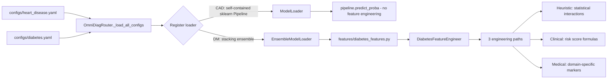
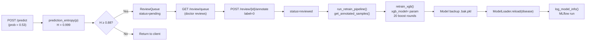
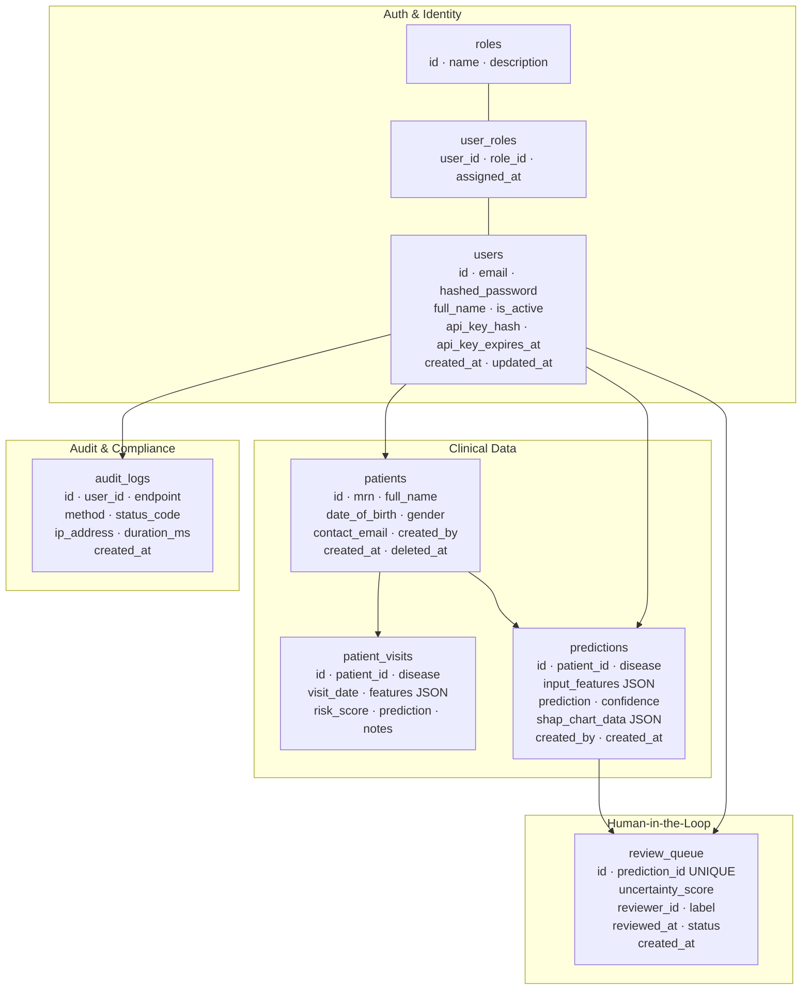

# OmniDiag: Multi-Disease Clinical Decision Support System

[](requirements.txt)
[](backend/main.py:1)
[](frontend/package.json)
[](docker-compose.yml:23)
[](backend/cache.py:39)
[](backend/model_loader.py)
[](backend/monitoring/metrics.py:37)
[](backend/monitoring/mlflow_tracker.py:63)
[](deploy/prometheus.yml)
[](k8s/hpa.yaml)
[](LICENSE)
[](.github/workflows/ci.yml)

---

**OmniDiag** is a config-driven, multi-disease clinical decision support system built for healthcare professionals. It serves per-disease XGBoost and stacking ensemble models behind a unified FastAPI surface, with SHAP-based explainability, a DiCE-inspired counterfactual engine, a human-in-the-loop active learning pipeline, DeepSeek LLM clinical report generation, Prometheus/Grafana/Evidently monitoring, MLflow experiment tracking, and Kubernetes deployment with horizontal pod autoscaling.

Coronary Artery Disease (CAD) and Diabetes Mellitus (DM) are currently registered. Adding a new disease requires a YAML config, Pydantic schema, feature engineer class, and model weights — no routing, middleware, or auth changes needed.

---

## System Architecture

### Request Flow & MLOps Pipeline

```mermaid
flowchart LR
    subgraph Client["Frontend (React 18 + Vite)"]
        A[Engineering Mode] --> B[DynamicClinicalForm]
        C[Clinical EMR Mode] --> B
        B --> D[useDiseaseForm]
        D --> E[useDiseaseSchema]
        E --> F["GET /api/v4/{disease}/schema"]
        D --> G[buildZodSchema]
        G --> H[React Hook Form + Zod]
        H --> I[SchemaFieldFactory]
        I --> J[OmniDiagApi]
    end

    subgraph Server["FastAPI Backend (port 7860)"]
        K[SecurityHeadersMiddleware] --> L[AuditMiddleware]
        L --> M[CORSMiddleware]
        M --> N[SlowAPI RateLimiter]
        N --> O{RBAC require_role}
        O --> P[Redis cache lookup]
        P -->|HIT| Q[Return cached]
        P -->|MISS| R[OmniDiagRouter]
        R --> S[FeatureEngineer]
        S --> T[ModelLoader / EnsembleLoader]
        T --> U[SHAP TreeExplainer]
        U --> V{uncertainty_band}
        V -->|H ≥ 0.88| W[ReviewQueue]
        V --> X[record_prediction]
        X --> Y[Prometheus metrics]
        T --> Z[Persist Prediction]
    end

    subgraph MLOps["MLOps Stack"]
        AA[MLflow :5000]
        BB[Prometheus :9090]
        CC[Grafana :3001]
        DD[Evidently DriftMonitor]
        BB --> CC
        Y --> BB
        DD --> BB
    end

    J -.->|HTTPS| K
    Z --> PostgreSQL[("PostgreSQL 15")]
    P -.-> Redis[("Redis 7")]
```



*Simplified: `U[SHAP TreeExplainer]` only runs on `/explain` requests, not `/predict` — a plain `/predict` call returns straight from `T[ModelLoader]` to `X`/`Z` without touching SHAP.*

### Config-Driven Disease Registration



### Active Learning Lifecycle



---

## Architecture & Core Features

### Config-Driven Disease Routing

[`OmniDiagRouter`](backend/router.py) scans [`configs/`](configs/) at startup and auto-discovers all YAML configuration files. Each config specifies the model type (single XGBoost or stacking ensemble), weights path, feature engineering module, and preprocessor artifacts. The router lazy-loads a [`ModelLoader`](backend/model_loader.py) or [`EnsembleModelLoader`](backend/ensemble_loader.py) per disease on first request — no additional endpoints or routing code needed when registering a new disease.

Each disease config declares the model architecture, weights paths with fallback resolution, SHAP explainer type (`tree` or `deep`), and schema back-reference via [`DISEASE_SCHEMA_REGISTRY`](backend/schemas.py). A Python module path for a disease-specific [`BaseFeatureEngineer`](features/base_features.py:17) subclass and a preprocessor directory (`label_encoders.pkl` + `standard_scaler.pkl`) still apply to diabetes; heart_disease's config carries neither — its Pipeline is self-contained (see [Explainable Inference Core](#explainable-inference-core)).

### RBAC & Security Middleware

[`require_role()`](backend/auth/rbac.py:39) is a FastAPI dependency factory that enforces role membership before any route handler executes. It reads `current_user.roles` (loaded eagerly via `lazy="selectin"` on the `User.roles` relationship) and raises HTTP 403 with a structured payload listing required vs. held roles if the intersection is empty. Five roles are seeded at startup: `super_admin`, `admin`, `doctor`, `nurse`, `viewer`. `CLINICAL_ROLES = ("doctor", "nurse", "super_admin")` gates `batch`; retrain and audit endpoints require `("super_admin",)`. **`predict`, `explain` and `counterfactuals` are deliberately open to anonymous callers** — they depend on `get_optional_user` rather than `require_role`, so the public demo can be tried without an account. Results are persisted (and linkable to a patient record) only for authenticated users; everything that reads or writes stored clinical data is role-gated.

[`get_current_user()`](backend/auth/dependencies.py:31) resolves the authenticated identity in priority order: `Authorization: Bearer <JWT>` header → `access_token` HttpOnly cookie → `X-API-Key` header (hash compared against `users.api_key_hash` via `get_user_by_api_key()`). [`get_optional_user()`](backend/auth/dependencies.py:108) returns `None` instead of raising 401, used on endpoints that permit anonymous one-off predictions while persisting results only for authenticated users.

Three middleware layers wrap every request in [`main.py`](backend/main.py): [`SecurityHeadersMiddleware`](backend/middleware/security.py) sets the `Strict-Transport-Security` (HSTS) header when `ENFORCE_HTTPS=true` — this is a response header only; the middleware does not perform a server-side HTTP→HTTPS redirect; [`AuditMiddleware`](backend/middleware/audit.py) writes every authenticated request as an immutable `audit_logs` row (user, endpoint, method, status, IPv6-capable IP address, duration_ms); [`CORSMiddleware`](backend/main.py) enforces an allowlist from `CORS_ALLOWED_ORIGINS` and never accepts wildcard origins.

### Redis Caching & Rate Limiting

[`init_cache()`](backend/cache.py:39) selects the cache backend at startup: if `REDIS_URL` is set, it pings a `redis.asyncio` client and initialises a `RedisBackend` (fastapi-cache2); otherwise it falls through to `InMemoryBackend` silently — no `REDIS_URL` means no Redis dependency in development or test environments. [`predict_cache_key()`](backend/cache.py:76) produces a deterministic 16-character SHA-256 fingerprint over `{disease, sorted_features}` so identical patient inputs within any 5-minute window return cached responses. Schema responses carry a 24-hour TTL; prediction responses carry 300 seconds. [`cache_flush()`](backend/cache.py:114) enumerates `omnidiag:*` keys via `redis.keys()` on the Redis backend, or clears `backend._store` directly on the in-memory fallback.

Rate limiting is applied via [`SlowAPI`](backend/rate_limit.py:49) with per-route limits: clinical endpoints are capped at `LIMIT_CLINICAL = "30/minute"`, admin operations at `LIMIT_ADMIN = "60/minute"`, and the `/generate-report` endpoint at a hard 10 requests/minute enforced at the route level. A `viewer` role is seeded (see RBAC above) but no route currently gates on it — there is no viewer-specific rate limit yet.

### Human-in-the-Loop Active Learning

The active learning pipeline consists of three components. [`sampler.py`](backend/active_learning/sampler.py:26) computes binary entropy **around the module's own decision threshold**, not around 0.5: the probability is first mapped by [`centre_on_threshold()`](backend/active_learning/sampler.py) — the prior-shift map with the threshold `t` sent to 0.5, strictly increasing and the identity when `t = 0.5` — and then `H(q) = -q·log₂(q) - (1-q)·log₂(1-q)` is taken. A prediction with `H ≥ 0.88` ([`_DEFAULT_ENTROPY_THRESHOLD`](backend/active_learning/sampler.py)) is queued via [`should_queue_for_review(probability_corrected, decision_threshold)`](backend/active_learning/sampler.py). For heart (`t = 0.3695`, read from the shipped model bundle, not argmax) that is ≈20–58 %; for diabetes (`t = 0.108184` on the prevalence-corrected scale) it is ≈5–22 %. The distinction matters: a 0.5-centred sampler on the corrected diabetes scale queued 4,789 of 14,139 test rows, every one a confident Positive at ≥ 5× the threshold, and **0 of the 849** rows within ±20 % of the threshold; the threshold-centred sampler queues 3,566 rows including **all 849**. Each queued row records `uncertainty_scale` and `decision_threshold` beside `uncertainty_score`, so scores from different releases are never compared blindly. [`uncertainty_band()`](backend/active_learning/sampler.py) maps the same centred value to `CERTAIN` / `CONFIDENT` / `BORDERLINE` / `UNCERTAIN`. The [`routes.py`](backend/active_learning/routes.py) module exposes `GET /api/v4/review/queue` (paginated, filterable by disease), `POST /api/v4/review/{id}/annotate` (writes `label` and transitions `status → reviewed`), `POST /api/v4/review/{id}/skip`, and `GET /api/v4/review/stats`.

[`run_retrain_pipeline()`](backend/active_learning/retrain.py:149) is the full async pipeline. [`get_annotated_samples()`](backend/active_learning/retrain.py:38) issues a raw SQL JOIN of `review_queue` and `predictions` filtered to `status='reviewed'` and `label IS NOT NULL`. [`retrain_xgb()`](backend/active_learning/retrain.py:84) loads the current `.pkl`, constructs an `xgb.DMatrix`, and calls `xgb.train()` with `xgb_model=model` for 20 incremental boost rounds at lr=0.05 — the existing tree structure is preserved and extended. The old model is renamed to a timestamped `.bak.pkl` before the new weights are written. On success, [`ModelLoader.invalidate()`](backend/model_loader.py) / [`EnsembleModelLoader.invalidate()`](backend/ensemble_loader.py) clears the live router's cached model object so the very next prediction lazy-reloads the new weights from disk — **no process restart required**. This hot-reload path was verified end-to-end (swap in a differently-shaped model file → confirm the next request immediately errors with a feature-mismatch specific to the *new* file, proving it was actually loaded). [`_log_to_mlflow()`](backend/active_learning/retrain.py:137) records the retrain run unconditionally, with a warning-only failure path if MLflow is unreachable.

🚧 **Known limitation:** `retrain_xgb()` builds its training matrix directly from the raw predict-time `input_features` (`X = np.array([list(feat.values()) for feat in features_list])`) and always reads/writes the single hardcoded path `models/{disease}/omni_diag_xgb_optimized.pkl`. For **heart_disease**, that filename no longer exists at all — the shipped weights are `models/heart_disease/heart_full_tuned.pkl`, a `dict` bundle (`{pipeline, features, threshold, ...}`), not a bare `XGBClassifier` — so `retrain_xgb()` fails immediately at its own `if not model_path.exists()` check, before the un-encoded-categorical-strings issue it was originally written to describe is ever reached. No real annotated-sample retrain cycle for heart_disease currently completes, for a different reason than previously documented. For **diabetes**, that same hardcoded path is **not** one of the three files `EnsembleModelLoader` actually loads (`xgb_model.pkl`, `lgb_model.pkl`, `rf_model.pkl`) — so even a numerically successful run retrains a file the live ensemble never reads, a silent no-op. The hot-reload mechanism described above is implemented and tested; connecting it to a disease-aware, correctly-shaped retrain step is the next piece of work here.

### DeepSeek LLM Clinical Report Generation

[`generate_report()`](backend/llm/report_generator.py:100) calls the DeepSeek API using an `AsyncOpenAI` client pointed at `_DEEPSEEK_BASE_URL = "https://api.deepseek.com"` with `model="deepseek-chat"` and `max_tokens=600`. The key is read lazily via [`_get_api_key()`](backend/llm/report_generator.py:18) on each call — not at import time — so Hugging Face Space secrets injected after startup are picked up correctly. [`_format_shap()`](backend/llm/report_generator.py:57) sorts SHAP values by absolute magnitude and formats the top 5 as directional bullets (`↑ increases risk` / `↓ decreases risk`) for inclusion in the user prompt alongside disease, probability, risk band, decision threshold and patient features. The risk band is computed **once, on the server**, by classifying `probability_corrected` against the disease's own `risk_bands` (corrected for diabetes, the historical 0.70 / 0.40 for heart) — never from literal cut-points and never from a band supplied by the client. The same band drives the narrative, the recommended actions and the LLM prompt, and is returned as `risk_band`. The prompt states that the probability is calibrated to the deployment prevalence so the model does not read 11 % as "low".

When `DEEPSEEK_API_KEY` is absent or the API call raises any exception, [`_rule_based_report()`](backend/llm/report_generator.py:71) generates the same four-section structure — Clinical Summary, Key Risk Drivers, Recommended Actions, Risk Stratification Note — using the SHAP rankings and a `HIGH` / `MODERATE` / `LOW` risk band derived from the probability. The response `source` field distinguishes `"llm"` (with `llm_model` and `latency_ms`) from `"rule_based"` (with `fallback_reason`) so callers can surface the provenance to clinicians.

### Clinical NLP Notes Parser

[`parse_clinical_note()`](backend/nlp/notes_parser.py:249) implements two-tier extraction from free-text clinical notes. [`_regex_extract()`](backend/nlp/notes_parser.py:97) runs first as the always-available baseline: it applies 20+ regex patterns (matched fresh via `re.search()` per call, not pre-compiled) across categories including age (with short-form aliases like `y/o`), BP systolic/diastolic, cholesterol, glucose, BMI, heart rate, creatinine, hemoglobin, oldpeak, and boolean flags for hypertension, diabetes, stroke, smoking, chest pain, exercise angina, edema, and anemia. If `use_bert=True` and HuggingFace Transformers is installed, `_bert_extract()` runs the `d4data/biomedical-ner-all` NER pipeline (lazy-loaded on first call, CPU inference, confidence threshold 0.7) and merges its output — BERT values win on overlapping keys. [`map_to_disease_schema()`](backend/nlp/notes_parser.py:236) applies disease-specific field name and value transformations: for `heart_disease`, `bp_systolic → RestingBP` (int); for `diabetes`, `cholesterol → HighChol` (binarised at 200 mg/dL). Missing `transformers` degrades silently to regex-only with no user-visible error.

### Explainable Inference Core

The inference pipeline order is **disease-specific**, matching how each model was trained (verified live for both diseases):

- **heart_disease (CAD)** — [`ModelLoader.predict()`](backend/model_loader.py:179) does **no manual preprocessing at all**: raw feature values go straight into `pipeline.predict_proba()`. The shipped weights file (`models/heart_disease/heart_full_tuned.pkl`) is a single self-contained `sklearn.Pipeline` — a `ColumnTransformer` (`IterativeImputer` + `StandardScaler` for the 6 numeric features, `SimpleImputer` + `OrdinalEncoder` for the 5 categorical ones) feeding an `XGBClassifier` — so imputation, scaling and encoding all happen inside the Pipeline itself. There is no separate feature-engineering step and no `label_encoders.pkl` / `standard_scaler.pkl` preprocessor files for this disease; six of the eleven input fields (`RestingBP, Cholesterol, FastingBS, MaxHR, Oldpeak, ST_Slope`) are `Optional` on the schema for exactly this reason — the Pipeline is built to impute them.
- **diabetes** — [`EnsembleModelLoader.predict()`](backend/ensemble_loader.py:245): engineer heuristic + medical features **first**, then encode + scale. Here `engineer_clinical()` is a documented no-op ([diabetes_features.py:101](features/diabetes_features.py:101)); its formula is computed inside `engineer_medical()` instead, by deliberate design (documented in-code) so it participates in live inference. It does — `Diabetes_Clinical_Risk` is typically the top-ranked SHAP feature for this disease (confirmed live).

On explain requests, the pipeline appends a SHAP TreeExplainer step returning structured JSON: `shap_chart_data` sorted by absolute SHAP value descending, a text explanation of the top-3 features with direction labels, and the base expected log-odds value. The `shap_chart_data` column in `predictions` stores this JSON for offline audit retrieval via `GET /admin/audit-logs` or direct DB query.

#### XGBoost 3.x Compatibility Patch

XGBoost 3.x stores `base_score` as a bracket-wrapped string (e.g. `[5.85E-1]`) in its UBJSON serialisation. SHAP's `TreeExplainer` calls `save_raw()` and parses the output with `float()`, which fails on the bracketed format. [`ModelLoader`](backend/model_loader.py) applies a `save_raw()` monkey-patch at load time that strips the brackets from the UBJSON byte stream, enabling SHAP to read `base_score` correctly. For heart_disease the patch targets `pipeline.named_steps["clf"]` (the `XGBClassifier` step inside the shipped Pipeline), not a bare top-level estimator. The patch is applied only to XGBoost models and silently skipped for other types.

### DiCE-Inspired Counterfactual Engine

[`CounterfactualGenerator`](backend/counterfactual_generator.py) implements a DiCE-inspired algorithm using random sampling with diversity selection — no external dependencies beyond NumPy and pandas (`dice-ml` was removed due to a `LossySetitemError` incompatibility with pandas ≥ 3.0):

1. **Sample** 500+ random perturbations of mutable patient features within clinical bounds
2. **Evaluate** each perturbation through the full engineering + preprocessing + prediction pipeline
3. **Filter** perturbations that flip the predicted class Positive → Negative
4. **Score** by proximity (normalised L1 distance) with a diversity penalty (Jaccard similarity of changed feature sets)
5. **Select** the top 3 most diverse counterfactuals

**Clinical Firewall** ([`_is_illegal_flip()`](backend/counterfactual_generator.py)) — discards candidates with clinically absurd transitions (e.g. advising a patient to start smoking, raise BP, or reduce physical activity). **Feasibility scoring** ([`_assess_feasibility()`](backend/counterfactual_generator.py)) classifies each scenario as `high` (lifestyle-only), `medium` (requires medical intervention), or `low` (unrealistically large or concurrent changes).

### Feature Engineering Pipeline

Disease-specific now, not uniform: **diabetes** implements a [`BaseFeatureEngineer`](features/base_features.py:17) subclass with three abstract methods executed in dependency order; **heart_disease does none of this** — its shipped Pipeline (see [Explainable Inference Core](#explainable-inference-core)) takes the 11 raw clinical fields directly, with no derived features at all. `features/heart_disease_features.py` and its heuristic/clinical/medical formulas below (`Age_BP_Interaction`, `Clinical_Risk_Score`, `RPP`, ...) describe the pre-Pipeline heart model and are **no longer called anywhere in live inference**.

**Heuristic (Statistical Interactions)** — Computes multiplicative interaction terms and ratios:
- DM: [`BMI_Age_Interaction`](features/diabetes_features.py:55), [`Health_Index`](features/diabetes_features.py:63), [`Lifestyle_Score`](features/diabetes_features.py:77), [`SES_Composite`](features/diabetes_features.py:88)

**Clinical (Risk Score Formulas)** — Computes exponentiated linear risk scores using clinical weights. Diabetes' live pipeline does not call `engineer_clinical()` directly (see [Explainable Inference Core](#explainable-inference-core)); the formula is real, but reached differently:
- DM: `Diabetes_Clinical_Risk = exp(BMI × 0.05 + Age × 0.03 + GenHlth × 0.2 + HighBP × 0.5)` — despite the name, this is actually computed inside [`engineer_medical()`](features/diabetes_features.py:128), **not** `engineer_clinical()` (a documented no-op at [diabetes_features.py:101](features/diabetes_features.py:101)). This relocation is deliberate so the formula runs live — it's typically the top SHAP-ranked feature for diabetes predictions.

**Medical (Domain-Specific)** — Computes cardiology-validated composite markers:
- DM: `Diabetes_Clinical_Risk` (see Clinical section above — it lives in the medical-path method for pipeline-compatibility reasons, not because of aliasing)

### Prometheus + Evidently + Grafana Monitoring

[`metrics.py`](backend/monitoring/metrics.py:37) registers all Prometheus instruments at module import time using lazy-guarded `try/except` so the app starts even if `prometheus_client` is absent. Eight instruments are exposed at `GET /metrics`: `omnidiag_predictions_total{disease,prediction}` (Counter), `omnidiag_prediction_confidence{disease}` (Histogram, buckets 0.01–1.0 with fine resolution below 0.1 — the old 0.5–1.0 set left 7 of 9 buckets unreachable for prevalence-corrected diabetes probabilities, whose maximum on the test split is 0.653; series recorded before this change are not comparable with those after it), `omnidiag_request_duration_seconds{method,endpoint,status}` (Histogram, buckets 0.01–5.0 s), `omnidiag_active_requests` (Gauge), `omnidiag_drift_share{disease}` (Gauge, updated post-drift-run), `omnidiag_cache_hits_total{disease}`, `omnidiag_cache_misses_total{disease}`, and `omnidiag_batch_rows_total{disease,status}`.

[`DriftMonitor`](backend/monitoring/drift.py:48) wraps Evidently's `Report` with `DatasetDriftMetric` and `DatasetMissingValuesMetric` against a per-disease reference CSV baseline: heart_disease uses `data/heart_disease/processed/final_ready_data.csv`; diabetes uses the raw BRFSS export `data/diabetes/raw/diabetes_binary_5050split_health_indicators_BRFSS2015.csv` (the paths intentionally differ — see [`_REFERENCE_PATHS`](backend/monitoring/drift.py:175)). A `threading.Lock` prevents concurrent report runs. [`get_monitor(disease)`](backend/monitoring/drift.py:181) returns per-disease singleton instances. After each run, [`record_drift()`](backend/monitoring/metrics.py:101) pushes the `drift_share` value to the Prometheus Gauge so Grafana dashboards reflect it without polling the admin API.

### MLflow Experiment Tracking

[`log_model_info()`](backend/monitoring/mlflow_tracker.py:63) and [`log_drift_metrics()`](backend/monitoring/mlflow_tracker.py:110) in [`mlflow_tracker.py`](backend/monitoring/mlflow_tracker.py) log all runs under the `"OmniDiag"` experiment. [`ensure_experiment()`](backend/monitoring/mlflow_tracker.py:46) is idempotent — it creates the experiment on first call and returns the existing `experiment_id` on subsequent calls. Model runs log `disease` and `model_version` as MLflow **tags**, evaluation metrics as MLflow **metrics** (via `mlflow.log_metrics()` — a separate mechanism from tags), and `.pkl` artifacts from `models/{disease}/`. Drift runs log `drift_share`, `drifted_columns`, `total_columns`, and `sample_size` as metrics with a `run_type=drift` tag. The retraining pipeline calls `_log_to_mlflow()` automatically after each incremental update. [`list_recent_runs(n=20)`](backend/monitoring/mlflow_tracker.py:143) backs the admin dashboard endpoint.

### Federated Learning *(🚧 In Progress — server K8s manifest pending)*

[`OmniDiagFLClient`](backend/federated/client.py:27) implements the hospital-site node. [`get_parameters()`](backend/federated/client.py:67) serialises the current XGBoost model via `pickle.dumps`; [`set_parameters()`](backend/federated/client.py:77) deserialises and applies the aggregated global model. [`fit()`](backend/federated/client.py:77) runs 10 incremental XGBoost rounds on local EHR data — raw patient records never leave the site. [`evaluate()`](backend/federated/client.py:99) computes local binary accuracy and returns it as a Flower metric dict.

[`start_fl_server()`](backend/federated/aggregator.py:62) configures a Flower `FedAvg` strategy with `fraction_fit=1.0` (all connected clients participate in each round) and a configurable `FL_MIN_CLIENTS` threshold. [`add_dp_noise()`](backend/federated/aggregator.py:96) is a standalone utility that clips a gradient vector to `max_grad_norm` (L2) and adds calibrated Gaussian noise scaled by `noise_multiplier=1.1`. It is **not yet wired** into `client.py`'s `get_parameters()`/`fit()` — those transmit the full pickled XGBoost model (`pickle.dumps(model)`), not a gradient vector, so differential privacy is implemented but not yet applied to weight transmission. Both files use `try: import flwr as fl` with a `log.error` fallback, so the rest of the backend starts without Flower installed; `flwr>=1.0.0` is now listed in `requirements.txt`.

### Schema-Driven Frontend Architecture

The frontend uses a pure schema-driven rendering pipeline with no hardcoded disease forms:

1. **Schema Fetching** — [`useDiseaseSchema`](frontend/src/hooks/useDiseaseSchema.js) fetches `GET /api/v4/{disease}/schema` and caches parsed results in three in-memory Maps. [`DiseaseContext`](frontend/src/context/DiseaseContext.jsx) pre-fetches schemas for all registered diseases at app init and persists the selected disease in `localStorage`.
2. **Schema Parsing** — [`parseSchema()`](frontend/src/utils/schemaFieldParser.js) converts JSON Schema properties into `FieldMetadata[]` with resolved component types: `segmented` (binary radio-group), `toggle` (yes/no switch), `select` (enum dropdown), `slider` (small-range integer), `number` (twin-bound slider + numeric input).
3. **Field Categorisation** — [`categorizeFields()`](frontend/src/utils/featureCategorizer.js) groups fields into ordered categories (Vitals & Signs, Lifestyle, Demographics, Medical History, Healthcare Access, Mental Health, General).
4. **Zod Validation** — [`buildZodSchema()`](frontend/src/utils/schemaToZod.js:27) mirrors Pydantic server-side rules as a Zod object schema for client-side validation without round-trips.
5. **Form Rendering** — [`DynamicClinicalForm`](frontend/src/components/DynamicClinicalForm.jsx) renders categorised accordion cards via [`SchemaFieldFactory`](frontend/src/components/SchemaFieldFactory.jsx), integrated with React Hook Form through [`useDiseaseForm`](frontend/src/hooks/useDiseaseForm.js).

---

## Database Schema



Two Alembic migrations ship with the project:

| Revision | Description |
|---|---|
| `da87946a56a6` | Initial schema — roles, users, user_roles, patients, predictions, review_queue, audit_logs |
| `f1e2d3c4b5a6` | Adds `patient_visits`; adds `api_key_hash` + `api_key_expires_at` to users; fixes `audit_logs.id` type (BigInteger → VARCHAR 36) |

The `patients.deleted_at` nullable timestamp implements GDPR soft-delete — prediction history is preserved when a patient record is removed. The `review_queue.prediction_id` UNIQUE constraint enforces one-to-one cardinality with `predictions`. All primary keys use `VARCHAR(36)` UUIDs for cross-database portability between SQLite (development) and PostgreSQL (production).

---

## Repository Structure

```
.
├── backend/                              # FastAPI application layer
│   ├── main.py                           # App entry, middleware stack, lifespan, routes
│   ├── router.py                         # OmniDiagRouter — config-driven disease routing
│   ├── schemas.py                        # Pydantic models + DISEASE_SCHEMA_REGISTRY
│   ├── model_loader.py                   # Lazy XGBoost loader + SHAP TreeExplainer + XGB3 patch
│   ├── ensemble_loader.py                # Stacking ensemble (XGB/LGB/RF + LR meta-learner)
│   ├── shap_service.py                   # SHAP value → JSON chart data transformation
│   ├── counterfactual_generator.py       # DiCE-inspired generator + Clinical Firewall
│   ├── database.py                       # Async SQLAlchemy engine + session factory
│   ├── cache.py                          # Redis / InMemoryBackend init + cache_get/set/flush
│   ├── rate_limit.py                     # SlowAPI limiter + LIMIT_CLINICAL/VIEWER/ADMIN
│   │
│   ├── auth/                             # Authentication & authorisation
│   │   ├── routes.py                     # /auth/register, /login, /refresh, /logout, /me
│   │   ├── jwt.py                        # encode_token(), decode_token()
│   │   ├── dependencies.py               # get_current_user, get_optional_user
│   │   ├── rbac.py                       # require_role() dependency factory
│   │   └── api_key.py                    # X-API-Key hash verification
│   │
│   ├── db_models/                        # SQLAlchemy ORM models
│   │   ├── user.py                       # User + user_roles association table
│   │   ├── role.py                       # Role (super_admin/admin/doctor/nurse/viewer)
│   │   ├── patient.py                    # Patient with soft-delete (deleted_at)
│   │   ├── patient_visit.py              # PatientVisit — longitudinal risk snapshots
│   │   ├── prediction.py                 # Prediction + shap_chart_data JSON
│   │   ├── review_queue.py               # ReviewQueue — active learning annotation store
│   │   └── audit_log.py                  # AuditLog — immutable HIPAA audit trail
│   │
│   ├── active_learning/                  # Human-in-the-loop pipeline
│   │   ├── sampler.py                    # prediction_entropy(), should_queue_for_review()
│   │   ├── routes.py                     # /review/queue, /review/{id}/annotate, /skip, /stats
│   │   └── retrain.py                    # run_retrain_pipeline() — fetch → retrain → reload → log
│   │
│   ├── monitoring/                       # MLOps observability
│   │   ├── metrics.py                    # Prometheus: 8 counters/histograms/gauges
│   │   ├── drift.py                      # DriftMonitor (Evidently) + get_monitor() singletons
│   │   ├── mlflow_tracker.py             # log_model_info(), log_drift_metrics(), list_recent_runs()
│   │   └── routes.py                     # /admin/drift/*, /admin/mlflow/*
│   │
│   ├── llm/
│   │   └── report_generator.py           # generate_report() — DeepSeek API + rule-based fallback
│   │
│   ├── nlp/
│   │   └── notes_parser.py               # parse_clinical_note() — BioBERT NER + regex fallback
│   │
│   ├── federated/                        # Federated learning (🚧 server manifest pending)
│   │   ├── aggregator.py                 # FedAvg strategy + add_dp_noise() (Gaussian DP)
│   │   └── client.py                     # OmniDiagFLClient — get_parameters/fit/evaluate
│   │
│   ├── admin/
│   │   └── routes.py                     # /admin/audit-logs, /admin/retrain
│   ├── patients/
│   │   └── routes.py                     # /patients/* CRUD (soft-delete aware)
│   └── middleware/
│       ├── audit.py                      # AuditMiddleware — writes every request to audit_logs
│       └── security.py                   # SecurityHeadersMiddleware — HTTPS enforcement
│
├── features/                             # Per-disease feature engineering
│   ├── base_features.py                  # BaseFeatureEngineer (ABC) — 3 abstract methods
│   ├── heart_disease_features.py         # CAD: heuristic / clinical / medical paths
│   └── diabetes_features.py             # DM: heuristic / clinical / medical paths
│
├── models/                               # Trained model artifacts
│   ├── advanced_feature_engineering.py   # Standalone feature computation functions
│   ├── heart_disease/                    # CAD self-contained Pipeline bundle (heart_full_tuned.pkl)
│   └── diabetes/                         # DM ensemble weights + preprocessors
│
├── configs/                              # Disease YAML configurations
│   ├── heart_disease.yaml                # CAD v6.0.0 — self-contained sklearn Pipeline (500-estimator XGBoost)
│   ├── diabetes.yaml                     # DM v1.1.0 — stacking ensemble
│   └── config_loader.py                  # Centralised YAML loader
│
├── alembic/                              # Database migrations
│   ├── env.py                            # Async-to-sync URL strip; imports all ORM models
│   └── versions/
│       ├── da87946a56a6_initial_schema.py
│       └── f1e2d3c4b5a6_add_patient_visits_api_keys_fix_audit_id.py
│
├── k8s/                                  # Kubernetes manifests
│   ├── namespace.yaml                    # Namespace: omnidiag
│   ├── backend-deployment.yaml           # 2 replicas, port 7860, model-cache PVC
│   ├── postgres-statefulset.yaml         # postgres:15-alpine, 10 Gi PVC
│   ├── redis-deployment.yaml             # redis:7-alpine
│   ├── ingress.yaml                      # api.omnidiag.ai — TLS via cert-manager
│   ├── hpa.yaml                          # Min 2 / max 10 replicas, CPU 70% / Mem 80%
│   ├── pvc.yaml                          # 5 Gi ReadWriteMany model cache
│   └── secrets.yaml                      # Secret template (fill before apply)
│
├── helm/omnidiag/                        # Helm chart v2.0.0
│   ├── Chart.yaml
│   ├── values.yaml                       # Parameterises all K8s resources
│   └── templates/                        # deployment, ingress, hpa, secrets, service
│
├── deploy/                               # Monitoring provisioning
│   ├── prometheus.yml                    # Scrape config targeting backend:7860/metrics
│   └── grafana/
│       ├── datasources/prometheus.yml    # Grafana datasource provisioning
│       └── dashboards/omnidiag.json      # Pre-built dashboard (predictions, latency, drift)
│
├── tests/                                # 13 test modules (SQLite in-memory, no Redis needed)
│   ├── conftest.py                       # Fixtures: DB, cache, mocked router, seeded roles
│   ├── test_auth.py
│   ├── test_rbac.py
│   ├── test_clinical.py
│   ├── test_patients.py
│   ├── test_admin.py
│   ├── test_audit_log.py
│   ├── test_cache.py
│   ├── test_llm_report.py
│   ├── test_security.py
│   ├── test_database.py
│   ├── test_unit_active_learning.py
│   ├── test_unit_auth.py
│   └── test_unit_counterfactuals.py
│
├── frontend/                             # React 18 + Vite + Tailwind CSS
│   ├── src/
│   │   ├── api.js                        # OmniDiagApi class (120 s timeout for HF cold starts)
│   │   ├── App.jsx                       # Sidebar navigation, mode routing
│   │   ├── context/DiseaseContext.jsx    # Schema pre-fetch + localStorage persistence
│   │   ├── hooks/
│   │   │   ├── useDiseaseSchema.js       # Schema fetch + parse + 3-layer Map cache
│   │   │   └── useDiseaseForm.js         # React Hook Form + Zod integration
│   │   ├── components/
│   │   │   ├── EngineeringMode.jsx       # Manual parameter testing interface
│   │   │   ├── ClinicalEmrMode.jsx       # Doctor's patient record dashboard
│   │   │   ├── DynamicClinicalForm.jsx   # Schema-driven form engine
│   │   │   ├── SchemaFieldFactory.jsx    # Component resolver (toggle/select/slider/number)
│   │   │   ├── ShapBarChart.jsx          # Recharts horizontal SHAP bar chart
│   │   │   ├── WhatIfScenarioCard.jsx    # Counterfactual viewer
│   │   │   └── MedicalTooltip.jsx        # Dictionary-backed hover tooltip
│   │   └── utils/
│   │       ├── schemaFieldParser.js      # JSON Schema → FieldMetadata[]
│   │       ├── schemaToZod.js            # FieldMetadata[] → Zod validation schema
│   │       ├── featureCategorizer.js     # Field → category grouping
│   │       └── medicalDictionary.js      # Feature name → clinical description
│   └── mockPatients.js                   # Pre-defined patient records (3 CAD, 4 DM)
│
├── data/                                 # Raw and processed datasets per disease
├── experiment_files/                     # Training experiments and diagnostics
├── docker-compose.yml                    # 7 services: postgres, redis, backend, mlflow, prometheus, grafana, retrain
├── Dockerfile                            # Production container
├── requirements.txt                      # Python dependencies
├── alembic.ini                           # Alembic config (sqlite fallback for local dev)
└── pytest.ini                            # asyncio_mode=auto, testpaths=tests/
```

---

## Local Setup

### Backend (Python 3.11+)

```bash
python -m venv .venv && source .venv/bin/activate
pip install -r requirements.txt
cp .env.example .env   # set JWT_SECRET_KEY at minimum

# SQLite fallback is automatic when DATABASE_URL is unset
uvicorn backend.main:app --reload --port 7860
```

API docs available at `http://localhost:7860/docs`. Redis is optional — the cache auto-falls-back to `InMemoryBackend` when `REDIS_URL` is unset.

### Full Stack (Docker Compose)

```bash
docker compose up -d
docker compose exec backend alembic upgrade head
```

| Service | URL | Default credentials |
|---|---|---|
| FastAPI | http://localhost:7860/docs | `doctor@omnidiag.com` / `Doctor@123` |
| MLflow | http://localhost:5000 | — |
| Prometheus | http://localhost:9090 | — |
| Grafana | http://localhost:3001 | `admin` / `omnidiag_grafana` |

```bash
# On-demand retrain (profile-gated — does not start with up -d)
docker compose run --rm retrain --disease heart_disease --min-samples 10
```

### Frontend (Node.js 20+)

```bash
cd frontend
npm install
npm run dev   # http://localhost:5173
```

### Federated Learning

```bash
# Central aggregation server
python -m backend.federated.aggregator --rounds 10 --min-clients 2

# Each hospital site — patient data stays local
python -m backend.federated.client \
  --server-address <central>:8080 \
  --disease heart_disease \
  --data-path /local/ehr_export.csv
```

---

## Deployment (Kubernetes + Helm)

The manifests below are the intended production deployment target; the live demo instance runs on Hugging Face Spaces via Docker (see the `sdk: docker` / `app_port: 7860` frontmatter at the top of this file), not on a Kubernetes cluster.

```bash
# Apply all K8s manifests
kubectl apply -f k8s/namespace.yaml
kubectl apply -f k8s/

# Or via Helm
helm install omnidiag ./helm/omnidiag -n omnidiag --create-namespace
helm upgrade omnidiag ./helm/omnidiag -n omnidiag --set image.tag=v2.1.0
```

The `hpa.yaml` autoscaler scales the backend between 2 and 10 replicas, targeting CPU utilisation at 70 % and memory at 80 %. The Ingress routes `api.omnidiag.ai` with TLS termination via cert-manager and Let's Encrypt. PostgreSQL runs as a StatefulSet with a 10 Gi PVC; model weights are shared across pods via a 5 Gi ReadWriteMany PVC mounted at `/app/models`.

---

## CI/CD Pipeline

The GitHub Actions workflow ([`.github/workflows/ci.yml`](.github/workflows/ci.yml)) runs on every push and pull request with two parallel jobs:

**Backend Validation** — Python 3.11 setup with pip caching; dependency install from `requirements.txt`; import verification (`OmniDiagRouter`, `ModelLoader`, `get_schema_for_disease`); API smoke test (starts uvicorn, verifies `GET /` returns 200, terminates).

**Frontend Build** — Node.js 20 with npm caching; `npm ci`; production build via `npm run build` (Vite compiles to `frontend/dist/`).

---

## API Reference

All endpoints are versioned under `/api/v4/`.

### System

| Method | Path | Auth | Description |
|---|---|---|---|
| `GET` | `/` | None | Health check |
| `GET` | `/api/v4/diseases` | None | Registered diseases with metadata |
| `GET` | `/api/v4/{disease}/schema` | None | JSON Schema for input fields |
| `GET` | `/metrics` | None | Prometheus scrape endpoint |

### Auth

Mounted at `/auth` (**not** under `/api/v4`) — verified live against a running instance:

| Method | Path | Description |
|---|---|---|
| `POST` | `/auth/register` | Create account |
| `POST` | `/auth/login` | JWT login (sets HttpOnly cookie) |
| `POST` | `/auth/refresh` | Rotate access token |
| `POST` | `/auth/logout` | Clear cookie |
| `GET` | `/auth/me` | Current user + roles |

### Clinical

| Method | Path | Auth | Response |
|---|---|---|---|
| `POST` | `/api/v4/{disease}/predict` | Anonymous OK¹ | `PredictResponse` — heart: `{prediction, confidence, diagnosis, inference_threshold}`, plus `data_completeness_warning` when a high-SHAP-importance input was missing and imputed; diabetes adds the scale audit fields below. `Cache-Hit` is a response **header**, not a body field |
| `POST` | `/api/v4/{disease}/explain` | Anonymous OK¹ | `{prediction, confidence, diagnosis, chart_data[], text_explanation, base_value}`; diabetes adds `base_value_raw, shap_scale, shap_reconstructed_probability_corrected, shap_additivity_gap, per_model_shap, shap_weights, ensemble_variance, model_agreement` |
| `POST` | `/api/v4/{disease}/counterfactuals` | Anonymous OK¹ | diabetes: `{status, baseline_probability, baseline_probability_corrected, probability_scale, counterfactuals[{scenario, changes{}, new_probability, new_probability_corrected, baseline_probability_corrected, risk_reduction, risk_reduction_relative_pct, risk_reduction_absolute_pp, probability_scale, feasibility}]}`; heart: `{status, baseline_probability, counterfactuals[{scenario_id, probability, changes[{feature, original_value, counterfactual_value, direction}]}]}` |
| `POST` | `/api/v4/{disease}/batch` | `doctor`/`nurse`/`super_admin` | `{results[], summary{total, ok, errors}}` — CSV upload, max 500 rows |
| `POST` | `/api/v4/generate-report` | Anonymous OK¹ | body `{disease, probability_corrected, label, shap_values[], features{}}` (`probability` is a **deprecated** alias; `confidence_band` is advisory and ignored) → `{report, source, risk_band, llm_model?, latency_ms?, fallback_reason?}` |
| `POST` | `/api/v4/parse-notes` | Open (no auth dependency) | `{extracted_features{}, mapped_features{}, field_count}` — `mapped_features` holds the schema-ready dict when `disease` is supplied |

¹ Deliberately open so the public demo works without an account (`Depends(get_optional_user)`). Predictions are **persisted and linkable to a patient record only for authenticated users**; anonymous calls are stateless. Rate limits still apply per IP.

#### Probability scale (diabetes)

The diabetes ensemble was trained on the 50/50-resampled BRFSS file, so its raw output sits on a 50 % prior. `EnsembleModelLoader.predict()` maps it to the deployment prevalence (`configs/diabetes.yaml → prevalence_deploy`, currently 0.237 — Jordan's actual diabetes prevalence; a US/BRFSS placeholder of ~0.14 was used until 2026-09-21) with a Bayes prior-shift correction before anything is compared or returned. The rule the codebase follows ([`backend/probability_scale.py`](backend/probability_scale.py), enforced by the AST guard in [`tests/test_probability_scale_contract.py`](tests/test_probability_scale_contract.py)):

> An unsuffixed probability or threshold is on the scale the module reports — **corrected** for diabetes. A value on the model's own training-prior scale always carries a `_raw` suffix.

| Field | Scale | Notes |
|---|---|---|
| `confidence` | corrected | Same value as `probability_corrected`. Compare with `inference_threshold`, **never with 0.5** |
| `probability_corrected` / `probability_raw` | corrected / raw | Both returned for audit |
| `inference_threshold` / `inference_threshold_raw` | corrected / raw | 0.108184 / 0.280854 |
| `risk_bands` / `risk_bands_raw` | corrected / raw | high 0.4202 / 0.70, moderate 0.1716 / 0.40 |
| `prevalence_correction_applied`, `prevalence_train`, `prevalence_deploy` | — | `true`, 0.50, 0.237 |
| `model_contributions`, `ensemble_variance` | raw | Per-base-model outputs, uncorrected |

`GET /api/v4/diseases` returns `info.inference_threshold` and `info.risk_bands` on the same scale. Stored rows carry `predictions.probability_scale` (`'corrected'` | `'raw'` | `NULL` for rows written before the column existed); aggregates split by it (`GET /api/v4/admin/stats → avg_confidence_by_scale`, drift runs → `rows_by_probability_scale`) and treat `NULL` as its own `unknown` group. Heart applies no prevalence correction and has a single scale — it returns a bare `inference_threshold` (0.3695, read from the model bundle, not this table's corrected/raw pair) but none of the other fields above.

A legacy `POST /api/v3/predict` (tagged **Legacy** in Swagger) is still mounted and, unlike its v4 counterpart, requires `CLINICAL_ROLES`. It is retained for backward compatibility only — new integrations should use `/api/v4/{disease}/predict`.

### Active Learning (requires `doctor` / `nurse` / `super_admin`)

| Method | Path | Description |
|---|---|---|
| `GET` | `/api/v4/review/queue` | Paginated pending items, filterable by disease |
| `POST` | `/api/v4/review/{id}/annotate` | Submit expert label `{label: 0|1}` |
| `POST` | `/api/v4/review/{id}/skip` | Dismiss item |
| `GET` | `/api/v4/review/stats` | `{pending, reviewed, skipped}` |

> ⚠️ `POST /admin/retrain` currently fails for heart_disease (categorical encoding bug) and is a silent no-op for diabetes (writes to a file the live ensemble doesn't read) — see [Human-in-the-Loop Active Learning](#human-in-the-loop-active-learning) above.

### Admin (requires `super_admin`)

Two different prefixes are actually in use — verified live against a running instance: `/admin/*` (audit, retrain, cache) and `/api/v4/admin/*` (drift, MLflow).

| Method | Path | Description |
|---|---|---|
| `GET` | `/admin/audit-logs` | Paginated HIPAA audit trail |
| `POST` | `/admin/retrain` | Trigger retraining pipeline (see limitation above) |
| `POST` | `/admin/cache/flush` | Invalidate all cached responses (e.g. after a model update) |
| `GET` | `/api/v4/admin/drift/{disease}/status` | Latest Evidently drift metrics (JSON) |
| `POST` | `/api/v4/admin/drift/{disease}/run` | Trigger fresh drift computation |
| `GET` | `/api/v4/admin/drift/{disease}/report` | Full Evidently HTML report |
| `GET` | `/api/v4/admin/mlflow/runs` | Recent MLflow experiment runs |
| `POST` | `/api/v4/admin/mlflow/register` | Register model metrics in MLflow |

---

## Tech Stack

### Backend

| Component | Technology | Purpose |
|---|---|---|
| API Framework | [FastAPI 0.100+](backend/main.py:1) | Async Python web framework |
| Model v1 (CAD) | [XGBoost 2.x](backend/model_loader.py) | Single gradient-boosted classifier |
| Model v2 (DM) | [Stacking Ensemble](backend/ensemble_loader.py) | XGBoost + LightGBM + RF + LR meta |
| Explainability | [SHAP 0.42+](backend/monitoring/metrics.py:37) | TreeExplainer → structured JSON |
| Database ORM | [SQLAlchemy 2.0+](backend/database.py) | Async session + declarative base |
| Migrations | [Alembic 1.13+](alembic/env.py) | Version-controlled schema changes |
| Cache | [Redis 7 + fastapi-cache2](backend/cache.py:39) | Prediction caching + rate-limit store |
| Auth | [python-jose + passlib](backend/auth/jwt.py) | JWT + bcrypt |
| Rate Limiting | [SlowAPI](backend/rate_limit.py:49) | Per-route request caps |
| LLM | [OpenAI SDK → DeepSeek](backend/llm/report_generator.py:100) | Clinical report generation |
| NLP | [Transformers + regex](backend/nlp/notes_parser.py:249) | Clinical note feature extraction |
| Metrics | [prometheus-client 0.20+](backend/monitoring/metrics.py) | `/metrics` scrape endpoint |
| Drift | [Evidently 0.4+](backend/monitoring/drift.py:48) | Dataset drift detection |
| MLOps | [MLflow 2.10+](backend/monitoring/mlflow_tracker.py:63) | Experiment tracking |
| Federated | [Flower (flwr 1.0+)](backend/federated/aggregator.py:62) | Cross-hospital FL (🚧) |
| Validation | [Pydantic v2](backend/schemas.py) | Input/output model validation |
| Config | [PyYAML 6.0+](configs/config_loader.py) | Disease configuration files |

### Frontend

| Component | Technology | Purpose |
|---|---|---|
| Framework | [React 18.3.1](frontend/src/App.jsx) | UI component library |
| Build | [Vite 5.4.0](frontend/vite.config.js) | Dev server + production bundler |
| Styling | [Tailwind CSS 3.4.19](frontend/tailwind.config.js) | Utility-first CSS |
| Forms | [React Hook Form 7.76.1](frontend/src/hooks/useDiseaseForm.js) | Form state management |
| Validation | [Zod 4.4.3](frontend/src/utils/schemaToZod.js:27) | Client-side schema validation |
| Charts | [Recharts 3.8.1](frontend/src/components/ShapBarChart.jsx) | SHAP value bar chart |
| PDF Export | [@react-pdf/renderer 4.5.1](frontend/package.json) | Clinical report PDF generation |
| PWA | [Workbox 7.4.1](frontend/package.json) | Service worker + offline support |

### Infrastructure

| Component | Technology | Purpose |
|---|---|---|
| Primary Database | [PostgreSQL 15-alpine](docker-compose.yml:23) | Relational datastore |
| Cache | [Redis 7-alpine](docker-compose.yml:43) | Prediction cache + rate limiting |
| Experiment Tracking | [MLflow on python:3.11-slim](docker-compose.yml:79) | Model and drift run registry |
| Metrics Scraper | [prom/prometheus:v2.51.0](docker-compose.yml:103) | Pulls from `/metrics` every 15 s |
| Dashboards | [grafana/grafana:10.4.0](docker-compose.yml:120) | Pre-provisioned OmniDiag dashboard |
| Container | [Docker + Compose v2](docker-compose.yml) | Local full-stack environment |
| Orchestration | [Kubernetes + Helm v2](helm/omnidiag/Chart.yaml) | Production autoscaling deployment |
| TLS | [cert-manager + Let's Encrypt](k8s/ingress.yaml) | Automatic certificate provisioning |
| CI/CD | [GitHub Actions](.github/workflows/ci.yml) | Backend smoke test + frontend build |

---

## License

Copyright (c) 2026 Yahya Lababenah. All Rights Reserved. — see [`LICENSE`](LICENSE) for full terms.
