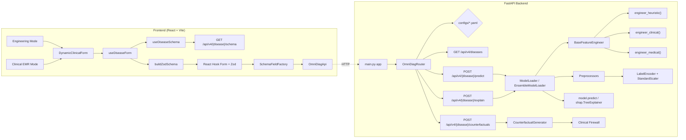
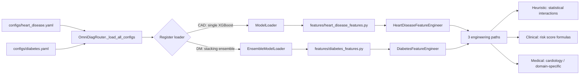

# OmniDiag: Dynamic Multi-Disease Clinical Decision Support System (CDSS)

[](requirements.txt)
[](backend/main.py:1)
[](frontend/package.json:12)
[](frontend/vite.config.js)
[](backend/model_loader.py:62)
[](backend/ensemble_loader.py:41)
[](backend/shap_service.py:14)
[](frontend/tailwind.config.js)
[](LICENSE)
[](.github/workflows/ci.yml:1)

---

**OmniDiag** is a config-driven, multi-disease clinical decision support system. It serves per-disease XGBoost and stacking ensemble models behind a unified FastAPI surface, with schema-driven React frontends, SHAP-based explainability, and a DiCE-inspired counterfactual engine constrained by a clinical firewall.

Coronary Artery Disease (CAD) and Diabetes Mellitus (DM) are currently registered. Adding a new disease requires creating a YAML config, Pydantic schema, feature engineer class, and model weights — no routing or middleware changes.

---

## System Architecture

### Request Flow & Component Model



### Config-Driven Disease Registration



---

## Architecture & Core Features

### Config-Driven Disease Routing

[`OmniDiagRouter`](backend/router.py:30) scans [`configs/`](configs/) at startup and auto-discovers all YAML configuration files. Each config specifies the model type (single XGBoost or stacking ensemble), weights path, feature engineering module, and preprocessor artifacts. The router lazy-loads a [`ModelLoader`](backend/model_loader.py:30) or [`EnsembleModelLoader`](backend/ensemble_loader.py:41) per disease on first request — no additional endpoints or routing code needed when registering a new disease.

Each disease config declares:
- **Model architecture**: single XGBoost classifier (CAD) or stacking ensemble of XGBoost + LightGBM + Random Forest with a Logistic Regression meta-learner (DM)
- **Weights path**: primary and fallback paths for model weight resolution via [`_resolve_weights_path()`](backend/model_loader.py:373)
- **Feature engineering**: Python module path and class name for the disease-specific [`BaseFeatureEngineer`](features/base_features.py:17) subclass
- **Preprocessors**: directory containing `label_encoders.pkl` and `standard_scaler.pkl`
- **Explainer type**: `"tree"` for SHAP TreeExplainer, `"deep"` for DeepExplainer
- **Schema reference**: back-referenced by [`DISEASE_SCHEMA_REGISTRY`](backend/schemas.py:257) in [`schemas.py`](backend/schemas.py:1)

### Dual-Mode Interface

The frontend provides two distinct interfaces, both consuming the same API:

- **Engineering Mode** ([`EngineeringMode.jsx`](frontend/src/components/EngineeringMode.jsx:16)) — Manual parameter grid with schema-driven form, prediction result panel, SHAP bar chart, and counterfactual what-if scenarios. Includes a "Randomize" button that fills all fields with valid data within their constraints.
- **Clinical EMR Mode** ([`ClinicalEmrMode.jsx`](frontend/src/components/ClinicalEmrMode.jsx:37)) — Doctor's patient-record dashboard. Selects from pre-defined mock patients per disease, renders a schema-driven vital-signs grid with color-coded risk indicators (green/yellow/red), and auto-runs AI diagnosis on patient selection. Displays SHAP explanations, feature impact tables, and counterfactual scenarios alongside clinical context (history, medications, admitting complaint).

### Feature Engineering Pipeline

Each disease implements a [`BaseFeatureEngineer`](features/base_features.py:17) subclass with three abstract methods executed in dependency order:

**Heuristic (Statistical Interactions)** — Computes multiplicative interaction terms and ratios:
- CAD: [`Age_BP_Interaction`](models/advanced_feature_engineering.py:24) (age × resting BP), [`HR_Age_Ratio`](models/advanced_feature_engineering.py:26) (max HR / age), [`Chol_Age_Ratio`](models/advanced_feature_engineering.py:28) (cholesterol / age)
- DM: [`BMI_Age_Interaction`](features/diabetes_features.py:55), [`Health_Index`](features/diabetes_features.py:63), [`Lifestyle_Score`](features/diabetes_features.py:77), [`SES_Composite`](features/diabetes_features.py:88)

**Clinical (Risk Score Formulas)** — Computes exponentiated linear risk scores using clinical weights:
- CAD: `Clinical_Risk_Score = exp(Age × 0.048 + RestingBP × 0.015 + Cholesterol × 0.002)` ([`engineer_clinical()`](features/heart_disease_features.py:70))
- DM: `Diabetes_Clinical_Risk = exp(BMI × 0.05 + Age × 0.03 + GenHlth × 0.2 + HighBP × 0.5)` ([`engineer_clinical()`](features/diabetes_features.py:101))

**Medical (Domain-Specific)** — Computes cardiology-validated composite markers:
- CAD: [`RPP`](models/advanced_feature_engineering.py:177) (Rate-Pressure Product = RestingBP × MaxHR), [`Exercise_Risk_Index`](models/advanced_feature_engineering.py:191) (Oldpeak × ExerciseAngina)
- DM: `Diabetes_Clinical_Risk` (aliased from clinical path, identical formula)

### Explainable Inference Core

The inference pipeline runs in three stages. Raw patient data enters the feature engineer (heuristic → clinical → medical), passes through label encoders and standard scaler, then reaches the model for prediction. On explain requests, the pipeline runs identically but appends a SHAP TreeExplainer step that returns structured JSON — feature impact chart data sorted by absolute SHAP value descending, a human-readable natural-language summary of the top-3 most impactful features with direction labels ("risk-increasing" / "protective"), and the base (expected) log-odds value.

### XGBoost 3.x Compatibility Patch

XGBoost 3.x stores `base_score` as a bracket-wrapped string (e.g., `'[5.85E-1]'`) in its UBJSON serialization. SHAP's `TreeExplainer` calls `save_raw()` internally and parses the output with `float()`, which fails on the bracketed format. [`ModelLoader.model`](backend/model_loader.py:62) applies a `save_raw()` monkey-patch at load time that strips the brackets from the UBJSON byte stream, enabling SHAP to read `base_score` correctly. The patch is applied only to XGBoost models and silently skipped for other model types.

### DiCE-Inspired Counterfactual Engine

The [`CounterfactualGenerator`](backend/counterfactual_generator.py:143) implements a DiCE-inspired algorithm using random sampling with diversity selection — no external dependencies beyond NumPy and pandas:

1. **Sample** 500+ random perturbations of mutable patient features within clinical bounds
2. **Evaluate** each perturbation through the full engineering + preprocessing + prediction pipeline
3. **Filter** perturbations that flip the predicted class Positive → Negative
4. **Score** by proximity (normalized L1 distance) with a diversity penalty (Jaccard similarity of changed feature sets)
5. **Select** the top 3 most diverse counterfactuals

**Clinical Firewall** ([`_is_illegal_flip()`](backend/counterfactual_generator.py:550)) — A post-generation filter that discards any candidate containing clinically absurd transitions (e.g., advising a patient to start smoking, raise blood pressure, or drop physical activity). Directional constraints (e.g., `HighBP → {0}`, `Veggies → {1}`) prevent unsafe sampling; the firewall catches any remaining violations.

**Feasibility scoring** ([`_assess_feasibility()`](backend/counterfactual_generator.py:509)) classifies each scenario as `high` (lifestyle-only changes), `medium` (requires medical intervention), or `low` (unrealistically large changes or multiple concurrent medical interventions).

### Schema-Driven Frontend Architecture

The frontend uses a pure schema-driven rendering pipeline — no hardcoded forms:

1. **Schema Fetching** — [`useDiseaseSchema`](frontend/src/hooks/useDiseaseSchema.js:28) fetches the JSON Schema from `GET /api/v4/{disease}/schema` and caches the parsed result in three in-memory Map caches (raw schema, parsed FieldMetadata, categorized fields). [`DiseaseContext`](frontend/src/context/DiseaseContext.jsx:43) pre-fetches schemas for all registered diseases at app initialization and persists the selected disease in `localStorage`.
2. **Schema Parsing** — [`parseSchema()`](frontend/src/utils/schemaFieldParser.js:124) converts JSON Schema properties into `FieldMetadata[]` with resolved component types: `segmented` (binary radio-group for sex), `toggle` (binary yes/no switch), `select` (enum dropdown), `slider` (small-range integer slider with live value badge), `number` (twin-bound slider + numeric input with min/max clamping), `text` (string fallback).
3. **Field Categorization** — [`categorizeFields()`](frontend/src/utils/featureCategorizer.js:120) groups fields into ordered categories (Vitals & Signs, Lifestyle, Demographics, Medical History, Healthcare Access, Mental Health, General) using keyword matching on field names and descriptions.
4. **Zod Validation** — [`buildZodSchema()`](frontend/src/utils/schemaToZod.js:27) mirrors Pydantic server-side validation rules as a Zod object schema, providing client-side validation without round-trips.
5. **Form Rendering** — [`DynamicClinicalForm`](frontend/src/components/DynamicClinicalForm.jsx:129) renders categorized accordion cards using [`SchemaFieldFactory`](frontend/src/components/SchemaFieldFactory.jsx:1), integrated with React Hook Form via [`useDiseaseForm`](frontend/src/hooks/useDiseaseForm.js:26).

### Cold Start Handling

Hugging Face Spaces free-tier instances spin down after inactivity. The frontend implements a two-tier timeout strategy: a `REQUEST_TIMEOUT_MS` of 120 seconds in the API client ([`OmniDiagApi`](frontend/src/api.js:10)) for HF Space cold starts, and a visual "Waking up..." indicator triggered after 8 seconds of loading via a `useRef` timeout in both [`EngineeringMode`](frontend/src/components/EngineeringMode.jsx:29) and [`ClinicalEmrMode`](frontend/src/components/ClinicalEmrMode.jsx:79).

---

## Repository Structure

```
.
├── backend/                          # FastAPI application layer
│   ├── main.py                       # App entry, CORS, route definitions
│   ├── router.py                     # OmniDiagRouter — config-driven routing
│   ├── schemas.py                    # Pydantic models + DISEASE_SCHEMA_REGISTRY
│   ├── model_loader.py               # Lazy XGBoost loader + SHAP TreeExplainer
│   ├── ensemble_loader.py            # Stacking ensemble loader (XGB/LGB/RF + LR meta)
│   ├── shap_service.py               # SHAP value → JSON chart data transformation
│   └── counterfactual_generator.py   # DiCE-inspired generator + Clinical Firewall
│
├── features/                         # Per-disease feature engineering
│   ├── base_features.py              # BaseFeatureEngineer (ABC)
│   ├── heart_disease_features.py     # CAD: 3 engineered paths (heuristic, clinical, medical)
│   └── diabetes_features.py          # DM: 3 engineered paths (heuristic, clinical, medical)
│
├── models/                           # Trained model artifacts & feature math
│   ├── advanced_feature_engineering.py  # Standalone feature computation functions
│   ├── heart_disease/                   # CAD XGBoost model + preprocessors
│   └── diabetes/                        # DM ensemble models + preprocessors
│
├── configs/                          # Disease YAML configurations
│   ├── heart_disease.yaml            # CAD v5.0.0 — single XGBoost (898 estimators)
│   ├── diabetes.yaml                 # DM v1.1.0 — stacking ensemble
│   └── config_loader.py              # Centralized YAML loader
│
├── frontend/                         # React + Vite + Tailwind CSS
│   ├── src/
│   │   ├── api.js                    # OmniDiagApi class (120s timeout)
│   │   ├── App.jsx                   # Sidebar navigation, mode routing
│   │   ├── context/DiseaseContext.jsx # Schema pre-fetching, localStorage persistence
│   │   ├── hooks/
│   │   │   ├── useDiseaseSchema.js   # Schema fetch + parse + cache
│   │   │   └── useDiseaseForm.js     # React Hook Form + Zod integration
│   │   ├── components/
│   │   │   ├── EngineeringMode.jsx   # Manual parameter testing interface
│   │   │   ├── ClinicalEmrMode.jsx   # Doctor's patient record dashboard
│   │   │   ├── DynamicClinicalForm.jsx  # Schema-driven form engine
│   │   │   ├── SchemaFieldFactory.jsx   # Component resolver (toggle/select/slider/number)
│   │   │   ├── ShapBarChart.jsx      # Recharts horizontal bar chart
│   │   │   ├── WhatIfScenarioCard.jsx  # Counterfactual scenarios viewer
│   │   │   ├── MedicalTooltip.jsx    # Dictionary-backed hover tooltip
│   │   │   └── DiseaseSelector.jsx   # Disease selection dropdown
│   │   └── utils/
│   │       ├── schemaFieldParser.js  # JSON Schema → FieldMetadata[]
│   │       ├── schemaToZod.js        # FieldMetadata[] → Zod validation schema
│   │       ├── featureCategorizer.js # Field → category grouping
│   │       └── medicalDictionary.js  # Feature name → clinical description
│   └── mockPatients.js               # Pre-defined patient records (3 CAD, 2 DM)
│
├── data/                             # Raw and processed data per disease
├── experiment_files/                 # Training experiments and diagnostics
│
├── .github/workflows/ci.yml          # GitHub Actions CI pipeline
├── Dockerfile                        # Production container for Hugging Face Spaces
├── requirements.txt                  # Python dependencies
└── LICENSE                           # All Rights Reserved
```

---

## Local Setup

### Backend (Python 3.10+)

```bash
# Create and activate virtual environment
python -m venv venv
source venv/bin/activate

# Install dependencies
pip install -r requirements.txt

# Start the API server
uvicorn backend.main:app --reload --port 8000
```

The server starts on `http://localhost:8000`. API docs available at `http://localhost:8000/docs`.

### Frontend (Node.js 20+)

```bash
cd frontend
npm install
npm run dev
```

The dev server starts on `http://localhost:5173` and proxies API requests to `http://localhost:8000`.

---

## CI/CD Pipeline

The GitHub Actions workflow ([`.github/workflows/ci.yml`](.github/workflows/ci.yml:1)) runs on every push and pull request with two parallel jobs:

### Backend Validation

- Python 3.11 setup with pip caching
- Dependency installation from `requirements.txt`
- Import verification: `OmniDiagRouter`, `ModelLoader`, `get_schema_for_disease` all import successfully
- API smoke test: starts `uvicorn`, verifies `GET /` returns 200, then terminates the process

### Frontend Build

- Node.js 20 setup with npm caching
- Clean install via `npm ci`
- Production build via `npm run build` (Vite compiles to `frontend/dist/`)

---

## API Reference

All endpoints are versioned under `/api/v4/`. The legacy `/api/v3/predict` endpoint is maintained for backward compatibility.

### System Endpoints

| Method | Path | Description |
|--------|------|-------------|
| `GET` | `/` | Health check — returns service status |
| `GET` | `/api/v4/diseases` | List all registered diseases with metadata |
| `GET` | `/api/v4/{disease}/schema` | JSON Schema for disease input fields |

### Clinical Endpoints

| Method | Path | Request Body | Response |
|--------|------|-------------|----------|
| `POST` | `/api/v4/{disease}/predict` | Patient data dict | `{ prediction, confidence, diagnosis }` |
| `POST` | `/api/v4/{disease}/explain` | Patient data dict | `{ chart_data[], text_explanation, base_value }` |
| `POST` | `/api/v4/{disease}/counterfactuals` | Patient data dict | `{ counterfactuals[] }` |

The explain response returns structured SHAP values sorted by absolute impact descending, a text explanation identifying the top-3 features with direction labels ("risk-increasing" / "protective"), and the base expected log-odds value. Counterfactuals return up to 3 diverse what-if scenarios with clinical feasibility ratings.

### Legacy Endpoint

| Method | Path | Description |
|--------|------|-------------|
| `POST` | `/api/v3/predict` | Legacy single-disease prediction (CAD only) |

---

## Tech Stack

### Backend

| Component | Technology | Purpose |
|-----------|-----------|---------|
| API Framework | [FastAPI](backend/main.py:1) | Async Python web framework |
| Model v1 (CAD) | [XGBoost](backend/model_loader.py:62) | Gradient-boosted tree classifier, 898 estimators |
| Model v2 (DM) | [Stacking Ensemble](backend/ensemble_loader.py:41) | XGBoost + LightGBM + Random Forest + Logistic Regression |
| Explainability | [SHAP](backend/shap_service.py:14) | TreeExplainer → structured JSON |
| Validation | [Pydantic v2](backend/schemas.py:1) | Input/output model validation |
| Config | [PyYAML](configs/config_loader.py:14) | Disease configuration files |

### Frontend

| Component | Technology | Purpose |
|-----------|-----------|---------|
| Framework | [React 18](frontend/package.json:12) | UI component library |
| Build | [Vite](frontend/vite.config.js) | Development server + production bundler |
| Forms | [React Hook Form](frontend/src/hooks/useDiseaseForm.js:14) | Form state management |
| Validation | [Zod](frontend/src/utils/schemaToZod.js:19) | Client-side schema validation |
| Charts | [Recharts](frontend/src/components/ShapBarChart.jsx:3) | SHAP value bar chart |
| Styling | [Tailwind CSS 3](frontend/tailwind.config.js) | Utility-first CSS framework |

### Infrastructure

| Component | Technology | Purpose |
|-----------|-----------|---------|
| Container | [Docker](Dockerfile:1) | Production deployment |
| Hosting | [Hugging Face Spaces](Dockerfile:40) | Model weight download at startup |
| CI/CD | [GitHub Actions](.github/workflows/ci.yml:1) | Automated testing + build |

---

## License

All Rights Reserved. See [`LICENSE`](LICENSE) for full terms.

This project and its associated code, models, and documentation are provided for evaluation and demonstration purposes only. No license is granted for commercial use, reproduction, or distribution without explicit written permission from the author.
