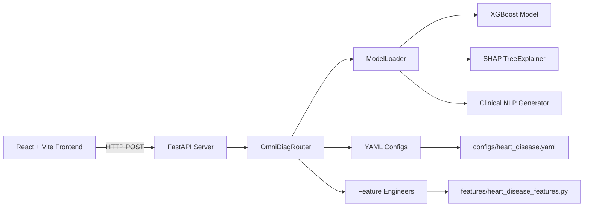

# 🏥 OmniDiag: Multi-Disease Diagnostic Platform


> **A config-driven, multi-disease diagnostic platform combining XGBoost with SHAP explainability and bilingual (EN/AR) clinical NLP summaries — served via FastAPI and a modern React dashboard.**

---

## 📋 Table of Contents

- [Executive Summary](#-executive-summary)
- [Key Features](#-key-features)
- [System Architecture](#-system-architecture)
- [Project Structure](#-project-structure)
- [Getting Started](#-getting-started)
- [API Documentation](#-api-documentation)
- [Clinical Interpretability](#-clinical-interpretability)
- [Frontend Dashboard](#-frontend-dashboard)
- [Tech Stack & Credits](#-tech-stack--credits)
- [Future Roadmap](#-future-roadmap)
- [License & Contact](#-license--contact)

---

## 📌 Executive Summary

OmniDiag is a **production-ready clinical decision support platform** that sits at the intersection of modern AI engineering and real-world medical diagnosis. Unlike conventional ML demos that optimize for generic accuracy metrics, OmniDiag is built with a **clinical-first mindset**:

- **Config-driven architecture** — adding a new disease requires only a YAML config and a feature engineer; no API code changes.
- **Explainable by default** — every prediction is accompanied by SHAP values and a **bilingual clinical summary** (English / Arabic) written in natural medical language.
- **Dual-mode UI** — engineers can stress-test models with manual inputs; clinicians can browse mock patient records in an EMR-style dashboard.

The system currently supports **Heart Disease risk assessment** using an optimized XGBoost model (898 estimators, Bayesian-tuned hyperparameters) with engineered heuristic and clinical features, achieving high sensitivity for early detection.

---

## ✨ Key Features

### 🔄 Dynamic Disease Routing
A zero-code plugin architecture: drop a YAML config in [`configs/`](configs/) and implement a feature engineer in [`features/`](features/). The [`OmniDiagRouter`](backend/router.py:27) auto-discovers and registers the new disease at startup — no API modifications needed.

### 🧠 SHAP Explainability
Every diagnostic decision is decomposed using [`shap.TreeExplainer`](backend/model_loader.py:336), revealing exactly which features drove the prediction and by how much. The [`/explain`](backend/main.py:85) endpoint returns raw SHAP values, base values, and feature names for downstream visualization.

### 🌐 Bilingual Clinical NLP
The [`_generate_clinical_summary()`](backend/model_loader.py:231) method translates SHAP values into natural-language clinical notes in **English** and **Arabic**. Top risk factors and protective factors are identified and described in human-readable prose — bridging the gap between model internals and clinical decision-making.

### 🖥️ Dual-Mode React Dashboard
A modern React + Vite + Tailwind CSS frontend with two complementary views:
- **Engineering Mode** — manual feature input, real-time prediction, SHAP bar charts, and confidence gauges.
- **Clinical EMR Mode** — mock patient records with batch predictions, color-coded risk badges, and clinical summary cards.

### 🏗️ Production-Grade Backend
FastAPI with CORS middleware, Pydantic schema validation, lazy model loading, and a legacy-compatible `/api/v3/predict` endpoint for backward compatibility.

---

## 🏗️ System Architecture



### Request Flow

1. **Frontend** sends patient data to `/api/v4/{disease}/predict` or `/api/v4/{disease}/explain`.
2. **FastAPI** validates the payload against a dynamically resolved Pydantic schema via [`get_schema_for_disease()`](backend/schemas.py:73).
3. **OmniDiagRouter** ([`backend/router.py`](backend/router.py:27)) looks up the disease name in its registry and delegates to the correct [`ModelLoader`](backend/model_loader.py:48).
4. **ModelLoader** applies feature engineering ([heuristic](models/advanced_feature_engineering.py:14) + [clinical](models/advanced_feature_engineering.py:32)), runs preprocessors (label encoding, scaling), and invokes the XGBoost model.
5. **SHAP TreeExplainer** computes feature-level contributions.
6. **Clinical NLP** ([`_generate_clinical_summary()`](backend/model_loader.py:231)) produces bilingual English/Arabic summaries from the top SHAP drivers.
7. **Response** is returned as structured JSON to the frontend for rendering.

---

## 📁 Project Structure

```
├── backend/                          # FastAPI application
│   ├── main.py                       # API entry point, route definitions
│   ├── router.py                     # OmniDiagRouter — dynamic disease routing
│   ├── model_loader.py               # ModelLoader — predict, explain, clinical NLP
│   └── schemas.py                    # Pydantic schemas, dynamic schema resolver
│
├── frontend/                         # React + Vite + Tailwind CSS dashboard
│   ├── src/
│   │   ├── App.jsx                   # Main app with mode routing
│   │   ├── api.js                    # API client (predict, explain endpoints)
│   │   ├── mockPatients.js           # Mock patient data for EMR mode
│   │   └── components/
│   │       ├── EngineeringMode.jsx   # Manual testing interface
│   │       ├── ClinicalEmrMode.jsx   # EMR-style patient dashboard
│   │       └── ShapBarChart.jsx      # SHAP waterfall visualization
│   ├── index.html
│   ├── vite.config.js
│   ├── tailwind.config.js
│   └── package.json
│
├── configs/                          # YAML disease configurations
│   ├── config_loader.py              # Config loading utilities
│   └── heart_disease.yaml            # Heart disease config (v4.0.0)
│
├── features/                         # Feature engineering modules
│   ├── base_features.py              # Abstract base feature engineer
│   └── heart_disease_features.py     # Heart disease feature engineer
│
├── models/                           # Trained model weights & training scripts
│   ├── heart_disease/
│   │   ├── xgboost_weights/          # XGBoost .pkl files
│   │   ├── preprocessors/            # Label encoders, scalers
│   │   └── tabnet_weights/           # TabNet weights (experimental)
│   ├── train_xgboost.py              # XGBoost training pipeline
│   ├── optimize_xgboost.py           # Bayesian hyperparameter optimization
│   └── advanced_feature_engineering.py
│
├── data_pipeline/                    # Data cleaning & merging
│   ├── clean_data.py                 # Full preprocessing pipeline
│   ├── merge_data.py                 # Data harmonization & merging
│   └── harmonization.py              # New data exploration
│
├── data/heart_disease/               # Isolated disease data
│   ├── raw/                          # Raw CSV / Excel files
│   ├── processed/                    # Cleaned, engineered datasets
│   └── interim/                      # Intermediate evaluation artifacts
│
├── ui/app.py                         # Legacy Streamlit UI (V2)
├── v2_archive/                       # Archived V2 notebooks & source
├── deployment/                       # Deployment guides (ngrok, etc.)
├── reports/                          # Evaluation metrics & figures
├── plans/                            # Architecture & migration plans
├── requirements.txt                  # Python dependencies
├── Dockerfile                        # Container build
└── .gitignore
```

---

## 🚀 Getting Started

### Prerequisites

- **Python 3.9+** with `pip`
- **Node.js 18+** with `npm`
- A virtual environment (recommended)

### Backend Setup

```bash
# Clone the repository
git clone https://github.com/your-org/omnidiag.git
cd omnidiag

# Create and activate virtual environment
python -m venv .venv
source .venv/bin/activate  # Linux/Mac
# .venv\Scripts\activate   # Windows

# Install Python dependencies
pip install -r requirements.txt

# Start the FastAPI server
uvicorn backend.main:app --reload --host 0.0.0.0 --port 8000
```

The API will be available at [`http://localhost:8000`](http://localhost:8000). Interactive Swagger docs at [`http://localhost:8000/docs`](http://localhost:8000/docs).

### Frontend Setup

```bash
cd frontend

# Install Node.js dependencies
npm install

# Start the development server
npm run dev
```

The dashboard will be available at [`http://localhost:5173`](http://localhost:5173) (or the next available port).

> **Note:** The frontend expects the backend at `http://localhost:8000`. Update the `BASE_URL` in [`frontend/src/api.js`](frontend/src/api.js) if your backend runs on a different host/port.

---

## 📖 API Documentation

### System Endpoints

| Method | Endpoint | Description |
|--------|----------|-------------|
| `GET` | [`/`](backend/main.py:37) | Health check — returns status, version, and available diseases |
| `GET` | [`/api/v4/diseases`](backend/main.py:46) | List all registered diseases with metadata |

### Clinical Endpoints

| Method | Endpoint | Description |
|--------|----------|-------------|
| `POST` | [`/api/v4/{disease}/predict`](backend/main.py:63) | Predict disease risk for a patient |
| `POST` | [`/api/v4/{disease}/explain`](backend/main.py:85) | Get SHAP-based explanation for a prediction |

### Legacy Endpoint

| Method | Endpoint | Description |
|--------|----------|-------------|
| `POST` | [`/api/v3/predict`](backend/main.py:110) | Legacy endpoint — routes to `heart_disease` |

### Example: `/api/v4/heart_disease/predict`

**Request:**
```json
{
  "Age": 58,
  "Sex": "M",
  "ChestPainType": "ATA",
  "RestingBP": 140,
  "Cholesterol": 289,
  "FastingBS": 0,
  "RestingECG": "Normal",
  "MaxHR": 120,
  "ExerciseAngina": "N",
  "Oldpeak": 2.4,
  "ST_Slope": "Flat"
}
```

**Response:**
```json
{
  "prediction": 1,
  "confidence": 0.87,
  "diagnosis": "High risk of heart disease",
  "probability": 0.87
}
```

### Example: `/api/v4/heart_disease/explain`

**Response:**
```json
{
  "shap_values": [0.42, -0.15, 0.31, ...],
  "base_value": 0.35,
  "feature_names": ["Age", "Sex_Num", "ChestPainType_ATA", ...],
  "clinical_summary": {
    "en": "The primary factors increasing risk are Oldpeak (2.4), Age (58), and ST_Slope (Flat). A protective factor reducing risk is ChestPainType (ATA).",
    "ar": "العوامل الرئيسية التي تزيد من الخطر هي Oldpeak (2.4) و Age (58) و ST_Slope (Flat). العامل الوقائي الذي يقلل الخطر هو ChestPainType (ATA)."
  }
}
```

---

## 🔬 Clinical Interpretability

OmniDiag treats explainability as a **first-class feature**, not an afterthought. The system implements a three-layer interpretability stack:

### Layer 1: SHAP Values (Mathematical)
[`shap.TreeExplainer`](backend/model_loader.py:336) computes exact Shapley values for the XGBoost model, quantifying each feature's marginal contribution to the prediction. The [`/explain`](backend/main.py:85) endpoint returns raw values for custom visualization (bar charts, waterfall plots, beeswarm plots).

### Layer 2: Feature Attribution (Visual)
The frontend's [`ShapBarChart`](frontend/src/components/ShapBarChart.jsx) component renders a horizontal bar chart of SHAP values, color-coded by direction (red = risk-increasing, green = risk-decreasing), giving clinicians an immediate visual of what drove the decision.

### Layer 3: Clinical NLP (Linguistic)
The [`_generate_clinical_summary()`](backend/model_loader.py:231) method translates the top SHAP drivers into natural-language clinical notes:

- **English:** *"The primary factors increasing risk are Oldpeak (2.4), Age (58), and ST_Slope (Flat). A protective factor reducing risk is ChestPainType (ATA)."*
- **Arabic:** *"العوامل الرئيسية التي تزيد من الخطر هي Oldpeak (2.4) و Age (58) و ST_Slope (Flat). العامل الوقائي الذي يقلل الخطر هو ChestPainType (ATA)."*

This bridges the gap between model internals and clinical documentation, enabling doctors to understand *why* a prediction was made without needing ML expertise.

---

## 🖥️ Frontend Dashboard

The React frontend provides two complementary interfaces:

### 🔧 Engineering Mode
[`EngineeringMode.jsx`](frontend/src/components/EngineeringMode.jsx) — a comprehensive manual testing interface with:
- All 11 feature inputs (sliders, dropdowns, number fields)
- Real-time prediction with confidence gauge
- SHAP bar chart visualization
- Bilingual clinical summary display
- Loading states and error handling

### 🏥 Clinical EMR Mode
[`ClinicalEmrMode.jsx`](frontend/src/components/ClinicalEmrMode.jsx) — a mock electronic medical records dashboard with:
- Patient list with search/filter
- Color-coded risk badges (Low / Medium / High)
- Batch prediction with parallel API calls
- Vital signs cards (Heart Rate, Blood Pressure, Cholesterol, etc.)
- Clinical summary cards in English and Arabic

---

## 🛠️ Tech Stack & Credits

### Backend
| Technology | Purpose |
|------------|---------|
| [Python 3.11](https://www.python.org/) | Core programming language |
| [FastAPI](https://fastapi.tiangolo.com/) | High-performance async API framework |
| [XGBoost](https://xgboost.readthedocs.io/) | Gradient-boosted decision tree engine |
| [SHAP](https://shap.readthedocs.io/) | Game-theoretic feature attribution |
| [Pydantic](https://docs.pydantic.dev/) | Data validation & schema management |
| [PyYAML](https://pyyaml.org/) | Configuration file parsing |
| [Pandas](https://pandas.pydata.org/) | Data manipulation & preprocessing |
| [Scikit-learn](https://scikit-learn.org/) | Preprocessing pipelines & encoders |

### Frontend
| Technology | Purpose |
|------------|---------|
| [React 18](https://react.dev/) | UI component library |
| [Vite 5](https://vitejs.dev/) | Build tool & dev server |
| [Tailwind CSS 3](https://tailwindcss.com/) | Utility-first CSS framework |
| [Recharts](https://recharts.org/) | Composable charting library |
| [Lucide React](https://lucide.dev/) | Icon component library |

### Infrastructure
| Technology | Purpose |
|------------|---------|
| [Docker](https://www.docker.com/) | Containerization |
| [MLflow](https://mlflow.org/) | Experiment tracking |
| [Optuna](https://optuna.org/) | Hyperparameter optimization |

### Developed By

**Yahya Mohammad Ali Lababneh** — Data Science and Artificial Intelligence

---

## 🗺️ Future Roadmap

### V4.1 — Dynamic Linguistic Engine
- Replace hardcoded Arabic feature name dictionary with a config-driven localization system
- Support additional languages (French, Spanish, German) via YAML locale files

### V4.2 — Multi-Disease Expansion
- Add configs for diabetes, chronic kidney disease, and hypertension
- Implement disease-specific feature engineers with domain-expert features

### V4.3 — Enhanced Clinical NLP
- Integrate with LLM APIs (GPT-4, Claude) for richer, patient-specific clinical narratives
- Add structured clinical report generation (PDF export)

### V4.4 — Production Hardening
- Add authentication (JWT / OAuth2)
- Implement rate limiting and request logging
- Add PostgreSQL persistence for patient records
- Deploy with Docker Compose (API + Frontend + DB)

### V4.5 — Model Registry
- Integrate MLflow model registry for versioned model deployments
- A/B testing infrastructure for comparing model versions in production

---

## 📄 License & Contact

Copyright (c) 2026 Yahya Lababenah. All Rights Reserved. 
This project is proprietary and confidential. Unauthorized copying, modification, or distribution is strictly prohibited.
For questions, collaboration, or clinical validation inquiries:

- **Author:** Yahya Mohammad Ali Lababneh
- **Email:** [yahyalababenah@example.com](yahyalababenah@example.com)
- **GitHub:** [github.com/yahyalababenah/omnidiag](https://github.com/yhyalababenah/omnidiag)

---

<p align="center">
  <i>Built with ❤️ for the intersection of AI and clinical medicine.</i>
  <br/>
  <i>Every prediction comes with a reason. Every reason comes in your language.</i>
</p>
