# OmniDiag: Multi-Disease Clinical Decision Support System

[](requirements.txt)
[](backend/main.py:1)
[](frontend/package.json)
[](docker-compose.yml:23)
[](backend/cache.py:39)
[](backend/monitoring/metrics.py:37)
[](backend/monitoring/mlflow_tracker.py:63)
[](deploy/prometheus.yml)
[](k8s/hpa.yaml)
[](LICENSE)
[](.github/workflows/ci.yml)

---

- **OmniDiag** is a config-driven, multi-disease clinical decision support system with SHAP explanations, human-in-the-loop review and an admin dashboard.
- **Shipped modules:** heart disease (CAD) and NHANES dysglycaemia.
- **BRFSS diabetes is retired** (October 2026) and is not a shipped module.
- **Not live:** the MLflow tracking server, Evidently drift reports and Grafana dashboards.
- **Federated learning** is a simulation in the research repo; the Flower prototype here is superseded.

**OmniDiag** is a config-driven, multi-disease clinical decision support system built for healthcare professionals. It serves per-disease models behind a unified FastAPI surface, with SHAP-based explainability, a DiCE-inspired counterfactual engine, a human-in-the-loop active learning pipeline, DeepSeek LLM clinical report generation, Prometheus metrics, and Kubernetes deployment with horizontal pod autoscaling.

## Who this is for, and what each module covers

**The system** is a clinical decision support system (CDSS) for **resident and general physicians**, in **outpatient clinics, teaching hospitals and government hospitals**. It supports a clinician's decision. It does not make one, and it does not diagnose.

**The heart module is part of that system with a narrower scope of its own.** It ranks **patients a clinician has already decided to refer for catheterisation** by the probability of a >50 % stenosis. It is **not a general-population screen**: every patient it learned from had already been selected for catheterisation by a clinician (UCI, 1982–1987), so it has never seen the people a screening test would be pointed at. The sentence is carried in the module's own config (`disease.scope_note`) and shown beside every result on screen and in the printed report, because a number without its scope is the failure this project is most exposed to.

**The diabetes module is now a second, separately scoped module: dysglycaemia screening on NHANES (Phase 9).** It replaces the BRFSS 2015 stacking ensemble, which was **retired** in the October 2026 cleanup: its config is archived ([`archive/post_expo_2026-10/INDEX.md`](archive/post_expo_2026-10/INDEX.md)), every route that would score or write for `diabetes` answers **410 `DISEASE_RETIRED`** and names `diabetes_nhanes` as the replacement, and stored BRFSS rows stay readable, marked as archived. Its 0.108184 threshold, 0.237 prevalence correction and `risk_bands` no longer exist in the served code.

### The two modules, side by side

| | **Heart** (Phase 8) | **Dysglycaemia screening** (Phase 9, NHANES) |
|---|---|---|
| **Question answered** | Among patients already chosen for catheterisation, who has a >50 % stenosis? | Among adults with **no diabetes diagnosis and on no glucose-lowering drug**, who has HbA1c ≥ 5.7 %? |
| **Not** | A general-population screen | A diabetes diagnostic. Dysglycaemia is established by the laboratory result, never by this model |
| **Data** | UCI cohorts, 1982–1987 | NHANES 2007–2018, n = 26,904, prevalence 32.9 % |
| **Model** | Spline-GLM, Venn-Abers calibration | Explainable Boosting Machine, Platt calibration (contributions *are* the model, no SHAP) |
| **Inputs** | 11 accepted, 7 read | 20 measurements at a first visit; 6 mandatory, never imputed |
| **Decision** | refer / uncertain / no referral; Mondrian conformal by sex × class | referral / uncertain / no referral; conformal by **age band** (20–39, 40–59, 60+), α = 0.20 |
| **Threshold, risk bands** | None, deliberately | None, deliberately (the BRFSS bands are retired, not recomputed) |
| **Uncertain share** | about 40 % | 38.3 % (referral 33.9 %, no referral 27.8 %) |
| **Next step on screen** | Result panel per decision | `clinical_action_plan` on every prediction: HbA1c/OGTT (High), fasting or random glucose (Medium), none (Low) |

**Measured on the held-out 2017–2018 cycle** (train 2007–2014, calibrate 2015–2016; n = 4,099, prevalence 35.9 %; every figure is from the shipped bundle's `model_card.json`):

- **AUC 0.752** (95 % CI 0.738–0.766); 0.766 with NHANES exam weights. Calibration slope 0.952, intercept −0.090, ECE 0.025.
- **86 % of dysglycaemic patients are flagged** (referral or uncertain) — and therefore **14.1 % receive `no_referral`**: 9.8 % aged 20–39, 15.8 % aged 40–59, 14.3 % aged 60+. **Roughly one in seven patients who do have dysglycaemia is told there is no indication to test.** A `no_referral` here is not a clearance; the action plan says so on screen. At α = 0.15 the figure was 10.1 %, and the move to 0.20 was made knowingly: about 6 points fewer healthy patients sent for a test, about 4 points more missed positives.
- Specificity of `no_referral` is 35.5 %, and **60–77 % of healthy patients are still told to test.** This is a "test most people" screen, not a narrow one.

**Limits, each measured and each carried in `configs/diabetes_nhanes.yaml`:**

- **Discrimination is uneven.** AUC 0.757 (20–39), 0.691 (40–59), 0.619 (60+); 0.785 female, 0.713 male.
- **Not race-blind.** Race is never an input, but the twenty features recover NH Asian membership at AUC 0.785 and NH Black at 0.780. Calibration differs by group behind the pooled figure (mean predicted minus observed: NH White +0.106, NH Asian −0.097, NH Black −0.076).
- **The label is ambiguous by construction.** HbA1c ≥ 5.7 % is a hard cut on an assay with 0.1–0.2 point within-person variability; 24.5 % of the cohort sits inside that band. About 0.07 AUC is unattainable in principle. HbA1c is also shifted by red-cell indices independently of glucose, so the label is not a pure measure of glycaemia.
- **Glycaemic measurements are banned as inputs, permanently** (glucose, insulin, OGTT): they measure the same quantity as the label. A complete blood count is banned too — its AUC gain (+0.022) is an assay artefact, not risk information.
- **Monotone priors hold on main effects only.** Pairwise terms can reverse direction for some patients (for example GGT +5 U/L lowers predicted risk for 16.3 %). "The model can never say older implies lower risk" is **false** for the shipped model and is not claimed anywhere.
- **Conformal coverage is measured under a temporal split**, which breaks exchangeability, so no coverage guarantee is claimed.
- **No deployment prevalence.** The 0.237 Jordan figure is total diabetes prevalence and does not transfer to this target. Absolute probabilities need local recalibration before they are shown as anything but a relative ordering.
- **Not clinically reviewed.** No clinician has read these screens or the action plans; that is a declared next step, as for the heart module.
- **What-If** for this module uses its own lever policy (`backend/diabetes_what_if_levers.py`), including raising HDL to a ceiling of 60 mg/dL; the heart module's counterfactual generator is untouched.

### What changed in Phase 8 (heart module only)

The heart module now ships a **Spline-GLM on seven pre-stress-test inputs, calibrated with exact inductive Venn-Abers, with a Mondrian conformal decision by sex × class** (`models/heart_disease/heart_l3_glm_stack.pkl`, built at image build time and verified against a recorded fingerprint). It answers **refer / do not refer / uncertain** rather than thresholding a probability, and **uncertain counts as a referral everywhere in the system**. It publishes **no decision threshold and no risk bands**, deliberately: Gate 6 measured that the probability's meaning does not transport between hospitals, so a HIGH/MODERATE/LOW badge on it would claim a precision the model does not have. The declared cost is that **around 40 % of patients land in `uncertain`**.

The full research record — every decision, its alternatives, and the measurement behind it — is in the experiments repository, not here.

> **What the screenshots in the research repo do and do not show.** They show that the system behaves as designed — that the interface reports the model's decision faithfully. **They do not show that it is clinically understood.** No clinician has read these screens. Around 40 % of patients land in `uncertain`, and what a physician does with that has not been tested with any physician. **Clinical review is a declared next step before any real use.**

### The three answers, on screen

The heart module returns **one of three answers**, and the interface reports
whichever one the model gave. These are real screens, captured from this branch
against a local backend (Gate 8.6-b, 2026-09-27).

| Referral | No referral | Uncertain |
|---|---|---|
| 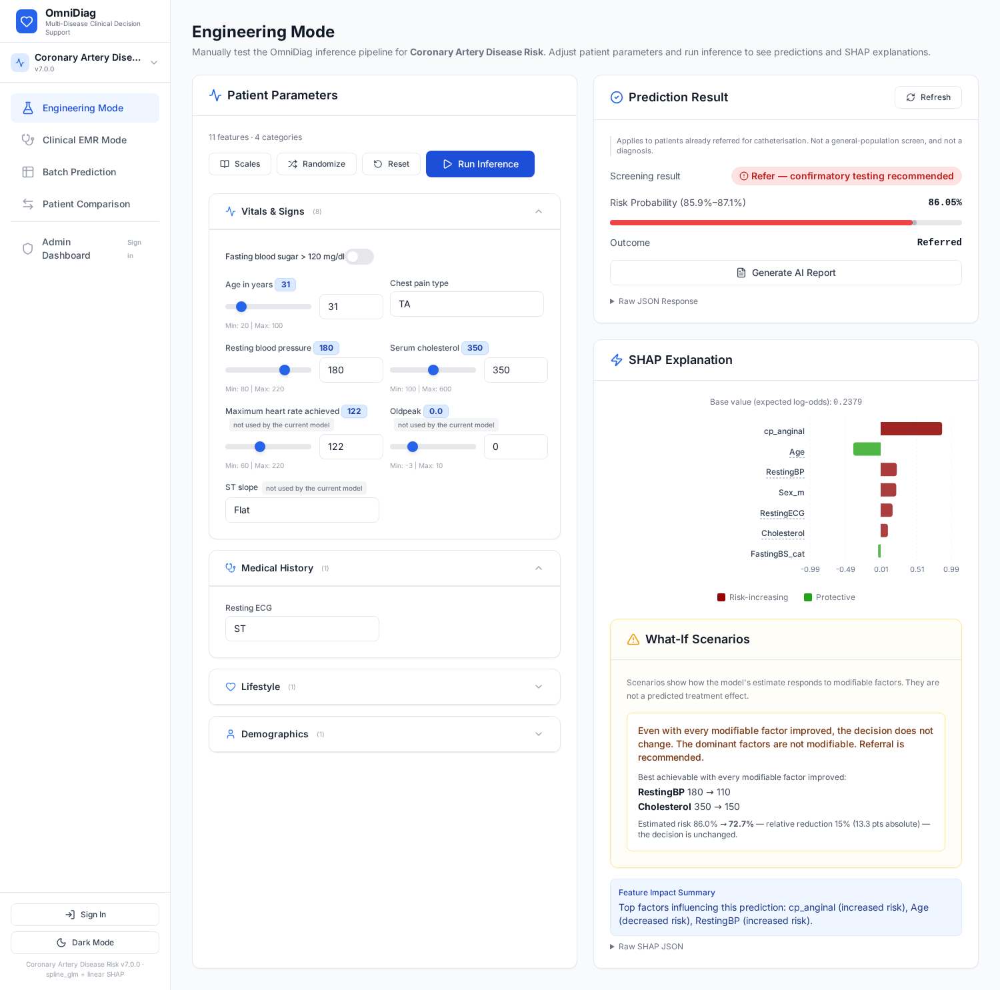 | 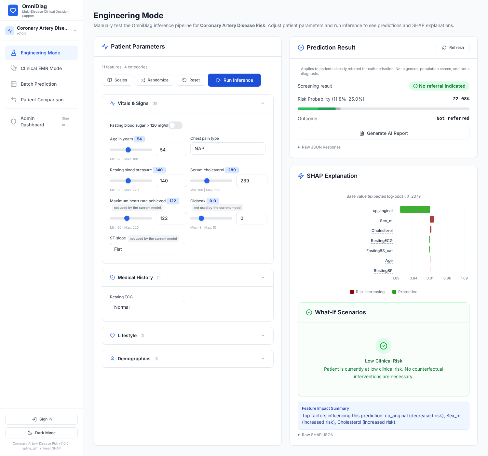 | 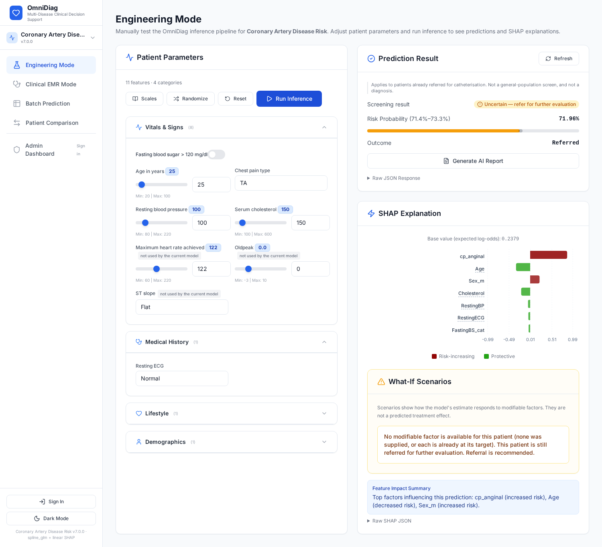 |
| `Refer — confirmatory testing recommended` | `No referral indicated` | `Uncertain — refer for further evaluation` |

**"Uncertain" is a third decision, not a middle band of risk.** The conformal set
contains *both* labels, which means the model is declining to rank this patient
at the guaranteed error rate — it is not saying "moderate risk". It is amber
rather than red or green for that reason, it **counts as a referral everywhere in
the system**, and it is where about 40 % of patients land. The module publishes
no threshold and no risk bands, so there is no middle band for it to be.

The generated report says the same thing in prose, including for the uncertain
patient — [`20_uncertain_report.png`](docs/assets/screenshots/20_uncertain_report.png).

**These screens show that the interface reports the model faithfully. They do not
show that it is clinically understood** — the limit stated above applies to these
four images too.

### The measurements behind the model

Every figure below is copied from the experiments repository, where it was
produced; none is a live plot. Each caption names the gate that produced it, the
script that drew it, and the date of the commit it was taken from.

| | |
|---|---|
| 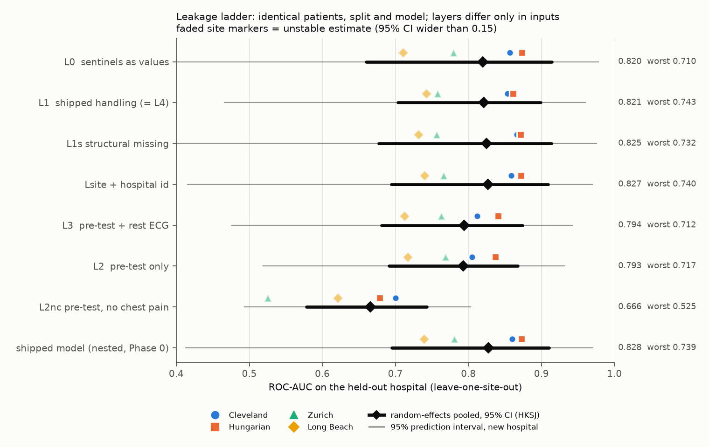 | 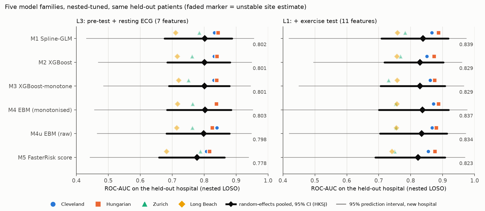 |
| **The seven-layer feature ladder**, pooled leave-one-hospital-out AUC with HKSJ intervals. Gate 3 · `scripts/p3_figures.py` · research repo `0e0047d`, 2026-09-25 | **The six model families**, on the shipped feature set and the wider one. Gate 4 · `scripts/p4_figures.py` · research repo `3c5d88a`, 2026-09-25 |
| 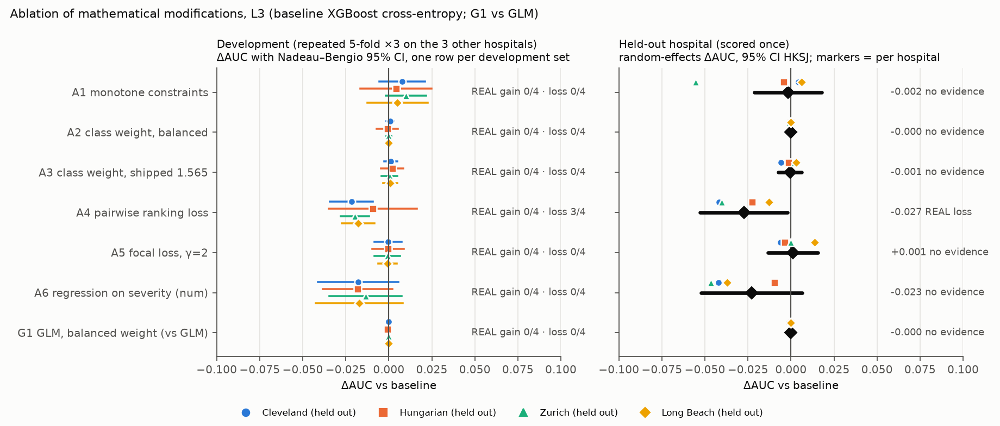 | 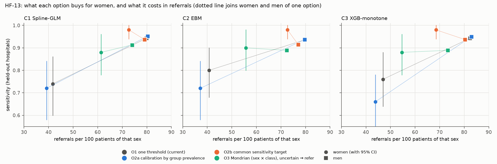 |
| **Nine training objectives** compared on the same split. Gate 5 · `scripts/p5_figures.py` · research repo `0e0047d`, 2026-09-25 | **The sex-sensitivity gap (HF-13)** and the four decision rules considered; O3, the Mondrian rule, is what ships. Gate 7 · `scripts/p7_hf13_figure.py` · research repo `f2e17a3`, 2026-09-26 |
| 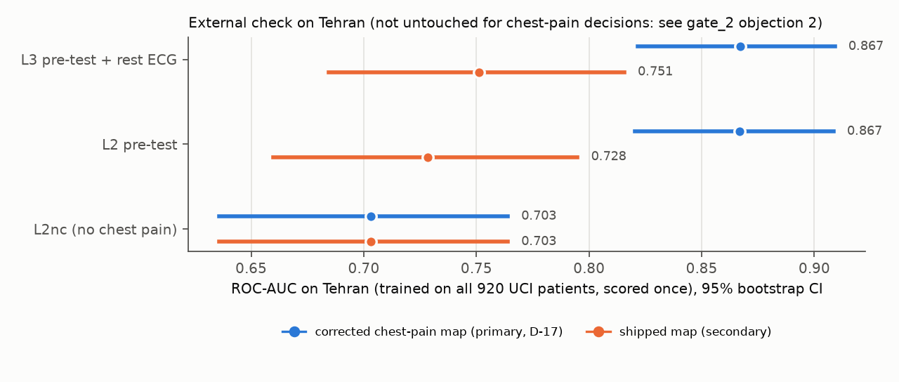 | 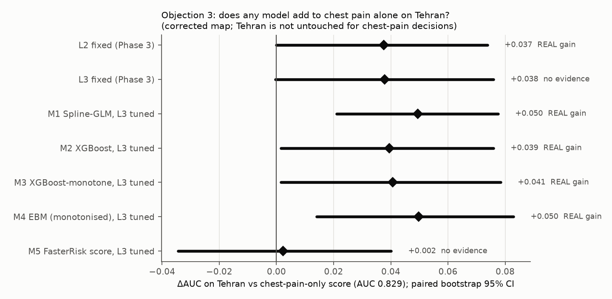 |
| **External validation, Tehran cohort** — a different country, a different decade, a different recording convention. Gate 1 · `scripts/p3_figures.py` · research repo `0e0047d`, 2026-09-25 | **Why chest-pain coding matters** between the two cohorts. Gate 4 · `scripts/p4_figures.py` · research repo `3c5d88a`, 2026-09-25 |

The pooled figure is never the whole story here: the widest single-hospital
interval spans 0.40 AUC, and the 95 % prediction interval for a *new* hospital
runs from 0.36 to 0.97. Both are in the research repo's `results.md`, with the
per-hospital tables the plots summarise.


### What changed in Phase 9 (dysglycaemia module only)

The diabetes slot now ships an **Explainable Boosting Machine on twenty first-visit inputs, calibrated with Platt scaling, with a group-conditional conformal decision by age band** (`models/diabetes_nhanes/diabetes_nhanes_ebm.joblib`, fetched at image build time and checked against a recorded sha256). Like the heart module, it answers **referral / no referral / uncertain** rather than thresholding a probability, and **uncertain counts as a referral everywhere in the system**. It publishes **no decision threshold and no risk bands**, deliberately. The declared cost is that **38.3 % of patients land in `uncertain`**, and that **14.1 % of the patients who do have dysglycaemia receive `no_referral`**. Every decision the model made on the way there, and the measurement behind it, is in [`docs/phase9/`](docs/phase9/).

> **What the screenshots below do and do not show.** They show that the interface reports the model's decision faithfully. **They do not show that it is clinically understood.** No clinician has read these screens or their action plans; that is a declared next step before any real use, as for the heart module.

### The three answers, on screen (dysglycaemia)

The module returns **one of three answers**, and the interface reports whichever one the model gave.
These are real screens, captured from the merged branch against a local backend (2026-09-28, Clinical
EMR mode, demo patients N-003, N-001 and N-002).

| Referral | No referral | Uncertain |
|---|---|---|
| 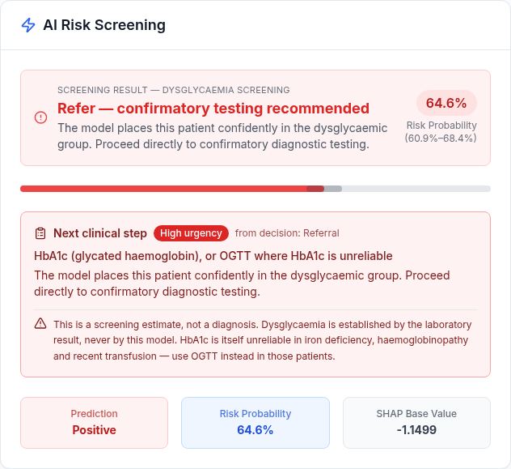 | 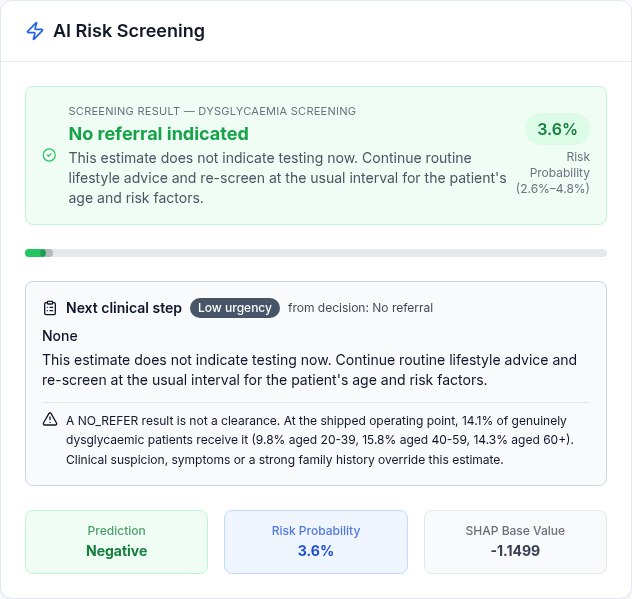 | 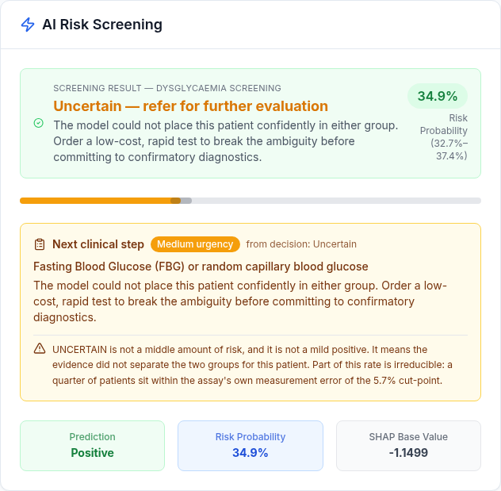 |
| `Refer — confirmatory testing recommended` · High urgency: HbA1c, or OGTT where HbA1c is unreliable | `No referral indicated` · Low urgency; the panel says **14.1 % of truly dysglycaemic patients receive this answer** | `Uncertain — refer for further evaluation` · Medium urgency: fasting or random glucose |

**"Uncertain" is a third decision, not a middle band of risk.** The conformal set contains *both*
labels: the model is declining to rank this patient at the guaranteed error rate. It counts as a
referral everywhere in the system, and it is where 38.3 % of patients land. Each panel carries a **next
clinical step** (`clinical_action_plan`) built from the decision, never from a risk band.

The generated report says the same thing in prose, including for the uncertain patient —
[`40_nhanes_uncertain_report.png`](docs/assets/screenshots/40_nhanes_uncertain_report.png). It is the
rule-based report, not the LLM one.

**These screens show that the interface reports the model faithfully. They do not show that it is
clinically understood** — the limit stated above applies to these images too. Three defects visible in
them are open, not hidden: the report quotes contributions as "SHAP +0.169" although this model has no
SHAP step; the report tells the clinician to "order an HbA1c test" for an uncertain patient while the
panel above it recommends a fasting or random glucose; and the uncertain panel's frame is green while its
title and next-step box are amber.

### How the dysglycaemia model explains itself

There is **no SHAP step in this module, and none is wanted**: the explanation is the model. An EBM is
additive by construction,

    logit(raw score) = intercept + Σ f_j(x_j) + Σ f_jk(x_j, x_k)

so each feature's contribution is read straight out of the fitted model, not estimated after the fact.
The identity is **asserted on every request** to within 1e-8 (measured at 2.7e-15 over the whole test
cycle) — an explanation that does not sum to the score is refused, not served. A pairwise term is split
evenly between its two features for the bar chart, the sum stays exact, and the unsplit terms are in
`term_contributions` for Engineering mode.

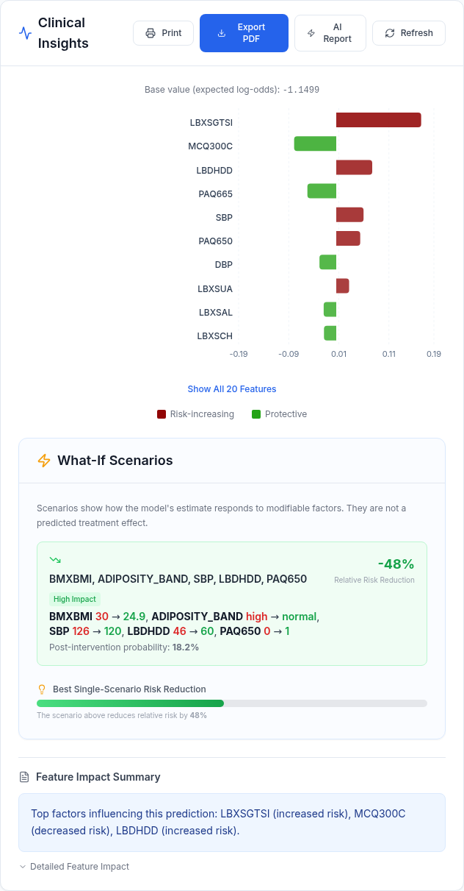

*Clinical Insights for N-002. Red bars raise the estimate, green bars lower it; the base value is the
model intercept.* Two things to read it correctly:

- **The bars are on the raw log-odds scale; the probability shown is after Platt calibration.** They do
  not add up to the displayed percentage by eye.
- **Monotone priors hold on main effects only.** Pairwise terms can reverse direction for some patients,
  so a single bar is a statement about this patient, not a rule about the feature.

**What-If uses this module's own lever policy.** For N-002 it moves BMI 30 → 24.9, adiposity band
high → normal, SBP 126 → 120, HDL 46 → 60 and vigorous activity 0 → 1, and the estimate falls to 18.2 %.
It is the model's response to modifiable factors, not a predicted treatment effect, and HDL is a proxy
for the behaviour that raises it ([`diabetes_what_if_levers.py`](backend/diabetes_what_if_levers.py)).

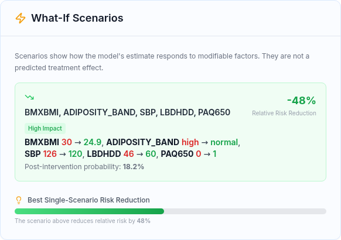

### The measurements behind the dysglycaemia model

Every figure below is a static image copied from the Phase 9 research folder into
[`docs/phase9/figures/`](docs/phase9/figures/) and committed on 2026-09-28 (`7300042`); none is a live
plot, and the scripts that drew them are **not in this repository**. Each caption names the finding or
decision it supports, in [`FINDINGS_REGISTER.md`](docs/phase9/FINDINGS_REGISTER.md) and
[`DISCOVERY_RECORD.md`](docs/phase9/DISCOVERY_RECORD.md).

| | |
|---|---|
| 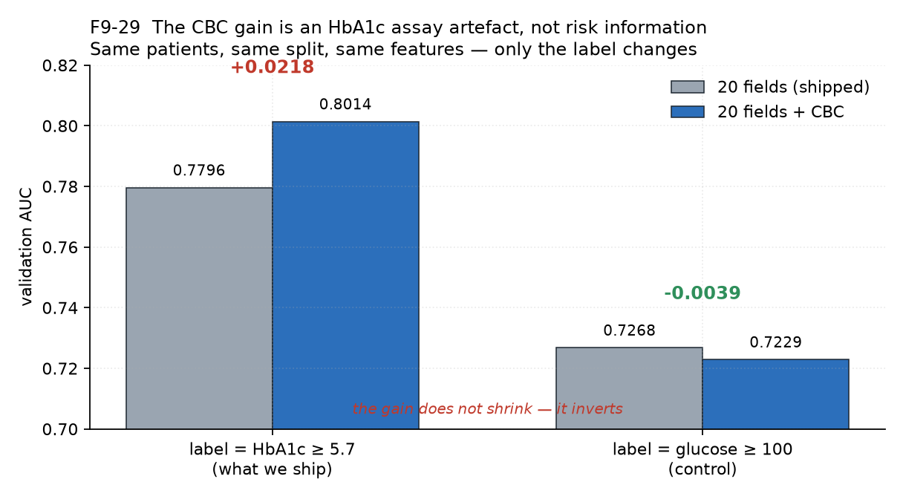 | 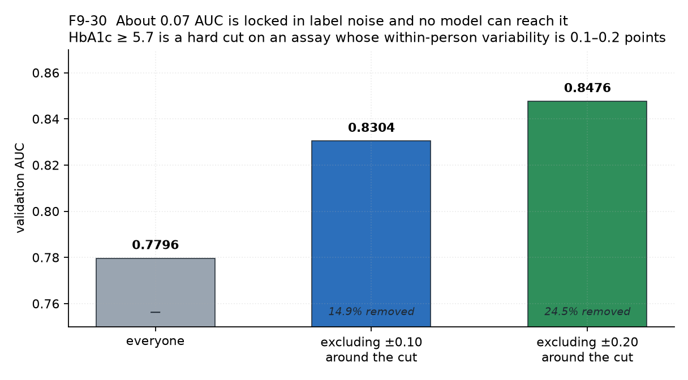 |
| **The CBC gain is an assay artefact (F9-29).** Adding a blood count lifts AUC by +0.0218 against the HbA1c label and *lowers* it by 0.0039 against a glucose label on the same patients, so it is banned as an input | **About 0.07 AUC is locked in label noise (F9-30).** Dropping the 24.5 % of patients within ±0.20 of the 5.7 % cut takes validation AUC from 0.7796 to 0.8476 |
| 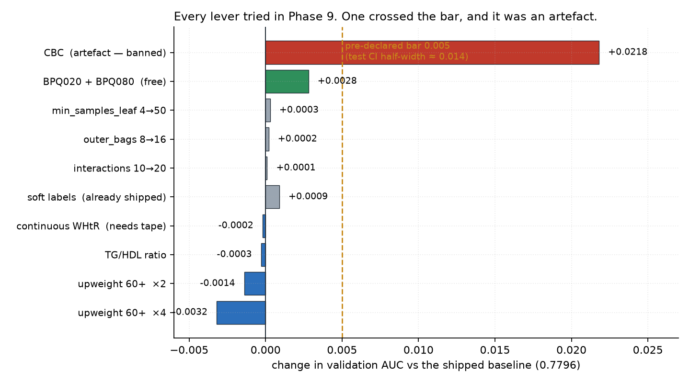 | 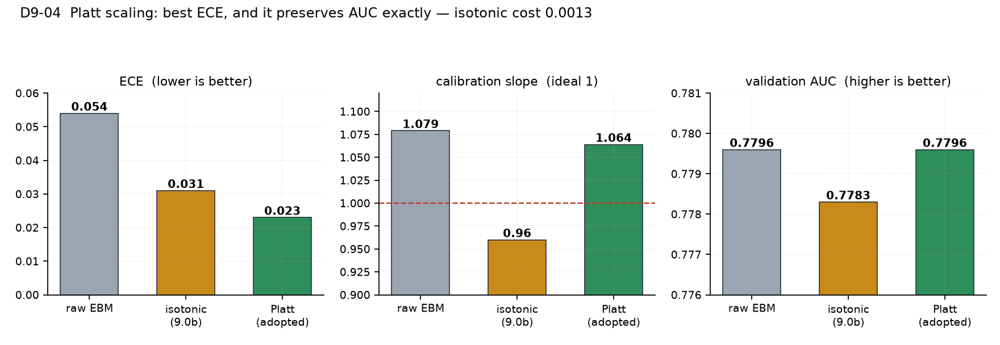 |
| **Every lever tried.** Against a pre-declared bar of +0.005, only the CBC crossed it, and it was the artefact; up-weighting the 60+ band made AUC worse | **Platt scaling is adopted (D9-04).** ECE 0.054 → 0.023 with AUC untouched at 0.7796; isotonic cost 0.0013 AUC |
| 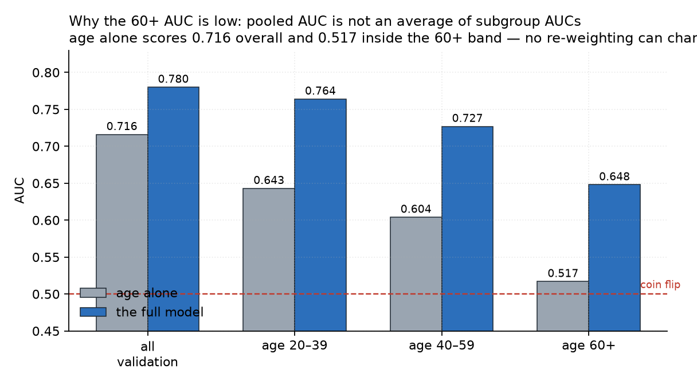 | 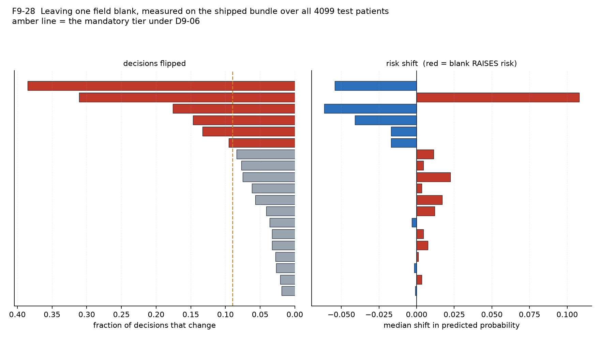 |
| **Why 60+ AUC is low.** Age alone scores 0.716 overall and 0.517 inside the 60+ band, so the full model's validation AUC of 0.648 there is not a defect that re-weighting can fix | **Leaving one field blank (F9-28).** Up to 38 % of decisions flip when a single field is missing, which is why six fields are mandatory and never imputed (D9-06) |
| 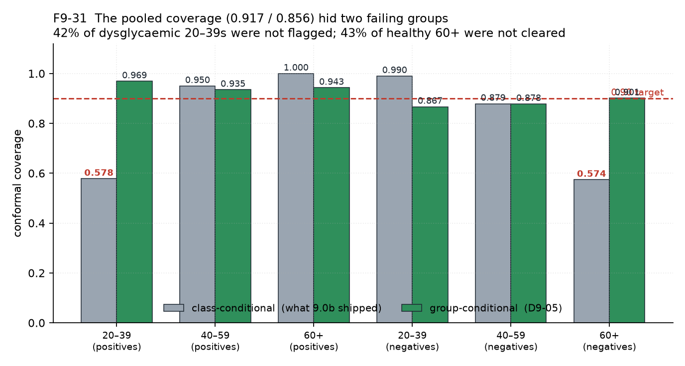 | 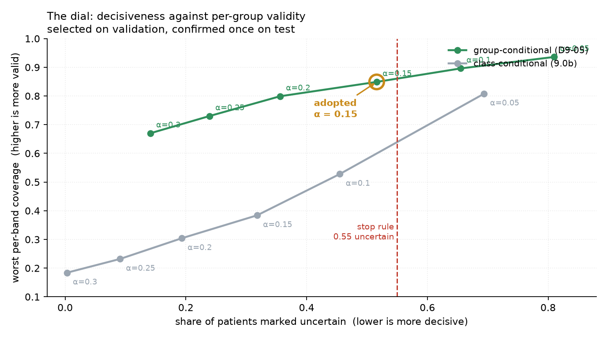 |
| **Pooled coverage hid two failing groups (F9-31).** Class-conditional coverage fell to 0.578 for dysglycaemic 20–39s and 0.574 for healthy 60+; group-conditional (D9-05) restores both | **The decisiveness dial.** Group-conditional keeps worst-band coverage far above class-conditional at every α. This plot marks α = 0.15, selected on validation; the shipped α was later moved to **0.20** (D9-07), for the reasons in the config |

The pooled figure is not the whole story here either: AUC is 0.757 for ages 20–39, 0.691 for 40–59 and
0.619 for 60+, and the twenty inputs recover NH Asian and NH Black membership at AUC 0.785 and 0.780
although race is never an input (see the limits above).

> **What is actually running in the deployed Space** (verified 2026-09-23, see
> [the archived feature verification](archive/post_expo_2026-10/docs/FEATURE_VERIFICATION.md)):
>
> - **Monitoring: Prometheus only.** Evidently drift detection and MLflow
>   tracking are implemented in this repository but are **not live**. Evidently
>   is installed in the image yet unusable — the code targets its 0.4 API and
>   the pin resolves to 0.7, which removed it; the cost of each way out is
>   costed in [docs/EVIDENTLY_COST.md](docs/EVIDENTLY_COST.md).
>
>   **MLflow, corrected 2026-09-26 (Gate 8.6).** It logged no runs because
>   *nothing wrote to it*: the only automatic caller was the retrain path, which
>   fails for heart and is a no-op for diabetes, and the script that builds the
>   shipped heart artifact logged nothing at all. Worse, the admin endpoint
>   reported `count: 0` whether the package was missing, the store was
>   unreachable, or the store was working and empty — so "MLflow is empty" could
>   not be told apart from "MLflow is not installed".
>
>   Both are fixed. `GET /admin/mlflow/runs` now returns a `status` of
>   `unavailable` / `unreachable` / `empty` / `ok` with the `tracking_uri` and a
>   reason, and [`scripts/train_heart_glm.py`](scripts/train_heart_glm.py) logs
>   one run per image build recording the artifact's provenance — the training
>   CSV's sha256, the bundle's sha256, the reproducibility fingerprint, the
>   conformal alpha, and the blank-input impact — and **deliberately no accuracy
>   figure**, because every performance number for this model is cross-fitted or
>   leave-one-hospital-out and belongs with its confidence interval, not beside
>   an artifact hash.
>
>   **What this still is not:** a tracking *server*. With no `MLFLOW_TRACKING_URI`
>   set, the store is a SQLite file baked into the image at build time, so it
>   holds exactly one run — the model in that image — and a new build replaces
>   it. There is no experiment comparison, and the retrain cycle that would
>   produce one is still broken (see the Known limitation below). `docker-compose`
>   and the k8s manifest do point at a real MLflow server, and the same code logs
>   there when one is reachable.
> - **Clinical notes: spaCy + regex, English only.** Numbers are assigned to
>   clinical concepts through spaCy's dependency parse, with a regex baseline
>   as fallback. The BioBERT path exists in the code but is never called — the
>   frontend always sends `use_bert: false` and `transformers` is not part of
>   the deployed dependency set. Arabic is not
>   supported: `/api/v4/parse-notes` reports `language.supported: false` for
>   any note containing Arabic and the UI says so explicitly.
> - **Patient Comparison compares two different patients**, side by side. It
>   is not a before/after view of one patient under an intervention; no such
>   view exists.

Two modules are currently registered: Coronary Artery Disease (`heart_disease`) and Dysglycaemia Screening on NHANES (`diabetes_nhanes`). The BRFSS module (`diabetes`) is retired and no longer registered; its name answers 410 (see [above](#who-this-is-for-and-what-each-module-covers)). Adding a disease within a registered model family requires a YAML config, a Pydantic schema and model weights — no routing, middleware, auth, or API changes. Adding a new model family requires one backend class implementing the ModelBackend interface, registered once. Each family declares its explainer: the heart GLM's SHAP values are exact and computed in closed form, the NHANES EBM is additive by construction, a tree family would use TreeExplainer, and any other family a slower generic SHAP explainer.

---

## System Architecture

### Request Flow & MLOps Pipeline

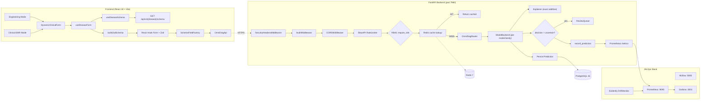
```mermaid
flowchart LR
    subgraph Client["Frontend (React 18 + Vite)"]
        A[Engineering Mode] --> B[DynamicClinicalForm]
        C[Clinical EMR Mode] --> B
        B --> D[useDiseaseForm]
        D --> E[useDiseaseSchema]
        E --> F["GET /api/v4/{disease}/schema"]
        D --> G[buildZodSchema]
        G --> H[React Hook Form + Zod]
        H --> I[SchemaFieldFactory]
        I --> J[OmniDiagApi]
    end

    subgraph Server["FastAPI Backend (port 7860)"]
        K[SecurityHeadersMiddleware] --> L[AuditMiddleware]
        L --> M[CORSMiddleware]
        M --> N[SlowAPI RateLimiter]
        N --> O{RBAC require_role}
        O --> P[Redis cache lookup]
        P -->|HIT| Q[Return cached]
        P -->|MISS| R[OmniDiagRouter]
        R --> T["ModelBackend (per model.family)"]
        T --> U["Explainer (exact additive)"]
        T --> V{"decision = uncertain?"}
        V -->|yes| W[ReviewQueue]
        V --> X[record_prediction]
        X --> Y[Prometheus metrics]
        T --> Z[Persist Prediction]
    end

    subgraph MLOps["MLOps Stack"]
        AA[MLflow :5000]
        BB[Prometheus :9090]
        CC[Grafana :3001]
        DD[Evidently DriftMonitor]
        BB --> CC
        Y --> BB
        DD --> BB
    end

    J -.->|HTTPS| K
    Z --> PostgreSQL[("PostgreSQL 15")]
    P -.-> Redis[("Redis 7")]
```

*Simplified: `U[Explainer]` only runs on `/explain` requests, not `/predict` — a plain `/predict` call returns straight from `T[ModelBackend]` to `X`/`Z` without computing an explanation.*

### Config-Driven Disease Registration

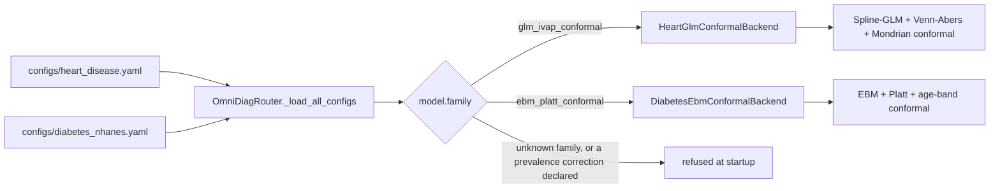
```mermaid
flowchart LR
    A[configs/heart_disease.yaml] --> B[OmniDiagRouter._load_all_configs]
    C[configs/diabetes_nhanes.yaml] --> B
    B --> D{model.family}
    D -->|glm_ivap_conformal| E[HeartGlmConformalBackend]
    D -->|ebm_platt_conformal| F[DiabetesEbmConformalBackend]
    D -->|unknown family, or a prevalence correction declared| X[refused at startup]
    E --> G[Spline-GLM + Venn-Abers + Mondrian conformal]
    F --> H[EBM + Platt + age-band conformal]
```

*Simplified; the shipped heart and NHANES modules return a conformal decision, not an entropy-based or threshold-based one (see modules table).*

### Active Learning Lifecycle

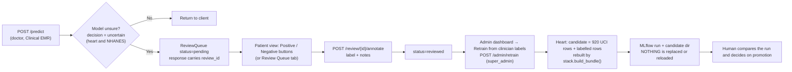
```mermaid
flowchart LR
    A["POST /predict\n(doctor, Clinical EMR)"] --> B{"Model unsure?\ndecision = uncertain\n(heart and NHANES)"}
    B -->|No| E[Return to client]
    B -->|Yes| D["ReviewQueue status=pending\nresponse carries review_id"]
    D --> F["Patient view: Positive / Negative buttons\n(or Review Queue tab)"]
    F --> G["POST /review/{id}/annotate\nlabel + notes"]
    G --> H["status=reviewed"]
    H --> I["Admin dashboard → Retrain from clinician labels\nPOST /admin/retrain (super_admin)"]
    I --> J["Heart: candidate = 920 UCI rows + labelled rows\nrebuilt by stack.build_bundle()"]
    J --> K["MLflow run + candidate dir\nNOTHING is replaced or reloaded"]
    K --> L["Human compares the run and decides on promotion"]
```

*Simplified; the shipped heart and NHANES modules return a conformal decision, not an entropy-based or threshold-based one (see modules table).*

---

## Architecture & Core Features

### Config-Driven Disease Routing

[`OmniDiagRouter`](backend/router.py) scans [`configs/`](configs/) at startup and auto-discovers all YAML configuration files. Each config names its model family in `model.family` (`glm_ivap_conformal` for CAD, `ebm_platt_conformal` for NHANES dysglycaemia), plus the weights path. The router instantiates the [`ModelBackend`](backend/model_backends/base.py) registered for that family ([`HeartGlmConformalBackend`](backend/model_backends/heart_glm_conformal.py), [`DiabetesEbmConformalBackend`](backend/model_backends/diabetes_ebm_conformal.py); `sklearn_pipeline`, which wraps [`ModelLoader`](backend/model_loader.py) and is the heart revert path, and `sklearn_generic` are registered too); artifacts lazy-load on first request, and an unknown family fails at startup. See [docs/ADDING_A_MODEL_FAMILY.md](docs/ADDING_A_MODEL_FAMILY.md) for the steps, measured costs, and current limits.

Each disease config declares the model architecture, weights paths with fallback resolution, explainer type (`linear` for heart, `additive` for NHANES), and schema back-reference via [`DISEASE_SCHEMA_REGISTRY`](backend/schemas.py) (or a `schema: {module, class}` block in the YAML). No registered family reads a feature-engineer module or a preprocessor directory any more (the BRFSS `stacking_ensemble` family was the only one); the heart Pipeline and the NHANES bundle are self-contained (see [Explainable Inference Core](#explainable-inference-core)), and a family that needs derived features computes them in its backend class.

### RBAC & Security Middleware

[`require_role()`](backend/auth/rbac.py:39) is a FastAPI dependency factory that enforces role membership before any route handler executes. It reads `current_user.roles` (loaded eagerly via `lazy="selectin"` on the `User.roles` relationship) and raises HTTP 403 with a structured payload listing required vs. held roles if the intersection is empty. Five roles are seeded at startup: `super_admin`, `admin`, `doctor`, `nurse`, `viewer`. `CLINICAL_ROLES = ("doctor", "nurse", "super_admin")` gates `batch`; retrain and audit endpoints require `("super_admin",)`; labelling a review case is open to `doctor`, `nurse` and `super_admin`. **`predict`, `explain` and `counterfactuals` are deliberately open to anonymous callers** — they depend on `get_optional_user` rather than `require_role`, so the public demo can be tried without an account. Results are persisted (and linkable to a patient record) only for authenticated users; everything that reads or writes stored clinical data is role-gated.

[`get_current_user()`](backend/auth/dependencies.py:31) resolves the authenticated identity in priority order: `Authorization: Bearer <JWT>` header → `access_token` HttpOnly cookie → `X-API-Key` header (hash compared against `users.api_key_hash` via `get_user_by_api_key()`). [`get_optional_user()`](backend/auth/dependencies.py:108) returns `None` instead of raising 401, used on endpoints that permit anonymous one-off predictions while persisting results only for authenticated users.

Three middleware layers wrap every request in [`main.py`](backend/main.py): [`SecurityHeadersMiddleware`](backend/middleware/security.py) sets the `Strict-Transport-Security` (HSTS) header when `ENFORCE_HTTPS=true` — this is a response header only; the middleware does not perform a server-side HTTP→HTTPS redirect; [`AuditMiddleware`](backend/middleware/audit.py) writes every authenticated request as an immutable `audit_logs` row (user, endpoint, method, status, IPv6-capable IP address, duration_ms); [`CORSMiddleware`](backend/main.py) enforces an allowlist from `CORS_ALLOWED_ORIGINS` and never accepts wildcard origins.

### Redis Caching & Rate Limiting

[`init_cache()`](backend/cache.py:39) selects the cache backend at startup: if `REDIS_URL` is set, it pings a `redis.asyncio` client and initialises a `RedisBackend` (fastapi-cache2); otherwise it falls through to `InMemoryBackend` silently — no `REDIS_URL` means no Redis dependency in development or test environments. [`predict_cache_key()`](backend/cache.py:76) produces a deterministic 16-character SHA-256 fingerprint over `{disease, sorted_features}` so identical patient inputs within any 5-minute window return cached responses. Schema responses carry a 24-hour TTL; prediction responses carry 300 seconds. [`cache_flush()`](backend/cache.py:114) enumerates `omnidiag:*` keys via `redis.keys()` on the Redis backend, or clears `backend._store` directly on the in-memory fallback.

Rate limiting is applied via [`SlowAPI`](backend/rate_limit.py:49) with per-route limits: clinical endpoints are capped at `LIMIT_CLINICAL = "30/minute"`, admin operations at `LIMIT_ADMIN = "60/minute"`, and the `/generate-report` endpoint at a hard 10 requests/minute enforced at the route level. A `viewer` role is seeded (see RBAC above) but no route currently gates on it — there is no viewer-specific rate limit yet.

### Human-in-the-Loop Active Learning

The active learning pipeline consists of three components. **A row is queued when the model itself answers `uncertain`** (`decision == 'uncertain'`). Both live modules report a conformal decision rather than a probability against a cut-point, so this is the rule for both. Routing such a module through a threshold rule was wrong in both directions, measurably so: with the 0.5 default it left a patient the model had called UNCERTAIN at p = 0.95 unqueued while queueing a confidently decided one at p = 0.52. A queued row records `decision_threshold = NULL`, because writing 0.5 there would make the audit trail claim a threshold the model does not have. [`sampler.py`](backend/active_learning/sampler.py:26) keeps the rule for a module that publishes only a threshold (none of the live ones; the retired BRFSS module did): binary entropy **around the module's own decision threshold**, not around 0.5. The probability is first mapped by [`centre_on_threshold()`](backend/active_learning/sampler.py) — the prior-shift map with the threshold `t` sent to 0.5 — and a prediction with `H(q) ≥ 0.88` ([`_DEFAULT_ENTROPY_THRESHOLD`](backend/active_learning/sampler.py)) is queued via [`should_queue_for_review()`](backend/active_learning/sampler.py). Each queued row records `uncertainty_scale` and `decision_threshold` beside `uncertainty_score`, so scores from different releases are never compared blindly. The [`routes.py`](backend/active_learning/routes.py) module exposes `GET /api/v4/review/queue` (paginated, filterable by disease), `POST /api/v4/review/{id}/annotate` (writes `label` and transitions `status → reviewed`), `POST /api/v4/review/{id}/skip`, and `GET /api/v4/review/stats`.

**Where the doctor labels.** In Clinical EMR Mode, when the model queues a case, the `/predict` response carries a `review_id` (returned only after the row is committed) and [`ReviewLabelBox`](frontend/src/components/ReviewLabelBox.jsx) shows **Positive / Negative** buttons and an optional reasoning box under the result. A doctor, nurse or super_admin labels the case there, without opening the Admin dashboard. Clinical roles also get a **Review Queue** tab in the sidebar for pending cases. The label is stored on the `review_queue` row (`label`, `notes`, `reviewer_id`, `reviewed_at`, `status = reviewed`); a second label on the same case is rejected with 409, and a `viewer` cannot label. The card appears only for cases the model is unsure about, so a confidently decided patient shows no buttons.

**Admin view.** The Admin dashboard's Annotation Queue has **Pending / Reviewed / Skipped** tabs with counters (`GET /api/v4/review/queue?status=…` and `/review/stats`). Reviewed rows show the label, the doctor's notes, who labelled and when.

**Retrain, from the Admin dashboard.** The *Retrain from clinician labels* panel (super_admin only) calls `POST /admin/retrain` for `heart_disease`. [`run_retrain_pipeline()`](backend/active_learning/retrain.py) reads the reviewed rows through [`get_annotated_samples()`](backend/active_learning/retrain.py) (a JOIN of `review_queue` and `predictions`, `status='reviewed'` and `label IS NOT NULL`) and skips the run when fewer than `min_samples` labels exist. For heart it does **not** update the live model. [`retrain_candidate()`](backend/active_learning/retrain.py) merges the labelled rows into the 920-row UCI training file ([`heart_glm/candidate.py`](backend/heart_glm/candidate.py) rewrites the chest-pain code from the API's clinical coding to the raw UCI coding, and rejects a row with a missing required field rather than imputing it) and rebuilds the whole Spline-GLM + IVAP + Mondrian-conformal stack with the same `stack.build_bundle()` the shipped build uses. The candidate is written to `models/heart_disease/candidates/<mlflow_run_id>/`; the shipped bundle and `reference_scores.json` are read-only and no loader is invalidated. The result reports how many decisions the candidate changes against the live model (moved out of / into `uncertain`) and the MLflow run id. **Promotion is a human decision made by reading that run.** The MLflow run is opened first and the build aborts if MLflow is unavailable.

🚧 **Limits of the heart retrain.**
- The labelled rows were selected **by model uncertainty**, not sampled, and their patients were not selected into a catheterisation cohort as the UCI patients were. The conformal guarantee is marginal over the mix it was calibrated on, so coverage measured on the candidate does not transfer to the UCI hospitals or to the hospital using it. The candidate is evidence for a decision, not a validated model (the same statement is stored in the candidate card and the MLflow run).
- Candidates are written to the container's disk. On Hugging Face Spaces that storage is ephemeral and is lost on rebuild; the MLflow record is what to keep.
- **NHANES dysglycaemia** is not retrained from labels yet: `POST /admin/retrain` answers `unsupported` for its family by design, and the retired `diabetes` answers 410. The Admin retrain panel therefore offers heart only.
- Nobody has yet run this on labels from real clinicians; it is covered by tests (`tests/test_heart_candidate_retrain.py`, `tests/test_doctor_labels_from_patient_view.py`), not by a clinical trial.

### DeepSeek LLM Clinical Report Generation

[`generate_report()`](backend/llm/report_generator.py:100) calls the DeepSeek API using an `AsyncOpenAI` client pointed at `_DEEPSEEK_BASE_URL = "https://api.deepseek.com"` with `model="deepseek-chat"` and `max_tokens=600`. The key is read lazily via [`_get_api_key()`](backend/llm/report_generator.py:18) on each call — not at import time — so Hugging Face Space secrets injected after startup are picked up correctly. [`_format_shap()`](backend/llm/report_generator.py:57) sorts SHAP values by absolute magnitude and formats the top 5 as directional bullets (`↑ increases risk` / `↓ decreases risk`) for inclusion in the user prompt alongside the disease, the probability and the module's decision. **Patient feature values are not sent**: `features` is accepted and deliberately not forwarded. No module defines risk bands any more (they went with the BRFSS module), so `risk_band` is always `null`; it stays in the response for existing clients. The how-it-decided part of the prompt is chosen by the module's `output_type`.

> **heart_disease takes a different prompt.** It configures `risk_bands: null` on purpose (D-32: Gate 6 measured that its probability's meaning does not transport between hospitals), so it gets **no band at all** — `risk_band` is `null` and the recommended actions are keyed on the decision instead. Its prompt states the decision, the Venn-Abers interval, that the probability is calibrated to the training hospitals' mix rather than to the reading institution's population, and that there is no threshold and no band to report. Until Phase 8 it was handed the threshold-module prompt unchanged, which told it the opposite on all three points and supplied a 0.70/0.40 band this module does not define.

When `DEEPSEEK_API_KEY` is absent or the API call raises any exception, [`_rule_based_report()`](backend/llm/report_generator.py:71) generates the same four-section structure — Clinical Summary, Key Risk Drivers, Recommended Actions, Risk Stratification Note — using the SHAP rankings and the module's decision, with no risk band. A stored row of a retired module is rendered by [`archived_report()`](backend/llm/report_generator.py) instead: rule-based, never the LLM, and opening with an *ARCHIVED MODULE* banner. The response `source` field distinguishes `"llm"` (with `llm_model` and `latency_ms`) from `"rule_based"` (with `fallback_reason`) so callers can surface the provenance to clinicians.

### Clinical NLP Notes Parser

[`parse_clinical_note()`](backend/nlp/notes_parser.py) extracts structured fields from free-text clinical notes in three tiers. [`_regex_extract()`](backend/nlp/notes_parser.py) runs first as the always-available baseline: patterns tolerate linking words ("age is 50", "BP of 150 over 95", "cholesterol level was 240"), spelled-out numbers ("sixty-two") and short forms ("45M", "71F"), and cover age, BP, cholesterol, fasting glucose, BMI, max heart rate, oldpeak, sex and condition flags (hypertension, diabetes, stroke, smoking, chest pain, exercise angina) with negation handling. [`_spacy_extract()`](backend/nlp/notes_parser.py) then reads the numbers by context: each number is linked to the nearest clinical concept in the sentence's dependency tree (adjacency as a fallback for telegraphic notes), each concept takes one number and each number one concept, numbers followed by non-clinical units (kg, cm, months) are skipped, every field has a plausible range, and a bare number predicated of the patient ("who is now 58") is the age. spaCy values override the regex ones; without spaCy the regex baseline alone runs. Resting heart rate and LDL/HDL are deliberately not mapped to MaxHR/Cholesterol. If `use_bert=True` and HuggingFace Transformers is installed, `_bert_extract()` runs the `d4data/biomedical-ner-all` NER pipeline (lazy-loaded, CPU, confidence threshold 0.7) and its values win on overlapping keys. **The BERT path is never taken in the deployment**: the frontend hard-codes `use_bert: false` and `transformers` is not installed in the Space image, so extraction is spaCy + regex. Describing the deployed parser as "BioBERT" is inaccurate. Every pattern is English; `language_support()` classifies the note by script and returns `supported: false` for anything containing Arabic (including mixed notes, where only the English abbreviations are read), which the UI surfaces instead of reporting "0 fields extracted". [`map_to_disease_schema()`](backend/nlp/notes_parser.py:236) applies disease-specific field name and value transformations: for `heart_disease`, `bp_systolic → RestingBP` (int). The NHANES module has no notes mapping (the BRFSS map went with that module). Missing `transformers` degrades silently to regex-only with no user-visible error.

### Explainable Inference Core

The inference pipeline order is **disease-specific**, matching how each model was trained (verified live for both diseases):

- **heart_disease (CAD)** — [`HeartGlmConformalBackend`](backend/model_backends/heart_glm_conformal.py) does **no manual preprocessing at all**: raw feature values are encoded by [`stack.encode_for_inference()`](backend/heart_glm/stack.py) and go straight into the bundle's `sklearn.Pipeline`. The shipped artifact (`models/heart_disease/heart_l3_glm_stack.pkl`) is built at image build time by [`scripts/train_heart_glm.py`](scripts/train_heart_glm.py) and holds a `ColumnTransformer` (`IterativeImputer` + `StandardScaler` + `SplineTransformer`) feeding a `LogisticRegression`, plus the Venn-Abers calibration arrays and the Mondrian conformal cells. There is no separate feature-engineering step and no preprocessor files for this disease. **The schema accepts eleven inputs and the model reads seven** (L3, D-25): `MaxHR`, `Oldpeak`, `ExerciseAngina` and `ST_Slope` are accepted for the record and not read at all — blanking any of them changes the answer by exactly nothing, measured, and the UI labels them. Of the seven it does read, `RestingBP`, `Cholesterol` and `FastingBS` are `Optional` and imputed, and a blank one is reported to the clinician as `data_completeness_warning`.
  > The previous model — a tuned `XGBClassifier` Pipeline in `models/heart_disease/heart_full_tuned.pkl` with a 0.3695 threshold — is **archived, not shipped**. Descriptions of it elsewhere in this file were corrected in Phase 8; `AUDIT_REPORT.md` and `WEAKNESS_REGISTER.md` keep their original text with dated addenda, because they are audit records.
- **diabetes_nhanes (dysglycaemia)** — [`DiabetesEbmConformalBackend`](backend/model_backends/diabetes_ebm_conformal.py) reads the twenty inputs as given; the six mandatory ones are never imputed (D9-06). The EBM bundle (`models/diabetes_nhanes/diabetes_nhanes_ebm.joblib`) is downloaded and sha256-checked at image build. The score is calibrated with Platt scaling, and the decision comes from the age-band conformal sets. Its explanation is the EBM's own additive term contributions (`explainer: additive`).

On explain requests, the module's explainer (exact additive contributions, for both live modules) returns structured JSON: `shap_chart_data` sorted by absolute SHAP value descending, a text explanation of the top-3 features with direction labels, and the base expected log-odds value. The `shap_chart_data` column in `predictions` stores this JSON for offline audit retrieval via `GET /admin/audit-logs` or direct DB query.

#### XGBoost 3.x Compatibility Patch

XGBoost 3.x stores `base_score` as a bracket-wrapped string (e.g. `[5.85E-1]`) in its UBJSON serialisation. SHAP's `TreeExplainer` calls `save_raw()` and parses the output with `float()`, which fails on the bracketed format. [`ModelLoader`](backend/model_loader.py) applies a `save_raw()` monkey-patch at load time that strips the brackets from the UBJSON byte stream, enabling SHAP to read `base_score` correctly. The patch is applied only to XGBoost models and silently skipped for other types.

> **No longer applies to heart_disease.** It did while that module shipped an `XGBClassifier` inside a Pipeline. The Spline-GLM that ships now is additive on the logit scale, so its SHAP values are computed exactly in closed form by [`stack.shap_log_odds()`](backend/heart_glm/stack.py) — no TreeExplainer, and no patch.

### DiCE-Inspired Counterfactual Engine

[`CounterfactualGenerator`](backend/counterfactual_generator.py) implements a DiCE-inspired algorithm using random sampling with diversity selection — no external dependencies beyond NumPy and pandas (`dice-ml` was removed due to a `LossySetitemError` incompatibility with pandas ≥ 3.0):

1. **Sample** 500+ random perturbations of mutable patient features within clinical bounds
2. **Evaluate** each perturbation through the full engineering + preprocessing + prediction pipeline
3. **Filter** perturbations that flip the predicted class Positive → Negative
4. **Score** by proximity (normalised L1 distance) with a diversity penalty (Jaccard similarity of changed feature sets)
5. **Select** the top 3 most diverse counterfactuals

**Clinical Firewall** ([`_is_illegal_flip()`](backend/counterfactual_generator.py)) — discards candidates with clinically absurd transitions (e.g. advising a patient to start smoking, raise BP, or reduce physical activity). **Feasibility scoring** ([`_assess_feasibility()`](backend/counterfactual_generator.py)) classifies each scenario as `high` (lifestyle-only), `medium` (requires medical intervention), or `low` (unrealistically large or concurrent changes).

### Feature Engineering Pipeline

Neither live module uses this layer: the heart Pipeline takes the raw clinical fields, and the NHANES EBM reads its twenty inputs directly. [`BaseFeatureEngineer`](features/base_features.py:17) (heuristic, clinical and medical methods, executed in dependency order) remains as a helper a family's backend class can use; no family loads it from a config. Its only user was the retired BRFSS module, whose `features/diabetes_features.py` (`BMI_Age_Interaction`, `Health_Index`, `Diabetes_Clinical_Risk`, ...) went with it; `features/heart_disease_features.py` described the pre-Pipeline heart model and is archived.

### Prometheus + Evidently + Grafana Monitoring

> **Deployment status:** only Prometheus `/metrics` is live. The Evidently and
> Grafana pieces below describe code in this repository that is not running in
> the deployed Space — see [docs/EVIDENTLY_COST.md](docs/EVIDENTLY_COST.md).

[`metrics.py`](backend/monitoring/metrics.py:37) registers all Prometheus instruments at module import time using lazy-guarded `try/except` so the app starts even if `prometheus_client` is absent. Eight instruments are exposed at `GET /metrics`: `omnidiag_predictions_total{disease,prediction}` (Counter), `omnidiag_prediction_confidence{disease}` (Histogram, buckets 0.01–1.0 with fine resolution below 0.1 — the old 0.5–1.0 set left 7 of 9 buckets unreachable for the retired BRFSS module's prevalence-corrected probabilities, whose maximum on the test split was 0.653; series recorded before this change are not comparable with those after it), `omnidiag_request_duration_seconds{method,endpoint,status}` (Histogram, buckets 0.01–5.0 s), `omnidiag_active_requests` (Gauge), `omnidiag_drift_share{disease}` (Gauge, updated post-drift-run), `omnidiag_cache_hits_total{disease}`, `omnidiag_cache_misses_total{disease}`, and `omnidiag_batch_rows_total{disease,status}`.

[`DriftMonitor`](backend/monitoring/drift.py:48) wraps Evidently's `Report` with `DatasetDriftMetric` and `DatasetMissingValuesMetric` against a per-disease reference CSV baseline: heart_disease uses `data/heart_disease/processed/final_ready_data.csv` (see [`_REFERENCE_PATHS`](backend/monitoring/drift.py)); the BRFSS reference went with that module. A `threading.Lock` prevents concurrent report runs. [`get_monitor(disease)`](backend/monitoring/drift.py:181) returns per-disease singleton instances. After each run, [`record_drift()`](backend/monitoring/metrics.py:101) pushes the `drift_share` value to the Prometheus Gauge so Grafana dashboards reflect it without polling the admin API.

### MLflow Experiment Tracking

> **Deployment status, corrected 2026-09-27 (Gate 8.6-b).** The sentence that
> stood here — that `list_recent_runs()` returns an empty list because nothing
> logs to it — stopped being true in Gate 8.6 and is replaced, not appended,
> because this section describes what the code does now.
>
> `scripts/train_heart_glm.py` logs **one run per image build** into the store
> baked into the image, recording that artifact's provenance and no accuracy
> figure; the admin endpoint reports a `status` of `unavailable` / `unreachable`
> / `empty` / `ok` instead of `count: 0` for all three. What is still **not**
> live is a tracking *server*: with no `MLFLOW_TRACKING_URI` the store is a
> SQLite file inside the image, holding exactly that image's build, and a new
> build replaces it.
>
> The **research** history — the seven-layer ladder, the six model families, the
> nine ablation arms, the calibration candidates, HF-13 and the external Tehran
> cohort, 45 runs in all — lives in a permanent store in the experiments
> repository, not here and not in the image. Each of those runs is tagged
> `post_hoc: true` with the commit of the results file it was read from: they are
> **readings of saved results, not re-runs**, and none of them was tracked live.

[`log_model_info()`](backend/monitoring/mlflow_tracker.py:63) and [`log_drift_metrics()`](backend/monitoring/mlflow_tracker.py:110) in [`mlflow_tracker.py`](backend/monitoring/mlflow_tracker.py) log all runs under the `"OmniDiag"` experiment. [`ensure_experiment()`](backend/monitoring/mlflow_tracker.py:46) is idempotent — it creates the experiment on first call and returns the existing `experiment_id` on subsequent calls. Model runs log `disease` and `model_version` as MLflow **tags**, evaluation metrics as MLflow **metrics** (via `mlflow.log_metrics()` — a separate mechanism from tags), and `.pkl` artifacts from `models/{disease}/`. Drift runs log `drift_share`, `drifted_columns`, `total_columns`, and `sample_size` as metrics with a `run_type=drift` tag. The retraining pipeline calls `_log_to_mlflow()` automatically after each incremental update. [`list_recent_runs(n=20)`](backend/monitoring/mlflow_tracker.py:143) backs the admin dashboard endpoint.

### Federated Learning *(prototype SUPERSEDED — replacement simulated in the research repo, not shipped)*

> **Status, plainly.** The Flower prototype described below is **superseded and will not be developed further**: it transmits a pickled XGBoost model, which `FedAvg` cannot average, and the heart module no longer ships an XGBoost model. Its `add_dp_noise()` is not wired into anything and offers no privacy guarantee.
>
> The replacement is **GLORE** (distributed Newton with a per-site intercept, Wu et al. 2012, JAMIA), chosen because naive FedAvg averages the intercept too, and prevalence across these four hospitals runs from 36 % to 94 % (calibrated intercept −0.67 to +2.37). GLORE keeps an intercept per site and shares only the slopes. **It is implemented and measured in the research repo only (`omnidiag_experiments`, branch `gate-8.10b-glore-prototype`) and is not part of this product — no code from it is merged here.**
>
> **What was measured** (simulation: four historical cohorts, one machine, one OS process per site, only gradients and Hessians cross the pipe; **not** a trial between institutions and **not** differentially private):
> - **Mechanics:** distributed GLORE reproduces the centralised per-site-intercept fit to ~2·10⁻¹⁴ (7 Newton iterations, isolated processes). The bytes that crossed the pipe (~148 KB) are the same order as the raw data (~177 KB), so message size is not a privacy argument; the only claim is that no patient row leaves its site.
> - **Leave-one-site-out AUC: 0.779 versus 0.802 for the shipped model (−0.023), outside the pre-declared ±0.01 tolerance.** Fitting the preprocessing on the training sites only did not close the gap (−0.024 before, −0.023 after), so it is a real cost, largest at Long Beach VA (0.703).
> - **Between-site slope heterogeneity:** no block significant after Holm correction (smallest adjusted p = 0.21, ChestPain), so the shared-slope assumption was not refuted.
> - **Local Mondrian conformal, held-out calibration, target coverage 0.90:** adequate where a site-class cell has ≥ 30 cases (0.87–0.89), poor where it falls back to the pooled quantile (Switzerland/healthy 0.33, Long Beach/healthy 0.59, Hungarian/diseased 0.78). The pooled-quantile fallback does not preserve coverage.
>
> The gradients and Hessians are statistical summaries that may leak information, as in any federated learning without differential privacy. The design critique is `gate_8_10a.md` and the results are `gate_8_10b_design.md` in the research repo.

[`OmniDiagFLClient`](archive/post_expo_2026-10/backend/federated/client.py:27) implements the hospital-site node. [`get_parameters()`](archive/post_expo_2026-10/backend/federated/client.py:67) serialises the current XGBoost model via `pickle.dumps`; [`set_parameters()`](archive/post_expo_2026-10/backend/federated/client.py:77) deserialises and applies the aggregated global model. [`fit()`](archive/post_expo_2026-10/backend/federated/client.py:77) runs 10 incremental XGBoost rounds on local EHR data — raw patient records never leave the site. [`evaluate()`](archive/post_expo_2026-10/backend/federated/client.py:99) computes local binary accuracy and returns it as a Flower metric dict.

[`start_fl_server()`](archive/post_expo_2026-10/backend/federated/aggregator.py:62) configures a Flower `FedAvg` strategy with `fraction_fit=1.0` (all connected clients participate in each round) and a configurable `FL_MIN_CLIENTS` threshold. [`add_dp_noise()`](archive/post_expo_2026-10/backend/federated/aggregator.py:96) is a standalone utility that clips a gradient vector to `max_grad_norm` (L2) and adds calibrated Gaussian noise scaled by `noise_multiplier=1.1`. It is **not yet wired** into `client.py`'s `get_parameters()`/`fit()` — those transmit the full pickled XGBoost model (`pickle.dumps(model)`), not a gradient vector, so differential privacy is implemented but not yet applied to weight transmission. Both files use `try: import flwr as fl` with a `log.error` fallback, so the rest of the backend starts without Flower installed; `flwr>=1.0.0` is now listed in `requirements.txt`.

### Schema-Driven Frontend Architecture

The frontend uses a pure schema-driven rendering pipeline with no hardcoded disease forms:

1. **Schema Fetching** — [`useDiseaseSchema`](frontend/src/hooks/useDiseaseSchema.js) fetches `GET /api/v4/{disease}/schema` and caches parsed results in three in-memory Maps. [`DiseaseContext`](frontend/src/context/DiseaseContext.jsx) pre-fetches schemas for all registered diseases at app init and persists the selected disease in `localStorage`.
2. **Schema Parsing** — [`parseSchema()`](frontend/src/utils/schemaFieldParser.js) converts JSON Schema properties into `FieldMetadata[]` with resolved component types: `segmented` (binary radio-group), `toggle` (yes/no switch), `select` (enum dropdown), `slider` (small-range integer), `number` (twin-bound slider + numeric input).
3. **Field Categorisation** — [`categorizeFields()`](frontend/src/utils/featureCategorizer.js) groups fields into ordered categories (Vitals & Signs, Lifestyle, Demographics, Medical History, Healthcare Access, Mental Health, General).
4. **Zod Validation** — [`buildZodSchema()`](frontend/src/utils/schemaToZod.js:27) mirrors Pydantic server-side rules as a Zod object schema for client-side validation without round-trips.
5. **Form Rendering** — [`DynamicClinicalForm`](frontend/src/components/DynamicClinicalForm.jsx) renders categorised accordion cards via [`SchemaFieldFactory`](frontend/src/components/SchemaFieldFactory.jsx), integrated with React Hook Form through [`useDiseaseForm`](frontend/src/hooks/useDiseaseForm.js).

---

## Database Schema

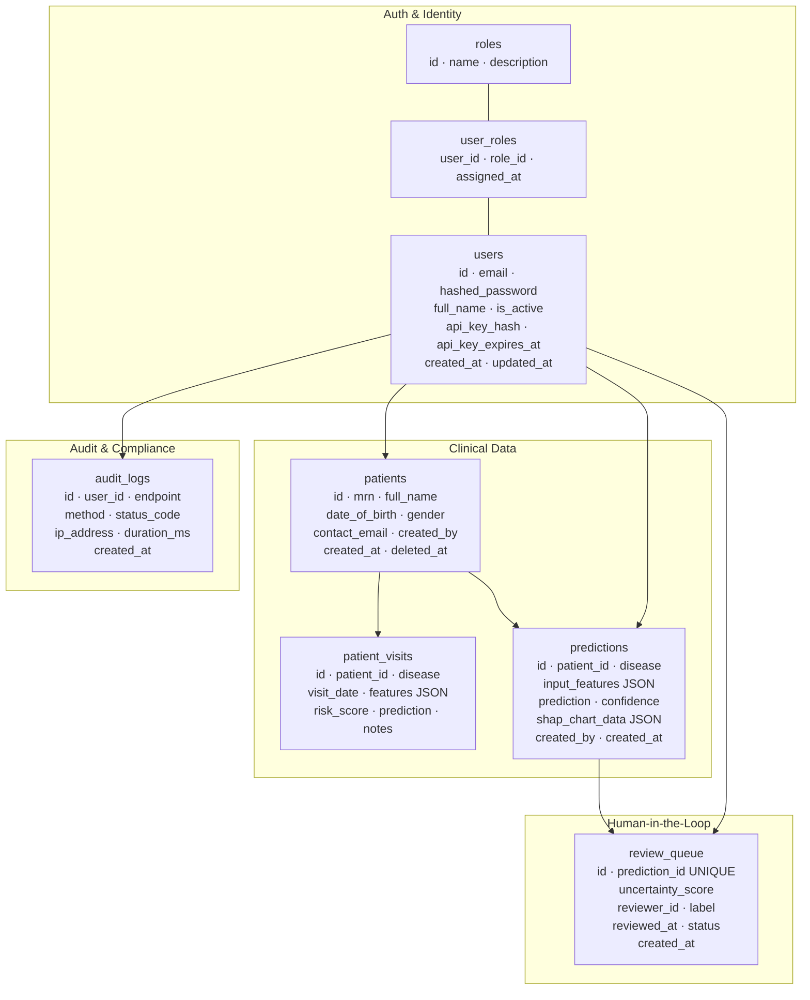
```mermaid
flowchart TD
    subgraph Auth["Auth & Identity"]
        R[roles\nid · name · description]
        U[users\nid · email · hashed_password\nfull_name · is_active\napi_key_hash · api_key_expires_at\ncreated_at · updated_at]
        UR[user_roles\nuser_id · role_id · assigned_at]
        R --- UR --- U
    end

    subgraph Clinical["Clinical Data"]
        P[patients\nid · mrn · full_name\ndate_of_birth · gender\ncontact_email · created_by\ncreated_at · deleted_at]
        PV[patient_visits\nid · patient_id · disease\nvisit_date · features JSON\nrisk_score · prediction · notes]
        PR[predictions\nid · patient_id · disease\ninput_features JSON\nprediction · confidence\nshap_chart_data JSON\ncreated_by · created_at]
        P --> PV
        P --> PR
    end

    subgraph HitL["Human-in-the-Loop"]
        RQ[review_queue\nid · prediction_id UNIQUE\nuncertainty_score\nreviewer_id · label\nreviewed_at · status\ncreated_at]
        PR --> RQ
        U --> RQ
    end

    subgraph Audit["Audit & Compliance"]
        AL[audit_logs\nid · user_id · endpoint\nmethod · status_code\nip_address · duration_ms\ncreated_at]
        U --> AL
    end

    U --> PR
    U --> P
```

Two Alembic migrations ship with the project:

| Revision | Description |
|---|---|
| `da87946a56a6` | Initial schema — roles, users, user_roles, patients, predictions, review_queue, audit_logs |
| `f1e2d3c4b5a6` | Adds `patient_visits`; adds `api_key_hash` + `api_key_expires_at` to users; fixes `audit_logs.id` type (BigInteger → VARCHAR 36) |

The `patients.deleted_at` nullable timestamp implements GDPR soft-delete — prediction history is preserved when a patient record is removed. The `review_queue.prediction_id` UNIQUE constraint enforces one-to-one cardinality with `predictions`. All primary keys use `VARCHAR(36)` UUIDs for cross-database portability between SQLite (development) and PostgreSQL (production).

---

## Repository Structure

```
.
├── backend/                              # FastAPI application layer
│   ├── main.py                           # App entry, middleware stack, lifespan, routes
│   ├── router.py                         # OmniDiagRouter — config-driven disease routing
│   ├── schemas.py                        # Pydantic models + DISEASE_SCHEMA_REGISTRY
│   ├── retired_diseases.py               # Retired modules: scoring/writes answer 410, records stay readable
│   ├── model_loader.py                   # Lazy XGBoost loader + SHAP TreeExplainer + XGB3 patch
│   ├── model_backends/                   # One class per model family, registered once
│   │   ├── base.py                       # ModelBackend interface + capabilities flags
│   │   ├── heart_glm_conformal.py        # Heart: Spline-GLM + Venn-Abers + Mondrian conformal
│   │   ├── diabetes_ebm_conformal.py     # NHANES: EBM + Platt + age-band conformal + What-If
│   │   └── sklearn_pipeline.py, sklearn_generic.py
│   ├── heart_glm/                        # Heart bundle loader (stack.py), reference scores, candidate.py (retrain candidate)
│   ├── diabetes_what_if_levers.py        # NHANES What-If lever policy (own module; imports nothing from backend)
│   ├── schemas_diabetes_nhanes.py        # NHANES input schema (20 fields, 6 mandatory)
│   ├── schemas_clinical_action.py        # clinical_action_plan built from the decision
│   ├── shap_service.py                   # SHAP value → JSON chart data transformation
│   ├── counterfactual_generator.py       # DiCE-inspired generator + Clinical Firewall
│   ├── database.py                       # Async SQLAlchemy engine + session factory
│   ├── cache.py                          # Redis / InMemoryBackend init + cache_get/set/flush
│   ├── rate_limit.py                     # SlowAPI limiter + LIMIT_CLINICAL/VIEWER/ADMIN
│   │
│   ├── auth/                             # Authentication & authorisation
│   │   ├── routes.py                     # /auth/register, /login, /refresh, /logout, /me
│   │   ├── jwt.py                        # encode_token(), decode_token()
│   │   ├── dependencies.py               # get_current_user, get_optional_user
│   │   ├── rbac.py                       # require_role() dependency factory
│   │   └── api_key.py                    # X-API-Key hash verification
│   │
│   ├── db_models/                        # SQLAlchemy ORM models
│   │   ├── user.py                       # User + user_roles association table
│   │   ├── role.py                       # Role (super_admin/admin/doctor/nurse/viewer)
│   │   ├── patient.py                    # Patient with soft-delete (deleted_at)
│   │   ├── patient_visit.py              # PatientVisit — longitudinal risk snapshots
│   │   ├── prediction.py                 # Prediction + shap_chart_data JSON
│   │   ├── review_queue.py               # ReviewQueue — active learning annotation store
│   │   └── audit_log.py                  # AuditLog — immutable HIPAA audit trail
│   │
│   ├── active_learning/                  # Human-in-the-loop pipeline
│   │   ├── sampler.py                    # prediction_entropy(), should_queue_for_review()
│   │   ├── routes.py                     # /review/queue, /review/{id}/annotate, /skip, /stats
│   │   ├── retrain.py                    # run_retrain_pipeline(); heart → retrain_candidate() (candidate only, never promoted)
│   │   └── diabetes_nhanes_candidate.py  # NHANES active learning: candidate only, never promoted
│   │
│   ├── monitoring/                       # MLOps observability
│   │   ├── metrics.py                    # Prometheus: 8 counters/histograms/gauges
│   │   ├── drift.py                      # DriftMonitor (Evidently) + get_monitor() singletons
│   │   ├── drift_stats.py                # Input drift on scipy alone: KS, chi-square, PSI
│   │   ├── mlflow_tracker.py             # log_model_info(), log_drift_metrics(), list_recent_runs()
│   │   └── routes.py                     # /admin/drift/*, /admin/mlflow/*
│   │
│   ├── llm/
│   │   └── report_generator.py           # generate_report() — DeepSeek API + rule-based fallback
│   │
│   ├── nlp/
│   │   └── notes_parser.py               # parse_clinical_note() — regex (English only); BioBERT path unused in deployment
│   │
│   ├── admin/
│   │   └── routes.py                     # /admin/audit-logs, /admin/retrain
│   ├── patients/
│   │   └── routes.py                     # /patients/* CRUD (soft-delete aware)
│   └── middleware/
│       ├── audit.py                      # AuditMiddleware — writes every request to audit_logs
│       └── security.py                   # SecurityHeadersMiddleware — HTTPS enforcement
│
├── features/                             # Per-disease feature engineering
│   └── base_features.py                  # BaseFeatureEngineer (ABC) — extension point; no live module uses it
│
├── models/                               # Trained model artifacts
│   ├── heart_disease/                    # CAD bundle (heart_l3_glm_stack.pkl), built at image build time
│   └── diabetes_nhanes/                  # NHANES EBM bundle (.joblib), model_card.json, drift_reference.json
│
├── configs/                              # Disease YAML configurations
│   ├── heart_disease.yaml                # CAD v7.0.0 — Spline-GLM + Venn-Abers + Mondrian conformal
│   ├── diabetes_nhanes.yaml              # NHANES v2.0.0 — EBM + Platt + age-band conformal, alpha 0.20
│   └── config_loader.py                  # Centralised YAML loader
│
├── alembic/                              # Database migrations
│   ├── env.py                            # Async-to-sync URL strip; imports all ORM models
│   └── versions/
│       ├── da87946a56a6_initial_schema.py
│       └── f1e2d3c4b5a6_add_patient_visits_api_keys_fix_audit_id.py
│
├── k8s/                                  # Kubernetes manifests
│   ├── namespace.yaml                    # Namespace: omnidiag
│   ├── backend-deployment.yaml           # 2 replicas, port 7860, model-cache PVC
│   ├── postgres-statefulset.yaml         # postgres:15-alpine, 10 Gi PVC
│   ├── redis-deployment.yaml             # redis:7-alpine
│   ├── ingress.yaml                      # api.omnidiag.ai — TLS via cert-manager
│   ├── hpa.yaml                          # Min 2 / max 10 replicas, CPU 70% / Mem 80%
│   ├── pvc.yaml                          # 5 Gi ReadWriteMany model cache
│   └── secrets.yaml                      # Secret template (fill before apply)
│
├── helm/omnidiag/                        # Helm chart v2.0.0
│   ├── Chart.yaml
│   ├── values.yaml                       # Parameterises all K8s resources
│   └── templates/                        # deployment, ingress, hpa, secrets, service
│
├── deploy/                               # Monitoring provisioning
│   ├── prometheus.yml                    # Scrape config targeting backend:7860/metrics
│   └── grafana/
│       ├── datasources/prometheus.yml    # Grafana datasource provisioning
│       └── dashboards/omnidiag.json      # Pre-built dashboard (predictions, latency, drift)
│
├── tests/                                # 48 test modules (SQLite in-memory, no Redis needed)
│   ├── conftest.py                       # Fixtures: DB, cache, mocked router, seeded roles
│   ├── test_auth.py
│   ├── test_rbac.py
│   ├── test_clinical.py
│   ├── test_patients.py
│   ├── test_admin.py
│   ├── test_audit_log.py
│   ├── test_cache.py
│   ├── test_llm_report.py
│   ├── test_security.py
│   ├── test_database.py
│   ├── test_unit_active_learning.py
│   ├── test_unit_auth.py
│   ├── test_unit_counterfactuals.py
│   ├── test_diabetes_ebm_backend.py      # NHANES backend: each test names the finding it protects
│   ├── test_diabetes_gate93.py           # NHANES What-If levers (incl. named adiposity band)
│   ├── test_diabetes_frontend_contract.py, test_diabetes_monitoring.py, test_diabetes_active_learning.py
│   └── … heart GLM, What-If policy, drift and MLflow-state tests (full list: ls tests/)
│
├── frontend/                             # React 18 + Vite + Tailwind CSS
│   ├── src/
│   │   ├── api.js                        # OmniDiagApi class (120 s timeout for HF cold starts)
│   │   ├── App.jsx                       # Sidebar navigation, mode routing
│   │   ├── context/DiseaseContext.jsx    # Schema pre-fetch + localStorage persistence
│   │   ├── hooks/
│   │   │   ├── useDiseaseSchema.js       # Schema fetch + parse + 3-layer Map cache
│   │   │   └── useDiseaseForm.js         # React Hook Form + Zod integration
│   │   ├── components/
│   │   │   ├── EngineeringMode.jsx       # Manual parameter testing interface
│   │   │   ├── ClinicalEmrMode.jsx       # Doctor's patient record dashboard
│   │   │   ├── DynamicClinicalForm.jsx   # Schema-driven form engine
│   │   │   ├── SchemaFieldFactory.jsx    # Component resolver (toggle/select/slider/number)
│   │   │   ├── ShapBarChart.jsx          # Recharts horizontal SHAP bar chart
│   │   │   ├── WhatIfScenarioCard.jsx    # Counterfactual viewer (retries once on 502/503/504)
│   │   │   ├── ClinicalActionPlan.jsx    # Next clinical step from the decision (NHANES)
│   │   │   └── MedicalTooltip.jsx        # Dictionary-backed hover tooltip
│   │   └── utils/
│   │       ├── schemaFieldParser.js      # JSON Schema → FieldMetadata[]
│   │       ├── schemaToZod.js            # FieldMetadata[] → Zod validation schema
│   │       ├── featureCategorizer.js     # Field → category grouping
│   │       └── medicalDictionary.js      # Feature name → clinical description
│   └── mockPatients.js                   # Pre-defined patient records (CAD, NHANES)
│
├── docs/
│   ├── assets/screenshots/               # Real UI captures: heart (10_, 20_) and NHANES (30_ to 40_)
│   ├── assets/research/                  # Heart research figures copied from the experiments repo
│   └── phase9/                           # NHANES record: DISCOVERY_RECORD, FINDINGS_REGISTER, RESEARCH_FIDELITY_AUDIT, figures/
├── data/                                 # Raw and processed datasets per disease
├── archive/                              # Superseded files, kept for provenance (each folder has its own index)
├── docker-compose.yml                    # 7 services: postgres, redis, backend, mlflow, prometheus, grafana, retrain
├── Dockerfile                            # Production container
├── requirements.txt                      # Python dependencies
├── alembic.ini                           # Alembic config (sqlite fallback for local dev)
└── pytest.ini                            # asyncio_mode=auto, testpaths=tests/
```

---

## Local Setup

### Backend (Python 3.11+)

```bash
python -m venv .venv && source .venv/bin/activate
pip install -r requirements.txt
cp .env.example .env   # set JWT_SECRET_KEY at minimum

# SQLite fallback is automatic when DATABASE_URL is unset
uvicorn backend.main:app --reload --port 7860
```

API docs available at `http://localhost:7860/docs`. Redis is optional — the cache auto-falls-back to `InMemoryBackend` when `REDIS_URL` is unset.

### Full Stack (Docker Compose)

```bash
docker compose up -d
docker compose exec backend alembic upgrade head
```

| Service | URL | Default credentials |
|---|---|---|
| FastAPI | http://localhost:7860/docs | `doctor@omnidiag.com` / `Doctor@123` |
| MLflow | http://localhost:5000 | — |
| Prometheus | http://localhost:9090 | — |
| Grafana | http://localhost:3001 | `admin` / `omnidiag_grafana` |

```bash
# On-demand retrain (profile-gated — does not start with up -d)
docker compose run --rm retrain --disease heart_disease --min-samples 10
```

### Frontend (Node.js 20+)

```bash
cd frontend
npm install
npm run dev   # http://localhost:5173
```

### Federated Learning

Superseded prototype (Flower/FedAvg); see the Federated Learning section.

---

## Deployment (Kubernetes + Helm)

The manifests below are the intended production deployment target; the live demo instance runs on Hugging Face Spaces via Docker (see the `sdk: docker` / `app_port: 7860` frontmatter at the top of this file), not on a Kubernetes cluster.

```bash
# Apply all K8s manifests
kubectl apply -f k8s/namespace.yaml
kubectl apply -f k8s/

# Or via Helm
helm install omnidiag ./helm/omnidiag -n omnidiag --create-namespace
helm upgrade omnidiag ./helm/omnidiag -n omnidiag --set image.tag=v2.1.0
```

The `hpa.yaml` autoscaler scales the backend between 2 and 10 replicas, targeting CPU utilisation at 70 % and memory at 80 %. The Ingress routes `api.omnidiag.ai` with TLS termination via cert-manager and Let's Encrypt. PostgreSQL runs as a StatefulSet with a 10 Gi PVC; model weights are shared across pods via a 5 Gi ReadWriteMany PVC mounted at `/app/models`.

---

## CI/CD Pipeline

The GitHub Actions workflow ([`.github/workflows/ci.yml`](.github/workflows/ci.yml)) runs on every push and pull request with two parallel jobs:

**Backend Validation** — Python 3.11 setup with pip caching; dependency install from `requirements.txt`; import verification (`OmniDiagRouter`, `ModelLoader`, `get_schema_for_disease`); API smoke test (starts uvicorn, verifies `GET /` returns 200, terminates).

**Frontend Build** — Node.js 20 with npm caching; `npm ci`; production build via `npm run build` (Vite compiles to `frontend/dist/`).

---

## API Reference

All endpoints are versioned under `/api/v4/`.

### System

| Method | Path | Auth | Description |
|---|---|---|---|
| `GET` | `/` | None | Health check |
| `GET` | `/api/v4/diseases` | None | Registered diseases with metadata |
| `GET` | `/api/v4/{disease}/schema` | None | JSON Schema for input fields |
| `GET` | `/metrics` | None | Prometheus scrape endpoint |

### Auth

Mounted at `/auth` (**not** under `/api/v4`) — verified live against a running instance:

| Method | Path | Description |
|---|---|---|
| `POST` | `/auth/register` | Create account |
| `POST` | `/auth/login` | JWT login (sets HttpOnly cookie) |
| `POST` | `/auth/refresh` | Rotate access token |
| `POST` | `/auth/logout` | Clear cookie |
| `GET` | `/auth/me` | Current user + roles |

### Clinical

| Method | Path | Auth | Response |
|---|---|---|---|
| `POST` | `/api/v4/{disease}/predict` | Anonymous OK¹ | `PredictResponse` — heart: `{prediction, confidence, diagnosis, decision, conformal_set, decision_is_referral, probability_lower, probability_upper, output_type, probability_scale}` and **no `inference_threshold`**, plus `data_completeness_warning` when an input the model reads was missing and imputed; `diabetes_nhanes` returns the same decision envelope plus `clinical_action_plan` and `score_raw`. `Cache-Hit` is a response **header**, not a body field |
| `POST` | `/api/v4/{disease}/explain` | Anonymous OK¹ | `{prediction, confidence, diagnosis, chart_data[], text_explanation, base_value, base_value_raw, shap_scale, shap_reconstructed_probability_corrected, shap_additivity_gap, counterfactuals}` |
| `POST` | `/api/v4/{disease}/counterfactuals` | Anonymous OK¹ | `{status, baseline_probability, crosses_threshold, best_achievable, message, counterfactuals[{scenario_id, probability, crosses_threshold, changes[{feature, original_value, counterfactual_value, direction}]}]}`; NHANES adds `probability_scale`, `immutable_features` and `hdl_simulation`. The NHANES call takes about 0.3 s |
| `POST` | `/api/v4/{disease}/batch` | `doctor`/`nurse`/`super_admin` | `{disease, total, succeeded, failed, chest_pain_coding, results[]}` — CSV upload; `max_batch_rows` per module (heart 500, NHANES 100) |
| `POST` | `/api/v4/generate-report` | Anonymous OK¹ | body `{disease, probability_corrected, label, shap_values[], features{}}` (`probability` is a **deprecated** alias; `confidence_band` is advisory and ignored) → `{report, source, risk_band, llm_model?, latency_ms?, fallback_reason?}` |
| `POST` | `/api/v4/parse-notes` | Open (no auth dependency) | `{extracted_features{}, mapped_features{}, field_count}` — `mapped_features` holds the schema-ready dict when `disease` is supplied |

¹ Deliberately open so the public demo works without an account (`Depends(get_optional_user)`). Predictions are **persisted and linkable to a patient record only for authenticated users**; anonymous calls are stateless. Rate limits still apply per IP.

A retired disease (`diabetes`) answers **410** with `code: DISEASE_RETIRED` and `replaced_by: diabetes_nhanes` on every route that would score, write, label, monitor or retrain it. Reading its stored records still works, and they carry an `archived_note`.

#### Probability scale

Both live modules return one probability, on the scale named by `probability_scale` (`ivap_calibrated_training_mix` for heart, `platt_calibrated_nhanes_2015_2016` for NHANES), and **no `inference_threshold` and no `risk_bands`**: the decision is a conformal set, not a probability against a cut-point. `GET /api/v4/diseases` reports both as `null`, alongside `output_type: "conformal_decision"`. Consumers branch on `output_type`; an absent threshold is information, not a gap to fill with 0.5. The rule the codebase follows ([`backend/probability_scale.py`](backend/probability_scale.py), enforced by the AST guard in [`tests/test_probability_scale_contract.py`](tests/test_probability_scale_contract.py)):

> An unsuffixed probability is on the scale the module reports. A value on the model's own internal scale always carries a `_raw` suffix (NHANES: `score_raw`).

Prevalence correction went with the BRFSS module: a config that declares `prevalence_train`, `prevalence_deploy` or non-null `risk_bands` is refused at load. Stored rows carry `predictions.probability_scale` (`'raw'`; `'corrected'` only on rows of the retired BRFSS module; `NULL` for rows written before the column existed); aggregates split by it (`GET /api/v4/admin/stats → avg_confidence_by_scale`, drift runs → `rows_by_probability_scale`) and treat `NULL` as its own `unknown` group.

A legacy `POST /api/v3/predict` (tagged **Legacy** in Swagger) is still mounted and, unlike its v4 counterpart, requires `CLINICAL_ROLES`. It is retained for backward compatibility only — new integrations should use `/api/v4/{disease}/predict`.

### Active Learning (requires `doctor` / `nurse` / `super_admin`)

| Method | Path | Description |
|---|---|---|
| `GET` | `/api/v4/review/queue` | Paginated items, `?status=pending\|reviewed\|skipped` (default `pending`), filterable by disease; returns `reviewer` and `reviewed_at` |
| `POST` | `/api/v4/review/{id}/annotate` | Submit expert label `{label: 0|1, notes?}`; 409 if already reviewed |
| `POST` | `/api/v4/review/{id}/skip` | Dismiss item |
| `GET` | `/api/v4/review/stats` | `{pending, reviewed, skipped}` |

> `POST /admin/retrain` builds a **candidate** for heart_disease (nothing is replaced) — see [Human-in-the-Loop Active Learning](#human-in-the-loop-active-learning). For `diabetes_nhanes` it answers `unsupported` (not wired yet, by design); for the retired `diabetes` it answers 410.

### Admin (requires `super_admin`)

Two different prefixes are actually in use — verified live against a running instance: `/admin/*` (audit, retrain, cache) and `/api/v4/admin/*` (drift, MLflow).

| Method | Path | Description |
|---|---|---|
| `GET` | `/admin/audit-logs` | Paginated HIPAA audit trail |
| `POST` | `/admin/retrain` | Build a heart retraining candidate from clinician labels `{disease, min_samples}`; returns the MLflow run id and decision-change counts |
| `POST` | `/admin/cache/flush` | Invalidate all cached responses (e.g. after a model update) |
| `GET` | `/api/v4/admin/drift/{disease}/status` | Latest Evidently drift metrics (JSON) |
| `POST` | `/api/v4/admin/drift/{disease}/run` | Trigger fresh drift computation |
| `GET` | `/api/v4/admin/drift/{disease}/report` | Full Evidently HTML report |
| `GET` | `/api/v4/admin/mlflow/runs` | Recent MLflow experiment runs |
| `POST` | `/api/v4/admin/mlflow/register` | Register model metrics in MLflow |

---

## Tech Stack

### Backend

| Component | Technology | Purpose |
|---|---|---|
| API Framework | [FastAPI 0.100+](backend/main.py:1) | Async Python web framework |
| Model (CAD) | Spline-GLM + Venn-Abers + Mondrian conformal | Heart module |
| Model (Dysglycaemia) | EBM + Platt + age-band conformal | NHANES dysglycaemia module |
| Explainability | [SHAP 0.42+](backend/shap_service.py) | Exact additive contributions (heart GLM in closed form, NHANES EBM terms) → structured JSON |
| Database ORM | [SQLAlchemy 2.0+](backend/database.py) | Async session + declarative base |
| Migrations | [Alembic 1.13+](alembic/env.py) | Version-controlled schema changes |
| Cache | [Redis 7 + fastapi-cache2](backend/cache.py:39) | Prediction caching + rate-limit store |
| Auth | [python-jose + passlib](backend/auth/jwt.py) | JWT + bcrypt |
| Rate Limiting | [SlowAPI](backend/rate_limit.py:49) | Per-route request caps |
| LLM | [OpenAI SDK → DeepSeek](backend/llm/report_generator.py:100) | Clinical report generation |
| NLP | [spaCy dependency parse + regex](backend/nlp/notes_parser.py) | Clinical note feature extraction |
| Metrics | [prometheus-client 0.20+](backend/monitoring/metrics.py) | `/metrics` scrape endpoint |
| Drift | [Evidently 0.4+](backend/monitoring/drift.py:48) | Dataset drift detection — **code only, not live** |
| MLOps | [MLflow 2.10+](backend/monitoring/mlflow_tracker.py:63) | Experiment tracking — **code only, not live** |
| Federated | [Flower](archive/post_expo_2026-10/backend/federated/aggregator.py:62) (archived; `flwr` removed from requirements in B7) | Prototype, **superseded** — see [Federated Learning](#federated-learning-prototype-superseded--replacement-simulated-in-the-research-repo-not-shipped) |
| Validation | [Pydantic v2](backend/schemas.py) | Input/output model validation |
| Config | [PyYAML 6.0+](configs/config_loader.py) | Disease configuration files |

### Frontend

| Component | Technology | Purpose |
|---|---|---|
| Framework | [React 18.3.1](frontend/src/App.jsx) | UI component library |
| Build | [Vite 5.4.0](frontend/vite.config.js) | Dev server + production bundler |
| Styling | [Tailwind CSS 3.4.19](frontend/tailwind.config.js) | Utility-first CSS |
| Forms | [React Hook Form 7.76.1](frontend/src/hooks/useDiseaseForm.js) | Form state management |
| Validation | [Zod 4.4.3](frontend/src/utils/schemaToZod.js:27) | Client-side schema validation |
| Charts | [Recharts 3.8.1](frontend/src/components/ShapBarChart.jsx) | SHAP value bar chart |
| PDF Export | [@react-pdf/renderer 4.5.1](frontend/package.json) | Clinical report PDF generation |
| PWA | [Workbox 7.4.1](frontend/package.json) | Service worker + offline support |

### Infrastructure

| Component | Technology | Purpose |
|---|---|---|
| Primary Database | [PostgreSQL 15-alpine](docker-compose.yml:23) | Relational datastore |
| Cache | [Redis 7-alpine](docker-compose.yml:43) | Prediction cache + rate limiting |
| Experiment Tracking | [MLflow on python:3.11-slim](docker-compose.yml:79) | Model and drift run registry |
| Metrics Scraper | [prom/prometheus:v2.51.0](docker-compose.yml:103) | Pulls from `/metrics` every 15 s |
| Dashboards | [grafana/grafana:10.4.0](docker-compose.yml:120) | Pre-provisioned OmniDiag dashboard |
| Container | [Docker + Compose v2](docker-compose.yml) | Local full-stack environment |
| Orchestration | [Kubernetes + Helm v2](helm/omnidiag/Chart.yaml) | Production autoscaling deployment |
| TLS | [cert-manager + Let's Encrypt](k8s/ingress.yaml) | Automatic certificate provisioning |
| CI/CD | [GitHub Actions](.github/workflows/ci.yml) | Backend smoke test + frontend build |

---

## License

Copyright (c) 2026 Yahya Lababenah. All Rights Reserved. — see [`LICENSE`](LICENSE) for full terms.
