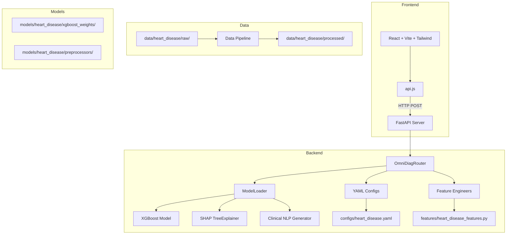

# OmniDiag — Comprehensive Analysis Report

> **Project:** OmniDiag (Multi-Disease Diagnostic Platform)
> **Author:** Yahya Mohammad Ali Lababneh
> **Current Version:** 4.0.0
> **Analysis Date:** 2026-05-26
> **Branch:** `production-final-v3`
> **Remote:** `origin/V3-advanced-DL`

---

## 1. Executive Summary

OmniDiag is a **production-ready clinical decision support platform** combining XGBoost with SHAP explainability and bilingual (EN/AR) clinical NLP summaries, served via FastAPI and a modern React dashboard. The project has evolved through multiple versions (V2 → V3 → V4) with significant architectural improvements.

**Overall Assessment:** The project is well-architected with clean separation of concerns, but has several critical issues that need attention before it can be considered truly production-ready. The most urgent issue is an **active Git rebase in progress** with unresolved merge conflicts.

---

## 2. 🏗️ Project Architecture Overview



---

## 3. 🔴 Critical Issues Found

### 3.1 Git & Version Control Issues

| # | Issue | Severity | Details |
|---|-------|----------|---------|
| 1 | **Active rebase in progress — STUCK** | 🔴 CRITICAL | You are currently in the middle of a `git rebase` (branch `hf-deploy` onto `16318c7`). The rebase cannot complete because of the merge conflict in `requirements.txt`. You cannot push, pull, or switch branches until this is resolved. |
| 2 | **Unresolved merge conflict in `requirements.txt`** | 🔴 CRITICAL | Lines 9-12 contain `<<<<<<< HEAD` / `=======` / `>>>>>>> dfecd17`. This blocks the rebase AND breaks `pip install`. |
| 3 | **4 remaining rebase steps pending** | 🟡 WARNING | After fixing the conflict, 4 more commits need to be replayed: `9259337` (PyYAML version), `31a7336` (startup logging), and 2 more. The rebase could hit more conflicts. |
| 4 | **Many deleted files in working tree** | 🟡 WARNING | `git status` shows ~40 deleted files (models, data, v2_archive). These were deleted in the rebased commits. If the rebase completes, these deletions become permanent. **Your model weights and data may be lost.** |
| 5 | **`.gitignore` ignores model files** | 🟡 WARNING | `*.pkl` is in `.gitignore` (line 6). All trained model weights are excluded from version control. |
| 6 | **`.gitattributes` references LFS but LFS not configured** | 🟡 WARNING | Line 1: `*.pkl filter=lfs diff=lfs merge=lfs -text` — but Git LFS may not be installed. |
| 7 | **Remote is `origin/V3-advanced-DL`** | 🟢 INFO | The remote branch is `V3-advanced-DL`, not `main` or `master`. Current local branch is `production-final-v3`. |

### 3.2 Dependency & Build Issues

| # | Issue | Severity | Details |
|---|-------|----------|---------|
| 6 | **Broken `requirements.txt`** | 🔴 CRITICAL | The merge conflict (lines 9-12) makes the file unparseable. `PyYAML` is in the conflict block — it may or may not be installed. |
| 7 | **No pinned versions in `requirements.txt`** | 🟡 WARNING | Most packages have no version pins (e.g., `fastapi`, `uvicorn`, `pandas`). This can lead to unexpected breakage when new versions are released. |
| 8 | **Missing `PyYAML` dependency** | 🟡 WARNING | `PyYAML` is used in `backend/router.py` and `configs/config_loader.py` but is caught in the merge conflict. It may not be installed. |
| 9 | **Docker Python version mismatch** | 🟡 WARNING | Dockerfile uses `python:3.10-slim` but CI uses Python 3.11, and README says 3.11+. The Docker image will run a different Python version than CI/testing. |
| 10 | **No `package-lock.json` in `.dockerignore`** | 🟢 INFO | `frontend/node_modules` is ignored but `package-lock.json` is not listed — though this is minor since the frontend isn't built in Docker. |

### 3.3 Backend Code Issues

| # | Issue | Severity | Details |
|---|-------|----------|---------|
| 11 | **`backend/schemas.py` raises `ValueError` instead of `HTTPException`** | 🟡 WARNING | Line 131: `get_schema_for_disease()` raises `ValueError` when disease not found. This will result in a 500 Internal Server Error instead of a proper 404 response. |
| 12 | **No async endpoints** | 🟢 INFO | All endpoints are synchronous (`def` not `async def`). FastAPI can handle this, but for I/O-bound operations, async would be more efficient. |
| 13 | **`shap_service.py` only generates English text** | 🟡 WARNING | The README promises bilingual (EN/AR) clinical summaries, but `generate_shap_explanation()` only produces English text. The Arabic translation feature mentioned in the README is not implemented in the current code. |
| 14 | **No input validation for legacy endpoint** | 🟢 INFO | `/api/v3/predict` (line 142-145) bypasses Pydantic schema validation entirely, passing raw dict directly to the router. |
| 15 | **`model_loader.py` — preprocessing order** | 🟡 WARNING | `predict()` applies preprocessors BEFORE feature engineering (line 206-207). But `_engineer_features()` expects raw categorical values (e.g., "M", "ATA"), while `_apply_preprocessors()` encodes them to numbers. This means heuristic features like `Age_BP_Interaction` are computed on encoded values, which is mathematically incorrect. |

### 3.4 Frontend Issues

| # | Issue | Severity | Details |
|---|-------|----------|---------|
| 16 | **API base URL points to production** | 🟡 WARNING | `frontend/src/api.js` line 1: Default `VITE_API_BASE` is `https://yahyoha-omnidiag.hf.space` (production). Local development requires setting `VITE_API_BASE=http://localhost:8000`. |
| 17 | **No loading skeleton for SHAP chart** | 🟢 INFO | The `ShapBarChart` component shows "No SHAP values to display" when data is null, but there's no loading skeleton during fetch. |
| 18 | **`FastingBS` field accepts string in form** | 🟡 WARNING | In `EngineeringMode.jsx`, `FastingBS` is a select with options `[0, 1]` (numbers), but JavaScript will send these as strings in the JSON payload. The backend may or may not handle this correctly. |

### 3.5 Model & Data Pipeline Issues

| # | Issue | Severity | Details |
|---|-------|----------|---------|
| 19 | **`optimize_xgboost.py` uses clinical features, not heuristic** | 🟡 WARNING | Line 20: The optimization script loads `clinical_file` (`data_clinical.csv`) instead of `heuristic_file` (`data_heuristic.csv`). But the winning experiment (88.98%) used heuristic features. The best params in the config were found on the wrong dataset. |
| 20 | **`ensemble_predict.py` imports `pytorch_tabnet`** | 🟢 INFO | Line 5: This dependency is not in `requirements.txt`. The script will fail if run. However, it's an archived experiment, so this may be intentional. |
| 21 | **No unit tests anywhere** | 🟡 WARNING | The entire project has zero tests — no pytest, no unittest, no frontend tests. This is risky for a "production-ready" platform. |
| 22 | **`metadata.json` references old column names** | 🟢 INFO | The metadata file uses V2 column names (e.g., `age`, `cp`, `trestbps`) while the current codebase uses V4 names (e.g., `Age`, `ChestPainType`, `RestingBP`). This file appears to be legacy. |

---

## 4. 🟡 Non-Critical Observations

### 4.1 Code Quality

| # | Observation | Details |
|---|-------------|---------|
| 23 | **Mixed Arabic/English comments** | Code comments are in both Arabic and English. This is fine for a bilingual team but may confuse future contributors. |
| 24 | **Hardcoded feature names in `shap_service.py`** | The SHAP service doesn't use the config for feature names — it relies on DataFrame column order. |
| 25 | **No type hints in some functions** | `advanced_feature_engineering.py` functions lack return type annotations. |
| 26 | **Duplicate model files** | `omni_diag_xgb_optimized.pkl` exists in both `models/heart_disease/` and `models/heart_disease/xgboost_weights/`. |

### 4.2 Documentation

| # | Observation | Details |
|---|-------------|---------|
| 27 | **README is excellent** | Comprehensive, well-structured, with architecture diagrams and API examples. |
| 28 | **Existing plans are thorough** | The `plans/` directory contains detailed migration and deliverables plans. |
| 29 | **No CONTRIBUTING.md** | Missing guidelines for contributors. |
| 30 | **No CHANGELOG.md** | No version history documented. |

### 4.3 Security

| # | Observation | Details |
|---|-------------|---------|
| 31 | **CORS is well-configured** | Strict allowlist instead of `["*"]`. Good security practice. |
| 32 | **No authentication** | The API has no auth layer. Anyone who can reach the endpoint can use it. |
| 33 | **No rate limiting** | No protection against abuse. |

---

## 5. 📊 Model Performance Summary

| Experiment | Accuracy | Notes |
|------------|----------|-------|
| Baseline XGBoost (V2) | 88.16% | Reached data ceiling |
| TabNet Baseline | 87.35% | Similar ceiling |
| **Heuristic Features (Winner)** | **88.98%** | **Age_BP_Interaction, HR_Age_Ratio, Chol_Age_Ratio** |
| Clinical Features | 88.57% | Clinical_Risk_Score formula |
| TabNet on Heuristic | 68.16% | Collapsed due to scaling sensitivity |
| Ensemble (TabNet + XGBoost) | Degraded | Anchor effect dragged down XGBoost |

**Best Hyperparameters (from Optuna Trial 83):**
- `n_estimators`: 898
- `max_depth`: 5
- `learning_rate`: 0.01359
- `subsample`: 0.9637
- `colsample_bytree`: 0.5455

---

## 6. 🗺️ Recommended Action Plan

### Phase 0: 🆘 UNSTICK THE REBASE (Do this FIRST — everything else is blocked)

1. **Decide: Complete or abort the rebase?**
   - **Option A (Recommended):** `git rebase --abort` — This returns you to the state before the rebase started (commit `99d633b` on `production-final-v3`). All your model files and data will be restored. You lose nothing.
   - **Option B:** Fix the conflict and continue — `git add requirements.txt && git rebase --continue`. But this risks losing the 40+ deleted files (models, data).

2. **After aborting, create a backup branch:** `git branch backup-before-rebase`

3. **Then properly merge `hf-deploy` into `production-final-v3`:**
   ```bash
   git checkout production-final-v3
   git merge hf-deploy --no-commit
   # Manually resolve conflicts
   git commit -m "merge: integrate hf-deploy changes into production-final-v3"
   ```

### Phase 1: 🔴 Immediate Critical Fixes

4. **Fix `requirements.txt` merge conflict** — Resolve the `<<<<<<< HEAD` / `=======` / `>>>>>>>` conflict for `PyYAML`
5. **Fix preprocessing order in `model_loader.py`** — Apply feature engineering BEFORE preprocessing (line 206-207). Currently encodes categoricals then computes heuristic features on encoded numbers, which is mathematically wrong.
6. **Fix `optimize_xgboost.py`** — Line 20 loads `clinical_file` instead of `heuristic_file`. The winning experiment (88.98%) used heuristic features, but optimization ran on clinical features.
7. **Fix `get_schema_for_disease()` error handling** — Return proper HTTP 404 instead of ValueError (500 error).

### Phase 2: 🟡 Version Control & CI/CD

8. **Configure Git LFS** — For tracking `.pkl` model files
9. **Update `.gitignore`** — Remove `*.pkl` from ignore (let LFS handle it), or add specific paths
10. **Push to a proper remote** — Create a GitHub repo and push `production-final-v3`
11. **Fix Docker Python version** — Dockerfile uses 3.10, CI uses 3.11, README says 3.11+. Align to 3.11.

### Phase 3: 🟡 Quality Improvements

12. **Add unit tests** — At minimum test `model_loader.py`, `shap_service.py`, and `router.py`
13. **Pin dependency versions** — In `requirements.txt` for reproducibility
14. **Implement bilingual clinical summaries** — Add Arabic translation support to `shap_service.py`
15. **Add async support** — Convert I/O-bound endpoints to `async def`

### Phase 4: 🟢 Production Hardening

16. **Add authentication** — JWT or API key-based auth
17. **Add rate limiting** — Protect against abuse
18. **Add request logging** — Structured logging for audit trail
19. **Docker Compose setup** — For multi-service deployment (API + Frontend + DB)

---

## 7. 📋 File Inventory Summary

| Directory | Files | Purpose |
|-----------|-------|---------|
| `backend/` | 5 files | FastAPI application (main, router, model_loader, schemas, shap_service) |
| `frontend/` | 10+ files | React + Vite dashboard |
| `configs/` | 2 files | YAML config + loader |
| `features/` | 3 files | Feature engineering base + heart disease |
| `models/` | 12 files | Training scripts, experiments, weights |
| `data_pipeline/` | 3 files | Data cleaning, merging, harmonization |
| `data/` | 2 processed CSVs | Heart disease dataset |
| `plans/` | 4 files | Architecture & migration plans |
| `ui/` | 1 file | Legacy Streamlit UI |
| `deployment/` | 2 files | Deployment guides |
| `reports/` | 1 file | Evaluation metrics |
| `scripts/` | 2 files | Project finalization utilities |

---

## 8. 🔮 Future Potential

The project has a solid foundation for expansion:

1. **Multi-disease support** — The config-driven architecture is ready for diabetes, CKD, hypertension
2. **LLM integration** — Replace hardcoded clinical summaries with GPT-4/Claude for richer narratives
3. **Model registry** — MLflow integration for versioned deployments
4. **Mobile app** — React Native frontend for field clinicians
5. **FHIR integration** — HL7 FHIR standard for EHR interoperability

---

*Report generated by Roo (Architect Mode) — 2026-05-26*
