# OmniDiag Architecture (Mermaid)

Modular monolith: one FastAPI process, feature modules, config-driven model-family registry.

## ١. الصورة الكبرى: Modular Monolith

عملية FastAPI واحدة (deployable واحد) مقسّمة داخلياً إلى وحدات (modules) بحدود واضحة؛ الأمراض تُضاف بملف YAML دون لمس باقي الكود.

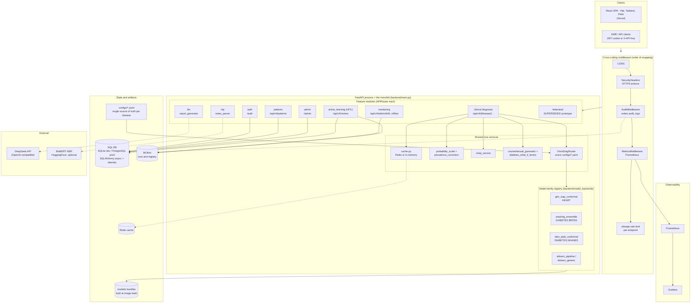
## ٢. خريطة الوحدات (Package Map)

كل مجلد = وحدة بمسؤولية واحدة. الوحدات تتحدث عبر استدعاءات داخلية (in-process) لا عبر شبكة، وهذا ما يجعله Monolith، والحدود النظيفة بينها هي ما يجعله Modular.

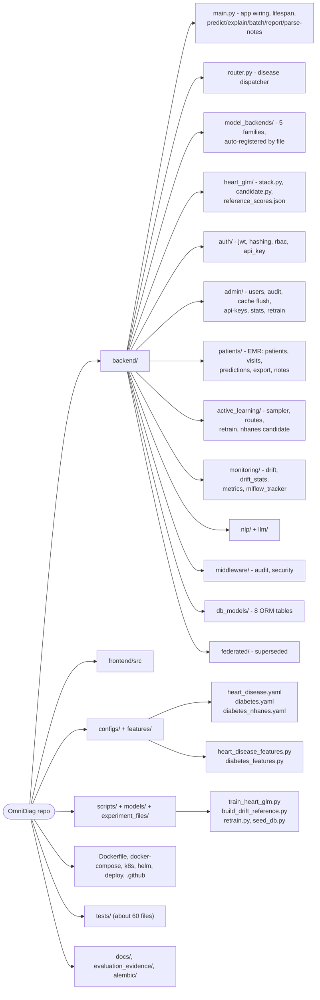

## ٣. رحلة طلب التنبؤ (Predict Request)

ما يحدث من الضغط على Predict حتى ظهور النتيجة: المصادقة، الكاش، النموذج، التسجيل، وإضافة الحالات غير المؤكدة لطابور المراجعة البشرية.

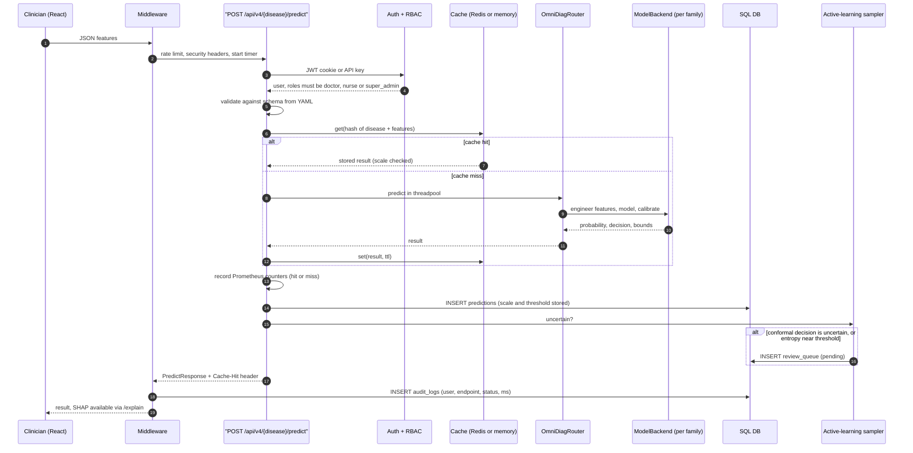

## ٤. الإضافة بالإعدادات: Config-driven Registry

إضافة مرض = ملف YAML + ملف features. الـ Router لا يعرف أسماء الأمراض ولا العائلات. كل عائلة نموذج تسجّل نفسها بمجرد وجود ملفها في model_backends.

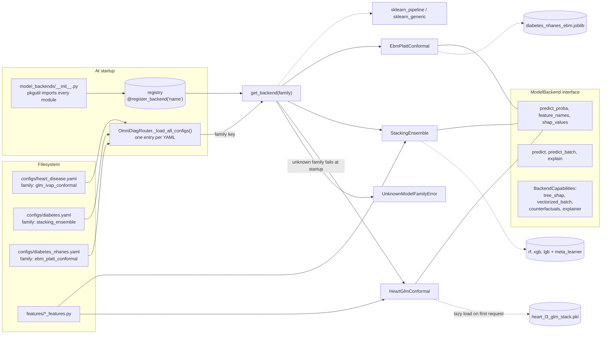

## ٥. نموذج القلب: Spline-GLM + Venn-Abers + Conformal

القرار ليس احتمالاً مقابل عتبة واحدة، بل مجموعة conformal تعطي referral / no_referral / uncertain، مع فاصل [p_lower, p_upper]. 7 مدخلات فقط، مدرَّب على 920 مريضاً من 4 مستشفيات.

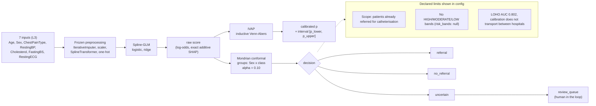

## ٦. الإنسان في الحلقة والتعلّم النشط (HITL + Active Learning)

النظام لا يتعلّم من نفسه تلقائياً: الحالات غير المؤكدة تذهب لطبيب، تسميته تُخزَّن، والإعادة التدريبية تنتج مرشَّحاً (candidate) يقرّر إنسان ترقيته.

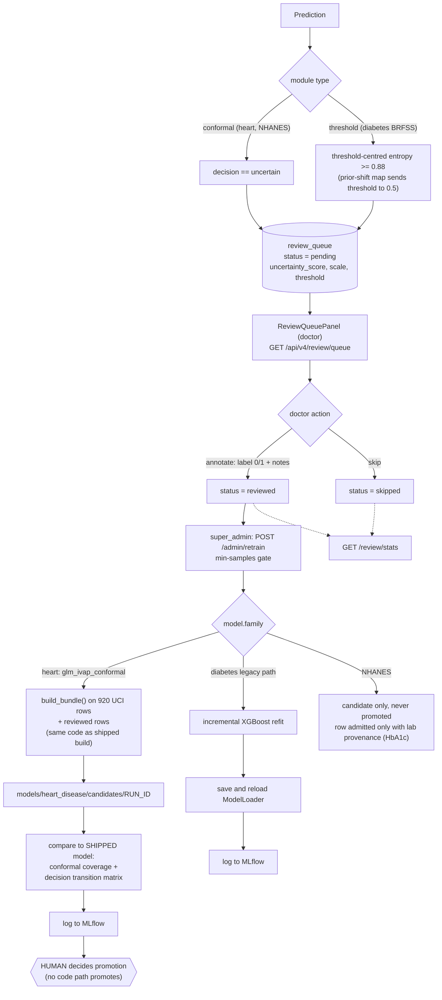

## ٧. معالجة اللغة (NLP) والتقرير بالـ LLM

ملاحظة سريرية نصية تتحول إلى حقول جاهزة للنموذج؛ وبعد التنبؤ يُولَّد تقرير سريري بالـ LLM مع حارس يمنع المحتوى الممنوع وبديل قاعدي عند الفشل.

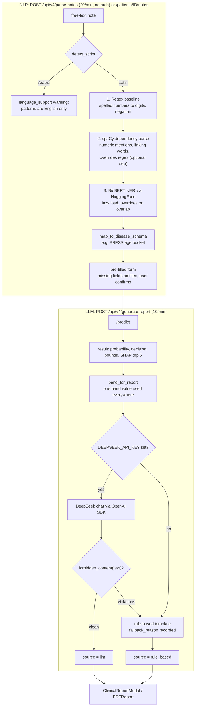

## ٨. الأمن والصلاحيات والتدقيق

JWT في كوكي + Refresh، مفتاح API بديل للأنظمة الخارجية، صلاحيات RBAC، وسجل تدقيق لكل طلب.

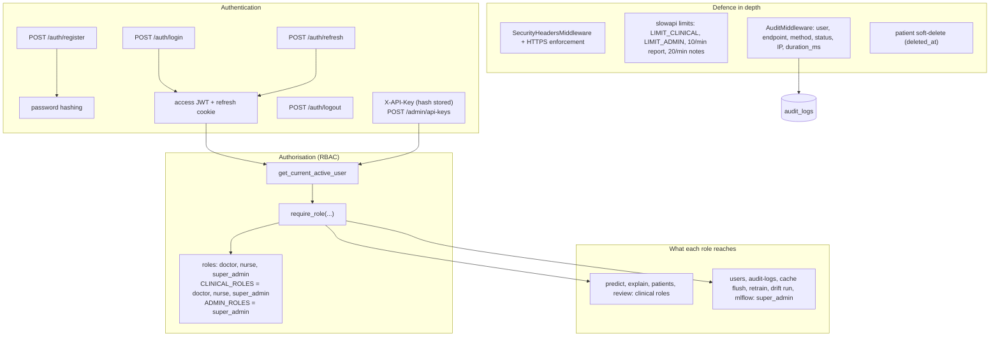

## ٩. المراقبة والـ Drift و MLflow

مراقبة تشغيلية (Prometheus/Grafana) ومراقبة انحراف المدخلات بإحصاءات KS و chi-square و PSI مقابل مرجع مجمَّد. الانحراف في المدخلات تنبيه للفحص وليس دليلاً على تدهور النموذج.

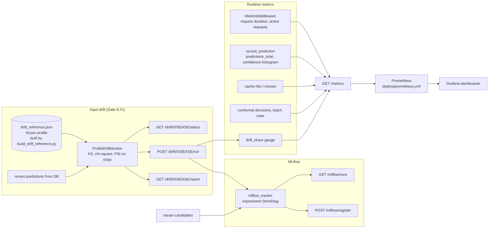

## ١٠. نموذج البيانات (Database)

ثمانية جداول؛ كل تنبؤ يُسجَّل مع مقياسه وعتبته، وطابور المراجعة مرتبط بالتنبؤ بعلاقة واحد لواحد.

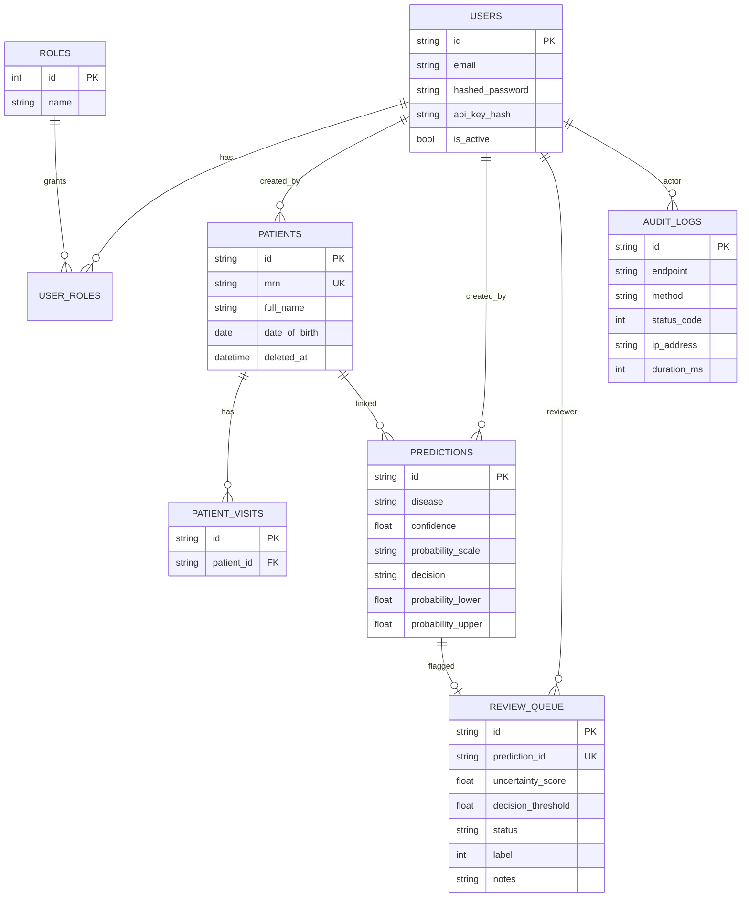

## ١١. الواجهة الأمامية (React SPA)

الفورم يُبنى ديناميكياً من الـ schema القادم من الـ API (لا حقول مكتوبة يدوياً لكل مرض)، ولذلك تظهر الأمراض الجديدة بدون تعديل الواجهة.

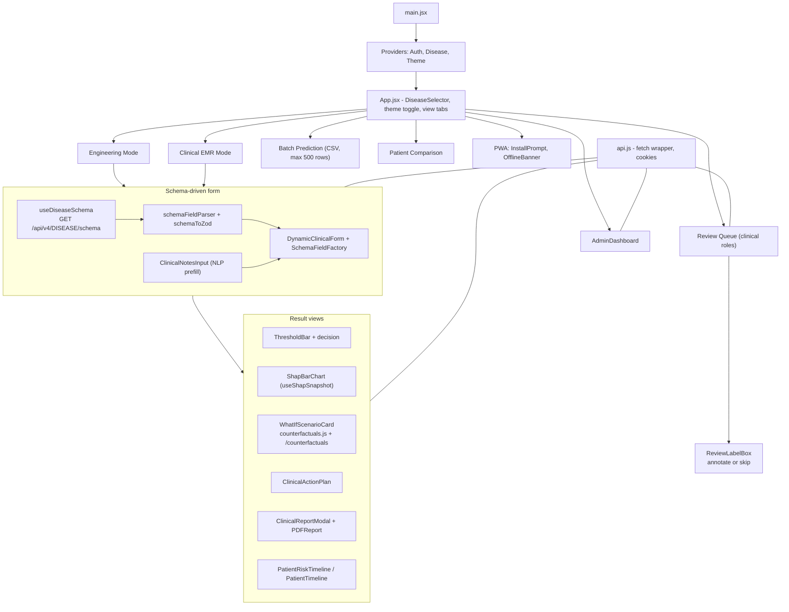

## ١٢. النشر والبنية التحتية (Deployment / CI)

نفس الصورة (image) تعمل محلياً وعلى Hugging Face Spaces وKubernetes. النماذج تُبنى أو تُحمَّل وقت بناء الصورة، فلا ملفات ثنائية في الريبو.

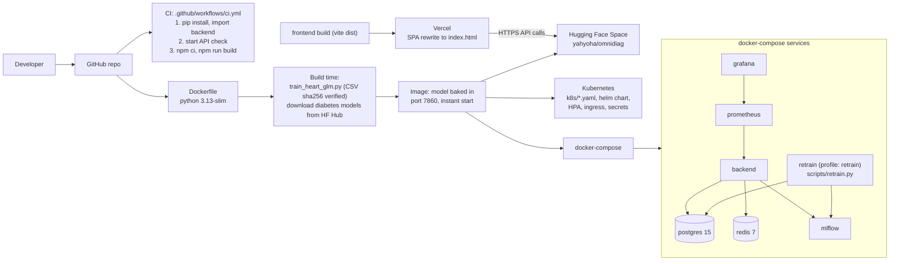

## ١٣. التعلّم الاتحادي (Federated Learning): الحالة الفعلية

غير مُشغَّل في المنتج. النموذج الأولي (Flower + FedAvg + XGBoost) لا يستطيع التجميع، والبديل GLORE مُنفَّذ ومقاس في مستودع التجارب فقط.

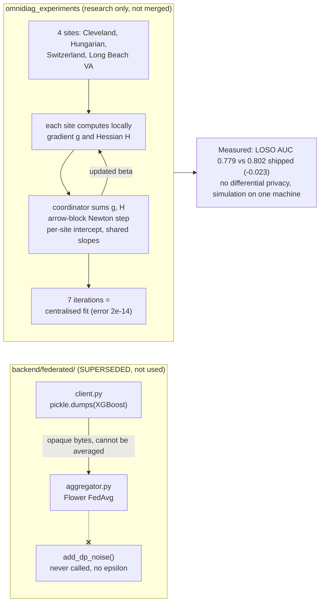

