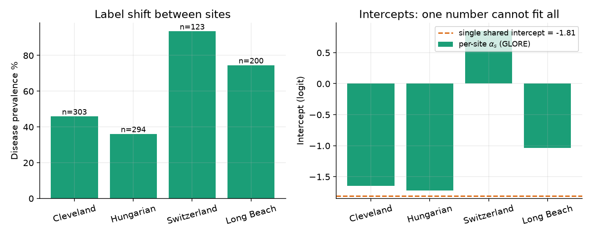
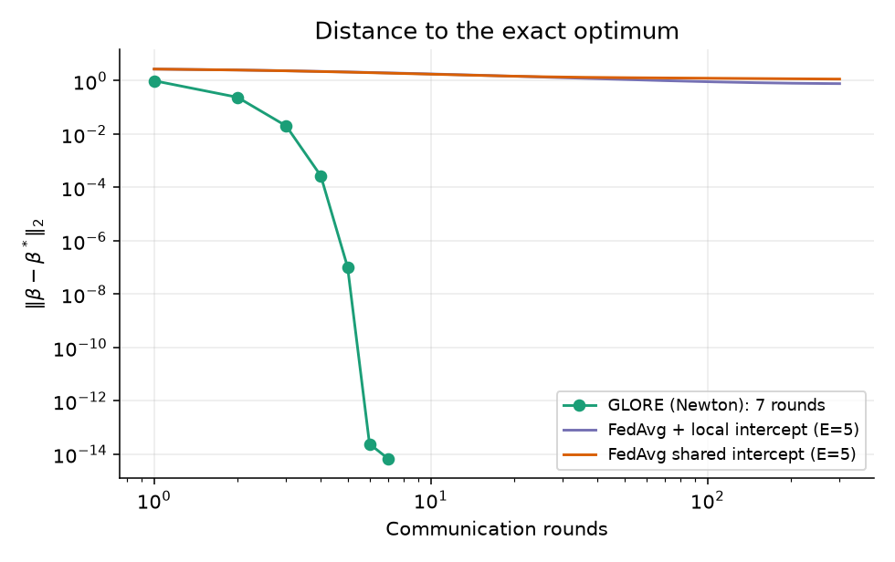
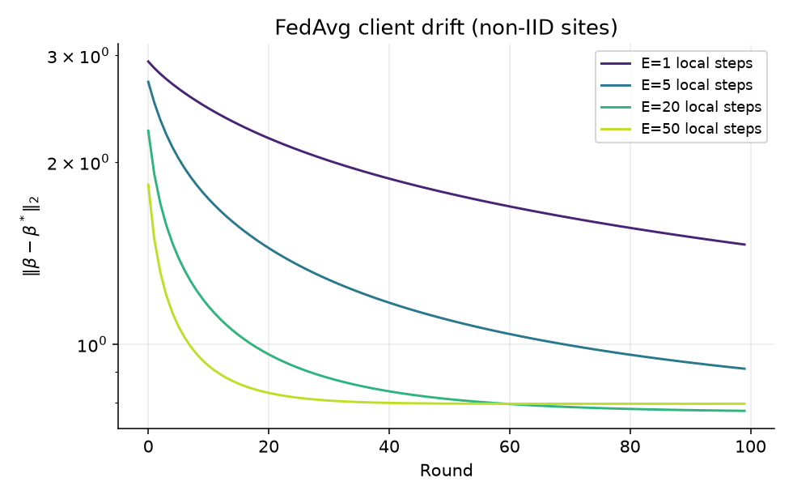
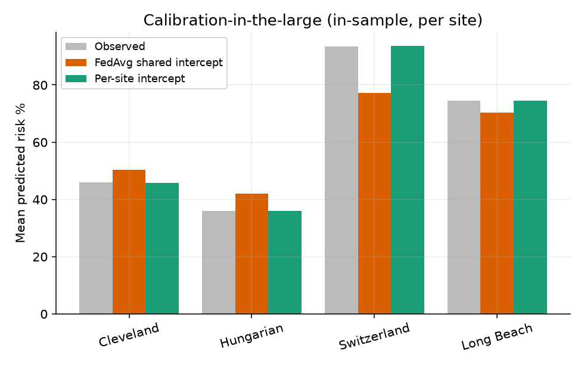
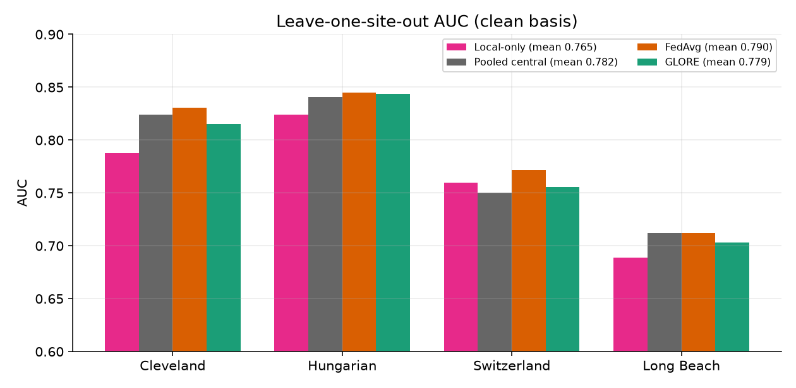
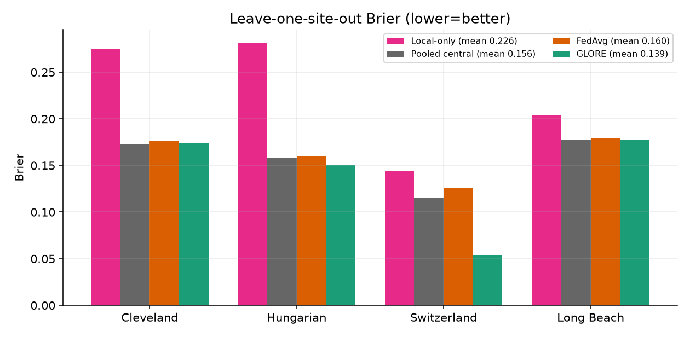
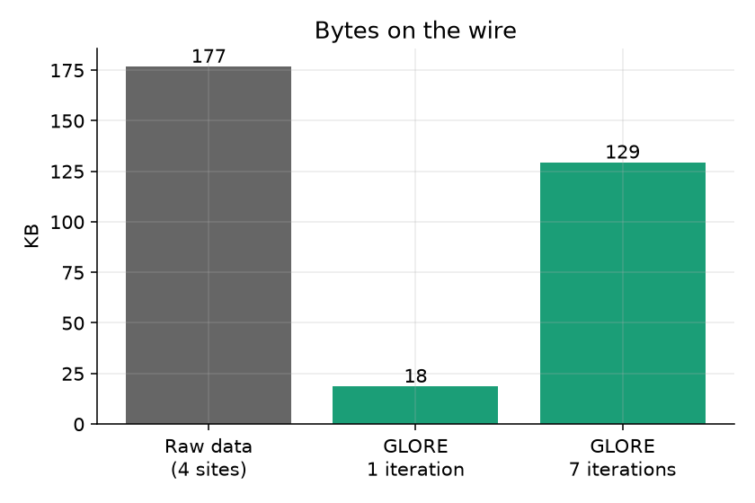
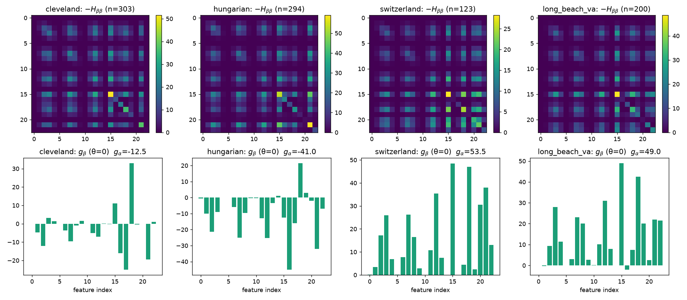
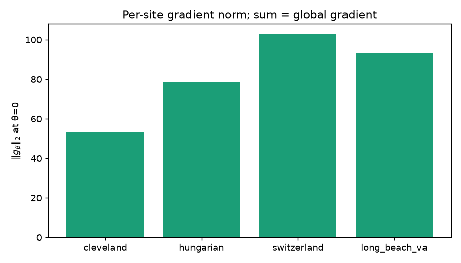

# تقرير التعلّم الاتحادي (FL) في OmniDiag — المفهوم، الرياضيات، التطبيق، الأرقام

**الحالة الصادقة:** لا يوجد FL يعمل داخل المنتج. (1) نموذج Flower/FedAvg/XGBoost في `backend/federated/` **لا يستطيع التجميع أصلاً** (موسوم SUPERSEDED). (2) البديل GLORE مُنفَّذ ومقاس **فقط** في `omnidiag_experiments` (محاكاة على جهاز واحد، 4 مجموعات تاريخية، **ليس** تجربة بين مؤسسات، **ليس** DP).
المصدر: كود المستودعين + تجربة مستقلة `fl_exp.py` (نتائجها في `fl_exp.json`).

## 1. المفهوم
K مواقع، كل موقع s يملك (X_s, y_s) لا يغادر. الهدف: حلّ  θ* = argmax Σ_s ℓ_s(θ)  دون جمع الصفوف. الاتحاد لا يزيد المعلومات؛ هو يوزّع الحساب فقط.
بياناتنا: 920 مريض، 4 مواقع، p = 23 ميزة بعد الأساس المجمَّد (spline + one-hot).

| الموقع | n | الانتشار | α_s (intercept) |
|---|---|---|---|
| Cleveland | 303 | 45.9% | −1.65 |
| Hungarian | 294 | 36.1% | −1.72 |
| Switzerland | 123 | 93.5% | +0.85 |
| Long Beach VA | 200 | 74.5% | −1.04 |



الانتشار من 36% إلى 94% = **label shift** حاد. intercept واحد مشترك (−1.81) يخطئ لكل موقع.

## 2. لماذا فشل التطبيق الأصلي (FedAvg + XGBoost)
- FedAvg: θ_{t+1} = Σ_s (n_s/n) θ_s^{t}، يتطلب متجهات أرقام. `client.py` يُرسل `[pickle.dumps(model)]` = بايتات معتمة: المتوسط بلا معنى. 
- أشجار XGBoost ليست متجهاً قابلاً للمتوسط (بنية متفرعة)؛ الصحيح SecureBoost. 
- `add_dp_noise()` لا يُستدعى من أي مكان، ولا يحسب ε ولا composition ⇒ **لا ضمان خصوصية**.
- `scripts/simulate_federated.py` يختار «أفضل مستشفى» ويسميه FedAvg (proxy) — ليس تجميعاً، ويقيّم accuracy على بيانات التدريب.

## 3. الآلية الرياضية للبديل: GLORE
النموذج: logit P(y=1|x, s) = α_s + βᵀx — **β مشتركة، α_s محلية** (تُكافئ انحدار لوجستي مركزي بمتغير موقع كتأثير ثابت).
اللوغاريتم المشترك: ℓ(α,β) = Σ_s Σ_i [y_i η_i − log(1+e^{η_i})], η_i = α_s + βᵀx_i.
كل موقع يحسب محلياً عند (α_s, β) الحالية، مع w_i = p_i(1−p_i):
- g_α = Σ(y−p) ، g_β = Xᵀ(y−p) 
- h_αα = −Σw ، h_αβ = −Σ w x ، H_ββ = −Xᵀ diag(w) X

المنسّق يجمع فقط g_β و H_ββ ويحلّ نظام Newton ببنية **arrow**: كل α_s يتفاعل مع β فقط:
```
[ h_αα¹            h_αβ¹ ] [Δα¹]   [g_α¹]
[       ⋱           ⋮    ] [ ⋮ ] = [ ⋮  ]      θ ← θ − H⁻¹ g
[ h_αβ¹ᵀ … H_ββ        ] [Δβ ]   [g_β ]
```
بما أن g و H **مجاميع** على الصفوف، التجميع عبر المواقع **دقيق** (لا تقريب)، فنتيجة Newton الموزَّع = المركزي حرفياً. Newton تقاربه تربيعي قرب الحل.

**التحقق (من النتائج المحفوظة):** max|β_GLORE − β_central| = 2.0·10⁻¹⁴، فروق α ≤ 2.6·10⁻¹³ (عملية OS معزولة لكل موقع، 7 تكرارات).

## 4. النتائج (أرقام)

### 4.1 سرعة التقارب (تجربتي، نفس البيانات، ridge مطابق)
‖β − β*‖₂ بعد:

| الطريقة | جولة 1 | جولة 5 | جولة 7 | جولة 300 |
|---|---|---|---|---|
| GLORE (Newton) | 0.99 | 9.9·10⁻⁸ | 6.8·10⁻¹⁵ | — |
| FedAvg + intercept محلي (E=5) | 2.8 | — | — | 0.77 |
| FedAvg intercept مشترك (E=5) | 2.9 | — | — | 1.14 |



GLORE: 7 جولات للدقة الآلية. FedAvg (GD مرتبة أولى، lr=0.5 ثابت): بعد 300 جولة لا يزال بعيداً. **تحفظ:** هذا يعكس ضبطي لـ lr/E؛ لا أدّعي أن FedAvg لا يتقارب أبداً، بل أن مرتبته الأولى أبطأ بأوامر من Newton على مسألة محدّبة ضيّقة الشرط.

### 4.2 Client drift
مع زيادة الخطوات المحلية E يستقر FedAvg على نقطة ثابتة **منحازة** عن β* (E=20 و50 تثبت قرب ‖Δ‖≈0.8). هذا هو الأثر المعروف لعدم التجانس (non-IID): كل موقع يسحب نحو أمثله المحلي.



### 4.3 المعايرة (calibration-in-the-large، داخل العينة)

| الموقع | الفعلي | FedAvg (intercept مشترك) | intercept محلي |
|---|---|---|---|
| Cleveland | 45.9% | 50.3% | 45.8% |
| Hungarian | 36.1% | 42.1% | 36.1% |
| Switzerland | 93.5% | 77.2% | 93.7% |
| Long Beach | 74.5% | 70.3% | 74.6% |



الـ intercept المشترك يُخطئ بـ −16 نقطة مئوية في Switzerland و +6 في Hungarian. الـ intercept المحلي يطابق الانتشار. **السبب الذي اختير GLORE من أجله.**

### 4.4 الأداء خارج العينة: leave-one-site-out نظيف (أساس مجمَّد من مواقع التدريب فقط)

| الطريقة | AUC متوسط | Brier متوسط |
|---|---|---|
| Local-only (موقع واحد) | 0.765 | 0.226 |
| Pooled مركزي (intercept واحد) | 0.782 | 0.156 |
| FedAvg (intercept مشترك) | **0.790** | 0.160 |
| GLORE + intercept محلي* | 0.779 | **0.139** |
| GLORE cold-start (بلا بيانات الموقع الجديد) | 0.779 | 0.169 |

*يحتاج تسميات الموقع الجديد لتقدير α (warm-start).



الأرقام في الجدول AUC لكل موقع (GLORE): Cleveland 0.815، Hungarian 0.844، Switzerland 0.755، Long Beach 0.703.

**قراءة صادقة (لا تجميل):**
1. **AUC لا يتأثر بالـ intercept** (إضافة ثابت لا تغيّر الترتيب) ⇒ GLORE **لا يحسّن التمييز**؛ فوائده في **المعايرة** فقط. وفي AUC هو 0.779 مقابل 0.790 لـ FedAvg وهما ضمن ضجيج عيّنات صغيرة (Switzerland n=123 ، 8 أصحاء فقط).
2. مقابل النموذج المشحون (LOSO 0.802): −0.023 ⇒ **خارج التسامح المُعلَن ±0.01**. تسريب المعالجة المسبقة استُبعد (−0.024 قبل، −0.023 بعد).
3. Brier: GLORE-warm أفضل (0.139) بسبب Switzerland (0.054 مقابل 0.126) — لكن هذا مشروط بمعرفة تسميات الموقع. في cold-start (0.169) يخسر أمام pooled (0.156).
4. «الاتحاد» هنا لا يتفوق على المركزي بالتعريف: GLORE يطابقه ولا يتجاوزه. القيمة الوحيدة = عدم نقل الصفوف.
5. عدم التجانس: لا كتلة معنوية بعد Holm (أصغر p معدّل = 0.21، ChestPain) ⇒ افتراض β مشتركة لم يُدحَض (غياب الدليل ≠ دليل الغياب مع n صغير).

### 4.5 الاتصال والخصوصية
لكل تكرار، كل موقع يرسل 1+p+1+p+p² = 577 عدد (p=23)؛ المجموع 4 مواقع ≈ 18.5 KB/تكرار (≈129 KB لـ 7 تكرارات؛ المقاس عبر الـ pipe ≈ 138 KB للمواقع→المنسق مع التسلسل). البيانات الخام ≈ 177 KB.



**حجم الرسالة ليس حجة خصوصية**: H_ββ و g تقترب من حجم البيانات. الادعاء الوحيد الصحيح: **لا صف مريض يغادر الموقع**. بدون DP هذه الإحصاءات قد تسرّب (خصوصاً مواقع صغيرة مثل n=123؛ و H_ββ تكشف تغاير الميزات). لا يجوز وصفه بـ «private».

## 5. ما يُقال وما لا يُقال في الدفاع
| يجوز | لا يجوز |
|---|---|
| GLORE يطابق المركزي بدقة 10⁻¹⁴ في 7 جولات | «لدينا FL يعمل في المنتج» |
| لا صف مريض يخرج من الموقع (محاكاة) | «خصوصية مضمونة / differentially private» |
| intercept محلي يصلح معايرة انتشار 36–94% | «يحسّن الدقة/AUC» |
| قياس LOSO: −0.023 عن المشحون، خارج التسامح | «أُثبت على مستشفيات حقيقية» |

## 6. القيود
محاكاة على جهاز واحد؛ 4 مجموعات تاريخية (UCI) متباينة بالزمن لا مستشفيات حيّة؛ n صغير (Switzerland 123)؛ لا DP ولا secure aggregation ولا تحقق من مشاركين خبيثين؛ تجربة FedAvg مقارنتي بضبط hyperparameters واحد (ليست sweep كاملاً)؛ Brier/AUC بدون فواصل ثقة هنا.
**الخطوة التالية الصحيحة إن أُريد ادعاء خصوصية:** secure aggregation + noise على g,H مع محاسبة ε، أو الإبقاء على الصياغة «محاكاة بحثية».

## 7. إعادة الإنتاج
`/home/yahia/omnidiag_experiments/.venv-research/bin/python docs/fl_report/fl_exp.py && python plots.py` (يعتمد على `heart/scripts` في مستودع التجارب).

## 8. الغراديانت والهيسيان لكل مستشفى (التكرار 0، θ=0، p=23) — `gh.py`

| الموقع | n | g_α | h_αα | ‖g_β‖₂ | ‖H_ββ‖_F | أكبر قيمة ذاتية لـ −H_ββ |
|---|---|---|---|---|---|---|
| Cleveland | 303 | −12.50 | −75.75 | 53.27 | 182.00 | 177.2 |
| Hungarian | 294 | −41.00 | −73.50 | 78.76 | 211.03 | 206.9 |
| Switzerland | 123 | +53.50 | −30.75 | 102.97 | 115.32 | 114.2 |
| Long Beach VA | 200 | +49.00 | −50.00 | 93.25 | 162.87 | 159.9 |

(عند θ=0 كل p̂=0.5 فـ h_αα = −n/4 بالضبط.) إشارة g_α تُظهر اتجاه الانتشار: سالبة (Cleveland, Hungarian: الانتشار < 50%)، موجبة (Switzerland, Long Beach: > 50%).

**التجميع:** Σ_s g_β − g_β(مركزي) أقصى فرق مطلق = 3.6·10⁻¹⁴؛ Σ_s H_ββ − H_ββ(مركزي) = 1.6·10⁻¹³. أي أن المجموع الموزَّع = المركزي.
**خطوة Newton الأولى من المجاميع:** Δα = (−1.02, −1.05, +0.16, −0.53)، ‖Δβ‖ = 2.08.

عند التقارب (7 تكرارات) كل g_α_s ≈ 10⁻¹⁵ (كل موقع معادَل محلياً)، أما g_β لكل موقع **ليس صفراً** (9.74، 5.13، 3.13، 9.80) لأن β مشتركة؛ **مجموعها** فقط هو الصفر (2.5·10⁻¹⁴).

### الشكل 8 — الهيسيان (الصف العلوي) والغراديانت (الصف السفلي) لكل مستشفى عند θ=0



**الصف العلوي: خريطة حرارية للمصفوفة −H_ββ (23×23)** لكل مستشفى.
- **ما هي:** −H_ββ = Xᵀ·diag(w)·X حيث w = p(1−p). مصفوفة متماثلة وشبه موجبة التحديد، تقيس مقدار «المعلومة» (information) التي تحملها بيانات الموقع عن كل ميزة (القطر) وعن ترابط الميزات (خارج القطر).
- **كيف تُقرأ:** اللون الأصفر = قيمة كبيرة (تصل إلى ~50 في Cleveland وHungarian، ~28 في Switzerland، ~48 في Long Beach). الألوان الداكنة = ميزات قليلة المعلومة أو أعمدة شبه ثابتة.
- **النمط المتكرر:** نفس الكتل تظهر في المواقع الأربعة لأن الأساس المجمَّد (spline + one-hot) واحد لكل المواقع. الأعمدة شبه السوداء (مثل الفهرس 0 و5 و10) ذات معلومة صغيرة جداً؛ الأرجح أنها أعمدة spline قليلة التفعيل، لكني لم أتحقق من أسمائها.
- **الاختلاف بين المواقع:** الأحجام تتناسب مع n (Switzerland n=123 أقل شدة؛ Cleveland وHungarian أعلى)، والأنماط تختلف لأن توزيع الميزات يختلف بين المستشفيات. المعلومة ‖H_ββ‖_F: 182.0 و211.0 و115.3 و162.9.
- **لماذا يهم:** المنسّق يجمع المصفوفات الأربع **بالجمع الأولي** فقط: H_ββ = Σ_s H_ββ^(s). لذلك الموقع الأكبر يؤثر أكثر في الخطوة، تماماً كما في النموذج المركزي.
- **الخصوصية:** هذه المصفوفة تكشف تغاير ميزات الموقع (second moments). وهي ليست مجهولة الهوية، وهذا أحد أسباب عدم ادعاء الخصوصية.

**الصف السفلي: أعمدة g_β (متجه من 23 قيمة) لكل مستشفى** مع قيمة g_α في العنوان.
- **ما هو:** g_β = Xᵀ(y − p̂) عند θ=0، أي p̂=0.5 لكل الصفوف. القيمة = مجموع (y − 0.5) مضروباً في قيمة الميزة. موجبة: زيادة الميزة ترتبط بمرض أكثر من 50%؛ سالبة: العكس.
- **الاختلاف الجوهري بين المواقع (وهو نقطة الشكل):**
  - Cleveland (g_α = −12.5) وHungarian (g_α = −41.0): أعمدة كثيرة سالبة. الانتشار أقل من 50% فالغراديانت يسحب المعاملات للأسفل.
  - Switzerland (g_α = +53.5) وLong Beach (g_α = +49.0): كل الأعمدة تقريباً موجبة، لأن انتشار المرض مرتفع (93.5% و74.5%) فيقرأ المستوى الأول من النموذج أن «كل شيء يشير إلى مرض».
- **الدلالة:** جزء كبير من هذا الاختلاف سببه الانتشار (label shift) وليس علاقة الميزات بالمرض. لهذا نفصل intercept لكل موقع (α_s): g_α يمتص جزءاً من هذا الإزاحة، وبعد الحل يصبح g_α = 0 لكل موقع، فتصحّ مشاركة β.
- **جمع الأعمدة:** Σ_s g_β هو الغراديانت العام. إشارات المواقع المتعاكسة تتلاشى جزئياً عند الجمع، وهذا ما يُنتج خطوة Newton مشتركة.

### الشكل 9 — حجم الغراديانت لكل موقع



يعرض ‖g_β‖₂ عند θ=0: Cleveland 53.3، Hungarian 78.8، Switzerland 103.0، Long Beach 93.3. أكبرها لأقلّها بيانات (Switzerland) وليس لأكبرها، لأن مواقع الانتشار العالي بعيدة أكثر عن p̂=0.5 فمتوسط البواقي أكبر. هذا لا يعني أن Switzerland «أهم»: وزنه في الجمع النهائي محدد بحجم H_ββ (الأصغر).

**ملاحظة أمانة:** لم أربط فهرس الميزة (0–22) باسم الميزة الأصلية في الشكل؛ التفسير أعلاه عن بنية الأساس (spline لأعمدة رقمية ثم أعمدة ثنائية/one-hot) وليس عن اسم عمود بعينه.
