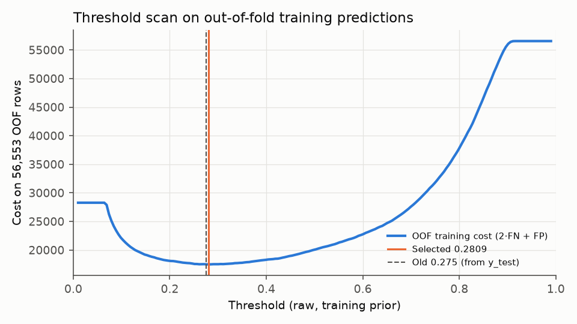

# Diabetes threshold decision log

| Item | Value |
|---|---|
| Data used for selection | training split only, 56,553 rows, out-of-fold stacking probabilities |
| OOF procedure | `cross_val_predict`, `StratifiedKFold(5, shuffle=True, random_state=42)`; clones of the three shipped base models, then a clone of the shipped meta-learner on the OOF base matrix |
| Selection function | `find_optimal_clinical_threshold` (models/train_diabetes_ensemble.py), unchanged |
| Cost function | `Cost = 2.0·FN + 1.0·FP` |
| Range scanned | `np.linspace(0.01, 0.99, 200)` — 200 thresholds, step 0.0049 |
| Tie rule | first threshold reaching the minimum (strict `<`) |
| **Selected (raw)** | **0.280854** |
| Selected, deployment prior π=0.14 | 0.059776 (written to configs/diabetes.yaml) |
| OOF cost at selected | 17477 (FN 2383, FP 12711) |
| OOF cost at grid point nearest 0.275 (0.2759) | 17494 |
| Old threshold re-derived on y_test today | 0.3203 |
| Sensitivity check: shipped meta-learner on OOF base matrix | 0.2809 |

## Why this threshold won

It is the grid point with the lowest 2·FN + FP on predictions that no model had seen during fitting. With FN weighted 2 and FP weighted 1, the optimum under perfect calibration is where P(diabetes | x) = 1/(1+2) = 0.333 on the training prior; the empirical optimum is 0.2809. The gap is a property of this model's calibration on the OOF rows, which is why the threshold is chosen empirically rather than set to 1/3. Whether the curve is flat near the minimum can be read from the ten best grid points below.

## Ten lowest-cost thresholds (OOF)

| threshold | total_cost | fn | fp | recall | precision |
|---|---|---|---|---|---|
| 0.2809 | 17477.0000 | 2383 | 12711 | 0.9157 | 0.6707 |
| 0.2759 | 17494.0000 | 2322 | 12850 | 0.9179 | 0.6689 |
| 0.2858 | 17503.0000 | 2460 | 12583 | 0.9130 | 0.6723 |
| 0.2612 | 17509.0000 | 2111 | 13287 | 0.9253 | 0.6632 |
| 0.2661 | 17517.0000 | 2189 | 13139 | 0.9226 | 0.6651 |
| 0.2956 | 17518.0000 | 2588 | 12342 | 0.9085 | 0.6755 |
| 0.3006 | 17520.0000 | 2649 | 12222 | 0.9063 | 0.6771 |
| 0.2907 | 17521.0000 | 2528 | 12465 | 0.9106 | 0.6738 |
| 0.2710 | 17527.0000 | 2258 | 13011 | 0.9201 | 0.6666 |
| 0.3104 | 17534.0000 | 2785 | 11964 | 0.9015 | 0.6806 |

