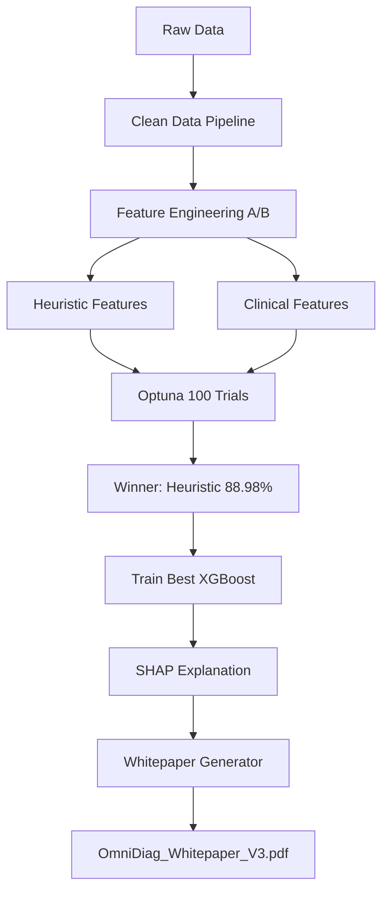

# OmniDiag V3 — Deliverables Execution Plan

## Overview

Based on the comprehensive structural outline provided and thorough exploration of the codebase, this plan breaks down the **3 immediate deliverables** into actionable, independent tasks. Each deliverable is designed to be executed sequentially by the Code mode.

---

## Deliverable 1: Academic Whitepaper (PDF Report)

**Goal:** Generate a professional academic PDF that documents the entire OmniDiag journey — from V2 baseline through V3 optimization, including XAI analysis — suitable for a judging panel.

### Tasks

| # | Task | Details |
|---|------|---------|
| 1.1 | **Install `weasyprint` dependency** | Add `weasyprint` to `requirements.txt` and install it in the `.venv` environment. |
| 1.2 | **Create the whitepaper generator script** | Write `scripts/generate_whitepaper.py` that produces a polished academic PDF. The script must: |
| | • **Title Page** | Project title, author name (Yahya Mohammad Ali Lababneh), date, version V3. |
| | • **Abstract** | Brief summary of the problem, approach, key results (88.98% accuracy), and XAI integration. |
| | • **Section 1: Introduction & Clinical Problem** | Explain cardiovascular disease early detection, the 918-patient dataset, and the clinical need for high-sensitivity diagnostics. |
| | • **Section 2: Data Pipeline & Integrity** | Describe the cleaning pipeline (`clean_data.py`), handling of illogical zeros in Cholesterol, the V2 data leakage discovery, and the courageous decision to reject V2's 90.31% accuracy in favor of V3's cleaner 88.98%. |
| | • **Section 3: Feature Engineering A/B Testing** | Detail the two paths — Statistical Heuristic (Age_BP_Interaction, HR_Age_Ratio, Chol_Age_Ratio) vs. Clinical Risk Score (logarithmic medical formula). Include the Optuna 100-trial setup and the winning configuration (898 trees, depth 5). |
| | • **Section 4: Model Selection — Occam's Razor** | Explain the TabNet experiment, its collapse to 68.16% on statistical features due to scaling sensitivity, the ensemble anchor effect, and the decision to adopt standalone XGBoost. |
| | • **Section 5: Explainable AI (SHAP)** | Describe TreeSHAP integration, include references to Summary Plot and Bee Swarm Plot (to be generated in Deliverable 3). Explain how SHAP provides game-theoretic feature importance transparency. |
| | • **Section 6: Results & Comparison Table** | Table comparing V2 (90.31% — leaked), V3 Clinical (88.57%), V3 Heuristic (88.98% — winner), TabNet (68.16%), Ensemble (degraded). |
| | • **Section 7: Conclusion & Future Work** | Summarize achievements, mention backlog items (MinMaxScaler, FastAPI inference UI). |
| | • **References** | Cite scikit-learn, XGBoost, SHAP, Optuna, TabNet papers. |
| 1.3 | **Run the generator** | Execute `python scripts/generate_whitepaper.py` to produce `reports/OmniDiag_Whitepaper_V3.pdf`. |
| 1.4 | **Verify output** | Confirm the PDF exists and is readable. |

### Architecture Flow



---

## Deliverable 2: Patient Inference Script (Live Demo)

**Goal:** Build a standalone CLI script that accepts single-patient data and outputs a real-time diagnosis with SHAP explanation — ready for live demo to the judging panel.

### Tasks

| # | Task | Details |
|---|------|---------|
| 2.1 | **Enhance `live_demo.py`** | Refactor the existing `models/live_demo.py` to: |
| | • **Accept CLI arguments** | Use `argparse` to accept patient features via command-line (e.g., `--age 58 --sex 1 --chestpain 2 ...`). |
| | • **Support raw input mode** | Also accept a patient index from the dataset for quick demos. |
| | • **Print formatted diagnosis report** | Clear terminal output showing: patient vitals, prediction (Healthy/Disease), confidence percentage, and top-3 contributing features from SHAP. |
| | • **Save SHAP waterfall plot** | Auto-save the SHAP waterfall plot as `reports/figures/live_shap_waterfall.png` for the panel to see. |
| | • **Handle missing features** | Compute heuristic features (Age_BP_Interaction, HR_Age_Ratio, Chol_Age_Ratio) on-the-fly from raw inputs. |
| 2.2 | **Test with sample patients** | Run the script with 2-3 sample patients (both healthy and diseased) to verify correctness. |
| 2.3 | **Create a quick-reference usage guide** | Add a comment block or `--help` output showing example commands for the panel. |

### CLI Interface Design

```
Usage:
  python models/live_demo.py --patient-idx 10
  python models/live_demo.py --age 58 --sex 1 --chestpain 2 --restingbp 140 --chol 289 --fbs 0 --restecg 1 --maxhr 122 --exang 0 --oldpeak 0.0 --stslope 1
```

---

## Deliverable 3: SHAP Plots Generation & Analysis (XAI Visualizations)

**Goal:** Run the SHAP explainer to generate publication-ready feature importance plots, save them to `reports/figures/`, and produce a brief analysis text for inclusion in slides.

### Tasks

| # | Task | Details |
|---|------|---------|
| 3.1 | **Create `scripts/generate_shap_plots.py`** | A dedicated script that: |
| | • Loads the optimized XGBoost model (`models/omni_diag_xgb_optimized.pkl`). |
| | • Loads the heuristic dataset (`data/processed/data_heuristic.csv`). |
| | • Computes SHAP values using `shap.TreeExplainer`. |
| | • Generates and saves: |
| |   - **Summary Bar Plot** → `reports/figures/shap_summary_bar.png` (global feature importance ranking) |
| |   - **Bee Swarm Plot** → `reports/figures/shap_beeswarm.png` (feature impact direction and distribution) |
| |   - **Waterfall Plot for Patient 0** → `reports/figures/shap_waterfall_p0.png` (single-prediction explanation) |
| |   - **Waterfall Plot for Patient 10** → `reports/figures/shap_waterfall_p10.png` (another example) |
| | • Prints a text analysis of which features dominate and why. |
| 3.2 | **Run the script** | Execute `python scripts/generate_shap_plots.py` to produce all plots. |
| 3.3 | **Verify outputs** | Confirm all PNG files exist in `reports/figures/`. |
| 3.4 | **Create analysis summary** | Write a concise markdown snippet (`reports/shap_analysis.md`) explaining the SHAP findings for slide inclusion. |

### Expected SHAP Insights

Based on the heuristic features and medical literature, we expect:
- **Oldpeak**, **MaxHR**, and **ChestPainType** to be top drivers (consistent with cardiology).
- **Age_BP_Interaction** to show meaningful combined risk signal.
- **Chol_Age_Ratio** to provide marginal improvement over raw Cholesterol.

---

## Execution Order

The deliverables are **independent** and can be executed in any order, but the recommended sequence is:

```
Deliverable 3 (SHAP Plots) → Deliverable 1 (Whitepaper includes SHAP figures) → Deliverable 2 (Live Demo)
```

This way the whitepaper can embed the SHAP plots generated in D3, and the live demo script can be tested last.

---

## Files to Create/Modify

| File | Action | Deliverable |
|------|--------|-------------|
| `scripts/generate_whitepaper.py` | **Create** | D1 |
| `reports/OmniDiag_Whitepaper_V3.pdf` | **Generate** | D1 |
| `models/live_demo.py` | **Modify** | D2 |
| `scripts/generate_shap_plots.py` | **Create** | D3 |
| `reports/figures/shap_summary_bar.png` | **Generate** | D3 |
| `reports/figures/shap_beeswarm.png` | **Generate** | D3 |
| `reports/figures/shap_waterfall_p0.png` | **Generate** | D3 |
| `reports/figures/shap_waterfall_p10.png` | **Generate** | D3 |
| `reports/shap_analysis.md` | **Create** | D3 |
| `requirements.txt` | **Modify** | D1 (add weasyprint) |

---

## Risk Assessment

| Risk | Mitigation |
|------|------------|
| `weasyprint` may have system-level dependencies (Cairo, Pango) | Use `pip install weasyprint` first; if fails, fall back to `fpdf2` or `reportlab` |
| SHAP computation on full dataset may be slow | Use a subset (e.g., 200 samples) for TreeSHAP; full dataset for bar plot only |
| Live demo script may fail if model pickle is incompatible with current Python/sklearn version | Pin `joblib` and `xgboost` versions in requirements; test immediately |
