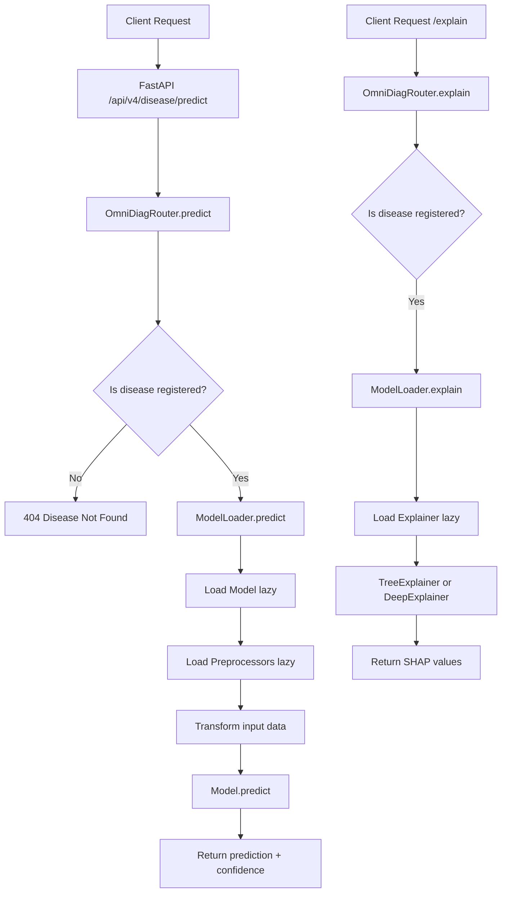

# OmniDiag Multi-Disease Platform — Architecture Refactoring Plan

## Vision

Transform OmniDiag from a single-disease (Heart Disease) project into a **Config-Driven Multi-Disease Diagnostic Platform**. Each disease is a self-contained module with its own config, data pipeline, feature engineering, model, and explainer — all orchestrated by a dynamic backend router.

---

## Target Directory Structure

```
OmniDiag/
│
├── configs/                          # NEW — YAML configs per disease
│   ├── heart_disease.yaml            # Heart disease config (XGBoost)
│   └── {disease2}_config.yaml        # Future disease config (DL/other)
│
├── data/
│   ├── heart_disease/                # MOVED — isolated heart disease data
│   │   ├── raw/
│   │   │   ├── heart.csv
│   │   │   └── Z-Alizadeh sani dataset.xlsx
│   │   ├── processed/
│   │   │   ├── merged_heart_data.csv
│   │   │   ├── final_ready_data.csv
│   │   │   ├── data_heuristic.csv
│   │   │   └── data_clinical.csv
│   │   └── interim/
│   │       └── ...
│   │
│   └── {disease2}/                   # FUTURE — isolated data for disease 2
│       ├── raw/
│       ├── processed/
│       └── interim/
│
├── features/                         # NEW — disease-specific feature engineering
│   ├── __init__.py
│   ├── base_features.py              # Abstract base class
│   ├── heart_disease_features.py     # Heart disease heuristic + clinical features
│   └── {disease2}_features.py        # FUTURE
│
├── models/                           # RETAINED — but organized by disease
│   ├── heart_disease/
│   │   ├── preprocessors/
│   │   │   ├── label_encoders.pkl
│   │   │   └── standard_scaler.pkl
│   │   ├── xgboost_weights/
│   │   │   ├── omni_diag_xgb_optimized.pkl
│   │   │   └── omni_diag_xgb.pkl
│   │   ├── tabnet_weights/
│   │   │   ├── omni_diag_model.zip
│   │   │   └── omni_diag_tabnet_heuristic.zip
│   │   ├── omni_diag_xgb_optimized.pkl
│   │   ├── final_model.pkl
│   │   ├── metadata.json
│   │   └── metrics.json
│   │
│   └── {disease2}/                   # FUTURE
│       ├── preprocessors/
│       └── weights/
│
├── backend/                          # REFACTORED — dynamic routing
│   ├── __init__.py
│   ├── main.py                       # FastAPI app entry point
│   ├── router.py                     # NEW — dynamic disease router
│   ├── schemas.py                    # NEW — Pydantic schemas per disease
│   └── model_loader.py               # NEW — lazy model + explainer loader
│
├── data_pipeline/                    # RETAINED — but generalized
│   ├── clean_data.py
│   ├── harmonization.py
│   └── merge_data.py
│
├── scripts/                          # RETAINED
│   ├── finalize_project.py
│   └── make_notebooks.py
│
├── ui/                               # RETAINED
│   └── app.py
│
├── reports/                          # RETAINED
│   ├── evaluation_metrics.txt
│   └── figures/
│
├── v2_archive/                       # RETAINED — untouched
│
├── plans/                            # RETAINED
│
├── requirements.txt
├── README.md
└── Dockerfile
```

---

## Component Design

### 1. Config System (`configs/`)

Each disease gets a YAML config file that fully describes its pipeline. This is the **single source of truth**.

**`configs/heart_disease.yaml`**:
```yaml
disease:
  name: "heart_disease"
  display_name: "Heart Disease"
  target_column: "HeartDisease"

data:
  raw_path: "data/heart_disease/raw/"
  processed_path: "data/heart_disease/processed/"
  raw_files:
    - "heart.csv"
    - "Z-Alizadeh sani dataset.xlsx"
  merged_file: "merged_heart_data.csv"
  final_clean_file: "final_ready_data.csv"

features:
  module: "features.heart_disease_features"
  class: "HeartDiseaseFeatureEngineer"
  heuristic_features:
    - name: "Age_BP_Interaction"
      formula: "Age * RestingBP"
    - name: "HR_Age_Ratio"
      formula: "MaxHR / Age"
    - name: "Chol_Age_Ratio"
      formula: "Cholesterol / Age"
  clinical_features:
    - name: "Clinical_Risk_Score"
      formula: "exp(Age * 0.048 + RestingBP * 0.015 + Cholesterol * 0.002)"

model:
  type: "xgboost"                    # xgboost | tabnet | deep_learning
  explainer_type: "tree"             # tree (TreeExplainer) | deep (DeepExplainer)
  weights_path: "models/heart_disease/xgboost_weights/omni_diag_xgb_optimized.pkl"
  preprocessors_path: "models/heart_disease/preprocessors/"
  best_params:
    n_estimators: 898
    max_depth: 5
    learning_rate: 0.013594126498405943
    subsample: 0.963733407970185
    colsample_bytree: 0.5454718650965412
    eval_metric: "logloss"

training:
  test_size: 0.2
  random_state: 42
  optimization_trials: 100

explainer:
  enabled: true
  type: "shap"
  plots_output_dir: "reports/figures/"
```

### 2. Feature Engineering Base Class (`features/base_features.py`)

```python
from abc import ABC, abstractmethod
import pandas as pd

class BaseFeatureEngineer(ABC):
    """Abstract base for disease-specific feature engineering."""
    
    def __init__(self, config: dict):
        self.config = config
        self.disease_name = config["disease"]["name"]
    
    @abstractmethod
    def engineer_heuristic(self, df: pd.DataFrame) -> pd.DataFrame:
        """Generate statistical/heuristic features."""
        pass
    
    @abstractmethod
    def engineer_clinical(self, df: pd.DataFrame) -> pd.DataFrame:
        """Generate clinically-derived features."""
        pass
    
    def run_all(self, df: pd.DataFrame) -> dict:
        """Run both paths and return dict of DataFrames."""
        return {
            "heuristic": self.engineer_heuristic(df.copy()),
            "clinical": self.engineer_clinical(df.copy())
        }
```

### 3. Dynamic Backend Router (`backend/router.py`)

```python
import yaml
import os
from fastapi import APIRouter, HTTPException
from backend.model_loader import ModelLoader

class OmniDiagRouter:
    """Dynamically routes patient data to the correct disease model."""
    
    def __init__(self, configs_dir: str = "configs"):
        self.configs_dir = configs_dir
        self.disease_configs = {}       # disease_name -> config dict
        self.model_loaders = {}         # disease_name -> ModelLoader
        self._load_all_configs()
    
    def _load_all_configs(self):
        """Scan configs/ directory and load all YAML configs."""
        for filename in os.listdir(self.configs_dir):
            if filename.endswith((".yaml", ".yml")):
                config_path = os.path.join(self.configs_dir, filename)
                with open(config_path, "r") as f:
                    config = yaml.safe_load(f)
                disease_name = config["disease"]["name"]
                self.disease_configs[disease_name] = config
                self.model_loaders[disease_name] = ModelLoader(config)
    
    def get_available_diseases(self) -> list:
        """Return list of registered disease names."""
        return list(self.disease_configs.keys())
    
    def predict(self, disease: str, patient_data: dict) -> dict:
        """Route prediction to the correct disease model."""
        if disease not in self.model_loaders:
            raise HTTPException(
                status_code=404,
                detail=f"Disease '{disease}' not registered. Available: {self.get_available_diseases()}"
            )
        loader = self.model_loaders[disease]
        return loader.predict(patient_data)
    
    def explain(self, disease: str, patient_data: dict) -> dict:
        """Route explanation to the correct disease explainer."""
        if disease not in self.model_loaders:
            raise HTTPException(status_code=404, detail=f"Disease '{disease}' not registered.")
        loader = self.model_loaders[disease]
        return loader.explain(patient_data)
```

### 4. Model Loader (`backend/model_loader.py`)

```python
import joblib
import pandas as pd
import shap
import numpy as np
from typing import Optional

class ModelLoader:
    """Lazy-loads model + preprocessors + explainer for one disease."""
    
    def __init__(self, config: dict):
        self.config = config
        self._model: Optional[object] = None
        self._explainer: Optional[object] = None
        self._preprocessors: Optional[dict] = None
    
    @property
    def model(self):
        if self._model is None:
            path = self.config["model"]["weights_path"]
            self._model = joblib.load(path)
        return self._model
    
    @property
    def explainer(self):
        if self._explainer is None:
            explainer_type = self.config["model"]["explainer_type"]
            if explainer_type == "tree":
                self._explainer = shap.TreeExplainer(self.model)
            elif explainer_type == "deep":
                self._explainer = shap.DeepExplainer(self.model)
            else:
                raise ValueError(f"Unknown explainer type: {explainer_type}")
        return self._explainer
    
    def predict(self, patient_data: dict) -> dict:
        """Run prediction and return result with confidence."""
        df = pd.DataFrame([patient_data])
        pred = self.model.predict(df)[0]
        proba = self.model.predict_proba(df)[0][1]
        return {
            "prediction": int(pred),
            "confidence": float(proba),
            "diagnosis": "Positive" if pred == 1 else "Negative"
        }
    
    def explain(self, patient_data: dict) -> dict:
        """Run SHAP explanation and return values."""
        df = pd.DataFrame([patient_data])
        shap_values = self.explainer(df)
        return {
            "shap_values": shap_values[0].values.tolist(),
            "base_value": float(shap_values[0].base_values),
            "feature_names": list(df.columns)
        }
```

### 5. Refactored FastAPI Entry (`backend/main.py`)

```python
from fastapi import FastAPI
from fastapi.middleware.cors import CORSMiddleware
from backend.router import OmniDiagRouter
from backend.schemas import get_schema_for_disease

app = FastAPI(title="OmniDiag Multi-Disease Platform", version="4.0.0")
app.add_middleware(CORSMiddleware, allow_origins=["*"], allow_methods=["*"], allow_headers=["*"])

# Initialize the dynamic router (loads all configs)
odiag_router = OmniDiagRouter()

@app.get("/")
def health_check():
    return {
        "status": "Healthy",
        "version": "4.0.0",
        "registered_diseases": odiag_router.get_available_diseases()
    }

@app.post("/api/v4/{disease}/predict")
def predict(disease: str, patient: dict):
    return odiag_router.predict(disease, patient)

@app.post("/api/v4/{disease}/explain")
def explain(disease: str, patient: dict):
    return odiag_router.explain(disease, patient)
```

---

## Migration Plan: Heart Disease → New Structure

### Phase 1: Create New Directories & Config

| Step | Action | Details |
|------|--------|---------|
| 1.1 | Create `configs/` directory | Add `heart_disease.yaml` with all parameters from existing code |
| 1.2 | Create `features/` package | Add `__init__.py`, `base_features.py`, `heart_disease_features.py` |
| 1.3 | Create `backend/__init__.py` | Package init |
| 1.4 | Create `backend/router.py` | Dynamic router class |
| 1.5 | Create `backend/model_loader.py` | Lazy loader with SHAP support |
| 1.6 | Create `backend/schemas.py` | Pydantic models per disease |

### Phase 2: Migrate Data

| Step | Action | Details |
|------|--------|---------|
| 2.1 | Create `data/heart_disease/raw/` | Move `data/raw/heart.csv` and `data/raw/Z-Alizadeh sani dataset.xlsx` |
| 2.2 | Create `data/heart_disease/processed/` | Move all CSVs from `data/processed/` |
| 2.3 | Create `data/heart_disease/interim/` | Move `data/interim/` contents |
| 2.4 | Update `data_pipeline/` scripts | Point file paths to `data/heart_disease/` |

### Phase 3: Migrate Models

| Step | Action | Details |
|------|--------|---------|
| 3.1 | Create `models/heart_disease/` | Move all heart-disease-specific model files |
| 3.2 | Organize preprocessors | Move `models/preprocessors/` into `models/heart_disease/preprocessors/` |
| 3.3 | Organize weights | Move `models/xgboost_weights/` and `models/tabnet_weights/` into `models/heart_disease/` |

### Phase 4: Update Scripts

| Step | Action | Details |
|------|--------|---------|
| 4.1 | Update `advanced_feature_engineering.py` | Use config-driven paths + call `HeartDiseaseFeatureEngineer` |
| 4.2 | Update `train_best_xgb.py` | Read params from config instead of hardcoded dict |
| 4.3 | Update `explain_xgb.py` | Use config-driven model loading |
| 4.4 | Update `live_demo.py` | Use config + dynamic loader |
| 4.5 | Update `optimize_xgboost.py` | Use config paths |

### Phase 5: Verify

| Step | Action | Details |
|------|--------|---------|
| 5.1 | Run data pipeline | Verify `clean_data.py` works with new paths |
| 5.2 | Run feature engineering | Verify `HeartDiseaseFeatureEngineer` produces correct CSVs |
| 5.3 | Run model loading | Verify `ModelLoader` loads model + explainer correctly |
| 5.4 | Test FastAPI router | Start uvicorn and hit `/api/v4/heart_disease/predict` |

---

## Mermaid: Request Flow



---

## Key Design Decisions

1. **Config-Driven**: Adding a new disease = drop a YAML file in `configs/` + implement a feature engineer class. Zero changes to routing logic.

2. **Lazy Loading**: Models and explainers are loaded on first request, not at startup. This keeps the API server lightweight and allows adding diseases without restarting (future enhancement).

3. **Explainer Abstraction**: The `explainer_type` field in config (`tree` vs `deep`) determines whether `TreeExplainer` or `DeepExplainer` is instantiated. This makes the system ready for neural network models.

4. **Backward Compatibility**: The old `data/processed/` and `models/` directories can be kept as symlinks or aliases during migration to avoid breaking existing scripts immediately.

5. **No Code Duplication**: The `base_features.py` abstract class ensures all disease feature engineers follow the same interface, making the system predictable and testable.

---

## Files to Create

| File | Purpose |
|------|---------|
| `configs/heart_disease.yaml` | Heart disease configuration |
| `features/__init__.py` | Package init |
| `features/base_features.py` | Abstract base class for feature engineers |
| `features/heart_disease_features.py` | Heart disease feature engineering logic |
| `backend/__init__.py` | Package init |
| `backend/router.py` | Dynamic disease router |
| `backend/model_loader.py` | Lazy model + explainer loader |
| `backend/schemas.py` | Pydantic schemas |

## Files to Modify

| File | Change |
|------|--------|
| `backend/main.py` | Replace hardcoded routes with dynamic `OmniDiagRouter` |
| `data_pipeline/clean_data.py` | Update paths to `data/heart_disease/` |
| `data_pipeline/merge_data.py` | Update paths to `data/heart_disease/` |
| `models/advanced_feature_engineering.py` | Delegate to `HeartDiseaseFeatureEngineer` |
| `models/train_best_xgb.py` | Read params from config |
| `models/explain_xgb.py` | Use config-driven paths |
| `models/live_demo.py` | Use config + dynamic loader |
| `models/optimize_xgboost.py` | Use config paths |

## Files to Move

| From | To |
|------|----|
| `data/raw/heart.csv` | `data/heart_disease/raw/heart.csv` |
| `data/raw/Z-Alizadeh sani dataset.xlsx` | `data/heart_disease/raw/Z-Alizadeh sani dataset.xlsx` |
| `data/processed/*.csv` | `data/heart_disease/processed/*.csv` |
| `data/interim/*.csv` | `data/heart_disease/interim/*.csv` |
| `models/preprocessors/` | `models/heart_disease/preprocessors/` |
| `models/xgboost_weights/` | `models/heart_disease/xgboost_weights/` |
| `models/tabnet_weights/` | `models/heart_disease/tabnet_weights/` |
| `models/omni_diag_xgb_optimized.pkl` | `models/heart_disease/omni_diag_xgb_optimized.pkl` |
| `models/final_model.pkl` | `models/heart_disease/final_model.pkl` |
| `models/metadata.json` | `models/heart_disease/metadata.json` |
| `models/metrics.json` | `models/heart_disease/metrics.json` |
