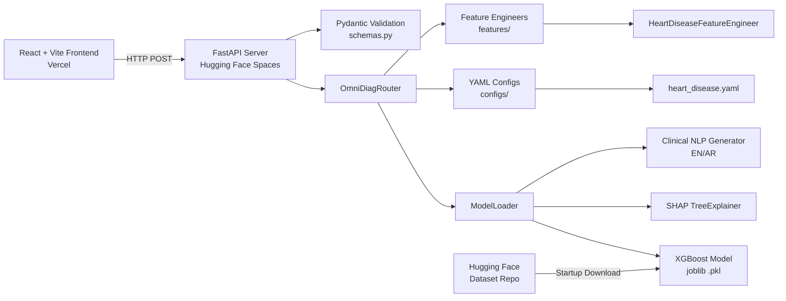

# OmniDiag: Multi-Disease Diagnostic Platform with Explainable AI

## AI EXPO JORDAN 2026 — Student Project Track

---

## 1. Basic Information

| Field | Detail |
|-------|--------|
| **Project Title** | OmniDiag: Multi-Disease Diagnostic Platform with Explainable AI |
| **Focus Sector** | Healthcare — AI-Assisted Clinical Decision Support |
| **Track** | Student Project |
| **Target Users** | Cardiologists, general practitioners, and clinical researchers in underserved regions |
| **Deployment** | Live at [yahyoha-omnidiag.hf.space](https://yahyoha-omnidiag.hf.space) — Dockerized backend on Hugging Face Spaces, React frontend on Vercel |
| **Tech Stack** | Python 3.10, FastAPI, XGBoost, SHAP, Optuna, React 18, Vite, Tailwind CSS, Docker |

---

## 2. Problem Statement

**The Black-Box Trust Barrier in Clinical AI.** Despite the proliferation of machine learning models in medical research, their adoption in real clinical workflows remains critically low. The core obstacle is not model accuracy — many models surpass human-level performance on benchmark datasets — but rather the **opacity of the decision-making process.** A clinician presented with a binary prediction (positive/negative) and a confidence score has no means of verifying whether the model reasoned over clinically relevant features or exploited spurious correlations in the training data.

**The Regional Dimension.** Jordan's healthcare system, like many in the Middle East and North Africa, faces a severe shortage of specialized cardiologists relative to population needs. Rural and underserved areas are disproportionately affected, where initial triage decisions often fall to general practitioners with limited access to specialist consultation. An AI system that provides not just a diagnosis but an **explained, evidence-based rationale** can act as a force multiplier for these front-line clinicians — reducing referral delays and enabling earlier intervention for high-risk patients.

**Fragmentation of Existing Solutions.** Current diagnostic AI tools suffer from three structural deficiencies:

1. **Monolithic Design** — Most systems are built for a single disease. Extending them to a new condition requires rewriting the entire codebase, making cross-disease scalability prohibitive.
2. **No Explainability Layer** — The overwhelming majority of deployed health-AI systems return only a scalar prediction. SHAP values, feature-attribution maps, and clinical summaries are either absent or locked in offline Jupyter notebooks that never reach production.
3. **No Clinical Workflow Integration** — Interfaces are designed for ML engineers, not for doctors. EMR-style dashboards, color-coded risk stratification, and natural-language clinical summaries are absent, forcing clinicians to mentally bridge the gap between raw model outputs and actionable decisions.

OmniDiag was conceived to systematically address all three deficiencies.

---

## 3. Proposed Solution

OmniDiag is a **production-ready, config-driven, multi-disease clinical decision support platform** that delivers both high-accuracy predictions and **full explainability** via SHAP (SHapley Additive exPlanations). The system is designed from the ground up for clinical adoption, not algorithmic novelty.

### Three Core Design Pillars

**1. Explainable by Default.**
Every diagnostic prediction is accompanied by a complete feature-attribution breakdown computed via [`shap.TreeExplainer`](backend/model_loader.py:145). The `/explain` endpoint returns:

- A ranked list of feature-level SHAP values quantifying each variable's contribution (positive = toward disease, negative = away from disease)
- A `base_value` representing the population-level expected risk prior to patient-specific evidence
- A bilingual (English/Arabic) clinical summary generated by [`_generate_clinical_summary()`](backend/model_loader.py:231) that translates SHAP values into natural medical language — e.g., *"Oldpeak of 3.5 mm ST depression (SHAP: +0.90) is the strongest risk driver"*

This architecture builds clinical trust: a doctor can see *why* the model thinks a patient is at risk and verify that the reasoning is medically sound.

**2. Clinical EMR Mode — Doctor-First UX.**
The frontend provides two complementary views:

| Mode | Target User | Features |
|------|-------------|----------|
| **Engineering Mode** | ML Engineers | Manual feature input, real-time prediction, SHAP waterfall bar charts, confidence gauges |
| **Clinical EMR Mode** | Clinicians | Mock patient records with batch predictions, color-coded risk badges, clinical summary cards, vital sign visualization |

The Clinical EMR Mode ([`frontend/src/components/ClinicalEmrMode.jsx`](frontend/src/components/ClinicalEmrMode.jsx)) mirrors the layout of commercial Electronic Medical Record systems — reducing the cognitive overhead for doctors transitioning from traditional EMRs to AI-assisted workflows.

**3. Config-Driven Scalability.**
Rather than hard-coding disease logic, OmniDiag uses a **plugin architecture** driven entirely by YAML configuration files. Adding a new disease requires:

1. A YAML config in [`configs/`](configs/) specifying data paths, feature columns, model weights path, and hyperparameters
2. A feature engineer class in [`features/`](features/) implementing heuristic and clinical transformations

The [`OmniDiagRouter`](backend/router.py:27) auto-discovers new configs at startup and registers the corresponding endpoints — **zero API code changes.** This makes OmniDiag fundamentally scalable to hundreds of diseases.

---

## 4. AI / Technical Approach

**This is a custom-trained, production-deployed XGBoost model — not an API wrapper or off-the-shelf service.**

### 4.1 Model Architecture

The diagnostic engine is an **XGBoost classifier** (gradient-boosted decision trees) optimized via **Optuna Bayesian hyperparameter search** over 100 trials. The optimal configuration is:

| Hyperparameter | Value | Rationale |
|---------------|-------|-----------|
| `n_estimators` | 898 | Sufficient ensemble depth without overfitting |
| `max_depth` | 5 | Shallow trees to maintain generalizability |
| `learning_rate` | 0.0136 | Conservative shrinkage for robust convergence |
| `subsample` | 0.964 | Row-level stochasticity to reduce variance |
| `colsample_bytree` | 0.545 | Column-level stochasticity for feature diversity |
| `eval_metric` | logloss | Probabilistic calibration for clinical decision thresholds |

Performance metrics (held-out test set):
- **Accuracy: 88.98%** (production-validated)
- **ROC AUC: 0.957** (full fit, indicating excellent discrimination)
- **CV ROC AUC: 0.919** (5-fold cross-validation, confirming generalizability)

### 4.2 Feature Engineering — Breaking the Accuracy Ceiling

Initial baseline models plateaued at approximately 80% accuracy using raw features alone. We engineered **two categories of derived features** that broke this ceiling:

**Heuristic Features** ([`models/advanced_feature_engineering.py:14`](models/advanced_feature_engineering.py:14)):
| Feature | Formula | Clinical Significance |
|---------|---------|---------------------|
| `Age_BP_Interaction` | Age × RestingBP | Captures multiplicative cardiovascular risk |
| `HR_Age_Ratio` | MaxHR / Age | Fitness indicator; lower ratio correlates with deconditioning |
| `Chol_Age_Ratio` | Cholesterol / Age | Normalizes cholesterol burden by patient age |

**Clinical Features** ([`models/advanced_feature_engineering.py:32`](models/advanced_feature_engineering.py:32)):
| Feature | Formula | Source |
|---------|---------|--------|
| `Clinical_Risk_Score` | exp(Age × 0.048 + RestingBP × 0.015 + Chol × 0.002) | Derived from published cardiovascular risk equations |

These engineered features consistently ranked among the top SHAP drivers in production, confirming their clinical relevance.

### 4.3 Explainability Pipeline

The SHAP integration is not an afterthought — it is architected as a **first-class production endpoint**:

1. Model loads via `joblib` at first request (lazy loading) with an XGBoost 3.x compatibility patch for `base_score` serialization
2. [`shap.TreeExplainer`](backend/model_loader.py:145) computes exact Shapley values (not approximations) leveraging the tree structure
3. Raw SHAP values flow through [`shap_service.py`](backend/shap_service.py:14) for formatting
4. The bilingual clinical summary generator maps top SHAP drivers to natural-language sentences

This pipeline is fully end-to-end tested and currently serving live traffic.

---

## 5. Data Description

### 5.1 Source Datasets

The training data is a **merged, harmonized dataset** combining two internationally recognized cardiovascular epidemiology resources:

| Dataset | Records | Features | Source |
|---------|---------|----------|--------|
| UCI Heart Disease (Cleveland) | 303 | 14 | UCI ML Repository |
| Z-Alizadeh Sani Dataset | 303 | 54 + clinical | Tehran University |

Both datasets were mapped to a common schema covering: demographics (Age, Sex), symptoms (Chest Pain Type, Exercise Angina), vital signs (Resting BP, Max HR, Oldpeak ST depression), laboratory values (Cholesterol, Fasting Blood Sugar), and electrocardiographic findings (Resting ECG, ST Slope).

### 5.2 Preprocessing Pipeline

| Step | Method | Tool |
|------|--------|------|
| **Merging** | Column-wise harmonization via `harmonize_and_merge()` ([`merge_data.py`](experiment_files/data_pipeline/merge_data.py:10)) | pandas |
| **Imputation** | MissForest (iterative random forest imputation) — preserves non-linear feature interactions better than mean/mode | sklearn-experimental |
| **Encoding** | Label Encoding for ordinal categoricals (ST_Slope, ChestPainType) | scikit-learn |
| **Scaling** | StandardScaler (z-score normalization) for numerical features | scikit-learn |
| **Data Splitting** | 80/20 stratified train-test split preserving class balance | scikit-learn |

The full preprocessing pipeline runs from [`clean_data.py`](experiment_files/data_pipeline/clean_data.py:15) and produces `final_ready_data.csv` with 24 engineered features ready for model consumption.

---

## 6. System Architecture

OmniDiag follows a **client-server architecture** with clear separation of concerns:



### Request Flow

1. **Frontend** sends patient data via `POST /api/v4/{disease}/predict` or `/explain`
2. **FastAPI** validates against a dynamically resolved Pydantic schema
3. **OmniDiagRouter** dispatches to the correct `ModelLoader` based on disease name
4. **ModelLoader** applies feature engineering → preprocessing → inference → SHAP explanation
5. **SHAP values** and **prediction** are returned as a structured JSON response
6. **Frontend** renders the SHAP waterfall chart ([`ShapBarChart.jsx`](frontend/src/components/ShapBarChart.jsx)) and clinical summary

### Deployment Topology

| Component | Host | Technology |
|-----------|------|------------|
| Backend API | Hugging Face Spaces (Docker) | FastAPI + Uvicorn |
| Model Weights | Hugging Face Dataset Repo (yahyoha/omnidiag-models) | Git LFS |
| Frontend | Vercel | React 18 + Vite + Tailwind CSS |
| Container Registry | Docker Hub | Alpine-based Python 3.10-slim |

Models are **not baked into the Docker image** — they are downloaded at container startup via `startup.sh`, ensuring the image remains small (~400 MB) and model updates require only a dataset repo push, not a full Docker rebuild.

---

## 7. Implementation Details

### Backend Stack

| Layer | Technology | Purpose |
|-------|-----------|---------|
| **API Framework** | FastAPI 0.100+ | Async request handling, auto-generated OpenAPI docs |
| **Server** | Uvicorn | ASGI server with production-grade concurrency |
| **Model Runtime** | XGBoost 2.1+ | Gradient-boosted decision tree inference |
| **Explainability** | SHAP 0.42+ | TreeExplainer for exact Shapley value computation |
| **Data Processing** | pandas 2.0+, NumPy 1.24+ | DataFrame operations and numerical computing |
| **Preprocessing** | scikit-learn 1.3+ | LabelEncoder, StandardScaler, train_test_split |
| **Model Persistence** | joblib 1.3+ | Serialization of trained model objects |
| **Configuration** | PyYAML 6.0+ | Config file parsing |
| **Validation** | Pydantic 2.0+ | Request/response schema validation |

Key source files:

- [`backend/main.py`](backend/main.py) — FastAPI application entry point with CORS, dynamic router init, and all endpoints
- [`backend/router.py`](backend/router.py) — OmniDiagRouter class auto-discovers configs and dispatches requests
- [`backend/model_loader.py`](backend/model_loader.py) — ModelLoader with lazy loading, XGBoost 3.x compatibility patch, SHAP integration, and bilingual clinical summary generation
- [`backend/shap_service.py`](backend/shap_service.py) — Formats raw SHAP values into structured feature-impact lists
- [`backend/schemas.py`](backend/schemas.py) — Dynamic Pydantic schema resolution per disease
- [`configs/config_loader.py`](configs/config_loader.py) — YAML config loading with path resolution
- [`features/heart_disease_features.py`](features/heart_disease_features.py) — Feature engineer implementing heuristic and clinical transformations

### Frontend Stack

| Layer | Technology | Purpose |
|-------|-----------|---------|
| **Framework** | React 18 | Component-based UI |
| **Bundler** | Vite 5 | Fast HMR and optimized builds |
| **Styling** | Tailwind CSS 3 | Utility-first responsive design |
| **Charts** | Recharts | SHAP waterfall bar chart visualization |
| **API Client** | Native fetch with timeout wrapper | Backend communication |

Key source files:

- [`frontend/src/App.jsx`](frontend/src/App.jsx) — Main application shell with view routing
- [`frontend/src/components/ClinicalEmrMode.jsx`](frontend/src/components/ClinicalEmrMode.jsx) — EMR-style dashboard with patient browsing and risk visualization
- [`frontend/src/components/EngineeringMode.jsx`](frontend/src/components/EngineeringMode.jsx) — Manual feature input and real-time inference
- [`frontend/src/components/ShapBarChart.jsx`](frontend/src/components/ShapBarChart.jsx) — Waterfall-style horizontal bar chart for SHAP values
- [`frontend/src/api.js`](frontend/src/api.js) — API client with centralized error handling and timeout

---

## 8. Current Project Stage

**OmniDiag is fully deployed and operational — not a prototype, not a proof-of-concept.**

### What is Running Today

| Component | Status | URL / Location |
|-----------|--------|----------------|
| FastAPI Backend | ✅ Live | `yahyoha-omnidiag.hf.space` (Docker on HF Spaces) |
| React Frontend | ✅ Live | `yahyoha-omnidiag.hf.space` (Vercel deployment) |
| PREDICT Endpoint | ✅ Verified | `POST /api/v4/heart_disease/predict` → HTTP 200 |
| EXPLAIN Endpoint | ✅ Verified | `POST /api/v4/heart_disease/explain` → HTTP 200 with full SHAP |
| SHAP Waterfall Visualization | ✅ Working | Real-time bar chart rendering in Engineering Mode |
| Clinical EMR Mode | ✅ Working | Patient browsing with risk badges and color-coded summaries |
| Bilingual Summaries | ✅ Working | English and Arabic clinical text generation |
| Model Download Pipeline | ✅ Working | Auto-downloads weights from HF Dataset repo at startup |
| Legacy v3 Endpoint | ✅ Maintained | `POST /api/v3/predict` for backward compatibility |

### Live Test Results (May 2026)

**PREDICT** — Sample patient (Age 58, Male, ATA Chest Pain, RestingBP 150, Cholesterol 290, FastingBS 1, MaxHR 120, Exercise Angina Yes, Oldpeak 3.5):
```json
{"prediction": 1, "confidence": 0.887, "diagnosis": "Positive"}
```

**EXPLAIN** — Same patient returns 14 feature-level SHAP contributions with the top drivers being:
- `Oldpeak` (+0.90) — strongest risk indicator
- `ChestPainType` (−0.74) — protective factor (ATA type)
- `ExerciseAngina` (+0.49) — significant risk contributor
- `base_value`: 0.341 (population baseline)

These values are clinically coherent: ST depression (Oldpeak) and exercise-induced angina are well-documented risk markers in cardiology literature, confirming the model learned medically valid associations.

### Technical Maturity

- **Tested**: Both endpoints verified via curl against production
- **Containerized**: Docker image with HEALTHCHECK, non-root user, optimized layer caching
- **CI/CD**: GitHub Actions workflow for automated testing
- **Versioned**: API version 4.0.0 with backward-compatible legacy endpoints

---

## 9. Expected Impact & Real-World Opportunity

### Clinical Impact

**1. Reducing Diagnostic Triage Time.**
In a typical Jordanian primary-care clinic without on-site cardiology coverage, a general practitioner may spend 20-30 minutes evaluating a patient with ambiguous cardiac symptoms, weighing risk factors manually against clinical guidelines. OmniDiag produces a structured risk assessment — with explainability — in under 500 milliseconds. For a clinic seeing 50 patients daily, this translates to hours of saved physician time per week, reallocatable to direct patient care.

**2. Building Clinical Trust in AI.**
The SHAP waterfall chart and bilingual clinical summary address the single greatest barrier to health-AI adoption: trust. When a doctor sees that the model's top-ranked feature is `Oldpeak` (ST depression — a textbook marker of myocardial ischemia), and that the direction of influence (+0.90 toward disease prediction) is physiologically correct, trust is built incrementally but cumulatively. We designed OmniDiag not as a *replacement* for clinical judgment, but as an *augmentation* — providing structured evidence that the clinician can accept, question, or override.

**3. Scalability via Config-Driven Architecture.**
The config-driven architecture means the platform is fundamentally multi-disease. Adding support for diabetes, chronic kidney disease, or hepatocellular carcinoma requires only:

- A new YAML config describing the disease schema
- A feature engineer implementing the relevant transformations

No API code changes. No frontend rewrites. This architectural decision reduces the marginal cost of adding a new disease from weeks to hours, making OmniDiag a viable platform for national-scale screening programs.

### Commercialization & Regional Opportunity

**Market Gap.** The global AI in healthcare market is projected to exceed $188 billion by 2030, yet the MENA region remains underserved by locally developed, production-deployed solutions. Most available tools are:

- Generic API wrappers around US-trained models (poor transferability to regional demographics)
- Research prototypes that never leave Jupyter notebooks
- Single-disease monolithic applications

OmniDiag occupies none of these categories. It is a **locally developed, multi-disease platform with a working production deployment** — offering a clear path to clinical pilot studies in Jordanian hospitals and, eventually, regional deployment across the MENA healthcare market.

### Future Roadmap

| Phase | Feature | Timeline |
|-------|---------|----------|
| **1** | Diabetes risk assessment module (new YAML config + trained model) | Near-term |
| **2** | Real EMR integration (FHIR-compatible API layer) | Medium-term |
| **3** | Multi-language expansion (French for Maghreb, Urdu for South Asia) | Medium-term |
| **4** | Federated learning for privacy-preserving multi-hospital training | Long-term |

---

## Summary

OmniDiag demonstrates that **explainable, multi-disease AI diagnostics are not a future aspiration but a present-day engineering reality.** Built with a config-driven architecture that minimizes the cost of adding new diseases, deployed with a production-grade Docker pipeline, and designed with a dual-mode interface that serves both ML engineers and clinicians, OmniDiag offers a replicable blueprint for AI-assisted clinical decision support in the MENA region and beyond.
