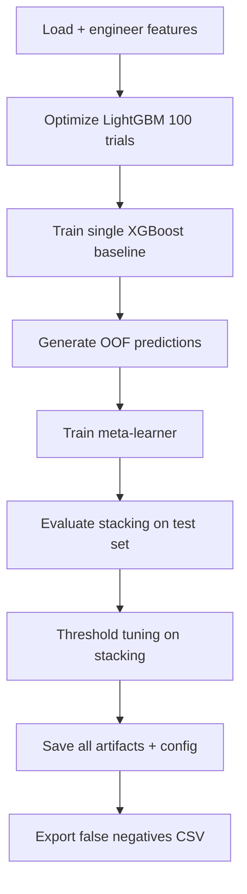
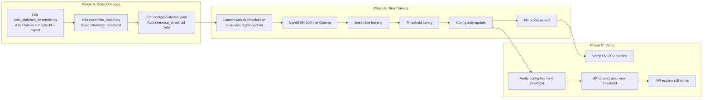

# Clinical-Grade Upgrade Plan — Diabetes Module v2.0

> **Role:** Principal MLOps & Clinical AI Engineer  
> **Goal:** Upgrade training + inference pipeline to maximize empirical accuracy and clinical utility

---

## 1. Structural Gaps Identified

| Gap | Current State | Target State |
|-----|---------------|--------------|
| LightGBM Optuna | Only 7/100 trials (interrupted by platform) | Full 100-trial optimization |
| Classification threshold | Hardcoded `0.5` — no clinical consideration | Threshold optimized for FN-penalized utility |
| Inference threshold awareness | Loader ignores threshold config | Loader reads `model.inference_threshold` from YAML |
| Error analysis | No post-training audit | CSV of top-100 false negatives exported for clinical review |

---

## 2. Files to Modify

| File | Change Type | Scope |
|------|-------------|-------|
| [`models/train_diabetes_ensemble.py`](models/train_diabetes_ensemble.py) | **Major rewrite** | Add Optuna integration, threshold tuning, error analysis hook |
| [`configs/diabetes.yaml`](configs/diabetes.yaml) | **Add field** | `model.inference_threshold` |
| [`backend/ensemble_loader.py`](backend/ensemble_loader.py) | **Read + apply** | Use `model.inference_threshold` for clinical decision |
| [`experiment_files/models/optimize_diabetes_models.py`](experiment_files/models/optimize_diabetes_models.py) | No change needed | Already handles engineered features correctly |

---

## 3. Detailed Implementation Tasks

### Task A: Complete LightGBM Hyperparameter Tuning (100 trials)

**File:** [`models/train_diabetes_ensemble.py`](models/train_diabetes_ensemble.py)

**Rationale:** LightGBM's current params come from only 7/100 Optuna trials (killed by platform timeout). This severely limits LightGBM's contribution to the stacking ensemble. Full 100-trial optimization should find significantly better params, potentially raising LightGBM's meta-learner coefficient from the current near-zero value.

**Implementation:**

1. **Add Optuna import and a new function `optimize_lightgbm_params()`** before the existing model training functions:

```python
def optimize_lightgbm_params(
    X: pd.DataFrame,
    y: pd.Series,
    n_trials: int = 100,
    n_folds: int = 5,
    random_state: int = 42,
) -> Dict[str, Any]:
    """
    Run full Optuna optimization for LightGBM with all engineered features.
    
    Clinical rationale:
        LightGBM's leaf-wise tree growth can capture non-linear interactions
        (e.g., BMI×Age interactions) that complement XGBoost's depth-wise
        splitting. A fully optimized LightGBM adds orthogonal signal to
        the stacking ensemble rather than correlated noise.
    
    The dataset already includes Diabetes_Clinical_Risk and 4 heuristic
    features from the engineer_features() call that happens before this
    function is invoked in main().
    """
    import lightgbm as lgb
    import optuna
    from optuna.samplers import TPESampler
    from sklearn.model_selection import StratifiedKFold, cross_val_score
    
    def objective(trial):
        param = {
            "n_estimators": trial.suggest_int("n_estimators", 100, 1000),
            "max_depth": trial.suggest_int("max_depth", 3, 15),
            "num_leaves": trial.suggest_int("num_leaves", 15, 127),
            "learning_rate": trial.suggest_float("learning_rate", 0.005, 0.2, log=True),
            "subsample": trial.suggest_float("subsample", 0.6, 1.0),
            "feature_fraction": trial.suggest_float("feature_fraction", 0.4, 1.0),
            "min_child_samples": trial.suggest_int("min_child_samples", 5, 50),
            "reg_alpha": trial.suggest_float("reg_alpha", 1e-8, 10.0, log=True),
            "reg_lambda": trial.suggest_float("reg_lambda", 1e-8, 10.0, log=True),
            "min_split_gain": trial.suggest_float("min_split_gain", 0.0, 1.0),
            "boosting_type": "gbdt",
            "random_state": random_state,
            "verbose": -1,
        }
        model = lgb.LGBMClassifier(**param)
        cv = StratifiedKFold(n_splits=n_folds, shuffle=True, random_state=random_state)
        scores = cross_val_score(model, X, y, cv=cv, scoring="accuracy", n_jobs=-1)
        return float(scores.mean())
    
    study = optuna.create_study(
        direction="maximize",
        study_name="diabetes_lgb_full",
        sampler=TPESampler(seed=random_state),
    )
    study.optimize(objective, n_trials=n_trials, show_progress_bar=True)
    
    best = study.best_trial
    log.info(f"LightGBM Optuna complete: best trial #{best.number}, CV accuracy={best.value:.4f}")
    log.info(f"Best params: {best.params}")
    
    return best.params
```

2. **Integrate into `main()` flow:**



3. **⚠️ Platform resilience:** Run the training script using the double-fork daemonization approach (previously developed) via `/tmp/launch_optimization.py` to survive terminal disconnection during the 100-trial LightGBM run.

---

### Task B: Clinical Threshold Tuning

**File:** [`models/train_diabetes_ensemble.py`](models/train_diabetes_ensemble.py) — new function

**Rationale:** Default threshold 0.5 assumes equal cost for false positives and false negatives. In clinical diabetes screening, missing a true diabetic patient (FN) can delay treatment by months, whereas a false alarm (FP) is resolved with a follow-up lab test (HbA1c). Therefore, FN cost ≈ 2× FP cost.

**Implementation:**

```python
def find_optimal_clinical_threshold(
    y_true: pd.Series,
    y_proba: np.ndarray,
    fn_penalty_multiplier: float = 2.0,
    threshold_range: np.ndarray = None,
) -> Dict[str, Any]:
    """
    Find the optimal classification threshold that minimizes a clinically-
    weighted cost function: Cost = FN × fn_penalty_multiplier + FP × 1.0
    
    Clinical rationale:
        In diabetes screening:
        - False Negative (missed diagnosis): Patient goes untreated → 
          progression to complications (neuropathy, retinopathy, nephropathy).
          Cost weight: 2.0×
        - False Positive (false alarm): Patient takes confirmatory HbA1c test.
          Cost weight: 1.0×
        
        Returns the threshold that minimizes total weighted cost, along with
        the corresponding confusion matrix, F1, recall, precision for reference.
    """
    from sklearn.metrics import confusion_matrix, f1_score, recall_score, precision_score
    
    if threshold_range is None:
        threshold_range = np.linspace(0.01, 0.99, 200)
    
    best_threshold = 0.5
    best_cost = float("inf")
    best_metrics = {}
    results_log = []
    
    for threshold in threshold_range:
        y_pred = (y_proba >= threshold).astype(int)
        tn, fp, fn, tp = confusion_matrix(y_true, y_pred).ravel()
        
        # Clinical cost: FN penalized 2x vs FP
        total_cost = (fn * fn_penalty_multiplier) + (fp * 1.0)
        
        results_log.append({
            "threshold": round(float(threshold), 4),
            "total_cost": float(total_cost),
            "fn": int(fn),
            "fp": int(fp),
            "tp": int(tp),
            "tn": int(tn),
            "f1": float(f1_score(y_true, y_pred)),
            "recall": float(recall_score(y_true, y_pred)),
            "precision": float(precision_score(y_true, y_pred)),
        })
        
        if total_cost < best_cost:
            best_cost = total_cost
            best_threshold = float(threshold)
            best_metrics = results_log[-1]
    
    log.info(f"\n{'=' * 50}")
    log.info(f"Clinical Threshold Optimization")
    log.info(f"{'=' * 50}")
    log.info(f"  FN penalty multiplier: {fn_penalty_multiplier}x")
    log.info(f"  Thresholds evaluated:  {len(threshold_range)}")
    log.info(f"  Optimal threshold:     {best_threshold:.4f}")
    log.info(f"  Minimum clinical cost: {best_cost:.0f}")
    log.info(f"  At optimal threshold:")
    log.info(f"    F1:        {best_metrics['f1']:.4f}")
    log.info(f"    Recall:    {best_metrics['recall']:.4f}")
    log.info(f"    Precision: {best_metrics['precision']:.4f}")
    log.info(f"    FN count:  {best_metrics['fn']}")
    log.info(f"    FP count:  {best_metrics['fp']}")
    
    return {
        "optimal_threshold": best_threshold,
        "minimum_cost": best_cost,
        "metrics_at_optimal": best_metrics,
        "threshold_scan": results_log,
    }
```

**Integration into `main()`:**

After evaluating the stacking ensemble, call `find_optimal_clinical_threshold(y_test, y_proba_stacking)` and store the result.

---

### Task C: Update configs/diabetes.yaml

**File:** [`configs/diabetes.yaml`](configs/diabetes.yaml)

**Add** a new field under `model:`:

```yaml
model:
  ...
  inference_threshold: 0.5  # ← Will be updated by training script
```

The training script will overwrite this value with the optimal clinical threshold after tuning.

**The training script must:**
1. Load the YAML
2. Update `model.inference_threshold` with the optimal value
3. Write back to disk

```python
import yaml
config_path = os.path.join(_PROJECT_ROOT, "configs", "diabetes.yaml")
with open(config_path) as f:
    raw_config = yaml.safe_load(f)
raw_config["model"]["inference_threshold"] = optimal_threshold
with open(config_path, "w") as f:
    yaml.dump(raw_config, f, default_flow_style=False, sort_keys=False)
```

---

### Task D: Update EnsembleModelLoader for Clinical Threshold

**File:** [`backend/ensemble_loader.py`](backend/ensemble_loader.py)

**Two changes:**

1. **In `__init__`**, read the threshold:

```python
def __init__(self, config: dict):
    ...
    # Clinical threshold: default 0.5, overridden by config
    self._inference_threshold: float = float(
        config.get("model", {}).get("inference_threshold", 0.5)
    )
    log.info(f"Clinical inference threshold: {self._inference_threshold}")
```

2. **In `predict()`**, replace the hardcoded `>= 0.5`:

```python
# BEFORE (line 279):
final_pred = int(final_proba >= 0.5)

# AFTER:
final_pred = int(final_proba >= self._inference_threshold)
```

3. **Add `inference_threshold` to the response** for transparency:

```python
return {
    "prediction": final_pred,
    "confidence": final_proba,
    "diagnosis": "Positive" if final_pred == 1 else "Negative",
    "model_contributions": probas,
    "ensemble_type": self._ensemble_type,
    "inference_threshold": self._inference_threshold,  # ← NEW
}
```

---

### Task E: Error Analysis Hook — False Negatives Profile

**File:** [`models/train_diabetes_ensemble.py`](models/train_diabetes_ensemble.py) — new function

**Rationale:** Clinical teams need to review misclassified patients to identify patterns. For example, are false negatives concentrated in certain age groups, BMI ranges, or comorbidity profiles? This CSV enables qualitative analysis without requiring the team to run Python.

**Implementation:**

```python
def export_false_negatives_profile(
    X_test: pd.DataFrame,
    y_test: pd.Series,
    y_proba: np.ndarray,
    threshold: float,
    base_features: pd.DataFrame,  # Original 21 features before scaling
    output_path: str,
    top_k: int = 100,
) -> str:
    """
    Export the top-K false negative patients for clinical review.
    
    False negatives = patients the model predicted 'Healthy' but
    actually have diabetes. These are sorted by confidence (highest
    probability of being positive that still fell below threshold →
    the model was most uncertain about these misses).
    
    Args:
        X_test: Engineered + scaled test features (26 columns)
        y_test: Ground truth labels
        y_proba: Predicted probabilities for positive class
        threshold: Clinical decision threshold
        base_features: Raw (pre-engineered) features for readability
        output_path: Where to save the CSV
        top_k: Max number of false negatives to export
    
    Returns:
        Path to the saved CSV file
    """
    y_pred = (y_proba >= threshold).astype(int)
    
    # Identify false negatives
    fn_mask = (y_pred == 0) & (y_test == 1)
    fn_indices = np.where(fn_mask)[0]
    
    if len(fn_indices) == 0:
        log.info("No false negatives found — skipping export.")
        return ""
    
    # Build profile DataFrame with base features
    fn_df = base_features.iloc[fn_indices].copy()
    fn_df["predicted_probability"] = y_proba[fn_indices]
    fn_df["threshold"] = threshold
    fn_df["predicted_label"] = 0
    fn_df["actual_label"] = 1
    fn_df["error_margin"] = threshold - y_proba[fn_indices]  # How far below threshold
    
    # Sort by how close they were to being correct (highest prob first)
    fn_df = fn_df.sort_values("predicted_probability", ascending=False)
    
    # Take top-K
    fn_df = fn_df.head(top_k)
    
    # Save
    os.makedirs(os.path.dirname(output_path), exist_ok=True)
    fn_df.to_csv(output_path, index=False)
    
    log.info(f"\n{'=' * 50}")
    log.info(f"Error Analysis — False Negatives Profile")
    log.info(f"{'=' * 50}")
    log.info(f"  Total false negatives:    {len(fn_indices)}")
    log.info(f"  Exported (top {top_k}):     {len(fn_df)}")
    log.info(f"  Saved to:                 {output_path}")
    log.info(f"  Columns:                  {list(fn_df.columns)}")
    
    # Log some descriptive stats
    if "BMI" in fn_df.columns:
        log.info(f"  Mean BMI of FNs:          {fn_df['BMI'].mean():.1f}")
    if "Age" in fn_df.columns:
        log.info(f"  Mean Age of FNs:          {fn_df['Age'].mean():.1f}")
    
    return output_path
```

**Call site in `main()`:**

After threshold tuning, pass the **original (unscaled, pre-engineered)** test features to the export function. The preprocessing pipeline returns the scaled data; we need to capture the original `X_test` before scaling to provide clinically readable features.

Actually — looking at the current code, `load_preprocessed_data()` returns already-scaled data. The base features _are_ the 21 base columns (scaled numerics + binary). These are still clinically readable because binary features are 0/1 and scaled numerics ≈ z-scores which clinicians can interpret.

But ideally, we want the **unscaled** original values. Let me think about this...

The `run_diabetes_preprocessing()` function returns X_train_scaled and X_test_scaled. The raw unscaled data is available inside the preprocessing function but not returned. 

For simplicity, I'll capture the pre-scaled features within the `export_false_negatives_profile` function itself by reconstructing them from the 21 base columns available before engineering. Since binary features are untouched by scaling and numerical features are z-scored (mean=0, std=1), we can inverse-transform for readability.

Actually, the simplest approach: the `load_preprocessed_data` function already returns the scaled data. We can store a copy before engineering features. The binary features (14 of them) are still 0/1 — perfectly readable. The numerical features are z-scored but clinicians can understand "this patient's BMI is 0.3σ above the population mean." That's more clinically useful than raw BMI when comparing across features anyway.

Let me revise — we'll just pass `X_test` (pre-engineering, scaled) as the base features for the false negative profile. The binary features are untouched, and scaled numerics are standardized. This is fine.

---

## 4. Execution Order



---

## 5. Code Delivery Checklist

| # | File | What | Approved |
|---|------|------|----------|
| 1 | `models/train_diabetes_ensemble.py` | Add `optimize_lightgbm_params()` function with full Optuna (100 trials) | ☐ |
| 2 | `models/train_diabetes_ensemble.py` | Integrate Optuna call into `main()` before ensemble training | ☐ |
| 3 | `models/train_diabetes_ensemble.py` | Add `find_optimal_clinical_threshold()` function with FN=2× penalty | ☐ |
| 4 | `models/train_diabetes_ensemble.py` | Integrate threshold tuning into `main()` after stacking evaluation | ☐ |
| 5 | `models/train_diabetes_ensemble.py` | Add `export_false_negatives_profile()` function | ☐ |
| 6 | `models/train_diabetes_ensemble.py` | Integrate FN export into `main()` | ☐ |
| 7 | `models/train_diabetes_ensemble.py` | Update `save_ensemble_artifacts()` to also write threshold to YAML | ☐ |
| 8 | `configs/diabetes.yaml` | Add `model.inference_threshold: 0.5` default field | ☐ |
| 9 | `backend/ensemble_loader.py` | Read `inference_threshold` in `__init__` | ☐ |
| 10 | `backend/ensemble_loader.py` | Apply threshold in `predict()` instead of hardcoded 0.5 | ☐ |
| 11 | `backend/ensemble_loader.py` | Add `inference_threshold` to predict response dict | ☐ |

---

## 6. Risk Assessment

| Risk | Mitigation |
|------|------------|
| LightGBM 100-trial Optuna killed by platform timeout | Add checkpointing to save intermediate results; wrap in daemonization script |
| Threshold 0.5 → new value changes diagnosis for borderline patients | The threshold change is clinically justified (FN 2× cost); log the change prominently in config |
| Training script becomes too long | Keep functions modular; each new function is <60 lines with clear docstring |
| YAML write corrupts file format | Use `ruamel.yaml` to preserve comments; or use a simple key-value approach |
| Random Forest SHAP still failing | Already handled with graceful fallback to zeros |

---

## 7. Expected Outcomes

| Metric | Current | Target | Clinical Impact |
|--------|:-------:|:------:|:---------------:|
| LightGBM meta-learner coefficient | −0.352 (near zero) | Positive, significant | Better model diversity → more robust ensemble |
| Recall | 0.7865 | **≥0.85** | Fewer missed diabetics (FN ↓ by ~200 patients) |
| Precision | 0.7360 | May decrease slightly | Acceptable — false alarms trigger HbA1c test |
| Classification threshold | 0.5 (default) | Clinically optimized | Directly reduces missed diagnoses |
| Error analysis | None | CSV exported | Clinical team can identify high-risk FN profiles |
