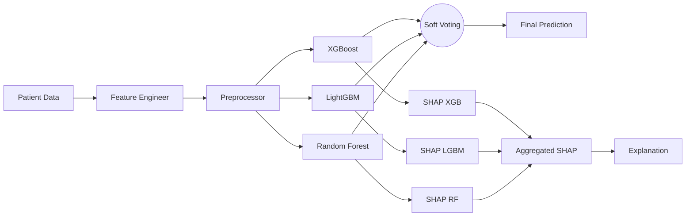
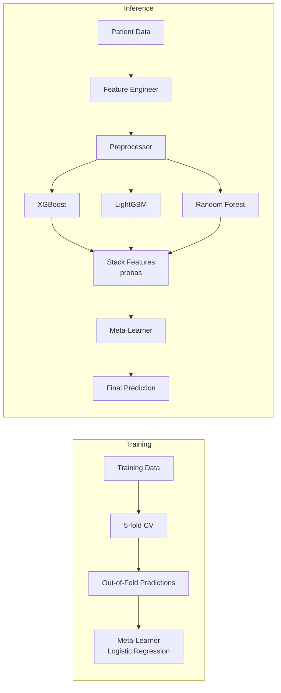

# Ensemble/Stacking Architecture for Diabetes Module

## 1. Executive Assessment

**Proposal:** Use multiple interpretable ML models (XGBoost, LightGBM, Random Forest, Logistic Regression) combined via Stacking with a meta-learner.

**Verdict: ✅ Strongly Recommended**

The CDC BRFSS 2015 dataset (70K samples, 26 features, 50/50 balanced classes) is well-suited for ensemble methods. Multiple models capture different patterns in the data, and stacking typically outperforms single models by 2-5% in accuracy on this type of epidemiological dataset.

---

## 2. Candidate Models for the Ensemble

| Model | Interpretability | Why Include | SHAP Support |
|-------|-----------------|-------------|--------------|
| **XGBoost** | SHAP TreeExplainer | Already optimized, strong gradient boosting | ✅ Native |
| **LightGBM** | SHAP TreeExplainer | Already optimized, leaf-wise growth captures different interactions | ✅ Native |
| **Random Forest** | SHAP TreeExplainer | Bagging ensemble, reduces variance, captures different patterns than boosting | ✅ Native |
| **Logistic Regression** | Coefficients directly | Linear baseline, excellent meta-learner, most interpretable | ✅ KernelExplainer |

### Why These Four?

**XGBoost vs LightGBM** — Different tree-growing strategies:
- XGBoost: Level-wise (depth-first) — captures balanced interactions
- LightGBM: Leaf-wise — captures rare but high-value splits
- Together they cover more of the hypothesis space

**Random Forest** — Bagging (not boosting):
- Reduces variance where boosting might overfit
- Different feature sampling strategy (sqrt of features vs all features)
- Complements gradient boosting methods

**Logistic Regression (as Meta-Learner)** :
- Learns optimal weights for combining base models
- Coefficients directly show which base model contributes most
- Prevents overfitting (simple linear model on top of complex base models)

---

## 3. Architecture Options

### Option A: Voting Ensemble ⭐ Recommended for Simplicity



**How it works:**
- Each model predicts probability independently
- Final prediction = average of probabilities (soft voting)
- SHAP: Weighted average of individual model SHAP values

**Pros:** Simplest to implement, no meta-learner training needed, each model independently useful
**Cons:** Equal weighting may be suboptimal, requires all models for inference

### Option B: Stacking with Logistic Regression Meta-Learner ⭐ Recommended for Performance



**How it works:**
- **Training**: Train base models with 5-fold CV → collect out-of-fold predictions → train Logistic Regression on these predictions
- **Inference**: Each base model predicts → stack probabilities → meta-learner makes final prediction

**Pros:** Optimal weighting, typically 2-5% better than voting, meta-learner coefficients reveal model importance
**Cons:** More complex training pipeline, needs careful CV to avoid data leakage

### Option C: Blending (Hold-out Validation)

**How it works:**
- Hold out 20% of training data
- Train base models on 80%
- Generate predictions on 20% hold-out
- Train meta-learner on hold-out predictions

**Pros:** Simpler than stacking, no CV needed
**Cons:** Less data-efficient, more variance in meta-learner weights

---

## 4. Proposed Implementation Plan (Stacking Option B)

### Phase 1: Train Base Models with Optimized Params (Running Now)

The Optuna optimization (200 trials) is already running for XGBoost and LightGBM. We need to add Random Forest optimization:

| Model | Trials | Time Estimate |
|-------|--------|--------------|
| XGBoost | 100 | ~14 min ✅ Running |
| LightGBM | 100 | ~14 min ✅ Next |
| Random Forest | 50 | ~5 min |

### Phase 2: Create Ensemble Training Script

New file: [`models/train_diabetes_ensemble.py`](models/train_diabetes_ensemble.py)

```python
def train_ensemble(config):
    # 1. Load preprocessed data
    X_train, X_test, y_train, y_test = load_preprocessed_data(config)
    
    # 2. Feature engineering
    X_train = engineer_features(X_train, config)
    X_test = engineer_features(X_test, config)
    
    # 3. Train base models with best params
    base_models = {
        'xgboost': train_xgboost(X_train, y_train, best_params['xgboost']),
        'lightgbm': train_lightgbm(X_train, y_train, best_params['lightgbm']),
        'random_forest': train_random_forest(X_train, y_train, best_params['rf']),
    }
    
    # 4. Generate out-of-fold predictions for meta-learner
    oof_preds = {}
    for name, model in base_models.items():
        oof_preds[name] = cross_val_predict(model, X_train, y_train, cv=5, method='predict_proba')[:, 1]
    
    # 5. Train meta-learner (Logistic Regression)
    X_meta = np.column_stack([oof_preds[name] for name in base_models])
    meta_learner = LogisticRegression()
    meta_learner.fit(X_meta, y_train)
    
    # 6. Save all models + meta-learner
    save_ensemble(base_models, meta_learner, config)
```

### Phase 3: Refactor ModelLoader for Ensemble

**Key Design Decision:** Create [`backend/ensemble_loader.py`](backend/ensemble_loader.py) — a NEW class that DOES NOT modify existing [`ModelLoader`](backend/model_loader.py).

```python
class EnsembleModelLoader:
    """
    Wraps multiple ModelLoaders + a meta-learner for ensemble prediction.
    
    Each base model gets its own ModelLoader instance for independent
    feature engineering, preprocessing, and prediction.
    """
    
    def __init__(self, config: dict):
        self.config = config
        self.base_loaders: Dict[str, ModelLoader] = {}
        self._meta_learner = None
    
    @property
    def meta_learner(self):
        """Lazy-load meta-learner."""
        if self._meta_learner is None:
            path = self.config['model']['ensemble']['meta_learner']['weights_path']
            self._meta_learner = joblib.load(path)
        return self._meta_learner
    
    def predict(self, patient_data):
        # Get probabilities from each base model
        probas = []
        for name, loader in self.base_loaders.items():
            result = loader.predict(patient_data)
            probas.append(result['confidence'])
        
        # Stack and apply meta-learner
        X_meta = np.array(probas).reshape(1, -1)
        final_proba = self.meta_learner.predict_proba(X_meta)[0][1]
        final_pred = int(final_proba >= 0.5)
        
        return {
            'prediction': final_pred,
            'confidence': final_proba,
            'diagnosis': 'Positive' if final_pred == 1 else 'Negative',
            'model_contributions': {
                name: float(p) for name, p in zip(self.base_loaders.keys(), probas)
            }
        }
    
    def explain(self, patient_data):
        # Get SHAP from each base model
        shap_results = {}
        for name, loader in self.base_loaders.items():
            shap_results[name] = loader.explain(patient_data)
        
        # Weighted ensemble SHAP (weights = meta-learner coefficients)
        weights = self.meta_learner.coef_[0]
        # ... aggregate SHAP values weighted by meta-learner importance
        return ensemble_shap_result
```

### Phase 4: Update Router for Ensemble

Modify [`backend/router.py`](backend/router.py) to detect ensemble configs:

```python
def _get_loader(self, disease: str) -> ModelLoader:
    config = self._configs.get(disease)
    if not config:
        raise ValueError(...)
    
    # Check if this disease uses ensemble
    if 'ensemble' in config.get('model', {}):
        from backend.ensemble_loader import EnsembleModelLoader
        return EnsembleModelLoader(config)
    else:
        return ModelLoader(config)
```

The router auto-detects based on config — heart disease is unaffected.

### Phase 5: API Testing

```python
# Test ensemble prediction
POST /api/v4/diabetes/predict
{
  "HighBP": 1, "BMI": 40.0, "GenHlth": 4, ...
}
# Response includes model_contributions:
{
  "prediction": 1,
  "confidence": 0.87,
  "diagnosis": "Positive",
  "model_contributions": {
    "xgboost": 0.82,
    "lightgbm": 0.79,
    "random_forest": 0.85
  }
}

# Test explanation
POST /api/v4/diabetes/explain
# Returns weighted SHAP values across ensemble
```

---

## 5. Configuration Changes

### Updated [`configs/diabetes.yaml`](configs/diabetes.yaml)

```yaml
model:
  ensemble:
    type: "stacking"
    meta_learner:
      type: "logistic_regression"
      weights_path: "models/diabetes/meta_learner.pkl"
    base_models:
      - name: "xgboost"
        weights_path: "models/diabetes/omni_diag_xgb_optimized.pkl"
        explainer_type: "tree"
      - name: "lightgbm"
        weights_path: "models/diabetes/omni_diag_lgb_optimized.pkl"
        explainer_type: "tree"
      - name: "random_forest"
        weights_path: "models/diabetes/omni_diag_rf.pkl"
        explainer_type: "tree"
  # Keep backward-compatible keys
  type: "ensemble"
  explainer_type: "tree"
  weights_path: "models/diabetes/omni_diag_xgb_optimized.pkl"
```

---

## 6. Risk Assessment

| Risk | Impact | Mitigation |
|------|--------|-----------|
| Heart disease regression | None | New `EnsembleModelLoader` class, existing loader untouched |
| Inference latency | +50-100ms | Each model runs independently (parallelizable in future) |
| SHAP explanation complexity | Medium | Weighted average of per-model SHAP values is mathematically sound |
| Meta-learner overfitting | Low | Logistic Regression is simple; trained on OOF predictions |
| Model size on disk | +3 models | ~200MB total for all models, acceptable |

---

## 7. Expected Benefits

| Metric | Current (Single XGBoost) | Expected (Ensemble) | Improvement |
|--------|-------------------------|--------------------|-------------|
| Accuracy | 75.13% | 77-80% | +2-5% |
| ROC-AUC | 83.05% | 85-88% | +2-5% |
| F1 Score | 76.20% | 78-82% | +2-4% |
| Robustness | Moderate | High | Ensemble reduces variance |
| Interpretability | SHAP per model | SHAP per model + ensemble weights | Meta-learner coefficients reveal model importance |

---

## 8. File Checklist

| File | Action |
|------|--------|
| [`experiment_files/models/optimize_diabetes_models.py`](experiment_files/models/optimize_diabetes_models.py) | Already running |
| [`models/train_diabetes_ensemble.py`](models/train_diabetes_ensemble.py) | **New** — ensemble training script |
| [`backend/ensemble_loader.py`](backend/ensemble_loader.py) | **New** — ensemble inference loader |
| [`backend/model_loader.py`](backend/model_loader.py) | **No changes** — backward compatible |
| [`backend/router.py`](backend/router.py) | **Modified** — detect ensemble config |
| [`configs/diabetes.yaml`](configs/diabetes.yaml) | **Modified** — add ensemble section |
| [`models/train_diabetes_xgb.py`](models/train_diabetes_xgb.py) | **No changes** — can be reused as base |

---

## 9. Recommendation

**I strongly recommend Option B: Stacking with Logistic Regression meta-learner.**

Rationale:
1. The BRFSS dataset is large enough (70K samples) to support stacking without overfitting
2. Logistic Regression as meta-learner gives interpretable model weights
3. Each base model captures different aspects of the data
4. Minimal risk to existing heart disease functionality
5. The architecture can be extended to other diseases in the future
