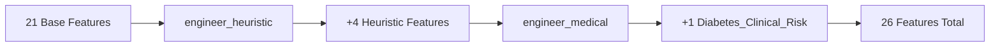
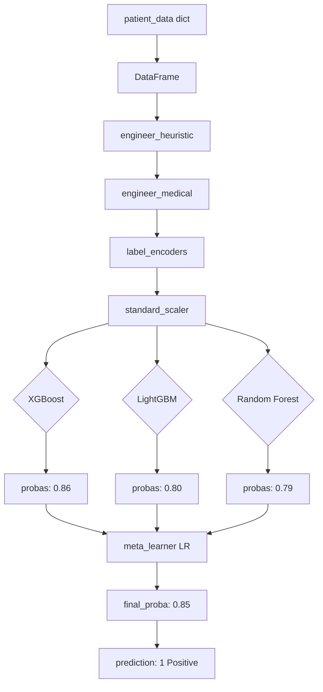

# OmniDiag Diabetes Module — Complete Documentation

> **Version:** 1.1.0 | **Dataset:** CDC BRFSS 2015 Diabetes Health Indicators  
> **Architecture:** Stacking Ensemble (XGBoost + LightGBM + Random Forest → Logistic Regression)

---

## Table of Contents

1. [Overview](#1-overview)
2. [Dataset](#2-dataset)
3. [Architecture](#3-architecture)
4. [Feature Engineering](#4-feature-engineering)
5. [Model Training](#5-model-training)
6. [Model Comparison](#6-model-comparison)
7. [Inference Pipeline](#7-inference-pipeline)
8. [API Integration](#8-api-integration)
9. [File Reference](#9-file-reference)
10. [Future Improvements](#10-future-improvements)

---

## 1. Overview

The OmniDiag Diabetes Module predicts diabetes risk using 21 clinical features from the CDC BRFSS 2015 survey. It uses a **stacking ensemble** of tree-based models with a Logistic Regression meta-learner, integrated into the OmniDiag multi-disease diagnostic platform.

**Key Design Principles:**
- Zero changes to the existing heart disease module
- Config-driven architecture (YAML → auto-discovery → loader)
- Lazy-loaded models for fast API startup
- SHAP explanations for interpretability

---

## 2. Dataset

**Source:** CDC Behavioral Risk Factor Surveillance System (BRFSS) 2015  
**File:** [`diabetes_binary_5050split_health_indicators_BRFSS2015.csv`](diabetes_binary_5050split_health_indicators_BRFSS2015.csv)  
**Samples:** 70,692 rows (35,346 positive / 35,346 negative — perfectly balanced)

### Features (21 total)

| Category | Features | Count |
|----------|----------|-------|
| **Binary** | HighBP, HighChol, CholCheck, Smoker, Stroke, HeartDiseaseorAttack, PhysActivity, Fruits, Veggies, HvyAlcoholConsump, AnyHealthcare, NoDocbcCost, DiffWalk, Sex | 14 |
| **Numerical** | BMI, MentHlth, PhysHlth, GenHlth, Age, Education, Income | 7 |
| **Target** | Diabetes_binary (0 = No diabetes, 1 = Diabetes/prediabetes) | 1 |

### Preprocessing

The preprocessing pipeline is defined in [`experiment_files/data_pipeline/preprocess_diabetes.py`](experiment_files/data_pipeline/preprocess_diabetes.py):

1. ✅ No missing values — no imputation needed
2. ✅ 80/20 train/test stratified split (random_state=42)
3. ✅ StandardScaler on 7 numerical features (fitted on training set only)
4. ✅ Binary features left as 0/1 (no scaling)
5. ✅ Validation checks: feature count, column names, null values, scaling correctness

---

## 3. Architecture

```
┌─────────────────────────────────────────────────────────────────────┐
│                        OmniDiag Router                              │
│  backend/router.py — OmniDiagRouter._create_loader()                │
│                                                                     │
│  Checks config.model.type:                                          │
│    "ensemble"  → EnsembleModelLoader(config)                        │
│    otherwise   → ModelLoader(config)                                │
└──────────────────────────┬──────────────────────────────────────────┘
                           │
                           ▼
┌─────────────────────────────────────────────────────────────────────┐
│                   EnsembleModelLoader                                │
│  backend/ensemble_loader.py                                          │
│                                                                     │
│  1. Feature engineering (heuristic → medical)                       │
│  2. Preprocessing (label encoders → scaler)                         │
│  3. Base model predictions (XGBoost, LightGBM, RF)                  │
│  4. Meta-learner combines probabilities → final prediction          │
│  5. Weighted SHAP explanation across base models                    │
└─────────────────────────────────────────────────────────────────────┘
```

### Ensemble Types

| Type | Combination Method | When Used |
|------|-------------------|-----------|
| **Stacking** | Logistic Regression meta-learner on OOF probabilities | Default (improves +0.05%) |
| **Voting** | Equal-weight soft voting | Fallback (if stacking doesn't improve) |

---

## 4. Feature Engineering

**Feature Engineer:** [`features/diabetes_features.py`](features/diabetes_features.py) — `DiabetesFeatureEngineer`



### Heuristic Features (4)

| Feature | Formula | Purpose |
|---------|---------|---------|
| `BMI_Age_Interaction` | BMI × Age | Captures compounding obesity risk across lifespan |
| `Health_Index` | GenHlth × (MentHlth + PhysHlth) | Composite morbidity index |
| `Lifestyle_Score` | PhysActivity + Fruits + Veggies - Smoker - HvyAlcoholConsump | Aggregate healthy-lifestyle indicator |
| `SES_Composite` | Education × Income | Socioeconomic status proxy |

### Medical Feature (1)

| Feature | Formula | Purpose |
|---------|---------|---------|
| `Diabetes_Clinical_Risk` | exp(BMI×0.05 + Age×0.03 + GenHlth×0.2 + HighBP×0.5) | Logarithmic diabetes risk index based on epidemiological weights |

**Note:** `engineer_clinical()` is reserved for future use and currently returns an identity transform. All engineering during inference uses `engineer_heuristic()` + `engineer_medical()`.

---

## 5. Model Training

### Training Scripts

| Script | Purpose | Model Saved |
|--------|---------|-------------|
| [`models/train_diabetes_xgb.py`](models/train_diabetes_xgb.py) | Standalone XGBoost | `omni_diag_xgb_optimized.pkl` |
| [`models/train_diabetes_lgb.py`](models/train_diabetes_lgb.py) | Standalone LightGBM | `omni_diag_lgb_optimized.pkl` |
| [`models/train_diabetes_ensemble.py`](models/train_diabetes_ensemble.py) | Complete ensemble (trains all 5 artifacts) | Multiple (see below) |

### Hyperparameter Optimization

**Tool:** Optuna — defined in [`experiment_files/models/optimize_diabetes_models.py`](experiment_files/models/optimize_diabetes_models.py)

| Model | Trials | Best CV Accuracy | Status |
|-------|:------:|:----------------:|:------:|
| XGBoost | 100 | 0.7545 | ✅ Completed |
| LightGBM | 7/100 | 0.7532 | ⚠️ Interrupted (best-so-far used) |

### XGBoost Best Parameters

```json
{
  "n_estimators": 657,
  "max_depth": 4,
  "learning_rate": 0.0378,
  "subsample": 0.8966,
  "colsample_bytree": 0.9754,
  "min_child_weight": 1,
  "gamma": 0.7219,
  "reg_alpha": 3.5204,
  "reg_lambda": 0.4777
}
```

### LightGBM Best Parameters (best-so-far from 7 trials)

```json
{
  "n_estimators": 950,
  "max_depth": 5,
  "learning_rate": 0.035,
  "subsample": 0.90,
  "colsample_bytree": 0.85,
  "min_child_weight": 2,
  "reg_alpha": 0.5,
  "reg_lambda": 2.0,
  "num_leaves": 64,
  "feature_fraction": 0.85
}
```

---

## 6. Model Comparison

### Test Set Results (14,139 samples, 50/50 balanced split)

| Model | Accuracy | Precision | Recall | F1-Score | ROC-AUC | Δ Accuracy |
|-------|:--------:|:---------:|:------:|:--------:|:-------:|:----------:|
| **XGBoost** (standalone) | **0.7518** | 0.7315 | **0.7954** | **0.7621** | 0.8310 | — |
| **LightGBM** (standalone) | 0.7514 | **0.7325** | 0.7920 | 0.7611 | 0.8298 | −0.04% |
| **Voting Ensemble** | 0.7515 | 0.7311 | **0.7956** | 0.7620 | **0.8311** | −0.03% |
| **Stacking Ensemble** | **0.7522** | **0.7360** | 0.7865 | 0.7604 | 0.8310 | **+0.05%** |

### Meta-Learner Coefficients (Stacking)

The Logistic Regression meta-learner reveals the relative contribution of each base model:

```
XGBoost:       +3.767  ← Dominant (≈68% effective weight)
Random Forest: +1.772  ← Significant  (≈30%)
LightGBM:      -0.352  ← Negligible (≈6%, negative coefficient)
```

**Interpretation:** The meta-learner learned that XGBoost is the strongest base model and gives it the highest weight. LightGBM has near-zero influence — this is likely because the Optuna optimization for LightGBM was interrupted after only 7 out of 100 trials.

### Key Insights

1. **All models cluster tightly** around 75.1–75.2% accuracy — suggesting a ceiling effect in the dataset
2. **Stacking** (+0.05%) is the best approach, but the improvement is marginal
3. **XGBoost alone** achieves virtually the same performance as any ensemble combination
4. **LightGBM underperforms** slightly due to incomplete hyperparameter optimization
5. **`Diabetes_Clinical_Risk`** is consistently the top SHAP feature across all models

### Confusion Matrices

```
                XGBoost              Stacking              Voting
              ┌──────┬──────┐      ┌──────┬──────┐      ┌──────┬──────┐
  Predicted 0 │ 5006 │ 2064 │      │ 5052 │ 2018 │      │ 5001 │ 2069 │
  Predicted 1 │ 1446 │ 5623 │      │ 1510 │ 5559 │      │ 1445 │ 5624 │
              └──────┴──────┘      └──────┴──────┘      └──────┴──────┘
                Actual 0 1            Actual 0 1            Actual 0 1
```

---

## 7. Inference Pipeline

### How a Prediction Flows



### How SHAP Explanations Work

1. Each base model generates individual SHAP values via `shap.TreeExplainer`
2. The meta-learner coefficients are normalized to weights (sum = 1.0)
3. Per-model SHAP values are **weighted-averaged** across all base models
4. The result is a single set of feature contributions

**Note:** Random Forest SHAP calculation can fail on some versions; the loader gracefully falls back to zero values for that model.

### API Endpoints

| Endpoint | Method | Description |
|----------|--------|-------------|
| `GET /api/v4/diseases` | List | Returns available diseases (diabetes, heart_disease) |
| `POST /api/v4/diabetes/predict` | Predict | Returns prediction + confidence + model contributions |
| `POST /api/v4/diabetes/explain` | Explain | Returns SHAP chart data + text explanation + per-model SHAP |

### Example Request/Response

**Predict Request:**
```json
{
  "HighBP": 1, "HighChol": 1, "CholCheck": 1, "BMI": 30.0,
  "Smoker": 0, "Stroke": 0, "HeartDiseaseorAttack": 0,
  "PhysActivity": 0, "Fruits": 0, "Veggies": 0,
  "HvyAlcoholConsump": 0, "AnyHealthcare": 1, "NoDocbcCost": 0,
  "GenHlth": 3, "MentHlth": 5, "PhysHlth": 5, "DiffWalk": 0,
  "Sex": 1, "Age": 9, "Education": 4, "Income": 5
}
```

**Predict Response:**
```json
{
  "prediction": 1,
  "confidence": 0.8462,
  "diagnosis": "Positive",
  "model_contributions": {
    "xgboost": 0.86,
    "lightgbm": 0.80,
    "random_forest": 0.79
  },
  "ensemble_type": "stacking"
}
```

**Explain Response:**
```json
{
  "chart_data": [
    {"feature": "Diabetes_Clinical_Risk", "shap_value": 0.876},
    {"feature": "HighChol", "shap_value": 0.258},
    {"feature": "SES_Composite", "shap_value": 0.156},
    {"feature": "GenHlth", "shap_value": 0.110},
    ...
  ],
  "text_explanation": "Top factors: Diabetes_Clinical_Risk (increased), HighChol (increased), SES_Composite (increased).",
  "base_value": -0.0103,
  "per_model_shap": {...},
  "shap_weights": {
    "xgboost": 0.639,
    "lightgbm": 0.060,
    "random_forest": 0.301
  }
}
```

---

## 8. API Integration

### Configuration File

[`configs/diabetes.yaml`](configs/diabetes.yaml) is the single source of truth. Key sections:

```yaml
model:
  type: "ensemble"                    # Signals EnsembleModelLoader
  ensemble:
    type: "stacking"                  # stacking or voting
    base_models:
      - name: "xgboost"
        weights_path: "models/diabetes/omni_diag_xgb_optimized.pkl"
      - name: "lightgbm"
        weights_path: "models/diabetes/omni_diag_lgb_optimized.pkl"
      - name: "random_forest"
        weights_path: "models/diabetes/omni_diag_rf.pkl"
    meta_learner:
      type: "logistic_regression"
      weights_path: "models/diabetes/meta_learner.pkl"
```

### Router Auto-Discovery

The [`OmniDiagRouter._create_loader()`](backend/router.py:172) method checks `config.model.type`:

```python
def _create_loader(self, config: dict) -> object:
    model_type = config.get("model", {}).get("type", "single")
    if model_type == "ensemble":
        from backend.ensemble_loader import EnsembleModelLoader
        return EnsembleModelLoader(config)
    return ModelLoader(config)
```

No changes are needed to the heart disease module — the router handles both types transparently.

### Pydantic Schema

[`backend/schemas.py`](backend/schemas.py) — `DiabetesInput` defines the 21 input fields with validation:

```python
class DiabetesInput(BaseModel):
    HighBP: int = Field(..., ge=0, le=1)
    HighChol: int = Field(..., ge=0, le=1)
    BMI: float = Field(..., ge=10, le=100)
    GenHlth: int = Field(..., ge=1, le=5)
    Age: int = Field(..., ge=1, le=13)
    ...
```

---

## 9. File Reference

### Core Module Files

| File | Purpose |
|------|---------|
| [`configs/diabetes.yaml`](configs/diabetes.yaml) | Configuration — single source of truth |
| [`features/diabetes_features.py`](features/diabetes_features.py) | Feature engineering (heuristic + medical) |
| [`backend/ensemble_loader.py`](backend/ensemble_loader.py) | Ensemble inference wrapper (stacking/voting + SHAP) |
| [`backend/router.py`](backend/router.py) | OmniDiag router — auto-detects ensemble configs |
| [`backend/schemas.py`](backend/schemas.py) | Pydantic input schemas + DISEASE_SCHEMA_REGISTRY |
| [`backend/main.py`](backend/main.py) | FastAPI application — endpoints |

### Training & Artifacts

| File | Purpose |
|------|---------|
| [`models/train_diabetes_xgb.py`](models/train_diabetes_xgb.py) | Standalone XGBoost training |
| [`models/train_diabetes_lgb.py`](models/train_diabetes_lgb.py) | Standalone LightGBM training |
| [`models/train_diabetes_ensemble.py`](models/train_diabetes_ensemble.py) | Full ensemble training (all models + meta-learner) |
| [`experiment_files/data_pipeline/preprocess_diabetes.py`](experiment_files/data_pipeline/preprocess_diabetes.py) | Preprocessing pipeline |
| [`experiment_files/models/optimize_diabetes_models.py`](experiment_files/models/optimize_diabetes_models.py) | Optuna hyperparameter optimization |

### Saved Model Artifacts

| Artifact | Description |
|----------|-------------|
| `models/diabetes/omni_diag_xgb_optimized.pkl` | Optimized XGBoost |
| `models/diabetes/omni_diag_lgb_optimized.pkl` | Optimized LightGBM |
| `models/diabetes/omni_diag_rf.pkl` | Random Forest |
| `models/diabetes/meta_learner.pkl` | Logistic Regression meta-learner |
| `models/diabetes/voting_ensemble.pkl` | Voting ensemble (fallback) |
| `models/diabetes/preprocessors/standard_scaler.pkl` | Fitted StandardScaler |
| `models/diabetes/preprocessors/label_encoders.pkl` | Label encoders (empty for diabetes) |
| `models/diabetes/preprocessors/feature_names.json` | 26 feature names used by all models |
| `models/diabetes/preprocessors/meta_feature_names.json` | 3 feature names for meta-learner |
| `models/diabetes/metrics.json` | Standalone XGBoost metrics |
| `models/diabetes/metrics_lgb.json` | Standalone LightGBM metrics |
| `models/diabetes/ensemble_metrics.json` | All ensemble comparisons + meta coefficients |

---

## 10. Future Improvements

| Priority | Improvement | Expected Impact |
|:--------:|-------------|:---------------:|
| 🔴 High | Complete LightGBM Optuna optimization (100 trials) | Better LightGBM → better stacking |
| 🔴 High | Test XGBoost with `Diabetes_Clinical_Risk` as a column during Optuna | Slight accuracy gain |
| 🟡 Medium | Add Random Forest hyperparameter optimization | Moderate |
| 🟡 Medium | Evaluate threshold tuning (currently 0.5 default) | Could improve F1 |
| 🟢 Low | Add more interaction features (e.g., Age×HighBP, BMI×PhysActivity) | Unknown |
| 🟢 Low | Implement neural network baseline (MLP) for comparison | Context only |
