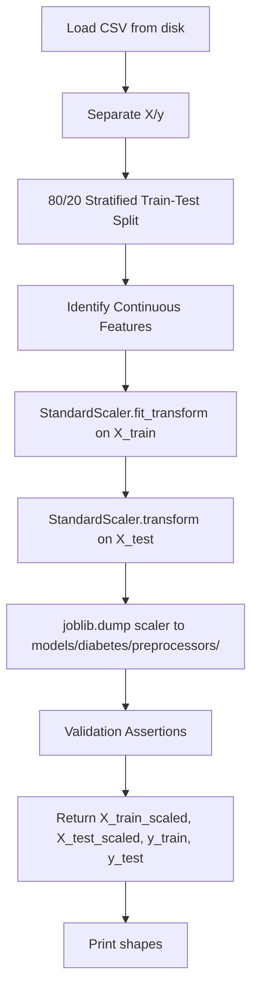
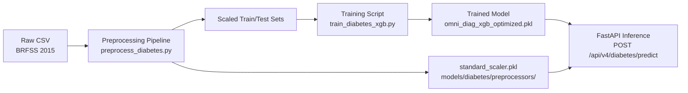

# Diabetes Module — Preprocessing Pipeline + Full OmniDiag Integration Plan

## Overview

This plan covers two phases:
- **Phase 1** (Immediate): A production-ready preprocessing pipeline script for the CDC Diabetes Health Indicators (BRFSS 2015) dataset.
- **Phase 2** (Full Integration): Integrating diabetes as a first-class OmniDiag disease module following the patterns documented in `plans/adding_new_disease_guide.md`.

---

## Dataset Summary

| Property | Value |
|---|---|
| Source | CDC BRFSS 2015 — Diabetes Health Indicators |
| File | `diabetes_binary_5050split_health_indicators_BRFSS2015.csv` |
| Rows | 70,692 |
| Columns | 22 |
| Target | `Diabetes_binary` (0/1, balanced 50/50) |
| Known Issues | No missing values expected (BRFSS is cleaned survey data) |

### Column Type Breakdown

| Type | Columns | Count |
|---|---|---|
| **Binary (0/1)** | `HighBP`, `HighChol`, `CholCheck`, `Smoker`, `Stroke`, `HeartDiseaseorAttack`, `PhysActivity`, `Fruits`, `Veggies`, `HvyAlcoholConsump`, `AnyHealthcare`, `NoDocbcCost`, `DiffWalk`, `Sex` | 14 |
| **Continuous (to scale)** | `BMI`, `MentHlth`, `PhysHlth`, `GenHlth`, `Age`, `Education`, `Income` | 7 |
| **Target** | `Diabetes_binary` | 1 |

### Rationale for Scaling Each Continuous Feature

| Feature | Type | Range | Why Scale |
|---|---|---|---|
| `BMI` | Continuous float | ~12–98 | True ratio scale; magnitude matters directly |
| `MentHlth` | Continuous int | 0–30 days | Days-per-month scale; linear magnitude |
| `PhysHlth` | Continuous int | 0–30 days | Days-per-month scale; linear magnitude |
| `GenHlth` | Ordinal int | 1–5 (excellent to poor) | Arbitrary interval; scaling centers it for tree-based models that may benefit |
| `Age` | Ordinal int | 1–13 (BRFSS age categories) | Even spacing assumed; scaling helps if model uses distance-based splits downstream |
| `Education` | Ordinal int | 1–6 (education level) | Arbitrary interval; scaling prevents large coefficients dominating |
| `Income` | Ordinal int | 1–8 (income bracket) | Arbitrary interval; scaling prevents large coefficients dominating |

> **Note:** Although `GenHlth`, `Age`, `Education`, and `Income` are ordinal, scaling them is a conservative choice: it does not harm tree-based models (XGBoost is scale-invariant for splits, but scaling aids interpretability with SHAP and enables use of linear/distance-based models later).

---

## Phase 1: Preprocessing Pipeline Script

### File to Create

[`experiment_files/data_pipeline/preprocess_diabetes.py`](../experiment_files/data_pipeline/preprocess_diabetes.py)

### Script Architecture



### Step-by-Step Implementation Details

#### 1. Module Docstring & Imports

```python
"""
OmniDiag — Diabetes Preprocessing Pipeline
===========================================
Production-ready preprocessing for the CDC Diabetes Health Indicators
dataset (BRFSS 2015). Performs stratified train-test split, standard
scaling of continuous features with anti-leakage safeguards, and
serializes the fitted scaler for production inference.

Usage:
    X_train, X_test, y_train, y_test = run_diabetes_preprocessing()
"""
```

Imports needed: `pandas`, `numpy`, `sklearn.model_selection.train_test_split`, `sklearn.preprocessing.StandardScaler`, `joblib`, `os`, `logging`.

#### 2. Configuration Constants

Define at module level:

- `DATA_PATH`: `"diabetes_binary_5050split_health_indicators_BRFSS2015.csv"` (project root)
- `TARGET_COL`: `"Diabetes_binary"`
- `CONTINUOUS_FEATURES`: 
  ```python
  ["BMI", "MentHlth", "PhysHlth", "GenHlth", "Age", "Education", "Income"]
  ```
- `TEST_SIZE`: `0.2`
- `RANDOM_STATE`: `42`
- `SCALER_SAVE_PATH`: `"models/diabetes/preprocessors/standard_scaler.pkl"` (OmniDiag convention)
- `ALL_FEATURES`: The full list of 21 feature columns (all except target)

#### 3. `run_diabetes_preprocessing()` Function

```python
def run_diabetes_preprocessing(
    data_path: str = DATA_PATH,
    test_size: float = TEST_SIZE,
    random_state: int = RANDOM_STATE,
    continuous_features: list = None,
    scaler_save_path: str = SCALER_SAVE_PATH,
) -> tuple:
```

**Steps inside the function:**

1. **Load Data** — `pd.read_csv(data_path)`
2. **Validate No Nulls** — `assert df.isnull().sum().sum() == 0`
3. **Separate X/y** — `X = df.drop(columns=[TARGET_COL])`, `y = df[TARGET_COL]`
4. **Validate target distribution** — print value counts
5. **Stratified Split** — `train_test_split(X, y, test_size=test_size, random_state=random_state, stratify=y)`
6. **Scale Continuous Features** — 
   - `scaler = StandardScaler()`
   - `X_train_cont = scaler.fit_transform(X_train[continuous_features])`
   - `X_test_cont = scaler.transform(X_test[continuous_features])`
   - Reconstruct full DataFrames by merging scaled continuous + unscaled binary columns
7. **Save Scaler** — Create directory with `os.makedirs(os.path.dirname(scaler_save_path), exist_ok=True)`, then `joblib.dump(scaler, scaler_save_path)`
8. **Validation Assertions**:
   - `assert X_train_scaled.shape[1] == X_test_scaled.shape[1]`
   - `assert len(y_train) == X_train_scaled.shape[0]`
   - `assert len(y_test) == X_test_scaled.shape[0]`
   - `assert set(X_train_scaled.columns) == set(X_test_scaled.columns)`
9. **Print Shapes** — `print(f"X_train_scaled: {X_train_scaled.shape}")` etc.
10. **Return** — `(X_train_scaled, X_test_scaled, y_train, y_test)`

#### 4. `if __name__ == "__main__":` Block

Call `run_diabetes_preprocessing()` and capture returned values for interactive inspection.

### Data Leakage Prevention

```
┌─────────────────────────────────────────────────────┐
│                  TRAIN SET                          │
│  StandardScaler.fit_transform(X_train_cont)         │
│  → Learns μ and σ from training data ONLY           │
└─────────────────────────────────────────────────────┘
                           │
                           ▼
┌─────────────────────────────────────────────────────┐
│                  TEST SET                            │
│  StandardScaler.transform(X_test_cont)               │
│  → Uses μ and σ from training data ONLY              │
│  → Zero information leakage from test set             │
└─────────────────────────────────────────────────────┘
```

### Validation Safeguards

| Assertion | Purpose |
|---|---|
| `df.isnull().sum().sum() == 0` | No missing values in raw data |
| `X_train_scaled.shape[1] == X_test_scaled.shape[1]` | Feature count consistency |
| `len(y_train) == X_train_scaled.shape[0]` | Row count consistency (train) |
| `len(y_test) == X_test_scaled.shape[0]` | Row count consistency (test) |
| `set(X_train.columns) == set(X_test.columns)` | Feature name consistency |
| `y_train.value_counts(normalize=True)` ~ `y_test.value_counts(normalize=True)` | Stratification preserved |

---

## Phase 2: Full OmniDiag Integration

After Phase 1 is complete, integrate diabetes as a full OmniDiag module.

### Phase 2 — File Checklist

| Step | Action | File to Create/Modify |
|---|---|---|
| 2.1 | Create data directories | `data/diabetes/raw/`, `data/diabetes/processed/`, `data/diabetes/interim/` |
| 2.2 | Move/link raw CSV | Copy CSV to `data/diabetes/raw/` |
| 2.3 | Create YAML config | `configs/diabetes.yaml` |
| 2.4 | Create feature engineer | `features/diabetes_features.py` |
| 2.5 | Register Pydantic schema | Modify `backend/schemas.py` |
| 2.6 | Train model | `models/train_diabetes_xgb.py` |
| 2.7 | Update frontend | Modify `EngineeringMode.jsx`, `ClinicalEmrMode.jsx` |
| 2.8 | Verify integration | Test API endpoints |

### Phase 2 — Detailed Steps

#### 2.1 Data Directories
```
data/diabetes/
├── raw/
│   └── diabetes_binary_5050split_health_indicators_BRFSS2015.csv
├── processed/
│   └── (will hold preprocessed data)
└── interim/
    └── (will hold validation scores)
```

#### 2.2 YAML Config — [`configs/diabetes.yaml`](../configs/diabetes.yaml)

Structure follows [`configs/heart_disease.yaml`](../configs/heart_disease.yaml) exactly:

```yaml
disease:
  name: "diabetes"
  display_name: "Diabetes Risk Assessment"
  description: "CDC BRFSS 2015 — Diabetes Health Indicators prediction with 21 features"
  target_column: "Diabetes_binary"
  version: "1.0.0"

data:
  raw_path: "data/diabetes/raw/"
  processed_path: "data/diabetes/processed/"
  interim_path: "data/diabetes/interim/"
  raw_files:
    - "diabetes_binary_5050split_health_indicators_BRFSS2015.csv"
  final_clean_file: "final_ready_data.csv"
  heuristic_file: "data_heuristic.csv"
  clinical_file: "data_clinical.csv"

features:
  module: "features.diabetes_features"
  class: "DiabetesFeatureEngineer"
  categorical_columns:
    - "HighBP"
    - "HighChol"
    - "CholCheck"
    - "Smoker"
    - "Stroke"
    - "HeartDiseaseorAttack"
    - "PhysActivity"
    - "Fruits"
    - "Veggies"
    - "HvyAlcoholConsump"
    - "AnyHealthcare"
    - "NoDocbcCost"
    - "DiffWalk"
    - "Sex"
  numerical_columns:
    - "BMI"
    - "MentHlth"
    - "PhysHlth"
    - "GenHlth"
    - "Age"
    - "Education"
    - "Income"
  imputation_features: []  # No missing values expected
  heuristic_features: []   # To be designed during feature engineering
  clinical_features: []    # To be designed during feature engineering

model:
  type: "xgboost"
  explainer_type: "tree"
  weights_path: "models/diabetes/omni_diag_xgb_optimized.pkl"
  fallback_weights_path: "models/diabetes/omni_diag_xgb_optimized.pkl"
  preprocessors_path: "models/diabetes/preprocessors/"
  best_params: {}  # To be filled after hyperparameter tuning

training:
  test_size: 0.2
  random_state: 42
  optimization_trials: 100
  optimization_direction: "maximize"
  optimization_metric: "accuracy"

explainer:
  enabled: true
  type: "shap"
  plots_output_dir: "reports/figures/"

api:
  endpoint_prefix: "/api/v4"
  version: "1.0.0"
```

#### 2.3 Feature Engineer — [`features/diabetes_features.py`](../features/diabetes_features.py)

Following the pattern from [`features/heart_disease_features.py`](../features/heart_disease_features.py):

- Inherit from `BaseFeatureEngineer`
- Implement `engineer_heuristic()` — create interaction features like:
  - `BMI_Age_Interaction`: `BMI * Age` (obesity risk compounded by age)
  - `Health_Index`: `GenHlth * (MentHlth + PhysHlth)` (composite morbidity)
  - `Lifestyle_Score`: `(PhysActivity + Fruits + Veggies - Smoker - HvyAlcoholConsump)` aggregated
  - `SES_Composite`: `Education * Income` (socioeconomic status proxy)
- Implement `engineer_clinical()` — create risk scores like:
  - `Diabetes_Clinical_Risk`: `exp(BMI*0.05 + Age*0.03 + GenHlth*0.2 + HighBP*0.5)`

#### 2.4 Schema Registration — [`backend/schemas.py`](../backend/schemas.py)

Add `DiabetesInput` Pydantic model (21 fields) and register in `DISEASE_SCHEMA_REGISTRY`.

#### 2.5 Training Script — [`models/train_diabetes_xgb.py`](../models/train_diabetes_xgb.py)

Load preprocessed data, train XGBoost, save model weights.

---

## Data Flow (End-to-End)



---

## Risk Assessment

| Risk | Impact | Mitigation |
|---|---|---|
| Scaler path `/kaggle/working/` vs OmniDiag path | Broken production inference | Use OmniDiag convention path `models/diabetes/preprocessors/` |
| Ordinal features scaled unnecessarily | Negative coefficients in linear models, but safe for XGBoost | Document rationale; XGBoost is tree-based and scale-invariant |
| Feature mismatch between train and inference | Silent prediction errors | Assertions in script + config-driven feature lists |
| No missing values assumption wrong | Pipeline crashes | Add `.isnull().sum()` diagnostic + optional imputation fallback |

---

## Phase 1 — Immediate: Preprocessing Script

Create [`experiment_files/data_pipeline/preprocess_diabetes.py`](../experiment_files/data_pipeline/preprocess_diabetes.py):
- Main function: `run_diabetes_preprocessing()`
- Continuous features: `BMI`, `MentHlth`, `PhysHlth`, `GenHlth`, `Age`, `Education`, `Income`
- Scaler saved to `models/diabetes/preprocessors/standard_scaler.pkl`
- Returns `(X_train_scaled, X_test_scaled, y_train, y_test)`
- Prints shapes and validation diagnostics
