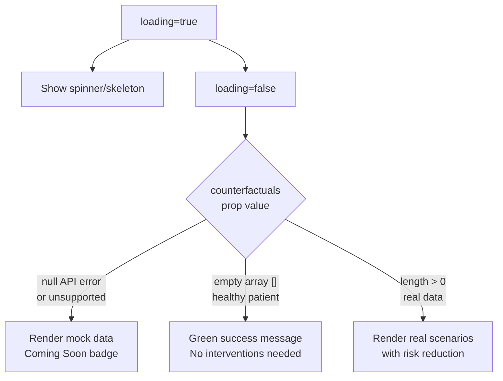

# Dynamic Counterfactuals (What-If Scenarios) — Implementation Plan v2

## Refined Clinical Logic for WhatIfScenarioCard

## Files to Modify

### 1. [`api.js`](frontend/src/api.js) — Add counterfactuals method
- Add `counterfactuals(disease, patientData)` method after `explain()`

### 2. [`WhatIfScenarioCard.jsx`](frontend/src/components/WhatIfScenarioCard.jsx) — Refine clinical logic
- `counterfactuals === null` → mock data with "Coming Soon" badge
- `counterfactuals?.length === 0` → green success: "Patient is currently at low clinical risk"
- `counterfactuals.length > 0` → real scenarios
- `loading === true` → spinner skeleton

### 3. [`ClinicalEmrMode.jsx`](frontend/src/components/ClinicalEmrMode.jsx) — Wire up API
- Add `counterfactualsData`, `counterfactualsLoading` state
- Reset on patient change
- Call `api.counterfactuals()` in parallel with predict/explain
- Pass props to `<WhatIfScenarioCard>`

### 4. [`EngineeringMode.jsx`](frontend/src/components/EngineeringMode.jsx) — Wire up API + render
- Import WhatIfScenarioCard
- Add same state + API logic
- Render card below SHAP chart
