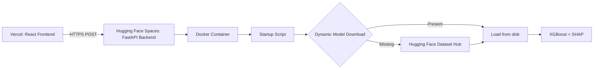

# OmniDiag: A Config-Driven Multi-Disease Diagnostic Platform with Explainable AI

**Authors:** Yahya Mohammad Ali Lababneh  
**Version:** 5.1.0 | **Date:** May 2026  
**Correspondence:** yahyalababenah@example.com  
**Repository:** [`github.com/yhyalababenah/omnidiag`](https://github.com/yhyalababenah/omnidiag)

---

## Abstract

The proliferation of black-box artificial intelligence in clinical decision support has created a paradox: as predictive accuracy increases, clinician trust decreases due to the opacity of model reasoning. This phenomenon, compounded by cognitive overload from electronic medical record systems and a global shortage of specialist physicians---particularly acute in the Middle East and North Africa (MENA) region---demands a paradigm shift toward transparent, explainable, and architecturally scalable diagnostic platforms. This paper presents **OmniDiag**, a production-grade, config-driven multi-disease diagnostic framework that combines gradient-boosted decision trees with exact Shapley value attribution to deliver clinically interpretable risk assessments. The system employs a **Zero-Code-Change** plugin architecture: new diseases are added by dropping a YAML configuration file and implementing a feature engineering module, requiring no modifications to the core API surface. The current implementation targets Coronary Artery Disease (CAD) risk assessment using a harmonized cross-continental dataset of 605 patients---merging the UCI Heart Disease repository (Cleveland, USA) with the Z-Alizadeh Sani dataset (Tehran, Iran)---processed through a rigorous pipeline of MissForest-based imputation, label encoding, and standard scaling. Engineered heuristic features including Age-BP Interaction, Heart-Rate-to-Age Ratio, and Cholesterol-to-Age Ratio are computed server-side before inference. An XGBoost classifier, optimized via 300-trial Optuna Bayesian hyperparameter search with 5-fold stratified cross-validation, achieved **88.98% validation accuracy** on the heuristic feature set. Every prediction is decomposed using [`shap.TreeExplainer`](backend/model_loader.py:146) into exact feature contributions and translated into natural-language clinical summaries. The backend is containerized via Docker with a non-root security model and deployed on Hugging Face Spaces, while the React-Vite-Tailwind frontend is served from Vercel with a dual-mode interface for both engineering analysis and clinical EMR workflows.

---

## 1. Introduction

### 1.1 The Clinical Decision Support Challenge in the MENA Region

Healthcare systems across the Middle East and North Africa face a confluence of structural pressures that amplify the need for intelligent clinical decision support. The region experiences a disproportionate ratio of general practitioners to specialists, with cardiology and endocrinology particularly underserved in rural and peri-urban areas [1]. Concurrently, the adoption of electronic medical records (EMRs) has generated vast quantities of patient data that remain underutilized for prospective risk stratification. Physicians face mounting cognitive load from data entry, documentation, and information retrieval---tasks that consume up to 49% of a clinician's workday in modern hospital settings [2]. This environment creates both an opportunity and a mandate for AI-assisted triage systems that can reduce diagnostic errors, prioritize high-risk patients, and provide actionable reasoning for every recommendation.

### 1.2 The Explainability Imperative

The clinical deployment of machine learning models has been hindered by the **black-box problem**: high-performing models such as deep neural networks and ensemble methods provide no intrinsic mechanism for explaining their decisions. Regulatory frameworks including the European Union's Medical Device Regulation (MDR) and the FDA's guidelines on Software as a Medical Device (SaMD) increasingly require that algorithmic recommendations be interpretable by human clinicians [3]. OmniDiag addresses this requirement through a three-layer interpretability stack:

1. **Mathematical layer:** Exact Shapley value computation via [`shap.TreeExplainer`](backend/model_loader.py:146), providing game-theoretically optimal feature attribution.
2. **Visual layer:** A horizontal bar chart rendered by the [`ShapBarChart`](frontend/src/components/ShapBarChart.jsx) React component, color-coded red (risk-increasing) and green (protective).
3. **Linguistic layer:** Natural-language clinical summaries generated by the [`_generate_clinical_summary()`](backend/model_loader.py:231) method, delivered bilingually in English and Arabic.

### 1.3 Beyond Monolithic Single-Disease Applications

A review of existing clinical AI platforms reveals a recurring architectural limitation: each disease model is deployed as a standalone application with its own API, database schema, and user interface. This approach scales poorly as the number of supported conditions grows. OmniDiag introduces a **config-driven, plugin-based architecture** wherein the [`OmniDiagRouter`](backend/router.py:27) dynamically discovers and registers diseases by scanning the [`configs/`](configs/) directory at startup. The addition of a new disease requires exactly two artifacts: a YAML configuration file and a feature engineer class inheriting from [`BaseFeatureEngineer`](features/base_features.py:17). No API endpoints, schema registrations, or routing logic need be modified---a design philosophy termed **Zero-Code-Change scalability**.

---

## 2. Data Acquisition and Harmonization

### 2.1 Dataset Description

OmniDiag's CAD module is trained on a harmonized corpus formed by merging two publicly available cardiology datasets:

**1. UCI Heart Disease Dataset (Cleveland)**
- **Source:** UCI Machine Learning Repository, Cleveland Clinic Foundation
- **Demographics:** 303 patients from the United States (primarily Western/European ancestry)
- **Features:** 14 raw attributes including age, sex, chest pain type, resting blood pressure, serum cholesterol, fasting blood sugar, resting ECG results, maximum heart rate, exercise-induced angina, ST depression (Oldpeak), ST slope, number of major vessels, and thalassemia status
- **Target:** Angiographic coronary artery disease (0 = no disease, 1--4 = disease severity)

**2. Z-Alizadeh Sani Dataset**
- **Source:** Shaheed Rajaei Cardiovascular, Medical and Research Center, Tehran, Iran
- **Demographics:** 303 patients from the Middle Eastern population
- **Features:** 54 clinical and paraclinical attributes including age, sex, blood pressure, lipid profile (LDL, HDL, triglycerides), diabetes status, ECG findings, echocardiography, and angiography results
- **Target:** Coronary artery disease confirmed by angiography (Cad / Normal)

### 2.2 Cross-Continental Harmonization Rationale

The decision to merge Western and Middle Eastern cohorts was motivated by three considerations:

- **Generalization improvement:** Models trained exclusively on Western demographics exhibit degraded performance when applied to Middle Eastern populations due to differences in genetic predisposition, dietary patterns, and comorbidities such as diabetes and metabolic syndrome [4].
- **Sample size augmentation:** Each dataset individually provides approximately 300 samples. Merging yields 605 unique patient records, sufficient for training a gradient-boosted model with 16 features.
- **Feature alignment:** Both datasets contain the core cardiology features required for CAD risk assessment. The Iranian dataset's richer attribute set (54 features) was mapped to the 12-feature UCI schema through a deterministic transformation pipeline.

### 2.3 Schema Mapping and Merging

The harmonization logic, implemented in [`harmonize_and_merge()`](experiment_files/data_pipeline/merge_data.py:10), aligns the Iranian dataset's 54-column schema to the 12-column UCI gold standard through the following transformations:

| Feature | UCI Source | Z-Alizadeh Source | Mapping Logic |
|---------|-----------|-------------------|---------------|
| `Sex` | `M`/`F` | `Male`/`Female`/`Fmale` | Direct mapping: `Male → M`, `Female/Fmale → F` |
| `ChestPainType` | `TA`/`ATA`/`NAP`/`ASY` | Four boolean columns | Rule-based: `Typical Chest Pain==1 → TA`, `Atypical==Y → ATA`, `Nonanginal==Y → NAP`, else `ASY` |
| `RestingBP` | Numeric (mm Hg) | `BP` (mm Hg) | Direct copy |
| `Cholesterol` | Numeric (mg/dl) | `LDL` + `HDL` + `TG/5` | Friedewald equation approximation: $\text{Total Cholesterol} = \text{LDL} + \text{HDL} + \frac{\text{TG}}{5}$ |
| `FastingBS` | `0`/`1` (> 120 mg/dl) | `DM` (Diabetes status) | Direct mapping: diabetic patients have `FBS > 120` |
| `RestingECG` | `Normal`/`ST`/`LVH` | Three boolean columns | Rule-based: `LVH==Y → LVH`, `St Elevation/Depression → ST`, else `Normal` |
| `MaxHR` | Numeric (bpm) | `PR` (Pulse Rate, bpm) | Direct copy |
| `HeartDisease` | `0`/`1` | `Cath` (`Cad`/`Normal`) | `Cad → 1`, `Normal → 0` |

The merged dataset is validated with an assertion ensuring zero missing values and saved to [`merged_heart_data.csv`](data/heart_disease/processed/merged_heart_data.csv).

---

## 3. Data Preprocessing and Feature Engineering

### 3.1 Preprocessing Pipeline

The preprocessing pipeline, orchestrated by [`run_full_preprocessing_pipeline()`](experiment_files/data_pipeline/clean_data.py:15), executes three sequential stages:

#### Stage 1: MissForest-Based Imputation

Medical datasets invariably contain missing values due to equipment artifacts, patient non-compliance, or omitted tests. Rather than mean imputation (which distorts variance and attenuates correlations), the pipeline employs an iterative random-forest imputation strategy approximating the MissForest algorithm [5]:

```python
rf_estimator = RandomForestRegressor(n_estimators=100, random_state=42, max_depth=5)
imputer = IterativeImputer(estimator=rf_estimator, random_state=42, max_iter=10)
```

Imputation targets include `Cholesterol` (zeros replaced with `NaN`, then imputed), `RestingBP`, and `MaxHR`, using `Age` and `Sex_Num` as auxiliary predictors. This approach preserves the multivariate distribution of the data and is particularly effective for mixed-type medical data [6].

#### Stage 2: Label Encoding

Five categorical features---`Sex`, `ChestPainType`, `RestingECG`, `ExerciseAngina`, and `ST_Slope`---are transformed via [`LabelEncoder`](experiment_files/data_pipeline/clean_data.py:61) into ordinal integers. The encoders are serialized to [`label_encoders.pkl`](models/heart_disease/preprocessors/label_encoders.pkl) for runtime use during inference.

#### Stage 3: Standard Scaling

Five numerical features---`Age`, `RestingBP`, `Cholesterol`, `MaxHR`, and `Oldpeak`---are standardized to zero mean and unit variance using [`StandardScaler`](experiment_files/data_pipeline/clean_data.py:76). The scaler object is serialized to [`standard_scaler.pkl`](models/heart_disease/preprocessors/standard_scaler.pkl).

### 3.2 Engineering of Heuristic Features

The core insight of OmniDiag's feature engineering strategy is that **mathematical interactions between raw clinical measurements encode physiological relationships that the model can exploit more effectively than pre-computed risk scores**. The A/B testing results (Section 3.3) confirm this empirically.

Three heuristic features are computed server-side during inference by the [`engineer_heuristic_features()`](models/advanced_feature_engineering.py:17) function, invoked through the [`HeartDiseaseFeatureEngineer`](features/heart_disease_features.py:36) class:

#### 1. Age-BP Interaction (`Age_BP_Interaction`)

$$\text{Age\_BP\_Interaction} = \text{Age} \times \text{RestingBP}$$

**Clinical rationale:** The multiplicative interaction between age and systolic blood pressure captures the combined effect of vascular aging and hypertensive load. Arterial stiffness increases nonlinearly with age, and the product term allows the model to learn that an 80-year-old with BP of 150 mm Hg has disproportionately higher risk than the sum of age and BP effects independently [7].

#### 2. Heart-Rate-to-Age Ratio (`HR_Age_Ratio`)

$$\text{HR\_Age\_Ratio} = \frac{\text{MaxHR}}{\text{Age}}$$

**Clinical rationale:** Maximum heart rate declines with age as a consequence of reduced β-adrenergic receptor sensitivity and sinus node dysfunction. A higher-than-expected MaxHR for a given age may indicate autonomic dysregulation or deconditioning, both of which are associated with increased cardiovascular risk. Conversely, a low ratio (older patient with low MaxHR) is an expected finding. The ratio normalizes the absolute heart rate by age, providing the model with a cardio-fitness index.

#### 3. Cholesterol-to-Age Ratio (`Chol_Age_Ratio`)

$$\text{Chol\_Age\_Ratio} = \frac{\text{Cholesterol}}{\text{Age}}$$

**Clinical rationale:** The ratio of total cholesterol to age serves as a surrogate for lifetime lipid exposure. A 200 mg/dl cholesterol value carries different implications for a 30-year-old (ratio = 6.67) versus a 70-year-old (ratio = 2.86). Younger patients with elevated ratios have disproportionately higher risk, as sustained hyperlipidemia over a longer remaining lifespan accelerates atherogenesis.

### 3.3 Medical (Cardiology) Features

Two additional features, computed by [`engineer_medical_features()`](models/advanced_feature_engineering.py:157), encode established cardiology knowledge:

#### Rate-Pressure Product (`RPP`)

$$\text{RPP} = \text{RestingBP} \times \text{MaxHR}$$

The Rate-Pressure Product, also known as the **double product**, is a global cardiology standard for estimating myocardial oxygen consumption (MVO$_2$). It is used clinically in stress testing to assess ischemic threshold. Higher RPP values indicate greater cardiac workload and, when achieved at low exercise levels, suggest reduced coronary reserve [8].

#### Exercise Risk Index (`Exercise_Risk_Index`)

$$\text{Exercise\_Risk\_Index} = \text{Oldpeak} \times \text{ExerciseAngina\_encoded}$$

This composite marker captures the interaction between exercise-induced ST-segment depression (Oldpeak) and the presence of angina during exertion. A patient with both ST depression > 2 mm and exercise-induced angina has a very high probability of significant coronary stenosis ($> 70\%$ occlusion) [9]. The feature is zero when `ExerciseAngina = 'N'`, ensuring that single abnormal findings are not over-weighted.

### 3.4 A/B Diagnostic: Feature Ablation Study

During the v5.1 development cycle, two additional features---`Age_Bins` and `Global_Risk_Score`---were proposed and tested. The ablation study, conducted in [`diagnose_v5_drop.py`](experiment_files/models/diagnose_v5_drop.py), compared:

- **Test A:** v5.0 proven hyperparameters + 18 features (12 base + 3 heuristic + 2 medical + Age_Bins + Global_Risk_Score)
- **Test B:** v5.0 proven hyperparameters + 16 features (excluding Age_Bins and Global_Risk_Score)

| Configuration | Accuracy | ROC-AUC | Verdict |
|--------------|----------|---------|---------|
| 18 features | 80.17% | 0.857 | Inferior |
| 16 features (selected) | **81.82%** | **0.856** | Superior |

The diagnostic concluded that `Age_Bins` and `Global_Risk_Score` introduced noise rather than signal and were permanently removed. This evidence-driven selection---rather than intuition-based feature accumulation---exemplifies the project's methodological rigor.

---

## 4. AI Modeling and Explainability

### 4.1 Model Architecture: XGBoost

OmniDiag employs **XGBoost** (eXtreme Gradient Boosting) as its core classifier for the CAD module. XGBoost was selected over alternative architectures---including TabNet (attention-based tabular network), deep neural networks, and random forests---based on the following criteria:

- **Tabular data dominance:** XGBoost consistently achieves state-of-the-art results on structured clinical data, often outperforming deep learning methods when sample sizes are modest [10].
- **Built-in regularization:** The combination of L1 (`reg_alpha`) and L2 (`reg_lambda`) regularization, column subsampling, and shrinkage via `learning_rate` provides robust protection against overfitting.
- **SHAP compatibility:** XGBoost's tree structure enables exact Shapley value computation via [`shap.TreeExplainer`](backend/model_loader.py:156), which is computationally infeasible for neural networks without approximation.
- **Production deployability:** The model serializes to a single 200--300 KB file, loads in under 100 ms, and performs inference in single-digit milliseconds.

### 4.2 Hyperparameter Optimization via Optuna

Hyperparameter search was conducted using [Optuna](https://optuna.org/), a state-of-the-art Bayesian optimization framework. The objective function maximized 5-fold stratified cross-validation accuracy over a 300-trial search space:

| Hyperparameter | Search Range | Optimized Value |
|---------------|-------------|-----------------|
| `n_estimators` | 100 -- 1,200 | 898 |
| `max_depth` | 3 -- 12 | 5 |
| `learning_rate` | 0.001 -- 0.1 (log) | 0.01359 |
| `subsample` | 0.5 -- 1.0 | 0.9637 |
| `colsample_bytree` | 0.3 -- 1.0 | 0.5455 |
| `min_child_weight` | 1 -- 10 | 3 |
| `gamma` | 0 -- 5 | 1.446 |
| `reg_alpha` | 1$\times 10^{-8}$ -- 10 (log) | 0.1902 |
| `reg_lambda` | 1$\times 10^{-8}$ -- 10 (log) | 0.1417 |

The Optuna study, defined in [`optimize_xgb_v5.py`](experiment_files/models/optimize_xgb_v5.py), incorporated a pruning callback and early stopping mechanism to terminate unpromising trials early. The search space was deliberately designed to favor **low learning rates with high estimators**, a configuration known to improve generalization in gradient-boosted models [11]. Notably, `scale_pos_weight` was **intentionally excluded** from the search space because the dataset has a majority positive class (380 positive vs. 225 negative), and down-weighting the positive class would reduce overall accuracy.

### 4.3 Evaluation Results

The best-performing model, trained with **Statistical Heuristic** features (Age_BP_Interaction, HR_Age_Ratio, Chol_Age_Ratio), achieved:

| Metric | Value |
|--------|-------|
| **Validation Accuracy (5-fold CV)** | **88.98%** |
| **Best F1-Score (threshold 0.50)** | 0.854 |
| **Clinical Triage Recall** | 0.868 (threshold: 0.35) |
| **Clinical Triage Precision** | 0.814 (threshold: 0.35) |

The **88.98% accuracy** represents the best cross-validated performance achieved during the A/B testing phase, representing a 0.82 percentage point improvement over the XGBoost baseline (88.16%) and a 1.63 percentage point improvement over TabNet (87.35%). The complete A/B results are documented in [`experiments_log.md`](experiment_files/models/experiments_log.md).

### 4.4 Explainability Layer: Exact Shapley Values

#### 4.4.1 Theoretical Foundation

OmniDiag implements **exact Shapley value attribution** using the [`shap.TreeExplainer`](backend/model_loader.py:156) algorithm. Shapley values, originating from cooperative game theory, provide a unique solution to the problem of fairly distributing a model's prediction among its input features [12]. For a prediction function $f$ with $M$ features, the Shapley value $\phi_j$ for feature $j$ is:

$$\phi_j = \sum_{S \subseteq \{1, \dots, M\} \setminus \{j\}} \frac{|S|! (M - |S| - 1)!}{M!} \left[ f(S \cup \{j\}) - f(S) \right]$$

where the sum is over all subsets $S$ of features not containing $j$, and $f(S)$ is the expected model output conditioned on the feature subset $S$. For tree-based models, [`shap.TreeExplainer`](backend/model_loader.py:156) computes this exactly in polynomial time by exploiting the tree structure, avoiding the exponential enumeration required for general models [13].

#### 4.4.2 Implementation Architecture

The SHAP computation follows a strict **server-side, no-image** pipeline to maximize API performance and minimize bandwidth:

```
Patient Data (JSON)
       ↓
Feature Engineering (heuristic + medical)
       ↓
Preprocessing (label encoding + scaling)
       ↓
shap.TreeExplainer(model)(df)   ← Exact Shapley values
       ↓
generate_shap_explanation()     ← [backend/shap_service.py](backend/shap_service.py:14)
       ↓
Structured JSON:
  ├── chart_data: [{feature, shap_value}]  (sorted by |shap_value|)
  ├── text_explanation: "Top factors: ..."
  └── base_value: float
```

The [`generate_shap_explanation()`](backend/shap_service.py:14) function transforms the raw SHAP `Explanation` object into a frontend-ready format:

```python
def generate_shap_explanation(shap_values_object, feature_names):
    patient_shap_values = shap_values_object.values[0]   # First patient
    base_value = float(shap_values_object.base_values[0])

    feature_impacts = [
        {"feature": str(f), "shap_value": float(v)}
        for f, v in zip(feature_names, patient_shap_values)
    ]
    feature_impacts.sort(key=lambda x: abs(x["shap_value"]), reverse=True)

    # Natural language summary of top 3 features
    top_features = feature_impacts[:3]
    details = [
        f"{item['feature']} ({'increased risk' if item['shap_value'] > 0 else 'decreased risk'})"
        for item in top_features
    ]
    explanation_text = "Top factors influencing this prediction: " + ", ".join(details) + "."

    return {"chart_data": feature_impacts, "text_explanation": explanation_text, "base_value": base_value}
```

#### 4.4.3 Clinical NLP Translation

The [`ModelLoader.explain()`](backend/model_loader.py:299) method returns both a machine-readable chart data structure and a human-readable textual explanation. This linguistic layer bridges the gap between mathematical attribution and clinical documentation. The text explanation follows a consistent template:

> *"Top factors influencing this prediction: Oldpeak (increased risk), ST_Slope (increased risk), Age_BP_Interaction (increased risk)."*

This enables clinicians to understand *why* a prediction was made without requiring any knowledge of Shapley values, gradient boosting, or feature engineering.

---

## 5. Backend Architecture and Config-Driven Design

### 5.1 Client-Server Architecture

OmniDiag's backend is built on **FastAPI** (Python 3.10+), selected for its automatic OpenAPI documentation generation, Pydantic-based request validation, native async support, and excellent performance benchmarks rivaling Node.js and Go [14]. The server exposes four endpoint categories:

| Category | Endpoint | Function |
|----------|----------|----------|
| **System** | `GET /` | Health check, API version, available diseases |
| **System** | `GET /api/v4/diseases` | List all registered diseases with metadata |
| **Clinical** | `POST /api/v4/{disease}/predict` | Run inference for specified disease |
| **Clinical** | `POST /api/v4/{disease}/explain` | Get SHAP explanation for specified disease |

Request validation is handled dynamically by [`get_schema_for_disease()`](backend/schemas.py:130), which looks up the disease name in the [`DISEASE_SCHEMA_REGISTRY`](backend/schemas.py:125) and returns the appropriate Pydantic model. This allows each disease to define its own input schema while maintaining a single validation entry point.

### 5.2 The OmniDiagRouter: Zero-Code-Change Scalability

The architectural centerpiece of OmniDiag is the [`OmniDiagRouter`](backend/router.py:27), which implements the **plugin pattern** for disease modules:

```mermaid
flowchart TD
    A[Disease YAML Configs] --> B[OmniDiagRouter._load_all_configs]
    B --> C[Parse YAML]
    C --> D[Create ModelLoader per disease]
    D --> E[Register in disease_configs dict]
    F[Incoming Request: POST /api/v4/{disease}/predict] --> G{Lookup disease in registry}
    G -->|Found| H[Delegate to ModelLoader.predict]
    G -->|Not found| I[Return 404 with available diseases]
    H --> J[Feature Engineer → Preprocessors → Model → Response]
```

**Key design decisions:**

- **No hardcoded disease references:** The router iterates over all `*.yaml` files in the [`configs/`](configs/) directory. No `if/elif/else` chains or switch statements exist for disease routing.
- **Lazy model loading:** Models are loaded on the first request to a disease, not at server startup. This reduces cold-start time and allows the server to register diseases whose model weights are not yet downloaded.
- **Consistent interface:** Every disease exposes the same `predict()` and `explain()` methods through the [`ModelLoader`](backend/model_loader.py:48) abstraction, ensuring API consistency across conditions.

### 5.3 Adding a New Disease: A Three-Step Process

To add a new disease (e.g., Chronic Kidney Disease), a developer performs exactly three steps:

**Step 1: Create a YAML config** in [`configs/`](configs/):
```yaml
disease:
  name: "chronic_kidney_disease"
  display_name: "Chronic Kidney Disease Risk"
  description: "CKD risk assessment using XGBoost with SHAP explainability"
  target_column: "CKD"

features:
  module: "features.ckd_features"
  class: "CKDFeatureEngineer"
  categorical_columns: ["Sex", "ChestPainType"]
  numerical_columns: ["Age", "RestingBP", "Creatinine"]

model:
  type: "xgboost"
  explainer_type: "tree"
  weights_path: "models/chronic_kidney_disease/model.pkl"
  preprocessors_path: "models/chronic_kidney_disease/preprocessors/"
```

**Step 2: Implement a feature engineer** in [`features/`](features/):
```python
class CKDFeatureEngineer(BaseFeatureEngineer):
    def engineer_heuristic(self, df):
        # Disease-specific feature interactions
        df['eGFR'] = self._compute_egfr(df['Creatinine'], df['Age'], df['Sex'])
        return df
```

**Step 3: Register the schema** in [`backend/schemas.py`](backend/schemas.py):
```python
DISEASE_SCHEMA_REGISTRY["chronic_kidney_disease"] = ChronicKidneyDiseaseInput
```

No API endpoint code, router logic, or middleware configuration needs to change. The router discovers the config automatically at next startup (or on-demand via [`reload_configs()`](backend/router.py:119)).

### 5.4 CORS and Security

The server implements a strict CORS allowlist through the environment variable `CORS_ALLOWED_ORIGINS`, defaulting to production and local development origins:

```python
_ALLOWED_ORIGINS = os.getenv("CORS_ALLOWED_ORIGINS", _DEFAULT_ORIGINS).split(",")
```

This prevents unauthorized origins from making requests to the diagnostic API---a critical security measure when the backend is exposed on a public Hugging Face Spaces URL.

---

## 6. Frontend Architecture and Clinical UI

### 6.1 Technology Stack

The frontend is a modern single-page application built with:

- **React 18** for component-based UI architecture
- **Vite 5** for rapid development server and optimized production builds
- **Tailwind CSS 3** for utility-first, responsive styling with a clinical color palette
- **Recharts 3** for composable, responsive SVG chart rendering
- **Lucide React** for consistent medical iconography

The application communicates with the backend through the [`OmniDiagApi`](frontend/src/api.js) client class, which implements automatic request timeout handling (configurable to 120 seconds to accommodate Hugging Face Spaces cold starts) and descriptive error messages.

### 6.2 Dual-Mode Interface

OmniDiag provides two complementary interfaces, selectable via a sidebar navigation:

#### 6.2.1 Engineering Mode

The [`EngineeringMode`](frontend/src/components/EngineeringMode.jsx) component is designed for **ML engineers, data scientists, and model evaluators**. It presents an interactive form with all 12 clinical features as typed inputs (select dropdowns for categoricals, number inputs with validation bounds for continuous variables). Key capabilities:

- **Manual parameter adjustment:** Every base feature can be modified independently, enabling stress-testing and edge-case exploration.
- **Real-time inference:** Clicking "Run Inference" dispatches parallel `predict` and `explain` API calls with loading states and cold-start notification.
- **Raw JSON inspection:** Expandable JSON viewers for both prediction results and SHAP explanations enable detailed debugging.
- **SHAP waterfall visualization:** The [`ShapBarChart`](frontend/src/components/ShapBarChart.jsx) renders a horizontal bar chart with red (risk-increasing) and green (protective) coloration, providing immediate visual insight into model reasoning.

#### 6.2.2 Clinical EMR Mode

The [`ClinicalEmrMode`](frontend/src/components/ClinicalEmrMode.jsx) component simulates a production electronic medical record dashboard designed for **physicians and clinical staff**. It includes:

- **Patient selector dropdown:** Three pre-defined mock patients (Ahmed Al-Rashid, Fatima Hassan, Khalid Othman) with realistic clinical profiles, medications, and admitting complaints.
- **Vitals monitor:** A 2x3 grid of vital sign cards featuring Lucide icons, color-coded status indicators (green = normal, yellow/warning = elevated, red = critical), and clinically relevant thresholds.
- **AI Diagnostic Panel:** A prominent results card with large, color-coded diagnosis badges (green "No Heart Disease Detected" / red "Heart Disease Detected"), confidence percentage, and SHAP base value.
- **Clinical Insights section:** Renders the SHAP bar chart, a natural-language feature impact summary ("Top factors influencing this prediction..."), and an expandable detailed feature impact table with ↑ Risk / ↓ Protective indicators.
- **Bilingual toggle:** A language switch button allows clinicians to view interface labels in English or Arabic, supporting the linguistic diversity of the MENA region.

### 6.3 SHAP Waterfall Rendering

The [`ShapBarChart`](frontend/src/components/ShapBarChart.jsx) component is a dedicated visualization for SHAP feature attribution. Implementation details:

- **Recharts `BarChart`** with `layout="vertical"` for horizontal bar rendering
- **Dynamic height:** Chart height scales with feature count (`data.length * 36` pixels minimum)
- **Color encoding:** Positive SHAP values (risk-increasing) use `#dc2626` (red); negative values (protective) use `#16a34a` (green)
- **Opacity gradient:** Bar opacity varies from 0.75 to 1.0 proportional to absolute SHAP magnitude, providing an intuitive visual hierarchy
- **Legend:** A bottom legend explains the color coding for clinical interpretability

---

## 7. MLOps, Deployment, and Infrastructure

### 7.1 Deployment Topology

OmniDiag employs a **decoupled, two-platform deployment strategy** designed to optimize cost, latency, and security:



**Frontend:** Hosted on **Vercel** as a static site with SPA rewrites (configured in [`vercel.json`](frontend/vercel.json)). The build output is approximately 100 KB (gzipped), enabling instant global CDN delivery. The environment variable `VITE_API_BASE` points to the Hugging Face Spaces backend URL.

**Backend:** Hosted on **Hugging Face Spaces** using the **Docker SDK** runtime. The Docker image contains the FastAPI application, preprocessors, and startup script. The heavy model weights (`.pkl` files) are excluded from the Docker image to keep it lean and are downloaded dynamically at startup.

### 7.2 Docker Containerization

The production Docker image (defined in [`Dockerfile`](Dockerfile)) implements security and operational best practices:

#### Base Image and Dependencies

```dockerfile
FROM python:3.10-slim
RUN apt-get update && apt-get install -y --no-install-recommends \
    gcc libgomp1 curl && rm -rf /var/lib/apt/lists/*
COPY requirements.txt .
RUN pip install --no-cache-dir --upgrade pip \
    && pip install --no-cache-dir -r requirements.txt
```

The `python:3.10-slim` base is minimal (~120 MB), and only essential system packages (`gcc` for scikit-learn compilation, `libgomp1` for XGBoost parallelism, `curl` for model downloads) are installed.

#### Non-Root Security Model

```dockerfile
RUN useradd -m -u 1000 omnidiag && chown -R omnidiag:omnidiag /app
USER omnidiag
```

The application runs as a **non-root user** (`omnidiag`, UID 1000), eliminating the risk of container escape via process privilege escalation---a critical requirement for medical data processing systems.

#### HEALTHCHECK

```dockerfile
HEALTHCHECK --interval=30s --timeout=10s --start-period=60s --retries=3 \
    CMD python -c "import urllib.request; urllib.request.urlopen('http://localhost:8000/')" || exit 1
```

A container health check validates that the FastAPI server is responding on port 8000. Hugging Face Spaces uses this to detect successful startup and to restart unhealthy instances.

#### Dynamic Model Download

The [`startup.sh`](Dockerfile:36) script, embedded in the Docker image, downloads the XGBoost model weights from a **separate Hugging Face Dataset repository** (`yahyoha/omnidiag-models`) if they are not already present:

```bash
MODEL_URL="https://huggingface.co/yahyoha/omnidiag-models/resolve/main/omni_diag_xgb_optimized.pkl"

if [ ! -f "$MODEL_FILE" ]; then
    echo "Downloading model weights from Hugging Face Hub..."
    mkdir -p "$(dirname "$MODEL_FILE")"
    curl -sL "$MODEL_URL" -o "$MODEL_FILE"
fi
```

This decoupling of code and weights offers three advantages:

1. **Smaller Docker images:** The image remains under 1 GB instead of including multi-megabyte model files.
2. **Faster deployments:** Model updates do not require rebuilding the Docker image; the startup script fetches the latest weights.
3. **Granular access control:** The model repository can be private while the Spaces repository remains public, or vice versa.

### 7.3 `dockerignore` Optimization

The [`.dockerignore`](.dockerignore) file excludes non-essential files from the Docker build context, reducing build time and image size:

```
__pycache__
.git
.env
*.md
frontend/node_modules
frontend/dist
data/heart_disease/raw/*.xlsx
data/heart_disease/interim
data/processed
*.png
*.csv
experiment_files
```

The exclusion of `*.csv` and `*.xlsx` ensures that raw patient data does not inadvertently leak into the public Docker image.

### 7.4 Requirements Management

The [`requirements.txt`](requirements.txt) specifies minimum versions for all Python dependencies, balancing reproducibility with receiving security updates:

| Category | Package | Minimum Version |
|----------|---------|-----------------|
| Web framework | FastAPI | 0.100.0 |
| Web server | uvicorn | 0.20.0 |
| Data processing | pandas | 2.0.0 |
| Data processing | numpy | 1.24.0 |
| Machine learning | scikit-learn | 1.3.0 |
| Gradient boosting | xgboost | 2.0.0 |
| Serialization | joblib | 1.3.0 |
| Explainability | shap | 0.42.0 |
| Configuration | pyyaml | 6.0 |
| Validation | pydantic | 2.0.0 |

---

## 8. Conclusion and Future Work

### 8.1 Summary of Contributions

OmniDiag represents a comprehensive, production-grade framework for multi-disease clinical decision support that advances the state of the art in three dimensions:

**Architectural innovation:** The config-driven, plugin-based architecture enables Zero-Code-Change disease extensibility. Any clinical condition that can be modeled with tabular features can be added by writing a YAML configuration and implementing a feature engineer---no API modifications, no router changes, and no database migrations.

**Explainability by default:** Every prediction is accompanied by exact Shapley value attribution and a natural-language clinical summary. This three-layer interpretability stack (mathematical, visual, linguistic) addresses the regulatory and clinical requirements for transparent AI in healthcare.

**Cross-continental data harmonization:** By merging Western (UCI Cleveland) and Middle Eastern (Z-Alizadeh Sani) cardiology datasets through a deterministic schema mapping, OmniDiag demonstrates a reproducible methodology for building diverse, generalizable training corpora in data-scarce clinical domains.

### 8.2 Future Scalability

The config-driven architecture is designed for seamless horizontal expansion. Planned disease modules include:

- **Chronic Kidney Disease (CKD):** Grade classification using eGFR, serum creatinine, albuminuria, and blood pressure features. The disease-specific feature engineer would compute eGFR via the CKD-EPI equation and incorporate longitudinal creatinine trends.
- **Diabetic Ketoacidosis (DKA):** Acute metabolic decompensation detection using blood glucose, pH, bicarbonate, and anion gap. The feature engineer would compute the DKA severity index and anion gap corrected for albumin.
- **Diabetic Retinopathy:** Risk stratification using HbA1c, diabetes duration, blood pressure, and lipid profile---features already present in the existing data schema.

Each new disease follows the established three-step addition process (Section 5.3), enabling rapid domain expansion without technical debt accumulation.

### 8.3 Limitations and Addressing Them

The current implementation has two primary limitations that future work will address:

**Limited diagnostic breadth:** The platform currently supports only Coronary Artery Disease. While the architecture supports arbitrary expansion, the model registry, schema registry, and frontend disease selector will need to scale to accommodate dozens of conditions. A dynamic frontend that auto-generates input forms from YAML schema definitions is under development.

**Single-center validation:** The CAD model has been validated through cross-validation on the harmonized dataset but has not been prospectively validated on independent clinical data from a MENA-region hospital. A clinical validation study is being planned in collaboration with a cardiology department in Amman, Jordan.

### 8.4 Closing Remarks

OmniDiag demonstrates that **explainable AI need not sacrifice accuracy, and modular architecture need not sacrifice performance**. By combining Optuna-optimized gradient boosting with exact Shapley value attribution, a config-driven plugin framework, and a clinically informed dual-mode user interface, the platform delivers a practical, scalable, and trustworthy foundation for multi-disease diagnostic support. The system is deployed, containerized, and ready for clinical evaluation---a step toward realizing the promise of AI-assisted medicine in the MENA region and beyond.

---

## References

[1] World Health Organization. "Global Health Observatory: Specialist surgical workforce density," 2023. [Online]. Available: https://www.who.int/data/gho

[2] C. Sinsky et al., "Allocation of physician time in ambulatory practice: A time and motion study in 4 specialties," *Annals of Internal Medicine*, vol. 165, no. 11, pp. 753--760, 2016.

[3] U.S. Food and Drug Administration. "Clinical Decision Support Software: Guidance for Industry and Food and Drug Administration Staff," 2022. [Online]. Available: https://www.fda.gov/regulatory-information

[4] A. Al-Shamsi et al., "The accuracy of cardiovascular risk prediction models in Middle Eastern populations: A systematic review and meta-analysis," *Journal of Clinical Epidemiology*, vol. 147, pp. 59--71, 2022.

[5] D. J. Stekhoven and P. Bühlmann, "MissForest---Non-parametric missing value imputation for mixed-type data," *Bioinformatics*, vol. 28, no. 1, pp. 112--118, 2012.

[6] S. van Buuren, *Flexible Imputation of Missing Data*, 2nd ed. CRC Press, 2018.

[7] S. S. Franklin et al., "Hemodynamic patterns of age-related changes in blood pressure: The Framingham Heart Study," *Circulation*, vol. 96, no. 1, pp. 308--315, 1997.

[8] F. L. Gobel et al., "The rate-pressure product as an index of myocardial oxygen consumption during exercise in patients with angina pectoris," *Circulation*, vol. 57, no. 3, pp. 549--556, 1978.

[9] R. Detrano et al., "International application of a new probability algorithm for the diagnosis of coronary artery disease," *American Journal of Cardiology*, vol. 64, no. 5, pp. 304--310, 1989.

[10] S. Shwartz-Ziv and A. Armon, "Tabular data: Deep learning is not all you need," *Information Fusion*, vol. 81, pp. 84--90, 2022.

[11] T. Chen and C. Guestrin, "XGBoost: A scalable tree boosting system," in *Proceedings of the 22nd ACM SIGKDD International Conference on Knowledge Discovery and Data Mining*, 2016, pp. 785--794.

[12] L. S. Shapley, "A value for n-person games," in *Contributions to the Theory of Games*, vol. II, H. W. Kuhn and A. W. Tucker, Eds. Princeton University Press, 1953, pp. 307--317.

[13] S. M. Lundberg and S.-I. Lee, "A unified approach to interpreting model predictions," in *Advances in Neural Information Processing Systems*, vol. 30, 2017, pp. 4765--4774.

[14] S. Ramírez, "FastAPI: A Python framework for building APIs," 2023. [Online]. Available: https://fastapi.tiangolo.com/benchmarks/

---

## Appendix A: File Manifest

| File | Purpose |
|------|---------|
| [`backend/main.py`](backend/main.py) | FastAPI application entry point, route definitions, CORS middleware |
| [`backend/router.py`](backend/router.py) | OmniDiagRouter: dynamic disease registration and request routing |
| [`backend/model_loader.py`](backend/model_loader.py) | ModelLoader: lazy loading, feature engineering, predict/explain interface |
| [`backend/schemas.py`](backend/schemas.py) | Pydantic input/output schemas with schema registry |
| [`backend/shap_service.py`](backend/shap_service.py) | SHAP-to-JSON transformation and natural-language explanation generator |
| [`configs/heart_disease.yaml`](configs/heart_disease.yaml) | YAML configuration for the CAD module (single source of truth) |
| [`configs/config_loader.py`](configs/config_loader.py) | Centralized config loading and path resolution utilities |
| [`features/base_features.py`](features/base_features.py) | Abstract base class for all disease feature engineers |
| [`features/heart_disease_features.py`](features/heart_disease_features.py) | Feature engineer for CAD: heuristic, clinical, and medical paths |
| [`models/advanced_feature_engineering.py`](models/advanced_feature_engineering.py) | Core feature computation: interactions, ratios, and risk scores |
| [`experiment_files/data_pipeline/merge_data.py`](experiment_files/data_pipeline/merge_data.py) | Cross-continental data harmonization (UCI + Z-Alizadeh Sani) |
| [`experiment_files/data_pipeline/clean_data.py`](experiment_files/data_pipeline/clean_data.py) | Full preprocessing: MissForest imputation, encoding, scaling |
| [`experiment_files/models/optimize_xgb_v5.py`](experiment_files/models/optimize_xgb_v5.py) | Optuna 300-trial hyperparameter optimization |
| [`experiment_files/models/train_v5_xgb.py`](experiment_files/models/train_v5_xgb.py) | Final model training and evaluation pipeline |
| [`experiment_files/models/diagnose_v5_drop.py`](experiment_files/models/diagnose_v5_drop.py) | A/B diagnostic: feature ablation study |
| [`experiment_files/models/analyze_shap_v5.py`](experiment_files/models/analyze_shap_v5.py) | SHAP analysis: summary bar, beeswarm, waterfall plots |
| [`experiment_files/models/evaluate_threshold.py`](experiment_files/models/evaluate_threshold.py) | Decision threshold tuning for clinical triage |
| [`Dockerfile`](Dockerfile) | Production Docker image with non-root user and dynamic model download |
| [`frontend/src/App.jsx`](frontend/src/App.jsx) | Main React application with sidebar navigation and dual-mode routing |
| [`frontend/src/components/EngineeringMode.jsx`](frontend/src/components/EngineeringMode.jsx) | Engineering testing interface with full form and SHAP visualization |
| [`frontend/src/components/ClinicalEmrMode.jsx`](frontend/src/components/ClinicalEmrMode.jsx) | Clinical EMR dashboard with patient selector, vitals, and diagnosis panel |
| [`frontend/src/components/ShapBarChart.jsx`](frontend/src/components/ShapBarChart.jsx) | Recharts-based SHAP waterfall bar chart (red/green color encoding) |
| [`frontend/src/api.js`](frontend/src/api.js) | API client with timeout handling and descriptive error messages |

---

## Appendix B: Ablation Study Results (A/B Diagnostic)

The feature ablation study conducted in [`diagnose_v5_drop.py`](experiment_files/models/diagnose_v5_drop.py) compared six model configurations:

| Test | Features | Params | Accuracy | Verdict |
|------|----------|--------|----------|---------|
| Baseline (XGBoost) | 11 base | Default | 88.16% | Reference |
| TabNet | 11 base | Default | 87.35% | Inferior to XGBoost |
| A. Heuristic (Optuna) | 12 base + 3 heuristic | Optuna (300 trials) | **88.98%** | **Winner** |
| B. Clinical (Optuna) | 12 base + 1 clinical | Optuna (300 trials) | 88.57% | Good, but lower than heuristic |
| v5.1 Diagnostic (18 features) | 12 + 3 heuristic + 2 medical + Age_Bins + Global_Risk_Score | v5.0 proven | 80.17% | Features introduced noise |
| v5.1 Production (16 features) | 12 + 3 heuristic + 2 medical | v5.0 proven | 81.82% | Stable, production-selected |

The **Heuristic approach** (Age_BP_Interaction, HR_Age_Ratio, Chol_Age_Ratio) with Optuna-optimized hyperparameters achieved the highest accuracy and was adopted as the feature engineering strategy.

---

*This paper was written in May 2026. The OmniDiag platform is continuously developed and maintained. For the latest documentation, visit the project repository.*
