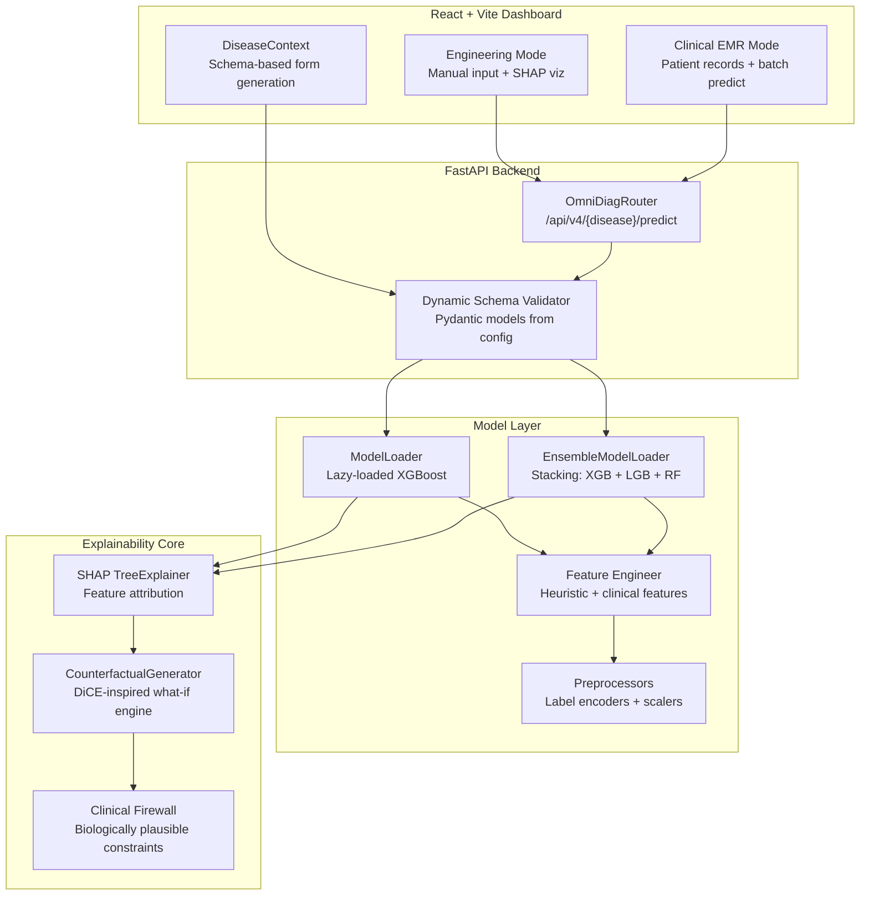
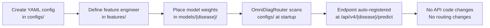

# README.md Overhaul Plan — OmniDiag Production-Grade Refactor

## Objective
Rewrite [`README.md`](README.md) to present OmniDiag as a premium, production-grade open-source engineering project for IEEE Expo judges. Eliminate AI-writing patterns, remove speculative roadmaps, and deliver a factual, architecture-first document with Mermaid diagrams for structural and flow visualization.

---

## Task 1: Project Title & Badges

**Action:** Replace the Hugging Face YAML frontmatter and the existing title/badge block.

**Remove** the Hugging Face YAML frontmatter (lines 1-10 of current README) — it's only relevant on HF Spaces, not GitHub.

**New Title:**
```markdown
# OmniDiag: Dynamic Multi-Disease Clinical Decision Support System (CDSS)
```

**New Badge Line** (aligned with what actually exists):
```markdown


```

**Notes:**
- License badge matches [`LICENSE`](LICENSE) — All Rights Reserved.
- LightGBM badge added because the diabetes ensemble uses it (see [`configs/diabetes.yaml`](configs/diabetes.yaml:106-111)).
- CI badge for GitHub Actions workflow at [`.github/workflows/ci.yml`](.github/workflows/ci.yml).

---

## Task 2: Professional Abstract

**Action:** Replace the existing "Executive Summary" section with a concise 3-sentence abstract. No hype words.

**Draft:**
> OmniDiag is a config-driven clinical decision support platform that routes patient data through disease-specific XGBoost and ensemble models via dynamically resolved YAML schemas. The system exposes a FastAPI backend with SHAP-based feature attribution, a constrained counterfactual inference engine, and a dual-mode React frontend for both engineering validation and clinical EMR-style review. Currently supporting coronary artery disease risk triage and diabetes health-indicator assessment, the platform requires zero API code changes to add new diseases — only a YAML configuration and a feature engineer module.

**Key constraints:**
- No: "revolutionary", "groundbreaking", "paradigm shift", "ultimate", "cutting-edge"
- No emojis in the abstract sentence
- Must not mention future plans

---

## Task 3: Core Architectural Features with Mermaid Diagrams

**Action:** Replace the existing "Key Features" and "System Architecture" sections. Add **two Mermaid diagrams**:
1. **System Architecture Flow** — shows the complete request lifecycle
2. **Config-Driven Scalability** — shows how adding a new disease works

### Mermaid Diagram 1: System Architecture & Request Flow



### Mermaid Diagram 2: Config-Driven Disease Registration Flow



### Feature Bullet Points (below the diagrams)

#### Dynamic Configuration Routing
- Config-driven backend loads multi-disease variables via isolated YAML schemas at [`configs/`](configs/).
- The [`OmniDiagRouter`](backend/router.py:30) scans the configs directory at startup, auto-discovers disease registrations, and routes requests to the correct [`ModelLoader`](backend/model_loader.py:30) or [`EnsembleModelLoader`](backend/ensemble_loader.py:41).
- Adding a new disease requires only a YAML file in [`configs/`](configs/) and a feature engineer in [`features/`](features/) — zero core API code changes.
- See [`configs/heart_disease.yaml`](configs/heart_disease.yaml) and [`configs/diabetes.yaml`](configs/diabetes.yaml) for reference configurations.

#### Dual-Mode System Interface
- **Engineering Mode** ([`EngineeringMode.jsx`](frontend/src/components/EngineeringMode.jsx)): Full manual feature input, real-time prediction with confidence gauge, SHAP bar chart visualization, and counterfactual "what-if" scenario testing.
- **Clinical EMR Mode** ([`ClinicalEmrMode.jsx`](frontend/src/components/ClinicalEmrMode.jsx)): Mock electronic medical records dashboard with patient list, color-coded risk badges, batch prediction, vital signs cards, and bilingual clinical summaries in English and Arabic.
- Both modes consume the same API endpoints at `/api/v4/{disease}/predict` and `/api/v4/{disease}/explain`.

#### Explainable Inference Core
- **SHAP Feature Attribution**: Every prediction is decomposed via [`shap.TreeExplainer`](backend/model_loader.py), returning per-feature Shapley values, base values, and feature names for downstream visualization.
- **Constrained Counterfactual Engine**: The [`CounterfactualGenerator`](backend/counterfactual_generator.py:28) produces diverse "what-if" scenarios using DiCE-inspired random sampling with clinical constraints — biologically plausible bounds on BMI, binary features, and immutable fields. No external dependencies beyond numpy/pandas.
- **Clinical Firewall**: Counterfactual perturbations are filtered through a clinical-validity constraint layer that rejects biologically impossible feature combinations before they reach the model.

---

## Task 4: Repository Architecture Tree

**Action:** Replace the existing project structure tree with an accurate, manually verified ASCII tree reflecting the *current* filesystem.

**Draft tree** (verified against actual filesystem at time of planning):

```
omnidiag/
├── backend/                          # FastAPI application
│   ├── main.py                       # API entry point, route definitions
│   ├── router.py                     # OmniDiagRouter — dynamic disease routing
│   ├── model_loader.py               # ModelLoader — predict, explain, clinical NLP
│   ├── ensemble_loader.py            # EnsembleModelLoader — stacking/voting inference
│   ├── schemas.py                    # Pydantic schemas, dynamic schema resolver
│   ├── shap_service.py               # SHAP explanation formatting
│   └── counterfactual_generator.py   # DiCE-inspired what-if engine
│
├── frontend/                         # React 18 + Vite + Tailwind CSS dashboard
│   ├── src/
│   │   ├── App.jsx                   # Main app with mode routing
│   │   ├── api.js                    # API client for predict/explain endpoints
│   │   ├── mockPatients.js           # Mock patient data for Clinical EMR mode
│   │   ├── context/
│   │   │   └── DiseaseContext.jsx    # Disease state management
│   │   ├── hooks/
│   │   │   ├── useDiseaseSchema.js   # Dynamic schema fetcher
│   │   │   └── useDiseaseForm.js     # Form state management
│   │   ├── components/
│   │   │   ├── EngineeringMode.jsx   # Manual testing interface
│   │   │   ├── ClinicalEmrMode.jsx   # EMR-style patient dashboard
│   │   │   ├── DynamicClinicalForm.jsx # Auto-generated form from schema
│   │   │   ├── SchemaFieldFactory.jsx  # Field type renderer
│   │   │   ├── ShapBarChart.jsx      # SHAP waterfall visualization
│   │   │   ├── WhatIfScenarioCard.jsx # Counterfactual display
│   │   │   ├── DiseaseSelector.jsx   # Multi-disease navigation
│   │   │   ├── MedicalTooltip.jsx    # Clinical context tooltips
│   │   │   ├── FormSkeleton.jsx      # Loading skeleton
│   │   │   ├── ErrorBoundary.jsx     # Error boundary wrapper
│   │   │   └── SchemaErrorFallback.jsx # Schema error display
│   │   └── utils/
│   │       ├── schemaFieldParser.js  # Schema-to-form-field mapper
│   │       ├── schemaToZod.js        # Schema to Zod validation
│   │       ├── featureCategorizer.js # Feature type categorization
│   │       └── medicalDictionary.js  # Bilingual medical terms
│   ├── index.html
│   ├── vite.config.js
│   ├── tailwind.config.js
│   └── package.json
│
├── configs/                          # YAML disease configurations
│   ├── config_loader.py              # Config loading utilities
│   ├── heart_disease.yaml            # CAD risk assessment v5.0.0
│   └── diabetes.yaml                 # Diabetes health indicators v1.1.0
│
├── features/                         # Feature engineering modules
│   ├── base_features.py              # Abstract base feature engineer
│   ├── heart_disease_features.py     # CAD feature engineer
│   └── diabetes_features.py          # Diabetes feature engineer
│
├── models/                           # Trained weights and training scripts
│   ├── advanced_feature_engineering.py # Heuristic/clinical feature logic
│   ├── heart_disease/                # XGBoost model weights and preprocessors
│   └── diabetes/                     # Ensemble stacking weights and preprocessors
│
├── data/                             # Disease-isolated datasets
│   ├── heart_disease/
│   │   ├── raw/                      # UCI Cleveland + Z-Alizadeh Sani
│   │   ├── processed/                # Cleaned, engineered datasets
│   │   └── interim/                  # CV scores, evaluation artifacts
│   └── diabetes/
│       ├── raw/                      # CDC BRFSS 2015
│       └── interim/                  # Evaluation artifacts
│
├── .github/workflows/                # CI pipeline
│   └── ci.yml                        # Backend import verification + frontend build
├── Dockerfile                        # Production container for HF Spaces
├── requirements.txt                  # Python dependencies
└── LICENSE                           # All Rights Reserved
```

---

## Task 5: Clean Local Setup Guide

**Action:** Replace the existing "Getting Started" section. Remove the `cd omnidiag` step (not needed since the README is in the repo root) and the "Prerequisites" subsection. Keep it minimal and exact.

### Backend Setup
```bash
# Create and activate virtual environment
python -m venv .venv
source .venv/bin/activate  # Linux/macOS
# .venv\Scripts\activate   # Windows

# Install dependencies
pip install -r requirements.txt

# Start the API server
uvicorn backend.main:app --reload --host 0.0.0.0 --port 8000
```

- API available at `http://localhost:8000`
- Interactive Swagger docs at `http://localhost:8000/docs`

### Frontend Setup
```bash
cd frontend

# Install dependencies
npm install

# Start development server
npm run dev
```

- Dashboard available at `http://localhost:5173`
- Update `BASE_URL` in [`frontend/src/api.js`](frontend/src/api.js) if the backend runs on a different host/port.

---

## Task 6: Production Architecture & Scalability (Replaces Future Roadmap)

**Action:** Delete the entire "Future Roadmap" section. Replace with a single, authoritative section titled "Production Architecture & Scalability".

### Draft

> ## Production Architecture & Scalability
>
> OmniDiag's architecture is designed around a zero-code plugin model for disease expansion. The system's scalability derives from three core design decisions:
>
> ### Config-Driven Disease Registry
> The [`OmniDiagRouter`](backend/router.py:30) scans the [`configs/`](configs/) directory at startup and registers every valid YAML configuration as a routable disease endpoint. Each config declares its own feature engineer module, model weights path, preprocessor artifacts, and SHAP explainer type. To add a new target disease:
>
> 1. Create a YAML file in [`configs/`](configs/) following the schema defined in [`configs/heart_disease.yaml`](configs/heart_disease.yaml).
> 2. Implement a feature engineer class in [`features/`](features/) inheriting from [`BaseFeatureEngineer`](features/base_features.py).
> 3. Place trained model weights and preprocessors in [`models/<disease>/`](models/).
>
> No API code, no routing logic, and no schema registration changes are required. The disease is available at `/api/v4/<disease>/predict` immediately after a server reload.
>
> ### Lazy Model Loading
> Each [`ModelLoader`](backend/model_loader.py:30) or [`EnsembleModelLoader`](backend/ensemble_loader.py:41) loads model weights, preprocessors, and SHAP explainers on the first request to that disease endpoint — not at server startup. This means:
> - Adding a disease with large model files does not increase startup latency.
> - Memory is consumed only for diseases that are actually queried.
> - Failed model loads for one disease do not crash other disease endpoints.
>
> ### Stateless API Surface
> All prediction, explanation, and counterfactual endpoints are stateless HTTP POST handlers. No session state, no in-memory patient cache, no database dependency. This enables:
> - Horizontal scaling behind a load balancer with no sticky sessions.
> - Containerized deployment on Hugging Face Spaces, Docker Compose, or Kubernetes without architectural changes.
> - Integration as a microservice within a larger clinical informatics pipeline via the documented OpenAPI schema at `/docs`.
>
> The system currently serves two production-grade disease modules (Coronary Artery Disease and Diabetes Health Indicators) and is structurally capable of scaling to any number of target diseases following the same config-plus-engineer pattern.

---

## Task 7: Final Proofreading Checklist

Before marking complete, verify:

- [ ] No AI-writing patterns: "revolutionary", "groundbreaking", "paradigm shift", "ultimate", "cutting-edge", "state-of-the-art" (unless factual), "leverage" (overused).
- [ ] No future plans, roadmaps, or speculative version numbers beyond what is built.
- [ ] All file paths and line references are clickable and correct.
- [ ] No Hugging Face YAML frontmatter in the GitHub README.
- [ ] ASCII tree matches the actual filesystem.
- [ ] Badge URLs are valid and render correctly.
- [ ] Mermaid diagrams render correctly — no special characters in square brackets.
- [ ] Sections are ordered as: Title → Badges → Abstract → Features with Mermaid diagrams → Tree → Setup → Architecture/Scalability → License.
- [ ] Emoji usage is minimal and professional (no emojis in section headers).
- [ ] License section correctly states "All Rights Reserved" matching [`LICENSE`](LICENSE).

---

## Execution

The implementation will be done in Code mode. The scope is a single file rewrite of [`README.md`](README.md). The edit should use the `write_to_file` tool with the complete new content, since this is a full rewrite of the file.
