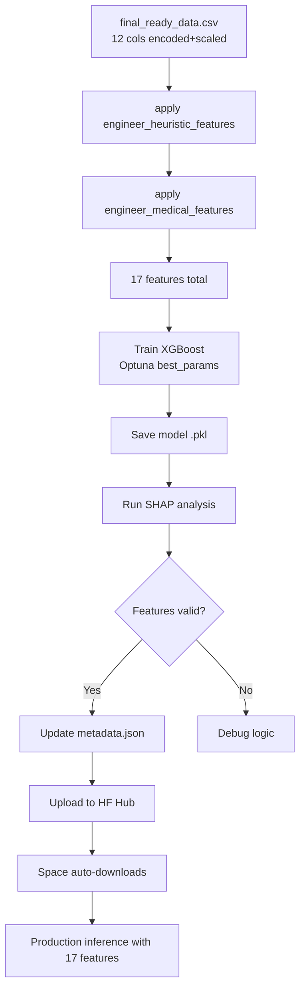

# Retrain & Deploy: XGBoost Model with New Dataset (v5.0 CAD)

## Overview

Retrain the XGBoost classifier on the new merged dataset (605 patients, 17 features after engineering), analyze SHAP to verify medical feature impact, and deploy to Hugging Face.

## Current State

| Component | Old (v4.0) | New (v5.0) |
|-----------|-----------|------------|
| Patients | ~918 (old heart.csv) | **605** (302 Cleveland + 303 Z-Alizadeh) |
| Base features | 12 columns | **12 columns** (dropped `ca`, `thal`) |
| Engineered features | 3 heuristic | **3 heuristic + 2 medical** = 5 engineered |
| Total features | 15 | **17** |
| Preprocessors | Old scaler/encoders | **Re-fit** (from clean_data.py v5.0) ✅ |
| Model accuracy | 88.98% | **Needs retraining** |
| Model file | yahyoha/omnidiag-models | **Needs update** |

---

## Phase 1: Create Unified Training Script

### New file: [`experiment_files/models/train_v5_xgb.py`](experiment_files/models/train_v5_xgb.py)

**Purpose**: Train XGBoost on ALL 17 features (12 base + 3 heuristic + 2 medical) with proper feature engineering pipeline.

**Key design decisions**:
1. **Read from `final_ready_data.csv`** (the cleaned 12-column data after encoding+scaling)
2. **Apply both `engineer_heuristic_features()` AND `engineer_medical_features()`** to generate all 17 features
3. **Train using existing best_params** from Optuna (n_estimators=898, max_depth=5, lr=0.0136)
4. **Save model** to `models/heart_disease/omni_diag_xgb_optimized.pkl`
5. **Print train/test accuracy** for immediate feedback

**Safety**:
- Backup existing model before overwriting: `cp omni_diag_xgb_optimized.pkl omni_diag_xgb_optimized.bak.v4`
- Log all metrics to `metrics.json`

### Modified file: [`configs/heart_disease.yaml`](configs/heart_disease.yaml)

Add `v5_training_notes` section documenting:
- Dataset size: 605 patients
- Feature count: 17
- Data sources: Cleveland + Z-Alizadeh
- Dropped features: ca, thal
- Added features: RPP, Exercise_Risk_Index

---

## Phase 2: Train & Evaluate

**Steps**:
1. Run `python experiment_files/models/train_v5_xgb.py`
2. Record training accuracy
3. If accuracy < 85%, consider re-tuning hyperparameters with Optuna

**Acceptance criteria**:
- ✅ Accuracy ≥ 85% (baseline from old model was 88.98%)
- ✅ Model saves without errors
- ✅ Feature count matches expectations (17 features)

---

## Phase 3: Comprehensive SHAP Analysis

### New/Modified file: [`experiment_files/models/analyze_shap_v5.py`](experiment_files/models/analyze_shap_v5.py)

**Purpose**: Deep SHAP analysis to verify:
1. RPP (Rate-Pressure Product) is a top contributor to CAD prediction
2. Exercise_Risk_Index adds value beyond Oldpeak alone
3. No feature has near-zero importance (can be pruned)

**Outputs**:
- `reports/figures/shap_summary_bar_v5.png` — Bar plot of mean |SHAP|
- `reports/figures/shap_beeswarm_v5.png` — Beeswarm plot (direction + impact)
- `reports/figures/shap_waterfall_v5_sample.png` — Waterfall for 1 patient
- Console output with top-10 features ranked

**What to check**:
```text
Top features expected:
1. ST_Slope           — strong predictor
2. ChestPainType      — strong predictor
3. RPP (NEW!)         — should be mid-to-high rank
4. Exercise_Risk_Index (NEW!)  — should correlate with Oldpeak
5. Oldpeak            — known predictor
6. Age_BP_Interaction — known predictor
7. MaxHR              — known predictor
...
```

**If RPP or Exercise_Risk_Index have near-zero SHAP importance**, something is wrong with the feature engineering logic in production (model_loader.py). This is a critical validation.

---

## Phase 4: Update Metadata & Metrics

### Modified file: [`models/heart_disease/metadata.json`](models/heart_disease/metadata.json)

Replace content with v5.0 metadata:
```json
{
  "version": "5.0.0",
  "disease": "coronary_artery_disease",
  "display_name": "Coronary Artery Disease Risk",
  "model_type": "xgboost",
  "training_date": "<auto-generated>",
  "dataset_size": 605,
  "data_sources": ["Cleveland UCI", "Z-Alizadeh Sani"],
  "base_features": [
    "Age", "Sex", "ChestPainType", "RestingBP", "Cholesterol",
    "FastingBS", "RestingECG", "MaxHR", "ExerciseAngina",
    "Oldpeak", "ST_Slope", "HeartDisease"
  ],
  "heuristic_features": [
    "Age_BP_Interaction", "HR_Age_Ratio", "Chol_Age_Ratio"
  ],
  "medical_features": [
    "RPP", "Exercise_Risk_Index"
  ],
  "dropped_features": ["ca", "thal"],
  "total_features": 17,
  "best_params": { ... from config ... },
  "test_accuracy": "<from training>"
}
```

### Modified file: [`models/heart_disease/metrics.json`](models/heart_disease/metrics.json)

Update with new training metrics.

---

## Phase 5: Upload to Hugging Face

### Step 5.1: Upload New Model Weights

Upload `omni_diag_xgb_optimized.pkl` to **Hugging Face Model Hub** at `yahyoha/omnidiag-models`:
- Using `huggingface_hub` Python library OR manual upload via browser
- Or use `curl` with HF token

**Important**: Keep the SAME filename (`omni_diag_xgb_optimized.pkl`) so the existing `startup.sh` download URL still works.

### Step 5.2: Optionally Update Preprocessors

The `standard_scaler.pkl` and `label_encoders.pkl` are already on the Space (committed before `*.pkl` was gitignored). They were already regenerated by our `clean_data.py` run. They need to be pushed to the Space.

Options:
1. **If preprocessors changed**: Push to GitHub → Space rebuilds → copies them
2. **If model only changed**: Just upload model to Hub → Space downloads at next restart

For safety, upload BOTH preprocessors to the Hub as well, so startup.sh could potentially download all three.

### Step 5.3: Update Space Env (if needed)

Check if the Space needs an environment variable or restart to pick up new model.

### Deployment Flow (after upload):
```
User pushes code → GitHub Actions (if any)
  → Hugging Face Space rebuilds Docker image
  → Container starts → startup.sh runs
  → curl downloads omni_diag_xgb_optimized.pkl from Hub
  → uvicorn starts with NEW model
  → First API call: ModelLoader loads new .pkl + new preprocessors
  → Feature engineering adds RPP + Exercise_Risk_Index
  → Inference with 17 features ✅
```

---

## Risk Assessment

| Risk | Impact | Mitigation |
|------|--------|------------|
| New model has lower accuracy | Medium | Keep old .bak model; revert if needed |
| SHAP shows RPP has zero importance | Medium | Debug engineer_medical_features in model_loader |
| Hugging Face space breaks | High | Test locally with FastAPI before pushing |
| Preprocessors mismatch | High | Upload new scaler/encoders to Hub alongside model |
| .pkl gitignore blocks upload | Low | Model uploaded to Hub (not git), preprocessors already committed |

---

## Todo List

```markdown
[ ] Phase 1: Create experiment_files/models/train_v5_xgb.py
[ ] Phase 2: Run training, record accuracy
[ ] Phase 3: Create and run SHAP analysis script
[ ] Phase 4: Update metadata.json and metrics.json
[ ] Phase 5.1: Upload model to Hugging Face Hub
[ ] Phase 5.2: Upload preprocessors to Hub
[ ] Phase 5.3: Verify Space deployment works
```

---

## Mermaid Workflow


