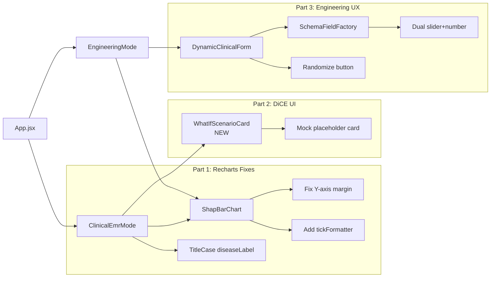

# OmniDiag Platform — UI/UX Polish Plan

## Overview

Three-part UI/UX upgrade: Recharts fixes, DiCE Counterfactuals card, and Engineering Mode UX enhancements. All changes are scoped to `frontend/src/components/` with no backend modifications required.

---

## Step 0: Git Branching (CRITICAL — Execute First)

**Command:**
```bash
git checkout -b feature/ui-ux-polish
```
No file modifications should occur before this command completes successfully.

---

## Part 1: Recharts UI Fixes

### Files Modified: [`frontend/src/components/ShapBarChart.jsx`](frontend/src/components/ShapBarChart.jsx), [`frontend/src/components/ClinicalEmrMode.jsx`](frontend/src/components/ClinicalEmrMode.jsx)

#### 1.1 Fix Y-Axis Label Truncation

**File:** [`frontend/src/components/ShapBarChart.jsx`](frontend/src/components/ShapBarChart.jsx:69)

**Current (line 69):**
```jsx
margin={{ top: 4, right: 16, left: 8, bottom: 4 }}
```
**Change to:**
```jsx
margin={{ top: 4, right: 16, left: 150, bottom: 4 }}
```

**Also (line 86) — YAxis width must match:**
```jsx
<YAxis
  type="category"
  dataKey="name"
  tick={{ fontSize: 11, fill: '#334155', fontWeight: 500 }}
  tickLine={false}
  axisLine={false}
  width={150}          // was: 100
/>
```

This ensures the `150px` left margin reserve is actually used by the Y-axis labels (e.g., `Diabetes_Clinical_Risk`).

#### 1.2 Fix X-Axis Float Precision

**File:** [`frontend/src/components/ShapBarChart.jsx`](frontend/src/components/ShapBarChart.jsx:73)

**Current (line 73-79):**
```jsx
<XAxis
  type="number"
  domain={[-domainMax, domainMax]}
  tick={{ fontSize: 11, fill: '#64748b' }}
  tickLine={false}
  axisLine={false}
/>
```
**Add `tickFormatter`:**
```jsx
<XAxis
  type="number"
  domain={[-domainMax, domainMax]}
  tick={{ fontSize: 11, fill: '#64748b' }}
  tickLine={false}
  axisLine={false}
  tickFormatter={(tick) => tick.toFixed(2)}
/>
```

This ensures X-axis ticks display as `0.25`, `0.50`, etc. instead of `0.2500000000000001`.

#### 1.3 Capitalize Disease Name in Diagnosis Badge

**File:** [`frontend/src/components/ClinicalEmrMode.jsx`](frontend/src/components/ClinicalEmrMode.jsx:424)

**Current logic (line 38):**
```js
const diseaseLabel = currentDiseaseInfo?.display_name || selectedDisease || 'Heart Disease';
```

**Problem:** When `selectedDisease` is `"diabetes"` (lowercase API key), the badge reads `"diabetes Detected"`.

**Fix — Add a titleCase helper (line ~39):**
```js
const titleCase = (str) => str.charAt(0).toUpperCase() + str.slice(1);
const diseaseLabel = titleCase(currentDiseaseInfo?.display_name || selectedDisease || 'Heart Disease');
```

This ensures `"diabetes"` -> `"Diabetes"`, appearing as `"Diabetes Detected"`.

---

## Part 2: DiCE Counterfactuals UI

### New File: [`frontend/src/components/WhatIfScenarioCard.jsx`](frontend/src/components/WhatIfScenarioCard.jsx)

**Purpose:** Prepare UI slot for Phase 2 XAI (DiCE counterfactual engine). Since the backend may return `null` for counterfactuals right now, render a graceful mock placeholder.

**Component Design:**

```jsx
export default function WhatIfScenarioCard({ /* future: counterfactuals */ }) {
  // ── Mock placeholder data ──
  const scenarios = [
    { feature: 'BMI', current: 32, proposed: 27, riskReduction: 44 },
    { feature: 'RestingBP', current: 158, proposed: 130, riskReduction: 28 },
  ];

  return (
    <div className="card">
      <div className="card-header">
        <h2 className="...">
          <Zap className="..." />
          What-If Scenarios (DiCE Counterfactuals)
        </h2>
        <span className="badge-amber">Coming Soon</span>
      </div>
      <div className="card-body space-y-4">
        {scenarios.map((s) => (
          <div key={s.feature} className="...">
            <p className="text-sm">
              Scenario: If <strong>{s.feature}</strong> drops from
              {' '}<span className="text-red-600">{s.current}</span>
              {' '}→ <span className="text-green-600">{s.proposed}</span>
              {' '}→ Risk reduces by <strong>{s.riskReduction}%</strong>
            </p>
          </div>
        ))}
        <p className="text-xs text-gray-400 italic">
          Powered by DiCE — backend integration pending.
        </p>
      </div>
    </div>
  );
}
```

**Import & Place in ClinicalEmrMode.jsx** — inside the SHAP card (around line 484), right after the `<ShapBarChart>` component:

```jsx
{/* SHAP Bar Chart */}
<ShapBarChart chartData={shapData.chart_data} baseValue={shapData.base_value} maxVisible={10} />

{/* DiCE Counterfactuals — Mock placeholder */}
<WhatIfScenarioCard />
```

Add import at top of [`ClinicalEmrMode.jsx`](frontend/src/components/ClinicalEmrMode.jsx:1):
```js
import WhatIfScenarioCard from './WhatIfScenarioCard';
```

**Design Rationale:**
- Uses a "Coming Soon" badge so the UI signals this is an upcoming feature
- Mock data demonstrates the visual layout with realistic feature names
- The component takes no required props today but is designed to accept `counterfactuals` array in future
- Styled consistently with existing card components

---

## Part 3: Engineering Mode UX Upgrade

### 3.1 Smart Input Controls — Dual Slider+Number

**File Modified:** [`frontend/src/components/SchemaFieldFactory.jsx`](frontend/src/components/SchemaFieldFactory.jsx:134)

**Current `NumberField` component:** Renders a plain `<input type="number">`.

**Enhanced `NumberField`:**

```jsx
function NumberField({ field, meta, error }) {
  const min = meta.validation.minimum;
  const max = meta.validation.maximum;
  const step = meta.validation.step ?? (meta.type === 'number' ? 0.1 : 1);

  // Determine if we should show a slider alongside (numeric ranges with finite bounds)
  const showSlider = min !== undefined && max !== undefined && (max - min) <= 500;

  return (
    <div>
      <label htmlFor={meta.name} className="block text-xs font-medium text-gray-600 mb-1">
        {meta.title}
      </label>
      <div className="flex items-center gap-3">
        {showSlider && (
          <input
            type="range"
            min={min}
            max={max}
            step={step}
            value={field.value ?? min}
            onChange={(e) => field.onChange(parseFloat(e.target.value))}
            className="flex-1 h-2 rounded-full appearance-none cursor-pointer
                       bg-gray-200 accent-primary-500 ..."
          />
        )}
        <input
          id={meta.name}
          type="number"
          min={min}
          max={max}
          step={step}
          value={field.value ?? ''}
          onChange={(e) => {
            const raw = e.target.value;
            field.onChange(raw === '' ? '' : Number(raw));
          }}
          className={`input-field w-24 ${error ? '...' : ''}`}
        />
      </div>
      {error && <p className="text-xs text-red-500 mt-0.5">{error}</p>}
      {(min !== undefined || max !== undefined) && (
        <p className="text-[10px] text-gray-400 mt-0.5">
          {min !== undefined && `Min: ${min}`}
          {min !== undefined && max !== undefined && ' | '}
          {max !== undefined && `Max: ${max}`}
        </p>
      )}
    </div>
  );
}
```

**Key design decisions:**
- Slider auto-shows when field has `min`/`max` bounds and range ≤ 500
- Number input always visible for precise entry
- The existing `SliderField` (for small integer ranges) remains unchanged — it's used for distinct categorical integer sliders
- This dual control pattern gives users both visual context (slider position) and precision (number input)
- Binary/toggle fields already use the `ToggleField` component — no changes needed there

#### 3.2 Quick Actions — "Fill Mock Data" Button

**File Modified:** [`frontend/src/components/DynamicClinicalForm.jsx`](frontend/src/components/DynamicClinicalForm.jsx:128)

**Add a `randomize` function and button in the form header section (around line 208):**

```jsx
// Inside DynamicClinicalForm component, add:
const randomizeFields = () => {
  const randomized = {};
  fields.forEach((f) => {
    if (f.component === 'toggle') {
      randomized[f.name] = Math.random() > 0.5 ? 1 : 0;
    } else if (f.component === 'select' && f.validation.enum?.length) {
      const opts = f.validation.enum;
      randomized[f.name] = opts[Math.floor(Math.random() * opts.length)];
    } else if (f.type === 'number' || f.type === 'integer') {
      const min = f.validation.minimum ?? 0;
      const max = f.validation.maximum ?? 100;
      const step = f.validation.step ?? (f.type === 'number' ? 0.1 : 1);
      const val = min + Math.random() * (max - min);
      randomized[f.name] = step < 1 ? parseFloat(val.toFixed(1)) : Math.round(val);
    } else {
      randomized[f.name] = f.default ?? '';
    }
  });
  form.reset(randomized);
};
```

**Add button alongside the existing "Reset" button:**
```jsx
<button
  type="button"
  onClick={randomizeFields}
  className="btn-secondary text-xs"
  title="Fill all fields with random valid data"
>
  <Shuffle className="w-3.5 h-3.5" />
  Randomize
</button>
```

**Add `Shuffle` to imports** from `lucide-react`.

**Design Rationale:**
- Respects each field's min/max/enum constraints for valid data generation
- Toggle fields get random 0/1
- Select fields pick random valid enum values
- Numeric fields get random values within their valid range
- Saves engineers significant time during presentations and rapid testing

---

## Component Dependency Diagram



## Summary of Changes

| File | Change Type | Description |
|------|------------|-------------|
| `frontend/src/components/ShapBarChart.jsx` | Modify | Increase `margin.left` to 150, YAxis width to 150, add `tickFormatter` to XAxis |
| `frontend/src/components/ClinicalEmrMode.jsx` | Modify | TitleCase `diseaseLabel`, add `WhatIfScenarioCard` import and placement |
| `frontend/src/components/WhatIfScenarioCard.jsx` | **Create** | New component with mock DiCE counterfactual scenarios |
| `frontend/src/components/SchemaFieldFactory.jsx` | Modify | Enhance `NumberField` with dual range slider + number input |
| `frontend/src/components/DynamicClinicalForm.jsx` | Modify | Add `randomizeFields` function and "Randomize" button |

## Execution Order

1. **Step 0:** `git checkout -b feature/ui-ux-polish`
2. **Part 1:** ShapBarChart.jsx + ClinicalEmrMode.jsx fixes
3. **Part 2:** Create WhatIfScenarioCard.jsx + integrate into ClinicalEmrMode.jsx
4. **Part 3:** SchemaFieldFactory.jsx enhancement + DynamicClinicalForm.jsx Randomize button
5. **Confirm:** Verify all changes compile and render correctly
